<style>
	*{
		font-family: "Consolas", "topWebfont","宋体"
	}
	strong,b{
		color:#E74C3C
	}
	code{
		color:#9400D3;
		font-family:"宋体" !important;
		font-size:16px !important;
		font-weight:600
	}
	code[class*="language-"], pre[class*="language-"]{
		font-weight:normal
	}
	em{
		font-style:normal;
		color:black;
		/* text-decoration: underline; */
		font-weight:normal;
		display:inline-block;
		border-bottom: 1px dashed red;
		text-indent:0em
	}
	a{
		color:#20B2AA !important;
	}
	.markdown-body blockquote{
		border-left:3px solid red !important
	}
	p{
		text-indent:2em
	}
	blockquote p,li p{
		text-indent:0em
	}
	.markdown-body h2{
		border-top:2px solid #20B2AA !important;
		padding-top:10px !important
	}
	.markdown-body p, .markdown-body blockquote, .markdown-body ul, .markdown-body ol, .markdown-body dl, .markdown-body table, .markdown-body pre{
		margin-bottom:10px !important
	}
	h3 code,h4 code{
		color:red !important
	}
	li a code{
		color:red !important;
		background:none !important
	}
	li a code:after,h3 code:after,h4 code:after{
		content:"☆"
	}
</style>


# 前端整理合集
- [前端整理合集](#前端整理合集)
  - [html](#html)
    - [`如何理解html语义化`](#如何理解html语义化)
    - [p标签里面不能嵌套ul、div等块级元素原因](#p标签里面不能嵌套uldiv等块级元素原因)
    - [src 和 href 的区别](#src-和-href-的区别)
    - [说说常用的 meta 标签](#说说常用的-meta-标签)
    - [meta作用](#meta作用)
      - [`HTML meta viewport属性`](#html-meta-viewport属性)
    - [DOCTYPE的作用？严格模式和混杂模式的区别？](#doctype的作用严格模式和混杂模式的区别)
    - [HTML5 为什么只需要写 !DOCTYPE HTML](#html5-为什么只需要写-doctype-html)
      - [SGML](#sgml)
    - [iframe有哪些优点和缺点](#iframe有哪些优点和缺点)
    - [`H5新增属性`](#h5新增属性)
    - [`常见的浏览器内核有哪些`](#常见的浏览器内核有哪些)
    - [h5新特性SharedWorker](#h5新特性sharedworker)
    - [webWorker](#webworker)
  - [css](#css)
    - [offsetWidth](#offsetwidth)
    - [a标签伪类顺序](#a标签伪类顺序)
    - [margin负值](#margin负值)
    - [BFC](#bfc)
      - [margin重叠](#margin重叠)
    - [两三栏布局](#两三栏布局)
    - [粘连布局](#粘连布局)
    - [`清除浮动`](#清除浮动)
    - [盒模型](#盒模型)
    - [`响应式设计`](#响应式设计)
    - [`元素水平垂直居中`](#元素水平垂直居中)
      - [伪类实现水平垂直居中](#伪类实现水平垂直居中)
    - [line-height继承](#line-height继承)
    - [css预处理语言](#css预处理语言)
    - [flex布局](#flex布局)
    - [元素竖向的百分比设定是相对于容器的高度吗？](#元素竖向的百分比设定是相对于容器的高度吗)
    - [css选择器](#css选择器)
      - [css选择器读取顺序](#css选择器读取顺序)
      - [可继承](#可继承)
    - [`伪类和伪元素的区别`](#伪类和伪元素的区别)
      - [伪类 伪元素有哪些](#伪类-伪元素有哪些)
    - [first-child和first-of-type/nth-child和nth-of-type](#first-child和first-of-typenth-child和nth-of-type)
    - [css元素隐藏](#css元素隐藏)
    - [`css画三角形`](#css画三角形)
      - [其他方案](#其他方案)
      - [xywh()](#xywh)
    - [CSS动画是什么](#css动画是什么)
    - [css动画实现方式](#css动画实现方式)
      - [transition 实现渐变动画](#transition-实现渐变动画)
      - [transform 转变动画](#transform-转变动画)
      - [animation 实现自定义动画](#animation-实现自定义动画)
    - [css视差滚动实现方案](#css视差滚动实现方案)
    - [3D立体感绕x轴旋转](#3d立体感绕x轴旋转)
      - [transform-style立体交叉遮盖](#transform-style立体交叉遮盖)
    - [`css性能优化`](#css性能优化)
    - [协同开发css类名冲突解决方案](#协同开发css类名冲突解决方案)
    - [postcss](#postcss)
    - [@namespace @document @page @supports在css中的作用](#namespace-document-page-supports在css中的作用)
    - [CSS函数](#css函数)
    - [rgba和opacity的透明效果有什么不同？](#rgba和opacity的透明效果有什么不同)
    - [node-sass 和 dart-sass](#node-sass-和-dart-sass)
    - [css换肤原理](#css换肤原理)
    - [元素动画方案](#元素动画方案)
      - [两种方案对比](#两种方案对比)
    - [border-radius设置不同的顶点弧度不一致](#border-radius设置不同的顶点弧度不一致)
  - [js](#js)
    - [获取伪类中的内容](#获取伪类中的内容)
    - [js中哪些会被判断为false](#js中哪些会被判断为false)
    - [js 类型转换机制](#js-类型转换机制)
    - [`let const var`](#let-const-var)
    - [函数和变量提升](#函数和变量提升)
    - [作用域的理解](#作用域的理解)
      - [词法作用域案例](#词法作用域案例)
      - [全局作用域诡异问题](#全局作用域诡异问题)
      - [作用域链](#作用域链)
    - [执行上下文和执行栈](#执行上下文和执行栈)
      - [执行上下文的生命周期](#执行上下文的生命周期)
    - [`闭包`](#闭包)
      - [不要滥用闭包](#不要滥用闭包)
      - [防抖和节流](#防抖和节流)
      - [闭包为什么会延长变量的生命周期](#闭包为什么会延长变量的生命周期)
      - [闭包案例](#闭包案例)
    - [内存泄漏](#内存泄漏)
      - [垃圾回收机制GC](#垃圾回收机制gc)
      - [Mark-Sweep标记清除优缺点](#mark-sweep标记清除优缺点)
        - [优化方案：标记整理](#优化方案标记整理)
      - [V8对GC的优化:分代式垃圾回收](#v8对gc的优化分代式垃圾回收)
        - [增量标记与惰性清理的优缺？](#增量标记与惰性清理的优缺)
        - [并发回收](#并发回收)
      - [可能的内存泄漏场景](#可能的内存泄漏场景)
    - [\[10, 20, 30\].map(parseInt)](#10-20-30mapparseint)
    - [函数声明和函数表达式区别](#函数声明和函数表达式区别)
    - [严格模式要注意的地方](#严格模式要注意的地方)
    - [LHS 和 RHS 是什么？会造成什么影响](#lhs-和-rhs-是什么会造成什么影响)
    - [== 和 ===](#-和-)
      - [==的注意之处](#的注意之处)
      - [\[\]==!\[\] {}==!{}的结果](#-的结果)
    - [实现a==1\&\&a==2\&\&a==3](#实现a1a2a3)
    - [Object.is() 与比较操作符 “===”、“==” 的区别？](#objectis-与比较操作符--的区别)
    - [判断对象是空对象](#判断对象是空对象)
    - [`深拷贝和浅拷贝`](#深拷贝和浅拷贝)
    - [数据类型](#数据类型)
      - [`判断数据类型的方法`](#判断数据类型的方法)
    - [js内置对象](#js内置对象)
    - [undefined和null的区别](#undefined和null的区别)
    - [数据结构](#数据结构)
      - [数组和链表的应用场景](#数组和链表的应用场景)
    - [字符串常用的方法](#字符串常用的方法)
      - [match matchAll](#match-matchall)
      - [substring slice字符串处理区别](#substring-slice字符串处理区别)
    - [`数组常用的方法`](#数组常用的方法)
      - [影响到原数组的方法](#影响到原数组的方法)
      - [数组reduce方法应用场景](#数组reduce方法应用场景)
      - [数组扁平化实现方案](#数组扁平化实现方案)
    - [数组中对象的排序](#数组中对象的排序)
    - [函数缓存](#函数缓存)
    - [`event loop`](#event-loop)
      - [event loop 宏任务 微任务 和dom渲染的关联](#event-loop-宏任务-微任务-和dom渲染的关联)
    - [Class和实例的关系以及原型链](#class和实例的关系以及原型链)
      - [函数的特殊性](#函数的特殊性)
    - [js如何实现继承](#js如何实现继承)
      - [`继承的方案`](#继承的方案)
    - [`正则表达式`](#正则表达式)
      - [正则的贪婪模式和懒惰模式](#正则的贪婪模式和懒惰模式)
    - [对象的一些方法](#对象的一些方法)
    - [new Object()和Object.cretate()以及Object.assign()区别](#new-object和objectcretate以及objectassign区别)
    - [关于对象的遍历方案](#关于对象的遍历方案)
      - [for...of 对象适配](#forof-对象适配)
    - [this指向](#this指向)
      - [this隐式绑定丢失](#this隐式绑定丢失)
      - [this的案例](#this的案例)
    - [bind和new的优先级问题以及箭头函数的指向](#bind和new的优先级问题以及箭头函数的指向)
      - [call appy bind的用法和区别](#call-appy-bind的用法和区别)
    - [new操作做了什么](#new操作做了什么)
    - [JS基本类型的装箱与拆箱](#js基本类型的装箱与拆箱)
    - [new String 和String区别](#new-string-和string区别)
    - [事件 事件流](#事件-事件流)
      - [事件模型](#事件模型)
        - [event.eventPhase](#eventeventphase)
      - [IE事件模型](#ie事件模型)
      - [事件代理](#事件代理)
      - [阻止事件冒泡和默认事件](#阻止事件冒泡和默认事件)
    - [event.target和event.currentTarget二者含义](#eventtarget和eventcurrenttarget二者含义)
    - [判断一个元素是否在可视区](#判断一个元素是否在可视区)
    - [`监听一个div宽度变化`](#监听一个div宽度变化)
    - [MutationObserver触发机制及应用场景](#mutationobserver触发机制及应用场景)
    - [Js单线程详解](#js单线程详解)
    - [`本地存储和场景`](#本地存储和场景)
      - [cookie的修改注意](#cookie的修改注意)
      - [使用js-cooke插件](#使用js-cooke插件)
      - [cookie查看范围和跨域携带](#cookie查看范围和跨域携带)
      - [localstorange本地过期时间](#localstorange本地过期时间)
      - [localstorage监听](#localstorage监听)
      - [需要在本页监听localstorage数据变化方案](#需要在本页监听localstorage数据变化方案)
    - [单点登录](#单点登录)
    - [`跨域`](#跨域)
      - [解决方案](#解决方案)
    - [`web端常见的攻击方式`](#web端常见的攻击方式)
    - [前端防护xss和xsrf攻击](#前端防护xss和xsrf攻击)
    - [如何捕获js异常](#如何捕获js异常)
    - [`js计算精度丢失问题`](#js计算精度丢失问题)
    - [script异步加载顺序](#script异步加载顺序)
    - [`ajax fetch axios`](#ajax-fetch-axios)
    - [`文件上传下载，原生js的实现原理`](#文件上传下载原生js的实现原理)
      - [`文件上传`](#文件上传)
      - [文件下载](#文件下载)
    - [文件传输前后端](#文件传输前后端)
    - [`token无感刷新`](#token无感刷新)
    - [js for 循环中break和return区别](#js-for-循环中break和return区别)
    - [前端控制并发请求](#前端控制并发请求)
    - [登录密码安全](#登录密码安全)
      - [CryptoJS](#cryptojs)
    - [对象保护不被修改](#对象保护不被修改)
    - [onload 和 DOMContentLoaded](#onload-和-domcontentloaded)
    - [ajax](#ajax)
    - [JWT](#jwt)
    - [token放在cookie还是localstorange](#token放在cookie还是localstorange)
  - [ES6](#es6)
    - [扩展运算符 剩余运算符](#扩展运算符-剩余运算符)
    - [数组的静态方法](#数组的静态方法)
      - [创建数组的方法](#创建数组的方法)
    - [Set和Map的应用](#set和map的应用)
      - [weakSet weakMap](#weakset-weakmap)
    - [Decorator应用场景](#decorator应用场景)
    - [Proxy的应用场景](#proxy的应用场景)
    - [`ES6中的Module`](#es6中的module)
    - [箭头函数与普通函数](#箭头函数与普通函数)
    - [Map与Object和 Set与Array的区别](#map与object和-set与array的区别)
    - [`Promise`](#promise)
      - [应用场景](#应用场景)
    - [async await](#async-await)
      - [async await异步本质](#async-await异步本质)
    - [Generator理解和应用](#generator理解和应用)
    - [`实现解构let [a,b] = {a:1,b:2}`](#实现解构let-ab--a1b2)
  - [Typescript](#typescript)
    - [never类型的应用场景](#never类型的应用场景)
    - [`联合类型的类型收窄操作`](#联合类型的类型收窄操作)
    - [类型谓词is](#类型谓词is)
    - [unknow类型和any类型的区别](#unknow类型和any类型的区别)
    - [混入和类型拓展操作 交叉类型的应用](#混入和类型拓展操作-交叉类型的应用)
    - [interface 和 type的各自应用场景](#interface-和-type的各自应用场景)
    - [泛型Generics](#泛型generics)
      - [泛型定义实际应用](#泛型定义实际应用)
    - [约束泛型](#约束泛型)
    - [keyof](#keyof)
    - [keyof any](#keyof-any)
    - [映射类型](#映射类型)
    - [`部分高级特性的实现`](#部分高级特性的实现)
    - [Ts中的Pick，Omit，Extract和Exclude区别](#ts中的pickomitextract和exclude区别)
    - [infer 推断使用](#infer-推断使用)
    - [数组的只读和多维数组](#数组的只读和多维数组)
    - [元组和可选项](#元组和可选项)
    - [ts函数](#ts函数)
      - [this和函数](#this和函数)
    - [构造函数定义](#构造函数定义)
    - [函数中extends约束](#函数中extends约束)
    - [函数的重载](#函数的重载)
    - [TS类的关键字](#ts类的关键字)
    - [抽象类的作用](#抽象类的作用)
    - [TS类的重写](#ts类的重写)
    - [类和接口](#类和接口)
  - [Vue2](#vue2)
    - [`Vue 生命周期`](#vue-生命周期)
      - [mounted created 请求数据](#mounted-created-请求数据)
    - [数据双向绑定](#数据双向绑定)
    - [`Vue双向绑定的原理`](#vue双向绑定的原理)
    - [vue页面初始化闪烁](#vue页面初始化闪烁)
    - [`Vue组件通信方式`](#vue组件通信方式)
    - [`data的写法是函数不是对象的原因`](#data的写法是函数不是对象的原因)
    - [vue直接给对象添加属性的问题](#vue直接给对象添加属性的问题)
    - [`v-if和v-for的优先级`](#v-if和v-for的优先级)
    - [计算属性computed和methods的区别](#计算属性computed和methods的区别)
    - [v-show v-if的应用场景](#v-show-v-if的应用场景)
    - [vue中key的原理](#vue中key的原理)
    - [Vue.extend 和 Vue.component](#vueextend-和-vuecomponent)
    - [`vue中mixin的理解和应用场景`](#vue中mixin的理解和应用场景)
      - [mixin注意事项](#mixin注意事项)
      - [mixins 和 composition api的优缺点](#mixins-和-composition-api的优缺点)
    - [vue中的修饰符](#vue中的修饰符)
      - [注意修饰符顺序](#注意修饰符顺序)
    - [`v-bind:value.sync`](#v-bindvaluesync)
    - [`vue中的$nextTick`](#vue中的nexttick)
      - [为什么要有$nextTick](#为什么要有nexttick)
      - [使用场景](#使用场景)
    - [`v-model自定义组件实现`](#v-model自定义组件实现)
      - [v-bind:sync](#v-bindsync)
      - [Vue3中的v-model不同之处](#vue3中的v-model不同之处)
    - [`diff算法`](#diff算法)
      - [Vue中diff算法怎样降低时间复杂度](#vue中diff算法怎样降低时间复杂度)
    - [Vue中组件和插件有什么区别](#vue中组件和插件有什么区别)
    - [自定义指令的应用场景](#自定义指令的应用场景)
    - [vue过滤器](#vue过滤器)
    - [vue插槽slot](#vue插槽slot)
    - [vue虚拟dom](#vue虚拟dom)
    - [Vue.observable](#vueobservable)
    - [vue处理错误](#vue处理错误)
      - [vue前端代码错误处理](#vue前端代码错误处理)
    - [`vue keep-alvie`](#vue-keep-alvie)
      - [缓存后如何获取数据](#缓存后如何获取数据)
    - [Keep-alive和v-if一起使用情况](#keep-alive和v-if一起使用情况)
    - [Vue动态组件和异步组件](#vue动态组件和异步组件)
    - [`Vuex的使用`](#vuex的使用)
    - [vuex辅助函数](#vuex辅助函数)
    - [介绍Vue的模板编译](#介绍vue的模板编译)
    - [SPA](#spa)
      - [原理和SEO优化](#原理和seo优化)
      - [SPA首屏加载优化](#spa首屏加载优化)
      - [hisotory路由404](#hisotory路由404)
    - [第三方库没有babel降级，vuecli怎么处理](#第三方库没有babel降级vuecli怎么处理)
    - [vue项目性能优化](#vue项目性能优化)
    - [vue路由传参方式](#vue路由传参方式)
  - [Vue3](#vue3)
    - [`与Vue2的不同`](#与vue2的不同)
      - [功能改变](#功能改变)
    - [v-on.native修饰符移除，怎么去操作组件的事件](#v-onnative修饰符移除怎么去操作组件的事件)
    - [vue2和vue3异步组件用法](#vue2和vue3异步组件用法)
    - [`vue3的Composition Api的好处`](#vue3的composition-api的好处)
      - [Composition API 和 React hooks 对比](#composition-api-和-react-hooks-对比)
    - [vue3性能提升主要体现在哪几个方面](#vue3性能提升主要体现在哪几个方面)
    - [vue3proxy取代defineProperty API原因](#vue3proxy取代defineproperty-api原因)
    - [defineComponent](#definecomponent)
    - [如何理解ref reactive toRef toRefs](#如何理解ref-reactive-toref-torefs)
      - [ref](#ref)
      - [reactive](#reactive)
      - [toRef](#toref)
      - [toRefs](#torefs)
      - [为何需要ref](#为何需要ref)
      - [为何需要.vuale](#为何需要vuale)
    - [computed和methods](#computed和methods)
      - [计算属性可写形式](#计算属性可写形式)
    - [Vue3中watch和watchEffect的区别](#vue3中watch和watcheffect的区别)
      - [监听ref](#监听ref)
      - [监听reactive](#监听reactive)
      - [Watch监听多个](#watch监听多个)
    - [侦听器触发时机和停止](#侦听器触发时机和停止)
    - [Setup中如何获取组件实例](#setup中如何获取组件实例)
    - [reactive() 的局限性](#reactive-的局限性)
    - [ref作为作为 reactive 对象的属性注意](#ref作为作为-reactive-对象的属性注意)
      - [数组和集合的注意事项](#数组和集合的注意事项)
    - [ref在模板中解包的注意事项](#ref在模板中解包的注意事项)
    - [shallowRef()](#shallowref)
    - [ref、isRef、customRef、triggerRef、shallowRef](#refisrefcustomreftriggerrefshallowref)
    - [script setup](#script-setup)
    - [Vue3中 script setup props emit 向父组件暴露数据用法](#vue3中-script-setup-props-emit-向父组件暴露数据用法)
    - [事件参数](#事件参数)
    - [vue3生命周期](#vue3生命周期)
    - [defineModel() V3.4](#definemodel-v34)
    - [`vue2和vue3的依赖注入区别`](#vue2和vue3的依赖注入区别)
    - [动态组件](#动态组件)
    - [全局注册和局部注册组件优缺点](#全局注册和局部注册组件优缺点)
    - [插槽的理解](#插槽的理解)
      - [条件插槽](#条件插槽)
      - [动态插槽](#动态插槽)
      - [作用域插槽](#作用域插槽)
    - [`pinia对比vuex`](#pinia对比vuex)
    - [vue插件的场景](#vue插件的场景)
      - [插件中的 Provide / Inject](#插件中的-provide--inject)
    - [v-memo(v3.2)](#v-memov32)
    - [vue高阶组件](#vue高阶组件)
    - [vue渲染机制](#vue渲染机制)
  - [React](#react)
    - [说说React特性](#说说react特性)
    - [React18更新了哪些](#react18更新了哪些)
    - [state 和 props 区别](#state-和-props-区别)
    - [super() 和 super(props) 区别](#super-和-superprops-区别)
    - [类组件和函数组件的区别](#类组件和函数组件的区别)
      - [react组件创建方式](#react组件创建方式)
      - [类组件的this绑定](#类组件的this绑定)
    - [react受控组件和非受控组件](#react受控组件和非受控组件)
    - [react事件机制](#react事件机制)
    - [react构建组件方式](#react构建组件方式)
    - [react生命周期](#react生命周期)
    - [react组件间通信](#react组件间通信)
      - [context类组件和函数组件的使用](#context类组件和函数组件的使用)
    - [react高阶组件的理解和应用](#react高阶组件的理解和应用)
      - [高阶函数](#高阶函数)
      - [高阶组件](#高阶组件)
      - [高阶组件的应用场景](#高阶组件的应用场景)
    - [react过渡动画](#react过渡动画)
      - [react-transition-group](#react-transition-group)
    - [react捕获错误](#react捕获错误)
    - [对React refs 的理解，应用场景](#对react-refs-的理解应用场景)
      - [应用场景](#应用场景-1)
    - [setState执行机制](#setstate执行机制)
      - [setState更新类型](#setstate更新类型)
      - [批量更新](#批量更新)
    - [react render理解](#react-render理解)
      - [render的触发时机](#render的触发时机)
    - [react中怎样避免子组件无效渲染和减少计算渲染](#react中怎样避免子组件无效渲染和减少计算渲染)
    - [React Jsx转换成真实DOM过程](#react-jsx转换成真实dom过程)
    - [Fiber架构的理解](#fiber架构的理解)
      - [React Fiber](#react-fiber)
    - [react中key的作用](#react中key的作用)
    - [react diff算法](#react-diff算法)
      - [原理](#原理)
      - [简单类型加key和不加key的性能](#简单类型加key和不加key的性能)
    - [react hooks的理解](#react-hooks的理解)
      - [常见的hooks](#常见的hooks)
      - [hooks作用](#hooks作用)
      - [自定义hooks](#自定义hooks)
    - [`react 性能优化`](#react-性能优化)
    - [react-router理解](#react-router理解)
      - [useSearchParams的应用](#usesearchparams的应用)
      - [react路由传参的形式](#react路由传参的形式)
    - [redux工作原理](#redux工作原理)
    - [项目中使用redux，结构划分](#项目中使用redux结构划分)
      - [react-redux redux-thunk](#react-redux-redux-thunk)
  - [Angular](#angular)
    - [`angular生命周期`](#angular生命周期)
    - [`angular组件通信`](#angular组件通信)
      - [父组件传值(也可以是函数)给子组件](#父组件传值也可以是函数给子组件)
      - [子组件传值(函数)给父组件](#子组件传值函数给父组件)
      - [跨层级通信](#跨层级通信)
    - [angular-cli 命令行命令](#angular-cli-命令行命令)
    - [属性定义](#属性定义)
    - [angular事件以及事件优化](#angular事件以及事件优化)
    - [Angular独立组件模式与传统基于模块](#angular独立组件模式与传统基于模块)
  - [DOM](#dom)
    - [DOM操作节点的基本API](#dom操作节点的基本api)
      - [innerHTML outerHTML createTextNode innerText textContent异同](#innerhtml-outerhtml-createtextnode-innertext-textcontent异同)
    - [property 和attribute使用](#property-和attribute使用)
    - [说说 Real DOM 和 Virtual DOM 的区别？优缺点？](#说说-real-dom-和-virtual-dom-的区别优缺点)
    - [Window.onload和 DOMContentLoaded（即ready）区别](#windowonload和-domcontentloaded即ready区别)
    - [服务端返回xml](#服务端返回xml)
    - [前端图片转base64](#前端图片转base64)
    - [如何获取文档中任意一个元素距离文档 document 顶部的距离？](#如何获取文档中任意一个元素距离文档-document-顶部的距离)
    - [document.write 和 innerHTML 的区别](#documentwrite-和-innerhtml-的区别)
    - [property 和attribute](#property-和attribute)
  - [BOM](#bom)
    - [BOM的含义](#bom的含义)
      - [moveTo moveBy scrollTo scrollBy resizeTo resizeBy](#moveto-moveby-scrollto-scrollby-resizeto-resizeby)
    - [location](#location)
    - [history](#history)
    - [获取当前页面URL参数](#获取当前页面url参数)
  - [移动端](#移动端)
    - [上拉加载下拉刷新实现](#上拉加载下拉刷新实现)
    - [`rem em vw vh dpr`](#rem-em-vw-vh-dpr)
      - [移动端1px实现](#移动端1px实现)
      - [移动端2X3X图](#移动端2x3x图)
    - [移动端兼容问题](#移动端兼容问题)
  - [小程序](#小程序)
    - [`登录`](#登录)
      - [不同的登录方式](#不同的登录方式)
    - [小程序头像获取](#小程序头像获取)
    - [微信小程序使用微信的wx.openid 和自己的账号密码登录有什么区别](#微信小程序使用微信的wxopenid-和自己的账号密码登录有什么区别)
    - [小程序分包](#小程序分包)
    - [uniapp 工程配置](#uniapp-工程配置)
    - [uniapp获取openid](#uniapp获取openid)
    - [pages.json](#pagesjson)
    - [tabBar](#tabbar)
    - [rpx](#rpx)
    - [static文件夹作用](#static文件夹作用)
    - [常用的组件](#常用的组件)
    - [常用的API](#常用的api)
    - [吸附顶部兼容](#吸附顶部兼容)
    - [uniapp换肤](#uniapp换肤)
    - [uni.switchTab uni.navigateTo uni.redirectTo  uni.reLaunch  的区别](#uniswitchtab-uninavigateto-uniredirectto--unirelaunch--的区别)
    - [easycom组件](#easycom组件)
    - [路由跳转传参的获取](#路由跳转传参的获取)
    - [vue和nvue区别](#vue和nvue区别)
    - [uniapp兼容各端编译](#uniapp兼容各端编译)
    - [uniapp 应用的生命周期、页面的生命周期、组件的生命周期](#uniapp-应用的生命周期页面的生命周期组件的生命周期)
  - [node](#node)
    - [为什么拼接目录不用相对目录要用path处理](#为什么拼接目录不用相对目录要用path处理)
    - [koa洋葱模型](#koa洋葱模型)
  - [包管理工具](#包管理工具)
    - [避免某些文件被tree-shaking](#避免某些文件被tree-shaking)
    - [npm缓存机制](#npm缓存机制)
      - [优缺点](#优缺点)
    - [npm link的应用场景](#npm-link的应用场景)
    - [yarn安装和依赖模块扁平化优势](#yarn安装和依赖模块扁平化优势)
      - [解除项目和模块之间的链接](#解除项目和模块之间的链接)
    - [修改源码方案](#修改源码方案)
  - [http](#http)
    - [`从输入URL到渲染页面的整个过程`](#从输入url到渲染页面的整个过程)
    - [`http状态码`](#http状态码)
    - [UDP TCP](#udp-tcp)
    - [http1.1 和 http2](#http11-和-http2)
    - [`浏览器缓存`](#浏览器缓存)
      - [强缓存](#强缓存)
      - [协商缓存](#协商缓存)
    - [http头部字段](#http头部字段)
      - [if-match的用法](#if-match的用法)
    - [https加密方式和证书](#https加密方式和证书)
      - [加密算法有哪几种](#加密算法有哪几种)
    - [get post区别](#get-post区别)
  - [性能优化](#性能优化)
    - [为什么css在页面head，js在body尾部](#为什么css在页面headjs在body尾部)
    - [浅谈前端性能优化](#浅谈前端性能优化)
    - [长列表虚拟列表](#长列表虚拟列表)
    - [重排重绘](#重排重绘)
  - [数据结构](#数据结构-1)
    - [`树的遍历`](#树的遍历)
    - [二叉树先中后序遍历](#二叉树先中后序遍历)
      - [非递归实现先中后序遍历](#非递归实现先中后序遍历)
    - [把一个数组改成一个单向链表](#把一个数组改成一个单向链表)
    - [堆和二叉树的关系](#堆和二叉树的关系)
    - [两个数组选找交集](#两个数组选找交集)
    - [两数之和](#两数之和)
    - [获取不重复最长子串长度](#获取不重复最长子串长度)
    - [最小覆盖子串(滑动窗口解法)](#最小覆盖子串滑动窗口解法)
  - [算法](#算法)
    - [复杂度](#复杂度)
    - [递归](#递归)
      - [递归和尾递归](#递归和尾递归)
    - [二分查找](#二分查找)
    - [将一个数组旋转k步](#将一个数组旋转k步)
    - [判断字符串括号匹配](#判断字符串括号匹配)
    - [最近的请求次数](#最近的请求次数)
    - [链表删除某一项（非最后一项）](#链表删除某一项非最后一项)
    - [反转链表](#反转链表)
    - [链表相加案例](#链表相加案例)
    - [删除排序链表中的重复元素](#删除排序链表中的重复元素)
    - [`环形链表判断`](#环形链表判断)
    - [二叉树的最大深度](#二叉树的最大深度)
    - [二叉树的最小深度](#二叉树的最小深度)
    - [二叉树层序遍历](#二叉树层序遍历)
    - [二叉树的中序遍历](#二叉树的中序遍历)
    - [路径之和](#路径之和)
  - [write](#write)
    - [封装一个通用的事件监听函数](#封装一个通用的事件监听函数)
    - [封装一个ajax函数](#封装一个ajax函数)
    - [手写instanceOf](#手写instanceof)
    - [手写new操作符](#手写new操作符)
    - [手写call apply bind](#手写call-apply-bind)
    - [手写防抖节流](#手写防抖节流)
    - [`手写深拷贝`](#手写深拷贝)
    - [手写Object.create](#手写objectcreate)
    - [手写简单axios](#手写简单axios)
    - [手写router](#手写router)
    - [统一封装axios的思量](#统一封装axios的思量)
  - [webpack](#webpack)
    - [Webpack的配置](#webpack的配置)
    - [webpack五个核心概念](#webpack五个核心概念)
    - [谈谈webpack升级变化](#谈谈webpack升级变化)
    - [如何区分 Webpack 中的 hash/chunkhash/contenthash](#如何区分-webpack-中的-hashchunkhashcontenthash)
    - [说出几个常见的loader和plugin](#说出几个常见的loader和plugin)
    - [`loader和plugin`](#loader和plugin)
    - [postcss-loader cssloader sass-loader style-loader执行顺序](#postcss-loader-cssloader-sass-loader-style-loader执行顺序)
    - [webpack的构建流程](#webpack的构建流程)
    - [bundle，chunk，module是什么](#bundlechunkmodule是什么)
    - [webpack调用和webpack-cli](#webpack调用和webpack-cli)
    - [webpack loader](#webpack-loader)
      - [loader写法](#loader写法)
      - [loader的执行顺序](#loader的执行顺序)
      - [手写一个loader](#手写一个loader)
      - [合并loader](#合并loader)
      - [webpack中的 asset module type](#webpack中的-asset-module-type)
    - [webpack对css处理](#webpack对css处理)
      - [抽离单独css文件](#抽离单独css文件)
      - [importLoaders 配置](#importloaders-配置)
      - [webpack单独分离css](#webpack单独分离css)
    - [babel-loader](#babel-loader)
      - [babel不能处理的es语法](#babel不能处理的es语法)
      - [单独使用](#单独使用)
    - [webpack 实现生产和测试环境](#webpack-实现生产和测试环境)
    - [webpack plugins](#webpack-plugins)
    - [模块热替换HMR](#模块热替换hmr)
    - [wbepack动态加载实现](#wbepack动态加载实现)
    - [split-chunks-plugin的使用](#split-chunks-plugin的使用)
    - [splitChunksPlugin和dllPlugin能一起使用吗](#splitchunksplugin和dllplugin能一起使用吗)
    - [打包的js有个别需要defer延迟加载，有的需要直接加载，怎么设置](#打包的js有个别需要defer延迟加载有的需要直接加载怎么设置)
    - [webapck tree-shaking](#webapck-tree-shaking)
    - [vite为什么比webpack快](#vite为什么比webpack快)
  - [Vite](#vite)
    - [构建工具](#构建工具)
    - [`vite为什么比webpack快`](#vite为什么比webpack快-1)
    - [vite预构建](#vite预构建)
    - [vite环境变量设置](#vite环境变量设置)
      - [vite客户端配置环境变量](#vite客户端配置环境变量)
    - [vite怎么读取App.vue文件](#vite怎么读取appvue文件)
    - [vite对css支持](#vite对css支持)
    - [vite中处理css](#vite中处理css)
      - [vite对css预编译和兼容处理](#vite对css预编译和兼容处理)
    - [vite对静态资源处理](#vite对静态资源处理)
      - [svg怎么悬浮变色](#svg怎么悬浮变色)
    - [vite alias的原理实现](#vite-alias的原理实现)
    - [vite生产配置](#vite生产配置)
    - [vite插件](#vite插件)
      - [vite-aliases](#vite-aliases)
      - [vite-plugin-html](#vite-plugin-html)
      - [vite-plugin-checker](#vite-plugin-checker)
      - [手写一个基础的vite插件](#手写一个基础的vite插件)
    - [vite构建的性能优化](#vite构建的性能优化)
    - [vite跨域](#vite跨域)
    - [vite HMR](#vite-hmr)
  - [代码维护和兼容](#代码维护和兼容)
    - [core-js和core-js-pure](#core-js和core-js-pure)
    - [Babel](#babel)
      - [自己的bable-preset](#自己的bable-preset)
      - [按需加载问题](#按需加载问题)
    - [Tree shaking](#tree-shaking)
      - [副作用模块和Tree shaking](#副作用模块和tree-shaking)
      - [Tree shaking 友好模式](#tree-shaking-友好模式)
      - [babel和tree shaking](#babel和tree-shaking)
      - [Webpack 和 Tree Shaking](#webpack-和-tree-shaking)
      - [如何设计一个兼顾 Tree Shaking 和易用性的公共库](#如何设计一个兼顾-tree-shaking-和易用性的公共库)
      - [CSS 和 Tree Shaking](#css-和-tree-shaking)
    - [AST](#ast)
      - [acorn 解析](#acorn-解析)
      - [基于acorn实现简单的tree-shaking](#基于acorn实现简单的tree-shaking)
  - [数据可视化](#数据可视化)
    - [echarts使用](#echarts使用)
    - [echarts基本配置](#echarts基本配置)
  - [其他构建工具](#其他构建工具)
  - [koa express](#koa-express)
  - [css预编译语言](#css预编译语言)
  - [微前端](#微前端)
  - [单元测试](#单元测试)
  - [其他](#其他)
    - [`项目难点，亮点阐述`](#项目难点亮点阐述)
    - [`函数好坏代码评审`](#函数好坏代码评审)


## html

### `如何理解html语义化`
1.	让人更容易读懂（增加代码可读性）
2.	去掉或丢失样式的时候能够让页面呈现出清晰结构
3.	让搜素引擎更容易理解（SEO优化）

### p标签里面不能嵌套ul、div等块级元素原因
不符合语义化规定，w3c规定，对于P元素，它指定了以下内容，这表明P元素只允许包含内联元素（包括p元素本身也不行）。
```
<!ELEMENT P - O (%inline;)* -- paragraph -->
```
简而言之，不可能在DOM中放置`<div>`元素，因为开放的`<div>`标签会自动closures`<p>`元素。
```js
<p>
    11
    <div href='www.baidu.com'>baidu1</div>
    22
</p>
```


### src 和 href 的区别
它们都是 HTML 中特定元素的属性。

src 是 source 的缩写，它通常用于 img、video、audio、script 元素，通过 src 属性，可以指定外部资源的来源地址。

href 是 hyper reference 的缩写，意味「超引用」，它通常用于 a、link 元素，通过 href 属性，`可以标识文档中引用的其他超文本。`

### 说说常用的 meta 标签
meta 标签提供关于HTML文档的**元数据**。元数据不会显示在页面上，但是对于机器是可读的。它可用于浏览器（如何显示内容或重新加载页面），搜索引擎（关键词），或其他 web 服务。

常用的 meta 标签的属性有：
1. content ，设置或返回 meta 元素的 content 属性的值 。
2. http-equiv，把 content 属性连接到一个 HTTP 头部。
3. name，把 content 属性连接到某个名称。

### meta作用

+ **字符集定义**：通过 `<meta charset="UTF-8">` 声明文档使用的字符集，这有助于确保网页内容在不同浏览器和设备上的正确显示。
+ **页面描述**：`<meta name="description" content="页面描述内容">` 用于为搜索引擎提供页面的简短描述，这通常显示在搜索结果页面中。
+ **关键词**：`<meta name="keywords" content="关键词1,关键词2,...">` 虽然现代搜索引擎不再像过去那样依赖此标签进行排名，但它仍然可以为搜索引擎提供一些关于页面内容的线索。
+ 作者信息：`<meta name="author" content="作者姓名">` 提供页面的作者信息。
+ 页面刷新：`<meta http-equiv="refresh" content="5;URL=http://www.example.com">` 可以用于设置页面在指定的秒数后自动刷新并跳转到另一个 URL。
+ **响应式设计**：`<meta name="viewport" content="width=device-width, initial-scale=1.0">` 用于设置网页在移动设备上的视口宽度和初始缩放级别，这是响应式设计的重要部分。
+ X-UA-Compatible：`<meta http-equiv="X-UA-Compatible" content="IE=edge">` 告诉 Internet Explorer 使用其最新的渲染引擎来渲染页面。
+ 社交媒体分享：`<meta property="og:title" content="网页标题"> 和 <meta property="og:image" content="图片URL">` 等标签用于为社交媒体平台（如 Facebook、Twitter 等）提供分享时的页面标题、图片等信息。
+ **安全信息**：`<meta http-equiv="Content-Security-Policy" content="...">` 用于定义页面内容的**安全策略**，如禁止加载外部脚本或限制某些资源的加载。

尽管 `<meta>` 标签提供了许多有用的功能，但过度使用或滥用这些标签可能会导致搜索引擎或其他网络工具对网页产生负面印象。因此，在使用 `<meta>` 标签时，请确保仅包含必要和相关的元信息。

#### `HTML meta viewport属性`
常见的meta viewport属性值包括：

1. width: 设置视口的宽度，可以使用具体的像素值比如width=600，也可以使用特定的关键字比如width=device-width表示视口宽度等于设备屏幕的宽度
2. initial-scale: 设置初始缩放比例，可以使用具体的数字值比如initial-scale=2.0，或者使用特性的关键值比如initial-scale=1.0表示不进行缩放
3. minimum-scale和maximum-scale：设置允许用户进行缩放的最小和最大比例
4. user-scalable：设置用户是否可以手动缩放网，可以设置为yes或no，通过设置不同的meta viewport属性值，开发者可以实现响应式设计，使网页在不同设备上呈现出最佳的显示效果

### DOCTYPE的作用？严格模式和混杂模式的区别？
！DOCTYPE告诉浏览器以HTML5标准解析页面，如果不写，则进入混杂模式

严格模式（标准模式）：`以w3c标准解析代码`

混杂模式（怪异模式）：`浏览器用自己的方式解析代码`，混杂模式通常模拟老式浏览器的行为，以防止老站点无法工作

HTML5 没有 DTD ，因此也就没有严格模式与混杂模式的区别，HTML5 有相对宽松的方法，实现时，已经尽可能大的实现了向后兼容(`HTML5 没有严格和混杂之分`)。

### HTML5 为什么只需要写 !DOCTYPE HTML
HTML（HyperText Markup Language）是人们从SGML中提取出来的一个微小子集。

是因为 HTML5 不基于 SGML，所以不需要引用 DTD。

在 HTML 4.01 中，<!DOCTYPE> 声明引用 DTD，因为 HTML 4.01 基于 SGML。

DTD 规定了标记语言的规则，这样浏览器才能正确地呈现内容。
```HTML
<!DOCTYPE HTML PUBLIC "-//W3C//DTD HTML 4.01 Transitional//EN" "http://www.w3.org/TR/html4/loose.dtd">
```

#### SGML
Standard Generalized Markup language，标准通用标记语言

### iframe有哪些优点和缺点
1. 优点：
	+ 灵活性
	+ **代码复用**(header和aside等可以不考虑)
	+ 独立性
	+ 展现嵌入的网页
	+ 加载速度较慢的内容，如广告
	+ **可以跨子域通信**

2. 缺点：
	+ **iframe会阻塞主页面onload事件（可考虑iframe异步代码）**
	+ **不利于搜索引擎识别**
	+ **增加http请求**
	+ 会增加页面的加载时间和渲染复杂度
	+ 嵌入的内容可能来自不受信任的第三方网站，这可能会导致一些安全风险
	+ 响应性问题：iframe内容的大小通常是固定的，这可能导致响应性问题，特别是在移动设备上

```js
// 比如动态添加一个广告弹窗
window.onload = function() {  
    console.log('Main page loaded!');  
    // 动态创建iframe  
    var iframe = document.createElement('iframe');  
    iframe.id = 'myIframe';  
    iframe.width = 500;  
    iframe.height = 300;  
    iframe.onload = function() {  
        console.log('Iframe loaded!');  
        // iframe加载完成后执行的代码  
    };  
    // 将iframe添加到页面中  
    document.body.appendChild(iframe);  
    // 设置iframe的src，开始加载内容  
    iframe.src = 'https://example.com/some-iframe-content.html';  
};
```

### `H5新增属性`
1. 语义标签 `<footer><nav>`等
2. 表单功能增强 `<input type="submit"><input type="email">` oninvalid 当验证不通过时触发此事件等
3. 新增了音频和视频
4. 新增canvas
5. 地理定位
6. 拖放API `<div id="div1" ondrop="drop(event)" ondragover="allowDrop(event)"></div>`
7. Web Worker
8. Web Storage
9. WebSocket

### `常见的浏览器内核有哪些`

主要分成两部分：渲染引擎(layout engineer或Rendering Engine)和JS引擎。

渲染引擎：负责取得网页的内容（HTML、XML、图像等等）、整理讯息（例如加入CSS等），以及计算网页的显示方式，然后会输出至显示器或打印机。浏览器的内核的不同对于网页的语法解释会有不同，所以渲染的效果也不相同。所有网页浏览器、电子邮件客户端以及其它需要编辑、显示网络内容的应用程序都需要内核。

JS引擎则：解析和执行javascript来实现网页的动态效果。

最开始渲染引擎和JS引擎并没有区分的很明确，后来JS引擎越来越独立，内核就倾向于只指渲染引擎。

常见内核

+ Trident 内核：IE, MaxThon, TT, The World, 360, 搜狗浏览器等。[又称 MSHTML]
+ Gecko 内核：Netscape6 及以上版本，FF, MozillaSuite / SeaMonkey 等
+ Presto 内核：Opera7 及以上。 [Opera内核原为：Presto，现为：Blink;]
+ Webkit 内核：Safari, Chrome等。 [ Chrome的：Blink（WebKit 的分支）]

### h5新特性SharedWorker
1. SharedWorker地址如果本地相对地址失效，可用http完整地址
2. 在SharedWorker中，如果你想要将发送者的信息传播给其他页面（即连接到SharedWorker的其他端口），你不能直接通过port.postMessage发送消息给特定的其他端口，因为port对象只代表当前连接。但是，你可以设置一个机制来存储和广播消息给所有连接的端口。

```html
<!DOCTYPE html>  
<html lang="en">  
<head>  
<meta charset="UTF-8">  
<meta name="viewport" content="width=device-width, initial-scale=1.0">  
<title>SharedWorker Example</title>  
</head>  
<body>  
  
<h1>SharedWorker Example</h1>  
  
<button onclick="sendMessage()">Send Message to SharedWorker</button>  
  
<script>  
// 连接到SharedWorker  
var worker = new SharedWorker('http://127.0.0.1:8848/code/sharedworker.js');  
  
// 连接到SharedWorker的端口  
var port = worker.port;  
  
// 监听从SharedWorker发送的消息  
port.onmessage = function(e) {  
  console.log('从sharedwork获取到信息', e.data);  
  // 在这里，你可以根据接收到的消息更新页面或其他操作  
};  
  
// 发送消息到SharedWorker的函数  
function sendMessage() {  
  port.postMessage('html页面发送的消息');  
}  
</script>  
  
</body>  
</html>
```
```html
<!DOCTYPE html>  
<html lang="en">  
<head>  
<meta charset="UTF-8">  
<meta name="viewport" content="width=device-width, initial-scale=1.0">  
<title>SharedWorker Example</title>  
</head>  
<body>  
  
<h1>SharedWorker Example</h1>  
  
<!-- <button onclick="sendMessage()">Send Message to SharedWorker</button>  -->
  
<script>  
// 连接到SharedWorker  
var worker = new SharedWorker('http://127.0.0.1:8848/code/sharedworker.js');  
  
// 连接到SharedWorker的端口  
var port = worker.port;  
  
// 监听从SharedWorker发送的消息  
port.onmessage = function(e) {  
  console.log('从sharedwork获取到信息', e.data);  
  // 在这里，你可以根据接收到的消息更新页面或其他操作  
};  
  
// 发送消息到SharedWorker的函数  
function sendMessage() {  
  port.postMessage('index页面发送消息!');  
}  
</script>  
  
</body>  
</html>
```
```js
var ports = [];  
  
self.onconnect = function(e) {  
  var port = e.ports[0];  
    
  // 将新端口添加到数组中  
  ports.push(port);  
  
  port.onmessage = function(e) {  
    var data = e.data;  
    console.log('Received message from port: ', data);  
  
    // 广播消息给所有端口（除了发送者）  
    ports.forEach(function(otherPort) {  
      if (otherPort !== port) {  
        otherPort.postMessage('sharedworkerjs接收到了信息并广播: ' + data);  
      }  
    });  
  };  
  
  // 当端口关闭时，从数组中移除它  
  port.onclose = function() {  
    var index = ports.indexOf(port);  
    if (index !== -1) {  
      ports.splice(index, 1);  
    }  
  };  
  
  // 示例：向所有端口发送消息  
  setInterval(function() {  
    ports.forEach(function(p) {  
      p.postMessage('Hello from the shared worker!');  
    });  
  }, 1000);  
};
```

> 同一个页面开两个窗口，也是会支持，数据的同步和获取

### webWorker
Web Worker 的作用，就是为 JavaScript 创造多线程环境，允许主线程创建 Worker 线程，将一些任务分配给后者运行。在主线程运行的同时，Worker 线程在后台运行，两者互不干扰。
```html
<!DOCTYPE html>  
<html lang="en">  
<head>  
    <meta charset="UTF-8">  
    <meta name="viewport" content="width=device-width, initial-scale=1.0">  
    <title>Web Worker Example</title>  
</head>  
<body>  
  
<script>  
// 创建一个新的 worker  
var worker = new Worker('fibonacci-worker.js');  
  
// 监听来自 worker 的消息  
worker.onmessage = function(e) {  
  console.log('Main: Message received from worker', e.data);  
  // 在这里，你可以将结果用于更新 DOM 或其他操作  
  alert('Fibonacci(' + n + ') = ' + e.data);  
};  
  
// 发送消息到 worker  
var n = 10; // 你可以更改这个值来测试不同的斐波那契数  
worker.postMessage(n);  
  
// 当我们不再需要 worker 时，应该将其终止  
// 例如，当用户关闭包含 worker 的页面时  
// window.addEventListener('beforeunload', function() {  
//   worker.terminate();  
// });  
</script>  
  
</body>  
</html>
```
```js
// fibonacci-worker.js  
  
// 定义斐波那契函数  
function fibonacci(n) {  
  if (n <= 1) return n;  
  return fibonacci(n - 1) + fibonacci(n - 2);  
}  
  
// 监听主线程发送的消息  
self.onmessage = function(e) {  
  console.log('Worker: Message received from main script', e.data);  
  
  var n = e.data;  
  var result = fibonacci(n);  
  
  // 将结果发送回主线程  
  self.postMessage(result);  
};
```

可以开启多个Web Worker，但具体数量应根据实际情况来决定。以下是一些关于Web Worker数量的考虑因素：

1. 资源占用：每个Web Worker都会占用内存和其他系统资源。因此，不要创建过多的Web Worker，以免对性能造成负面影响。一般来说，不超过10个Web Worker是比较合适的。
2. CPU核心数：Web Worker的数量也可以根据CPU的核心数来设置。例如，如果CPU有4核，那么4-6个Web Worker可能是不错的选择，这样可以最大限度地利用CPU资源，同时不会造成过多的资源消耗。
3. 任务性质：
	+ 对于CPU密集型任务（如计算Fibonacci数列、图片滤镜处理等），可以根据CPU核心数设置更多的Web Worker。
	+ 对于IO密集型任务（如读取文件、发送AJAX请求、WebSocket通信等），Web Worker的数量不宜太多，否则可能造成过多的线程上下文切换，影响性能。一般来说，2-3个Web Worker就足够了。
4. 动态调整：Web Worker的数量也可以动态调整。例如，根据系统负载情况，可以动态创建或终止Web Worker，以达到最优的线程数量。例如，在一个图像编辑网站中，当用户执行高消耗操作如图片滤镜或特效时，可以临时增加2-3个Web Worker，操作结束后再关闭这些额外的Web Worker。


## css

### offsetWidth
offsetWidth 属性是一个只读属性,返回一个元素的布局宽度.（各浏览器的 offsetWidth `可能有所不同`）.offsetWidth = border + padding + scrollbar(竖直方向滚动条) + width.


```html
<!DOCTYPE html>
<html>
<head>
    <title>盒模型</title>
    <style type="text/css">
        #div1 {
            width: 100px;
			height:50px;
            padding: 10px;
            border: 1px solid #ccc;
            margin: 10px;
			overflow-y:auto ;
            /* box-sizing: border-box; */
        }
    </style>
</head>
<body>
    <div id="div1">
        this is div1
		this is div1
		this is div1
		this is div1
		this is div1
    </div>
    <script>
 		console.log(document.getElementById('div1').offsetWidth) // 122
		let div1 = document.getElementById('div1')
		// 使用 getComputedStyle 获取元素的计算后样式  
		var style = window.getComputedStyle(div1); 
		console.log(style.paddingLeft) // 10px
		console.log(style.paddingRight)// 10px
		console.log(style.width) //83.2px // 滚动条占据了一定的宽度
		console.log(style.marginLeft)//10px
		console.log(style.marginRight)//10px
    </script>
</body>
</html>
```
> offsetWidth 注意不同盒模型时结果，IE盒模型给的width已经包含了boder padding 故就是100

### a标签伪类顺序
lvha(love-ha)
```css
a:link{color:#f30;} 
a:visited{color:#000;} 
a:hover{color:#fff;} 
a:active{color:#f99;}
```

### margin负值
1.	margin-top和margin-left为负值时，元素向上或者向左移动
2.	margin-bottom为负值时，下方元素上移，自身不受影响
3.	margin-right为负值时，右侧元素左移，自身不受影响(margin-right负值也可以理解为自身在越来越小，当不占width又是float时可以浮动上去，三栏布局可应用到)

```html
<!DOCTYPE html>
<html>
<head>
    <title>margin 负值</title>
    <style type="text/css">
        body {
            margin: 20px;
        }

        .float-left {
            float: left;
        }
        .clearfix:after {
            content: '';
            display: table;
            clear: both;
        }

        .container {
            border: 1px solid #ccc;
            padding: 10px;
        }
        .container .item {
            width: 100px;
            height: 100px;
        }
        .container .border-blue {
            border: 1px solid blue;
            margin-right:-10px;
        }
        .container .border-red {
            border: 1px solid red;
        }
    </style>
</head>
<body>
    
    <p>用于测试 margin top bottom 的负数情况</p>
    <div class="container">
        <div class="item border-blue">
            this is item 1
        </div>
        <div class="item border-red">
            this is item 2
        </div>
    </div>

    <p>用于测试 margin left right 的负数情况</p>
    <div class="container clearfix">
        <div class="item border-blue float-left">
            this is item 3
        </div>
        <div class="item border-red float-left">
            this is item 4
        </div>
    </div>

</body>
</html>
```


k1和k2是两个div
1. 上下布局
   + k1 margin-top 负值，k1往上移动，k2跟随移动对应距离
   + k2 margin-top 负值，k1不动，k2往上移动，层级比k1高，可覆盖点击不到K1的事件
   + k1 margin-bottom 负值 k1不动 k2往上移动
   + k2 margin-bottom 负值 k2不动，k2后如果有相邻的元素比如k3存在，则会向上移动
2. 左右布局
   + k1 margin-left 负值 k1往左移动，k2跟随移动对应距离
   + k2 margin-left 负值 k1不动，k2 往左移动，层级比k1高
   + k1 margin-right 负值 k1不动 k2往左移动
   + k2 margin-right 负值 k2不动 k2后如果有相邻的元素比如k3存在，则会向左移动

实际应用：`圣杯布局+粘连布局`

### BFC
在页面中元素都有一个隐含的属性叫作`Block Formatting Context`，即块级格式化上下文，简称BFC。该属性能够设置打开或关闭，默认是关闭的。页面上的一个`隔离渲染区域`，**容器里面的子元素不会在布局上影响到外面的元素**

一旦开启元素的BFC后，元素将会具备如下特性：

+ 父元素的垂直`外边距`不会和子元素重叠
+ 开启BFC的元素`不会被浮动元素`所覆盖
+ 开启BFC的元素能够**包含浮动的子元素**


1. 普通文档流布局规则
	+ 浮动的元素是不会被父级计算高度
	+ 非浮动元素会占据浮动元素的位置
	+ margin会传递给父级[根据规范，一个盒子如果没有上补白和上边框，那么它的上边距应该和其文档流中的第一个孩子元素的上边距重叠。]
	+ 两个相邻元素上下margin会重叠
2. BFC布局规则
	+ 浮动的元素会被父级计算高度（父级触发了BFC）
	+ `非浮动元素不会占据浮动元素位置（非浮动元素触发了BFC）`
	+ margin不会传递给父级（父级触发了BFC）
	+ 两个相邻元素上下margin会重叠（给其中一个元素增加一个父级，然后让他的父级触发）【margin重叠三个条件:同属于一个BFC;相邻;块级元素】
3. 产生方式
	+ 根元素，即HTML元素
	+ 浮动元素：float值为left、right
	+ overflow值不为 visible，为 auto、scroll、hidden
	+ display的值为inline-block、inltable-cell、table-caption、table、inline-table、flex、inline-flex、grid、inline-grid
	+ position的值为absolute或fixed
4. BFC作用 :多栏布局,清除浮动,上下margin重叠

> 多栏布局指的是左侧float，然后给整体父级加上BFC模式，这样就可以避免右侧的内容占据左侧


```html
<!DOCTYPE html>
<html>
    <head>
        <meta charset="utf-8" />
        <meta name="viewport" content="width=device-width, initial-scale=1">
        <title></title>
        <style>
            *{margin:0;padding:0}
            .k1{
                width:100px;
                height:100px;
                border:1px solid #00D6B2;
                float:left;
                
            }
            .k2{
                width:200px;
                height:200px;
                background-color: bisque;
                /* overflow: hidden; */
                
            }
        </style>
    </head>
    <body>
        <div class="k1">
            
        </div>
        <div class="k2">
            abc def weq1 abcdef weq1
            abc def weq1 abcdef weq1
            abc def weq1 abcdef weq1
            abc def weq1 abcdef weq1
            abc def weq1 abcdef weq1
            abc def weq1 abcdef weq1
            abc def weq1 abcdef weq1
            abc def weq1 abcdef weq1
            abc def weq1 abcdef weq1
            abc def weq1 abcdef weq1
        </div> 
    
    </body>
</html>
```


放开k2中/* overflow: hidden; */


```html
<style>
  div {
    border: solid 1px red;
    width: 50px;
    height: 50px;
  }
  .float {
    float: left;
  }
</style>
<div>1</div>
<div class="float">2</div>
<div class="float">3</div>
<div style='background: red;'>4</div>
<div style='background: blue;'>5</div>
<div class="float">6</div>
```

如果给2设置上背景色且不透明，那么就看不到4的背景色red的样式了，相当于2脱离了文档流，浮动在4的上方了。


#### margin重叠
margin-top和margin-bottom重叠，空白p被忽略，所以最后相距`15px`
```html
<!DOCTYPE html>
<html>
<head>
    <style type="text/css">
        p {
            font-size: 16px;
            line-height: 1;
            margin-top: 10px;
            margin-bottom: 15px;
        }
    </style>
</head>

<body>
    <p>AAA</p>
    <p></p>
    <p></p>
    <p></p>
    <p>BBB</p>
</body>
</html>
```


### 两三栏布局
+ flex grid

```html
<style>
    .box{
        display: flex;
    }
    .left {
        width: 100px;
    }
    .right {
        flex: 1;
    }
</style>
<div class="box">
    <div class="left">左边</div>
    <div class="right">右边</div>
</div>
```
flex可以说是最好的方案了，代码少，使用简单

> 注意的是，flex容器的一个默认属性值:align-items: stretch;

> 这个属性导致了列等高的效果。 为了让两个盒子高度自动，需要设置: align-items: flex-start

+ 两边使用 float，中间使用 margin
+ absolute + margin
+ 圣杯布局：center left right在同一层级全部浮动，父级设左右padding，左侧：margin-left:-100% + 定位right对应宽度，右边margin-right对应宽度 
+ 双飞翼布局：多一个div包裹，中间div用margin不是padding，左侧不需要再借助定位改变位置，右侧不需要通过margin-right直接使用`margin-left`即可

```html
<style>
*{
    margin:0;
    padding:0
}
#container {
  padding-left: 200px; 
  padding-right: 150px;
}
#container .column {
  float: left;
}

#center {
  width: 100%;
  background:greenyellow
}

#left {
  width: 200px; 
  margin-left: -100%;
  position: relative;
  right: 200px;
  background: skyblue;
}
#right {
  width: 150px; 
  margin-right: -150px; 
  background: mediumvioletred;
}

#footer {
  clear: both;
}

</style>
<div id="header">header</div>
<div id="container">
  <div id="center" class="column">1</div>
  <div id="left" class="column">2</div>
  <div id="right" class="column">3</div>
</div>
<div id="footer">footer</div>
```


div内容为2的位置因为浮动本应该在1之后，然后设置margin-left：-100%；相当于向左移动了整个#container位置，还需要在通过定位移动200px


div内容为3的位置，设置了margin-right负值，本来应该影响右侧内容，但是它的右侧没内容，假设有，右侧内容会慢慢左移，当margin-right负值等于div3的大小，就相当于完全遮盖住，**外界感觉div3相当于没了宽度，没了宽度的div3自然可以移动上去。**


双飞翼布局
```html
<!DOCTYPE html>
<html>
<head>
    <meta charset="UTF-8">
    <meta name="viewport" content="width=device-width, initial-scale=1.0">
    <meta http-equiv="X-UA-Compatible" content="ie=edge">
    <title>双飞翼布局</title>
    <style type="text/css">
        body {
            min-width: 550px;
        }
        .col {
            float: left;
        }

        #main {
            width: 100%;
            height: 200px;
            background-color: #ccc;
        }
        #main-wrap {
            margin: 0 190px 0 190px;
        }

        #left {
            width: 190px;
            height: 200px;
            background-color: #0000FF;
            margin-left: -100%;
        }
        #right {
            width: 190px;
            height: 200px;
            background-color: #FF0000;
            margin-left: -190px;
        }
    </style>
</head>
<body>
    <div id="main" class="col">
        <div id="main-wrap">
            this is main
        </div>
    </div>
    <div id="left" class="col">
        this is left
    </div>
    <div id="right" class="col">
        this is right
    </div>
</body>
</html>
```

### 粘连布局
1. 为内容区域添加最小的高度
	+ min-height
	+ padding-bottom top元素
	+ `margin-top bottom元素(margin负值的应用)`

```html
<!DOCTYPE html>
<html lang="en">
<head>
    <meta charset="UTF-8">
    <meta name="viewport" content="width=device-width, initial-scale=1.0">
    <title>Document</title>
    <style>
		*{
			margin: 0;
			padding: 0;         
		}
		html,body{
			height: 100%;
		}
		#main{
			min-height: 100%;  
			background-color: orange;
		}
		.main{
			padding-bottom: 100px;
		}
		#footer{
			height: 100px;
		    background: pink;
			margin-top: -100px;
		}
    </style>
</head>
<body>
    <div id="main">
        <div class="main">
            main<br>
            main<br>
            main<br>
            main<br>
            main<br>
            main<br>	
        </div>
    </div>
    <div id="footer">
        footer
    </div>
</body>
</html>
```

2. flex布局：footer的flex设为0，这样footer获得其固有的高度;content的flex设为1

### `清除浮动`
1.	overflow:hidden
2.	父级设置固定高度
3.	clear:both;兼容性好，需要一个空div，语义化不好
4.	万能清除法

```css
.类名:after {
  content: "";
  clear: both;
  display: block;
  height: 0;
  overflow: hidden;
  visibility: hidden;
  zoom:1;
}
```

```html
<style type="text/css">
	.parent::after {  
	    content: ""; /* 必须设置内容，即使它是空的 */  
	    display: table; /* 创建一个匿名表格块级盒子 */  
	    clear: both; /* 清除浮动 */  
	}  
	.parent{
		border:3px slateblue solid 
	}
	.float-child {  
	    float: left; /* 或者使用 float: right; */  
	    width: 100px;  
	    height: 100px;  
	    background-color: lightblue;  
	    margin-right: 10px; /* 如果是左浮动的话 */  
	}
</style>
<div class="parent">  
    <div class="float-child">我是浮动元素我是浮动元素我是浮动元素我是浮动元素我是浮动元素我是浮动元素我是浮动元素</div>  
    <!-- 注意这里没有额外的清除标签 -->  
</div>
```


### 盒模型
盒模型指的是HTML元素在渲染时所占据的空间，包括元素的内容（content）、内边距（padding）、边框（border）和外边距（margin）。

所有元素都可以看成是一个盒子

```
box-sizing: content-box(标准盒模型)|border-box(IE盒模型)|inherit:
```

### `响应式设计`
适配不同尺寸屏幕

+ flex弹性盒子 grid 网格布局
+ 媒体查询 @media （设置不同屏幕的断点@media (min-width: 600px) and (max-width: 899px)）
+ 百分比
+ vw/vh
+ rem
+ rpx全称“response pixel”，即响应式的px,小程序专用

### `元素水平垂直居中`
+ position 定位四个方向值一致，margin:auto
+ position + transform
+ position + margin负值(需知道宽高)
+ grid
+ flex 主轴侧轴居中
+ flex+margin auto
+ table
+ 伪类法

```css
.father {  
	display: flex;  
	justify-content: center; /* 水平居中 */  
	align-items: center; /* 垂直居中 */  
}  
```
```css
	.father {
		display: table-cell;
		vertical-align: middle;
		text-align: center; 
	}
	.son {
		display: inline-block;
	}
```

```html
<html>
<head>
    <meta charset="UTF-8">
    <meta name="viewport" content="width=device-width, initial-scale=1.0">
    <meta http-equiv="X-UA-Compatible" content="ie=edge">
    <title>水平垂直居中方案</title>
    <style type="text/css">
        .container {
            border: 1px solid #ccc;
            margin: 10px;
            padding: 10px;
            height: 200px;
        }
        .item {
            background-color: #ccc;
        }
		 /*行内元素*/
        .container-1{
            text-align: center;
            line-height: 200px;
            height: 200px;
        }

        .container-2 {
            position: relative;
        }
		 /*需要知道宽高*/
        .container-2 .item {
            width: 300px;
            height: 100px;
            position: absolute;
            left: 50%;
            margin-left: -150px;
            top: 50%;
            margin-top: -50px;
        }

        .container-3 {
            position: relative;
        }
		/*不需要知道宽高，但是不兼容低版本浏览器*/
        .container-3 .item {
            width: 200px;
            height: 80px;
            position: absolute;
            left: 50%;
            top: 50%;
            transform: translate(-50%, -50%)
        }

        .container-4 {
            position: relative;
        }
		 /*比较优秀的处理方案*/
        .container-4 .item {
            width: 100px;
            height: 50px;
            position: absolute;
            top: 0;
            left: 0;
            bottom: 0;
            right: 0;
            margin: auto;
        }
 		.container-5 {
           position: relative;
          justify-content: center;
          align-items: center;
          display:flex;
          
        }
        .container-5 .item {
            width: 100px;
            height: 50px;
        }

    </style>
</head>
<body>
    <div class="container container-1">
        <span>一段文字</span>
    </div>

    <div class="container container-2">
        <div class="item">
            this is item
        </div>
    </div>

    <div class="container container-3">
        <div class="item">
            this is item
        </div>
    </div>

    <div class="container container-4">
        <div class="item">
            this is item
        </div>
</div>
<div class="container container-5">
        <div class="item">
            this is item
        </div>
    </div>

</body>
</html>
```

flex+margin:auto
```html
<style type="text/css">
	div.parent{
	  display:flex;
	  width:300px;
	  height:300px;
	  border:1px solid red
	}
	div.child{
	  margin:auto;
	  width:100px;
	  height:100px;
	  background: blue;
	}
	
</style>
<div class='parent'>
	<div class='child'></div>
</div>

```

#### 伪类实现水平垂直居中

```html
<div class="wrapper">
    <div>XGHYHRSB</div>
</div>
<style type="text/css">
	.wrapper {
	    width: 300px;
	    height: 300px;
	    border: 1px solid #ccc;
	    text-align: center;
		font-size: 0;
	}
	
	.wrapper::after {
	    content: '';
	    display: inline-block;
	    vertical-align: middle;
	    height: 100%;
		background-color: rgba(0, 0, 255, 0.2);
		width: 10px;
	}
	
	.wrapper > div {
	    vertical-align: middle;
		display: inline-block;
		font-size: 20px;
		width:150px;
		height:200px;
		line-height: 200px;
		border:1px solid red
	}
</style>
```


伪类中颜色和宽度只是为了更好的查看实现效果，实际不需要。

当 .wrapper 内部的 .wrapper::after 伪元素和 .wrapper > div 都设置为 display: inline-block; 和 vertical-align: middle; 时，`它们就会在同一行内水平排列，并尝试在垂直方向上居中对齐`。因为 .wrapper::after 的高度是 `100%`，它会“推动” .wrapper > div 向上移动，直到它们都在 .wrapper 的垂直中心线上对齐。


### line-height继承
1.	写具体数值，如30px，则继承父级该值
2.	写比例如1/2/3.5等,则继承该比例（**自己的**font-size*父级中的比例）
3.	写百分比,如200%,则继承计算出来的结果(**父级**的font-size*200%)

### css预处理语言
扩充css语言，增加了变量，混合，函数，嵌套，代码模块化等功能，方便复用和开发

+ 嵌套 scss less stylus

```css
.a {
	&.b {
		color: red;
	}
}
```
+ 变量处理

```css
/* // less要求变量@开头 */
@red : #c00;
strong {
	color: @red;
}
```
```css
/* sass变量$开头 */
$red: #c00;
strong {
	color: $red;
}
```
```css
/* stylus变量可以$也可以不加符号，不要用@ */
$mainColor = #0982c1  
$siteWidth = 1024px  
borderStyle = dotted  
  
body  
  color $mainColor  
  border 1px borderStyle $mainColor  
  max-width $siteWidth
```

+ 作用域概念:和js类似，但是最好不要去定义重复名称变量，除非真的需要

> sass测试也一样，有的人说显示unscoped 会是white，实际测试不是
```less
@color: black;
.scoped {
 @bg: blue;
 @color: white;
 color: @color;
 background-color:@bg;
}
.unscoped {
 color:@color;
}
```
```css
.scoped {
  color: #ffffff;
  background-color: #0000ff;
}
.unscoped {
  color: #000000;
}
```

+ 混入(mixins)是预处理器最精髓之一，抽离提取。

在less中，混合的用法是指将定义好的classA引入classB中，同时还可以传参和带有默认参数
```less
.alert {
 font-weight: 700;
}
// 函数一样
.highlight(@color: red) {
 font-size: 1.2em;
 color: @color;
}
.heads-up {
 .alert;
 .highlight(red);
}
```
```css
.alert {
  font-weight: 700;
}
.heads-up {
  font-weight: 700;
  font-size: 1.2em;
  color: #ff0000;
}

```

sass需要关键词@mixin和引入时@include
```scss
@mixin large-text {
 font: {
 family: Arial;
 size: 20px;
 weight: bold;
 }
 color: #ff0000;
}
.page-title {
 @include large-text;
 padding: 4px;
 margin-top: 10px;
}
```
```scss
// 定义一个带参数的mixin  
@mixin large-text($family, $size, $weight) {  
  font-family: $family;  
  font-size: $size;  
  font-weight: $weight;  
  color: #ff0000;  
}  
  
// 使用mixin，并传递参数  
.page-title {  
  @include large-text(Arial, 40px, bold);  
  padding: 4px;  
  margin-top: 10px;  
}
```
```css
.page-title {
  font-family: Arial;
  font-size: 40px;
  font-weight: bold;
  color: #ff0000;
  padding: 4px;
  margin-top: 10px; }
```
stylus可以不加关键字,参数和函数写法一致，用等号
```css
error(borderWidth= 2px) {
 border: borderWidth solid #F00;
 color: #F00;
}
.generic-error {
 padding: 20px;
 margin: 4px;
 error(); /* error mixins */
}
.login-error {
 left: 12px;
 position: absolute;
 top: 20px;
 error(5px); /* error mixins $borderWidth 5px */
}
```

+ 其他逻辑判断

```scss
@for $i from 1 through 3 {  
  .item-#{$i} { width: 100px * $i; }  
}
$type: monster;  
body {  
  @if $type == monster {  
    background: green;  
  } @else if $type == demon {  
    background: red;  
  } @else {  
    background: blue;  
  }  
}
```
```css
.item-1 {
  width: 100px; }
.item-2 {
  width: 200px; }
.item-3 {
  width: 300px; }
body {
  background: green; }
```
stylus语法
```css
for i in 1..3  
  .item-{i}  
    width: 100px * i
type = 'monster'  
body  
  if type == 'monster'  
    background: green  
  else if type == 'demon'  
    background: red  
  else  
    background: blue
```
```css
.item-1 {  
  width: 100px;  
}  
.item-2 {  
  width: 200px;  
}  
.item-3 {  
  width: 300px;  
}
body {  
  background: green;  
}
```


### flex布局
+ flex-direction: 设置主轴的方向
+ **justify-content**: `设置主轴上的子元素排列方式`
+ flex-wrap: 设置子元素是否换行
+ align-content: 设置侧轴的子元素的排列方式（多行）
+ **align-items**:`设置侧轴上的子元素排列方式（单行）`
+ align-self:`允许单个项目有与其他项目不一样的对齐方式`，可覆盖align-items属性。
+ flex-flow:复合属性，相当于同时设置了flex-direction 和 flex-wrap
+ order：定义项目的排列顺序。**数值越小，排列越靠前**，默认为0。

```css
.box {
 justify-content: flex-start | flex-end | center | space-between | space-around;
}
```
+ space-between：两端对齐，项目之间的间隔都相等。
+ space-around：**每个项目两侧的间隔相等。所以，项目之间的间隔比项目与边框的间隔大一倍。**


```css
.box { align-items: flex-start | flex-end | center | baseline | stretch; }
```


+ stretch（默认值）：如果项目未设置高度或设为auto，将占满整个容器的高度。

```css
.box {
  align-content: flex-start | flex-end | center | space-between | space-around | stretch;
}
```


+ align-content属性定义了多根轴线的对齐方式。如果项目只有一根轴线，该属性不起作用。

```css
.item {
  align-self: auto | flex-start | flex-end | center | baseline | stretch;
}
```


+ align-self属性允许单个项目有与其他项目不一样的对齐方式，可覆盖align-items属性。默认值为auto，表示继承父元素的align-items属性，如果没有父元素，则等同于stretch。


### 元素竖向的百分比设定是相对于容器的高度吗？
当按百分比设定一个元素的宽度时，它是相对于**父容器的宽度**计算的，但是，对于一些表示竖向距离的属性，例如 `padding-top , padding-bottom , margin-top , margin-bottom` 等，当按百分比设定它们时，依据的也是父容器的`宽度`，而不是高度。

### css选择器
id选择器 标签选择器 类选择器 后代选择器 子选择器(div>p) 相邻选择器(a+div) 群组选择器(div,p 选择所有div和p) 伪类选择器 伪元素选择器 属性选择器 层级选择器(p~ul 选择前面有p元素的所有ul)

#### css选择器读取顺序
CSS选择器的解析是从右向左解析的。若从左向右的匹配，发现不符合规则，需要进行`回溯`，会损失很多性能。

若从右向左匹配，先找到所有的最右节点，对于每一个节点，向上寻找其父节点直到找到根元素或满足条件的匹配规则，则结束这个分支的遍历。

两种匹配规则的性能差别很大，是因为从右向左的匹配在第一步就筛选掉了大量的不符合条件的最右节点（叶子节点），而从左向右的匹配规则的性能都浪费在了失败的查找上面。

#### 可继承
+ 可继承的属性：font-size, font-family, color
+ 不可继承的样式：border, padding, margin, width, height
+ 注意a标签不继承父级的`color`，h1-h6不继承font-size(是按照一定的em比例呈现的)

### `伪类和伪元素的区别`
1. 用途：
	+ 伪类主要用于为某些元素添加一些**特殊的效果**，这些效果通常是基于元素的某种状态来触发的，例如用户与元素的交互行为（如鼠标悬停、点击等）或元素的**特定状态**（如链接被访问过、元素获得焦点等）。伪类可以用于改变这些状态下元素的样式。
	+ 伪元素则用于在某些元素的前面或后面添加一些**内容或样式**，这些内容或样式是虚拟的，不会出现在DOM结构中，但可以通过CSS进行样式控制。伪元素通常用于向元素添加装饰性的内容或样式，如添加下划线、背景图像等。
2. 表示方式：
	+ 伪类通常用单冒号“:”来表示，例如`:hover、:active、:visited`等。
	+ 伪元素则用双冒号“::”来表示，这是为了与伪类进行区分。常见的伪元素有`::before、::after、::first-letter、::first-line`等。
3. 匹配原理：
	+ 伪类是基于元素的状态来匹配的，当元素处于特定的状态时，伪类选择器就会生效，从而改变元素的样式。
	+ 伪元素则是基于元素的位置来创建的，它们并不与文档中的任何元素直接对应，而是根据CSS规则在元素的内容之前或之后生成虚拟的内容或样式。
	
总的来说，伪类和伪元素在CSS中各有其独特的用途和表示方式，开发者可以根据需要选择使用它们来实现不同的效果。

#### 伪类 伪元素有哪些
1. 伪类
	- :hover：鼠标悬停在元素上时的状态。
	- :active：元素当前被激活（如鼠标按下）的状态。
	- :focus：元素当前获得焦点（如光标置于其上）的状态。
	- :link 和 :visited：用于链接元素，分别表示未访问和已访问的链接。
	- :target：用来匹配页面的URI中某个标识符的目标元素。
	- :lang(language)：用来匹配使用指定语言的元素。
2. 伪元素
	- ::before 和 ::after：在元素的内容之前或之后插入内容。
	- ::first-letter：选择块级元素的第一个字母。
	- ::first-line：选择文本或块级元素的第一行。
	- ::marker：选择列表项的标记，如无序列表中的项目符号点或有序列表中的数字。
	- ::selection：选择用户选择的文本部分。

### first-child和first-of-type/nth-child和nth-of-type
+ :first-child: 表示在**一组兄弟元素**中的第一个元素，符合要求即匹配对应css样式,不符合就结束
+ :first-of-type:表示一组兄弟元素中**其类型**的第一个元素(存在一个查找的过程)匹配
+ :nth-child(n)和:first-child(n)规则基本一直，只是要找的是第n个元素(按位置判断)
+ :nth-of-type同:first-of-type:规则，第n个该类型的元素(按类型判断)

```html
<!DOCTYPE html>
<html>
	<head>
		<meta charset="utf-8" />
		<meta name="viewport" content="width=device-width, initial-scale=1">
		<title></title>
		<style>
			*{
				margin:0;
				padding:0;
			}
			.k1,.k2{
				border:1px solid ;
			}
			.k1 section:first-child{
				color:red
			}
			.k2 section:first-of-type{
				color:blue
			}
		</style>
	</head>
	<body>
		<div class="k1">
			<section>第一个section</section>
			<div>
				<section>div里的一个section</section>
				<section>
					<div>xxxxxx</div>
					<section>999999</section>
				</section>
			</div>
			<div>
				<div>122222</div>
				<section>9999</section>
				<div>
					<section>2222</section>
				</div>
				<section>
					<section>1</section>
					<section>2</section>
					<section>3</section>
				</section>
			</div>
		</div>
		<div class="k2">
			<section>第一个section</section>
			<div>
				<section>div里的一个section</section>
				<section>
					<div>xxxxxx</div>
					<section>999999</section>
				</section>
			</div>
			<div>
				<div>122222</div>
				<section>9999</section>
				<section>3333</section>
			</div>
		</div>
	</body>
</html>
```


### css元素隐藏
+ display:none
+ visibility:hidden
+ opacity:0
+ 宽高设为0
+ 定位出可视区
+ clip-path


### `css画三角形`
可以看到,设置不同颜色的各个边框，就会发现边框是梯形，极限情况下，width height为0，其他边框颜色留一个边框就可以得到三角形


#### 其他方案
1. svg 
2. canvas
3. clip-path：clip-path CSS 属性使用裁剪方式创建元素的可显示区域。区域内的部分显示，区域外的隐藏。

#### xywh()
```css
clip-path: xywh(0px 5px 100% 75% round 5% 5% 0% 5%);
/**
 * x起点 
 * y起点
 * 宽度：x终点
 * 高度：y终点
 * round：弧度
 * 两个值：左上+右下 和 右上+左下 设置
 * 四个值：左上+右上+右下+左上
 * */
```


### CSS动画是什么

CSS动画（CSS Animations）是为层叠样式表建议的允许可扩展标记语言（XML）元素使用CSS的动画的模块

`即指元素从一种样式逐渐过渡为另一种样式的过程`

常见的动画效果有很多，如`平移、旋转、缩放`等等，复杂动画则是多个简单动画的组合

`css`实现动画的方式，有如下几种：
- transition 实现渐变动画
- transform 转变动画
- animation 实现自定义动画


### css动画实现方式

#### transition 实现渐变动画
`transition`的属性如下：

- property:填写需要变化的css属性
- duration:完成过渡效果需要的时间单位(s或者ms)
- timing-function:完成效果的速度曲线
- delay: 动画效果的延迟触发时间

其中`timing-function`的值有如下：

| 值                            | 描述                                                         |
| ----------------------------- | ------------------------------------------------------------ |
| linear                        | 匀速（等于 cubic-bezier(0,0,1,1)）                           |
| ease                          | 从慢到快再到慢（cubic-bezier(0.25,0.1,0.25,1)）              |
| ease-in                       | 慢慢变快（等于 cubic-bezier(0.42,0,1,1)）                    |
| ease-out                      | 慢慢变慢（等于 cubic-bezier(0,0,0.58,1)）                    |
| ease-in-out                   | 先变快再到慢（等于 cubic-bezier(0.42,0,0.58,1)），渐显渐隐效果 |
| cubic-bezier(*n*,*n*,*n*,*n*) | 在 cubic-bezier 函数中定义自己的值。可能的值是 0 至 1 之间的数值 |

注意：并不是所有的属性都能使用过渡的，如`display:none<->display:block`

举个例子，实现鼠标移动上去发生变化动画效果

```html
<style>
       .base {
            width: 100px;
            height: 100px;
            display: inline-block;
            background-color: #0EA9FF;
            border-width: 5px;
            border-style: solid;
            border-color: #5daf34;
            transition-property: width, height, background-color, border-width;
            transition-duration: 2s;
            transition-timing-function: ease-in;
            transition-delay: 500ms;
        }

        /*简写*/
        /*transition: all 2s ease-in 500ms;*/
        .base:hover {
            width: 200px;
            height: 200px;
            background-color: #5daf34;
            border-width: 10px;
            border-color: #3a8ee6;
        }
</style>
<div class="base"></div>
```

#### transform 转变动画
包含四个常用的功能：
- translate：位移
- scale：缩放
- rotate：旋转
- skew：倾斜

一般配合`transition`过度使用

注意的是，`transform`不支持`inline`元素，使用前把它变成`block`

#### animation 实现自定义动画

`animation`是由 8 个属性的简写，分别如下：

| 属性                                   | 描述                                                         | 属性值                                        |
| -------------------------------------- | ------------------------------------------------------------ | --------------------------------------------- |
| animation-duration                     | 指定动画完成一个周期所需要时间，单位秒（s）或毫秒（ms），默认是 0 |                                               |
| animation-timing-function              | 指定动画计时函数，即动画的速度曲线，默认是 "ease"            | linear、ease、ease-in、ease-out、ease-in-out  |
| animation-delay                        | 指定动画延迟时间，即动画何时开始，默认是 0                   |                                               |
| animation-iteration-count              | 指定动画播放的次数，默认是 1                                 |                                               |
| animation-direction 指定动画播放的方向 | 默认是 normal                                                | normal、reverse、alternate、alternate-reverse |
| animation-fill-mode                    | 指定动画填充模式。默认是 none                                | forwards、backwards、both                     |
| animation-play-state                   | 指定动画播放状态，正在运行或暂停。默认是 running             | running、pauser                               |
| animation-name                         | 指定 @keyframes 动画的名称                                   |                                               |

`CSS` 动画只需要定义一些关键的帧，而其余的帧，浏览器会根据计时函数插值计算出来，

通过 `@keyframes` 来定义关键帧

因此，如果我们想要让元素旋转一圈，只需要定义开始和结束两帧即可：

```css
@keyframes rotate{
    from{
        transform: rotate(0deg);
    }
    to{
        transform: rotate(360deg);
    }
}
```

`from` 表示最开始的那一帧，`to` 表示结束时的那一帧

也可以使用百分比刻画生命周期

```css
@keyframes rotate{
    0%{
        transform: rotate(0deg);
    }
    50%{
        transform: rotate(180deg);
    }
    100%{
        transform: rotate(360deg);
    }
}
```

定义好了关键帧后，下来就可以直接用它了：

```css
animation: rotate 2s;
```


### css视差滚动实现方案
+ perspective  transform: translateZ() scale();
+ background-attachment


translateZ 值调节元素在 Z 轴的位置（近大远小），同时配合 scale 值让元素的大小看起来和原来无异。那么就实现了滚动过程中，不同元素看起来的运动速度不同。

```css
.container {
  width: 100vw;
  height: 100vh;
  overflow-x: auto;
  overflow-y: hidden;
  perspective: 1px;
}
.img-1 {
  transform: translateZ(-1px) scale(2); //变慢两倍
}
.img-2 {
  transform: translateZ(-2px) scale(3); //变慢三倍
}
.text-1 {
  transform: translateZ(0.5px) scale(0.5); //变快两倍
}

```


### 3D立体感绕x轴旋转
```html
<!DOCTYPE html>
<html>
<head>
<meta charset="utf-8"> 
<title></title> 
<style>
#div1
{
	position: relative;
	height: 150px;
	width: 150px;
	margin: 50px;
	padding:10px;
	border: 1px solid black;
	perspective:150;
	-webkit-perspective:150; /* Safari and Chrome */
}

#div2
{
	padding:50px;
	position: absolute;
	border: 1px solid black;
	background-color: red;
	transform: rotateX(50deg);
	
}
</style>
</head>

<body>

<div id="div1">
  <div id="div2">HELLO</div>
</div>
 
</body>
</html>
```


#### transform-style立体交叉遮盖
transform-style 属性指定嵌套元素是怎样在三维空间中呈现。
```html
<!DOCTYPE html>
<html>
<head>
<meta charset="utf-8"> 
<title></title>
<style>
#div5
{
	position: relative;
	height: 200px;
	width: 200px;
	margin: 100px;
	padding:10px;
	border: 1px solid black;
}

#div6
{
	padding:50px;
	position: absolute;
	border: 1px solid black;
	background-color: red;
	transform: rotateY(60deg);
	transform-style: preserve-3d;
	-webkit-transform: rotateY(60deg); 
	-webkit-transform-style: preserve-3d;
}

#div7
{
	padding:40px;
	position: absolute;
	border: 1px solid black;
	background-color: yellow;
	transform: rotateY(-60deg);
	-webkit-transform: rotateY(-60deg); 

}

</style>
</head>

<body>

<div id="div5">
  <div id="div6">HELLO
  	<div id="div7">YELLOW</div>
  </div>
</div>

</body>
</html>
```


### `css性能优化`
1. 内联首屏`关键css`，可下载完html立刻渲染，不需要外链下载再渲染，但是不能缓存且代码不能过多(阻塞)
2. **异步加载css**
```js
//方案1
const myCSS = document.createElement( "link" );
myCSS.rel = "stylesheet";
myCSS.href = "mystyles.css";
// header
document.head.insertBefore( myCSS, document.head.childNodes[ document.head.
childNodes.length - 1 ].nextSibling );
```
```html
<!-- 方案2： media设置noexist，再onload改为all，这样一开始不加载，等页面加载完毕后再去解析css -->
<link rel="stylesheet" href="mystyles.css" media="noexist" onload="this.med
ia='all'">
```
```html
<!-- 方案3：先rel配置可选，后加载完删除可选alternate -->
<link rel="alternate stylesheet" href="mystyles.css" onload="this.rel='styl
esheet'">
```
3. 资源压缩 webpack gulp
4. 避免过度约束，选择器(从右往左执行，不要写太多层级div #x 直接写 #x更快)，尽量不用通配符和属性选择器
5. 避免！important，可以选择其他选择器
6. 减少昂贵属性使用 border-radius filter :nth-child box-shadow,重绘时会降低浏览器性能
7. 少使用@import
8. 根据实际需要引入css

```css
<link href="style.css" rel="stylesheet"> 
<link href="print.css" rel="stylesheet" media="print"> 
<link href="other.css" rel="stylesheet" media="(min-width: 40em)">
```
上面的第一个样式表声明未提供任何媒体类型或查询，因此它适用于所有情况，也就是说，它始终会阻塞渲染。第二个样式表则不然，它只在打印内容时适用---或许您想重新安排布局、更改字体等等，因此在网页首次加载时，该样式表不需要阻塞渲染。最后，最后一个样式表声明提供由浏览器执行的“媒体查询”：符合条件时，浏览器将阻塞渲染，直至样式表下载并处理完毕。

其他
+ 减少重排操作，以及减少不必要的重绘
+ 了解哪些属性可以继承而来，避免对这些属性重复编写
+ cssSprite，合成所有icon图片，用宽高加上backgroud-position的背景图方式显现出我们要的icon图，减少了http请求
+ 把小的icon图片转成base64编码
+ CSS3动画或者过渡尽量使用transform和opacity来实现动画，不要使用left和top属性

> css实现性能的方式可以从选择器嵌套、属性特性、减少http这三面考虑，同时还要注意css代码的加载顺序

### 协同开发css类名冲突解决方案
1. css module
2. scoped
3. css in js 库，如styled-components 
4. oocss模式
5. BEM设计模式

scoped 的实现原理是，Vue 会为每个组件生成一个唯一的 data-v-hash 属性（其中 hash 是基于组件选项计算得出的一个唯一值），并在编译时将组件的 CSS 选择器添加这个属性，以确保这些选择器只选中当前组件的元素。这样，即使两个组件使用了相同的类名，也不会发生样式冲突，因为它们的 CSS 选择器实际上并不相同。

例如，如果你有一个带有 scoped 属性的 `<style>`标签，并且其中定义了一个 .my-class 的选择器，那么在运行时，这个选择器实际上会被转换为类似 .my-class[data-v-hash] 的形式。因此，只有具有相同 data-v-hash 属性的元素才会应用这个样式。

css-module流程


oocss：1.容器与内容分离 2.结构（基础对象）与皮肤分离(比如换肤，不影响原先基础代码，但是在新对象可覆盖和可扩展)


BEM:块(block)+元素(element__)+修饰符(modifier--):命名规范，让结构清晰，是类oocss模式


### postcss
PostCSS 是一个使用 JavaScript 工具和插件转换 CSS 代码的工具。它允许你使用未来的 CSS 语法，并为你提供许多有用的功能，如变量、嵌套规则、混合（mixins）、函数等，这些功能在原生 CSS 中是不可用的，并且可以添加前缀和低浏览器适配。

PostCSS 的主要功能只有两个：第一个就是前面提到的把 `CSS 解析成 JavaScript 可以操作的 AST`，第二个就是`调用插件来处理 AST 并得到结果`。因此，不能简单的把 PostCSS 归类成 CSS 预处理或后处理工具。PostCSS 所能执行的任务非常多，同时涵盖了传统意义上的预处理和后处理。

它支持的功能可以通过添加各类插件得到实现。


### @namespace @document @page @supports在css中的作用
在 CSS 中，@namespace、@document、@page 和 @supports 都是特殊的“at-rules”，它们各自有不同的用途和上下文。然而，需要注意的是，并非所有的这些 at-rules 都在所有 CSS 版本或所有浏览器中得到广泛支持。

在 HTML 文档中，通常不需要使用 @namespace，因为 HTML5 默认使用 HTML 命名空间。
```css
@namespace url(http://www.w3.org/1999/xhtml);  
/* 现在可以针对 XHTML 命名空间中的元素应用样式 */  
xhtml|p {  
  color: blue;  
}
```
@document 规则（也称为“文档查询”）允许你为特定的文档（或一组文档）定义样式。然而，这个规则并未在 CSS 标准中得到最终确定，因此在大多数浏览器中都不受支持。

@page 规则用于修改**打印文档**的页面布局。可以使用它来设置边距、孤行控制、页眉和页脚等。
```css
@page {  
  size: A4;  
  margin: 1cm;  
  
  /* 设置页眉和页脚 */  
  @top-center {  
    content: "My Document";  
    font-size: 10pt;  
  }  
  @bottom-right {  
    content: counter(page) " / " counter(pages);  
    font-size: 10pt;  
  }  
}
```
@supports 规则允许你基于浏览器是否支持某个 CSS 特性来应用样式。这有助于创建兼容多个浏览器的样式表。
```css
/* 如果浏览器支持 grid 布局，则应用以下样式 */  
@supports (display: grid) {  
  .container {  
    display: grid;  
    grid-template-columns: 1fr 1fr 1fr;  
  }  
}  
  
/* 如果不支持 grid 布局，则应用以下回退样式 */  
.container {  
  display: flex;  
  flex-wrap: wrap;  
}
```

### CSS函数


### rgba和opacity的透明效果有什么不同？

opacity是一个属性。opacity属性的值，可以被其子元素继承，给父级div设置opacity属性，那么所有子元素都会继承这个属性，并且，该元素及其继承该属性的所有子元素的所有内容透明度都会改变。

rgba是一个属性值。rgba设置的元素，只对该元素的背景色有改变，并且，该元素的后代不会继承该属性。

### node-sass 和 dart-sass
node-sass和dart-sass（现已更名为sass）是两种不同的Sass编译器，它们在实现方式、性能、兼容性以及使用上存在一些区别。

1. 实现方式：
	+ node-sass：基于LibSass，LibSass是一个用C++编写的Sass解析器。因此，node-sass依赖于C++环境，并通过Node.js的绑定与JavaScript交互。
	+ dart-sass（现sass）：基于Dart语言编写，不依赖于C++环境。它直接由Dart语言编译成可执行代码，因此在性能上有所优化。
2. 版本与兼容性：
	+ node-sass：与Node.js的版本紧密相关，一旦Node.js升级，可能会出现node-sass无法工作的情况，因为需要对应版本的二进制依赖文件。
	+ dart-sass（现sass）：不依赖于Node.js的版本，因此不存在版本兼容性问题。此外，dart-sass支持更多的Sass和CSS新特性。
3. 性能：
	+ node-sass：基于C++的LibSass，编译速度相对较快。
	+ dart-sass（现sass）：由于基于Dart语言构建，其性能在解析和编译Sass代码时也非常快，甚至在某些情况下可能超过node-sass。
4. 使用与配置：
	+ node-sass：支持自定义导入器、函数和全局变量，提供了较高的灵活性。然而，由于其与Node.js版本紧密相关，可能会带来额外的配置和维护工作。
	+ dart-sass（现sass）：`不支持/deep/语法，需要改为::v-deep`。此外，dart-sass（现sass）的API设计更为简洁，方便开发者进行扩展和定制。
5. 更新与维护：
	+ node-sass：由于依赖C++环境和Node.js版本，可能会遇到维护和更新困难的问题。
	+ dart-sass（现sass）：作为Sass社区官方推荐的Sass编译器，得到了持续的更新和维护。

推荐新项目用dart-sass，因为node-sass虽然继续维护，但是不会增加任何新的功能了，且和node版本绑定

### css换肤原理
1. 利用css变量去实现换肤功能
2. 利用sass定义变量去更好的使用
3. 在js根据切换属性更新主题 + localstorange存储或者后台传输主题
```css
/* var.scss */
/** 根据设计规范定义全局变量声明 **/
/** 跟主题无关的变量放到root里**/
:root {
    // 后续
    --text-hover-color:#40A9FF;
}
// // 跟主题相关变量，通过属性选择器提升优先级
html[data-theme='light']:root {
    --bg-color:#FFF;
}
html[data-theme='dark']:root {
    --bg-color:#000;
	--container-bg:url('../assets/images/bg.png') repeat repeat;
}
$bg-color:var(--bg-color);
```
```css
/* common.scss */
.ant-radio-wrapper {
	color:$bg-text-color-main
}
```
```js
// 页面使用
<html lang="en" data-theme="dark"></html>
const changeTheme =()=>{

	if(document.documentElement.getAttribute('data-theme') === 'dark'){
		document.documentElement.setAttribute('data-theme','light')
		eventBus.emit('changeTheme','light')
	}else{
		document.documentElement.setAttribute('data-theme','dark')
		eventBus.emit('changeTheme','dark')
	}
}
```

### 元素动画方案
1. transition + transform + translate
2. transition + offset

```html
<!DOCTYPE html>  
<html lang="en">  
<head>  
<meta charset="UTF-8">  
<title>Offset Animation Control</title>  
<style>  
@keyframes move {  
  from {  
    offset-distance: 0%;  
  }  
  to {  
    offset-distance: 100%;  
  }  
}  
#offsetElement {  
  width: 50px;  
  height: 50px;  
  background-color: blue;  
  offset-path: path("M 100 100 L 300 100 L 200 300 z");  
  animation: move 3s linear infinite;  
  animation-play-state: running; /* Default state is running */  
}  
</style>  
</head>  
<body>  
  
<div id="offsetElement"></div>  
<button id="pauseBtn">Pause</button>  
<button id="playBtn">Play</button>  
  
<script>  
document.getElementById('pauseBtn').addEventListener('click', function() {  
  document.getElementById('offsetElement').style.animationPlayState = 'paused';  
});  
  
document.getElementById('playBtn').addEventListener('click', function() {  
  document.getElementById('offsetElement').style.animationPlayState = 'running';  
});  
</script>  
  
</body>  
</html>
```

#### 两种方案对比
offset-distance与offset-path：这组属性的兼容性相对较差，尤其在一些旧版本的浏览器中可能不被支持。

translate transform：translate transform的兼容性较好，被广泛支持于现代浏览器中。

`offset-distance与offset-path：能够创建出沿着复杂路径移动的动画效果，具有更高的灵活性和创意性。`

translate transform：只能实现线性移动的动画效果，对于需要复杂路径的动画，其表现力相对较弱。

translate transform通常比offset-distance与offset-path具有更高的渲染效率

### border-radius设置不同的顶点弧度不一致


## js

### 获取伪类中的内容
1. window.getComputedStyle(element):返回一个对象，可得到元素的所有 CSS 属性的值。私有的 CSS 属性值可以通过对象提供的 API 或通过简单地使用 CSS 属性名称进行索引来访问。

```js
let div1 = document.getElementById('div1')
// 使用 getComputedStyle 获取元素的计算后样式  
var style = window.getComputedStyle(div1); 
console.log(style.paddingLeft) // 10px
```

2. 与伪元素一起使用:getComputedStyle 可以从**伪元素拉取样式信息**

```css
 .k1::after {
    content: "rocks!";
  }
```

```js
let k1=document.getElementsByClassName("k1")[0]
console.log(window.getComputedStyle(k1, ':before').getPropertyValue("content")) //rocks!
//	console.log(window.getComputedStyle(k1, ':before').content)也可以这样写
```

### js中哪些会被判断为false
以下这些都会： 0 null undefined **NaN** ""
```js
if (0) {  
  console.log("This will not be logged because 0 is falsy.");  
}  
  
if (null) {  
  console.log("This will not be logged because null is falsy.");  
}  
  
if (undefined) {  
  console.log("This will not be logged because undefined is falsy.");  
}  
  
if (NaN) {  
  console.log("This will not be logged because NaN is falsy.");  
}  
  
if ("") {  
  console.log("This will not be logged because an empty string is falsy.");  
}
```

### js 类型转换机制
+ 显式转换： Number() parseInt() Boolean() String()...
+ 隐式转换: 根据运行的代码自动做了某些转换

```js
console.warn(Number('1a'))//NaN
console.warn(Number(true))//1
const obj ={
	toString:()=>{
		return 112
	}
}
console.log(Number(obj))// 112
console.log(parseInt('22a1'))//22
//console.log(Number(Symbol(1)))// Cannot convert a Symbol value to a number
console.log(Number(null))//0
console.log(Number([3,4]))//NaN
console.log(Number([3]))//3
const arr=[1,2,3]
arr.toString=function(){
	return 1111
}
console.log(Number(arr))//1111
```

```js
+new Date()// 转换成时间戳
null+1 //1
undefined+1//NaN
```

### `let const var`
+ let: 块级作用域 无变量提升 暂时性死域
+ const: 块级作用域 定义后不可更改
+ var: 全局作用域，可重复定义

```js
function foo(arg1) {
   let arg1 // SyntaxError: Identifier 'arg1' has already been declared
   // var arg1 //no error
}

foo('arg1')
```

当你使用 let 试图重新声明一个已经作为函数参数存在的变量 arg1 时，JavaScript解释器会抛出一个错误，因为 let 不允许在同一作用域内重复声明同一个变量。因为函数参数名会出现在其「执行上下文/作用域」当中。

在函数的第一行，便已经声明了 arg1 这个变量，函数体再用 let 声明，会报错.

### 函数和变量提升
```js
var bar = function () {  
  console.log('bar2');  
};  
  
function bar() {  
  console.log('bar1');  
}  
  
bar(); // bar2
```
首先，function bar() {...} 被提升到代码块的顶部。

然后，var bar;（这是var bar = function() {...};的变量提升部分）也被提升到代码块的顶部，但它位于函数声明之后。

由于变量提升只提升了变量的声明，而没有提升其赋值，所以在函数声明之后，var bar; 仅仅是声明了一个变量，但没有给它赋值。

接下来，当执行到var bar = function() {...};时，bar变量被赋予了一个新的函数值，这个值覆盖了之前通过函数声明创建的bar函数。

> 总结：在JavaScript中，函数声明会覆盖同名的变量声明，`但变量赋值（特别是函数表达式赋值）会覆盖同名的函数声明`。这就是为什么输出是bar2的原因。

```js
foo(10);
function foo(num) {
  console.log(foo);
  foo = num;
  console.log(foo);
  var foo;
}

console.log(foo);
foo = 1;
console.log(foo);

// undefined
// 10
// ƒ foo (num) {
//    console.log(foo)
//    foo = num     
//    console.log(foo)
//    var foo
// }
// 1
```
在 foo(10) 执行时，函数体内进行变量提升后，函数体内第一行输出 undefined，函数体内第三行输出 foo。接着运行代码，到了整体第 8 行，console.log(foo) 输出 foo 函数内容（因为 foo 函数内的 foo = num，将 num 赋值给的是函数作用域内的 foo 变量。）

### 作用域的理解
作用域（Scope）指的是变量和函数`可访问的区域或范围`。

+ 全局作用域 在顶层的var或者其他层级没加var的变量
+ 块级作用域 大括号中let const 声明
+ 函数作用域 function中

#### 词法作用域案例

词法作用域，也被称为`静态作用域`，是定义在词法阶段的作用域，即在**写代码时**就已经**确定了变量和函数**的作用范围。词法作用域关注的是函数在`何处声明`，而不是从何处调用。
```js
var a = 2;
function foo(){
 console.log(a)
}
function bar(){
 var a = 3;
 foo();
}
bar()

// 2
```


#### 全局作用域诡异问题
```js
a = 3;  
{  
    a = 2;  
    function a() {}  
    a = 1;  
}  
console.log(a); // 2
```

#### 作用域链
当尝试访问一个变量或函数时，JavaScript引擎会首先在当前的执行环境中进行查找。如果在当前环境中找到了对应的标识符，那么就直接使用它；如果没有找到，则会沿着作用域链向上一级作用域进行查找，这个过程会一直持续到找到对应的标识符或到达全局作用域为止。

### 执行上下文和执行栈
执行上下文是JavaScript引擎在执行代码时的内部概念，执行上下文提供了`代码执行的环境`，而作用域则决定了在这个环境中`哪些变量和函数是可访问的`。每一个执行上下文都是与特定的`变量对象`（Variable Object）相关联的。变量对象是一个`包含`了执行上下文中所有变量和函数声明的对象。当JavaScript代码执行时，它会创建一个或多个执行上下文，这些上下文按照特定的顺序（称为执行栈）进行管理。

JavaScript中有三种类型的执行上下文：

1. 全局执行上下文：当脚本开始执行时创建的全局作用域。
2. 函数执行上下文：每次调用函数时都会创建一个新的函数执行上下文。
3. Eval函数执行上下文：由eval()函数创建的上下文，但eval()在现代JavaScript开发中很少使用，因此通常可以忽略。

执行栈是一种后进先出（`LIFO`）的数据结构，用于`管理`JavaScript程序的执行上下文。当脚本开始执行时，JavaScript引擎会创建一个全局执行上下文并将其推入执行栈。然后，每当调用一个函数时，都会为该函数创建一个新的执行上下文并将其推入执行栈。当函数执行完毕后，其对应的执行上下文会从执行栈中弹出，控制权返回给之前的执行上下文。

这种机制确保了JavaScript代码按照正确的顺序执行。例如，在嵌套函数调用中，内层函数的执行上下文会先被推入执行栈，并在其执行完毕后弹出，然后控制权返回给`外层函数`。


#### 执行上下文的生命周期
创建阶段（Creation phase）、执行阶段（Execution phase）和回收阶段（Cleanup phase）。

+ 创建阶段：当函数被调用，但尚未执行任何其内部代码之前，会进入创建阶段。在这个阶段，JavaScript引擎会进行以下操作：
	- **创建变量对象**（Variable Object）：该对象用于存储变量和函数声明。对于全局上下文，变量对象是全局对象（如window对象）。对于函数上下文，变量对象会初始化为函数的参数对象（arguments），然后提升函数声明和变量声明。
	- 确定this的指向
	- 创建作用域链
+ 执行阶段：在此阶段，**变量会被赋值，函数会被调用**，代码的逻辑会按照顺序执行。
+ 回收阶段：在这个阶段，JavaScript引擎会进行垃圾回收，释放不再需要的内存和对象，清理执行上下文，并将其从执行栈中弹出。


### `闭包`
***函数嵌套函数，闭包就是将函数内部和函数外部连接起来的一座桥梁。***


场景：[权限收敛] [抖动和节流] [延长变量的生命周期] [函数柯里化] [缓存][私有仓库]
```js
// 闭包隐藏数据，只提供 API
	function createCache() {
	    const data = {} // 闭包中的数据，被隐藏，不被外界访问
	    return {
	        set: function (key, val) {
	            data[key] = val
	        },
	        get (key) {
	            return data[key]
	        }
	    }
	}
	
	const c = createCache()
	c.set('a', 100)
	c.set('a', 160)
	console.log( c.get('a') )
```
```js
const updateCursor = (function () {
  // 如果这个换成全局变量，其实也可以，找的时候都可能有些麻烦。
  let selectTableCol = false
  return function (updateLeftStaple: boolean) {
   // xxx处理
   // selectTableCol= xxxx
  }
})()
```

#### 不要滥用闭包
1. 构造函数的方法尽可能定义在函数原型上
```js
// 定义在内部每次都要占内存且消耗时间，这种闭包不是需要的
function MyObject(name, message) {
 this.name = name.toString();
 this.message = message.toString();
 this.getName = function() {
 return this.name;
 };
 this.getMessage = function() {
 return this.message;
 };
}
```
2. 避免循环引用的问题
```js
function func() {
	var test = document.getElementById('test');
	test.onclick = function () {
		console.log('hello world');
	}
	test = null;//没有这一步，则会形成不必要的闭包
	//再给test赋值onclick的时候点击事件已经存在dom上了，test只是一个暂存dom元素的变量
	//这仅仅断开了局部变量 test 和 DOM 元素之间的引用，但并没有改变 DOM 元素本身或它的任何属性，
	//包括 onclick 事件处理器。如果是要解绑点击事件，需要把dom上的onclick设置为null
	// document.getElementById('test').onclick = null;
}
```
```js
function func() {
    var test = document.getElementById('test');
	// 使click的handler无法再满足闭包条件
    test.onclick = funcTest;
}
function funcTest(){
    console.log('hello world');
}
```
> 当闭包不需要时，需要手动置为null，释放内存

#### 防抖和节流
防抖（debounce）和节流（throttle）是两种常用的浏览器事件处理方法，它们的主要目的都是为了减少事件触发频率，优化性能。

+ 防抖：在一定时间内，事件处理函数只执行一次，如果在这个时间段内又触发了这个事件，则重新计算执行时间。***【搜索框自动补全、表单验证、按钮点击等】***
+ 节流：在一段时间内，无论事件触发多少次，都只执行一次事件处理函数。***【页面滚动、鼠标移动、懒加载】***

#### 闭包为什么会延长变量的生命周期

```js
var message = 'hello'
function foo(){
  var name = 'foo';
  var age = 18;

  function bar(){
    console.log(name);
    console.log(age);
  }

  return bar
}

var fn = foo();
fn()
```

1. 在执行所有代码之前，引擎会在内存里创建GO对象或者VE（ox100），它里面有String对象，window对象等内置对象。是被提前创建好的。然后现在去执行代码，GO对象是不会被销毁的。
2. **创建执行上下文栈，然后执行全局代码**，创建全局执行上下文VO，这个VO指向GO。
3. 然后，这个时候解析全局代码，往全局GO里面加东西了，原来的全局里面有Date,window,String等等，现在又加入message（undefined）foo(oxa00)，test(oxboo)等变量。解析foo是函数，就**创建一个函数对象 foo（oxa00）**，里面有函数的父级作用域，也就是全局的GO对象（ox100）,还有函数执行体（函数代码）。
4. 接下来执行执行代码，先给message赋值，变成了hello，然后执行函数foo。
5. 创建foo函数的函数执行上下文。往里面创建VO对象，VO指向AO对象。 创建一个foo函数的AO对象（ox200）。默认里面没有对象，然后**解析函数**，里面放入name:undefined,age:undefined


6. 然后执行一行一行执行foo里面的代码，同时把AO里面的name赋值'foo'，age赋值18；


7.	`foo函数执行完之后，栈里面的foo函数执行上下文就会被销毁`，一旦销毁，对foo的`AO对象的引用`将会没有，然后ox2oo就会被销毁。
8. 存在闭包的情况，然后foo的执行上下文被销毁，但是bar不会被销毁，因为fn指着它。 然后bar对象不会被销毁，它上面的 foo的ao对象也不会被销毁的。因为bar里面有parentScope这个东西，它指向foo的AO对象。
9. 把fn=null;虽然这时候bar和foo的AO循环引用，但是根据标记清除法，只要从根对象GO开始能找到的对象就不会被销毁。但是bar和foo的AO从根对象指不向他们，他们就会被销毁。


#### 闭包案例
```js
const foo = () => {
   var arr = []
   var i

   for (i = 0; i < 10; i++) {
       arr[i] = function () {
           console.log(i)
       }
   }
   return arr[0]
}

foo()()
```
答案：10，这时自由变量为 i，foo() 执行返回的是 arr[0], arr[0] 此时是函数：
```js
function () {    console.log(i) }
```
变量 i 值为 10。

```js
var fn = null
const foo = () => {
   var a = 2
   function innerFoo() {
       console.log(a)
   }
   fn = innerFoo    
}

const bar = () => {
   fn()
}

foo()
bar()
```
正常来讲，根据调用栈的知识，foo 函数执行完毕之后，其执行环境生命周期会结束，所占内存被垃圾收集器释放，上下文消失。

但是通过 innerFoo 函数赋值给 fn，fn 是全局变量，这就导致了 foo 的变量对象 a 也被保留了下来。所以函数 fn 在函数 bar 内部执行时，依然可以访问这个被保留下来的变量对象，输出结果为 2。

```js
var fn = null
const foo = () => {
   var a = 2
   function innerFoo() {
       console.log(c)            
       console.log(a)
   }
   fn = innerFoo
}

const bar = () => {
   var c = 100
   fn()    
}

foo()
bar()
//Uncaught ReferenceError: c is not defined
```
在 bar 中执行 fn() 时，fn() 已经被复制为 innerFoo，变量 c 并不在其作用域链上，c 只是 bar 函数的内部变量。因此报错 ReferenceError: c is not defined。


在谷歌浏览器V8最新引擎执行上述代码，会发现value没有被引用

加上引用后，会发现生成了闭包


### 内存泄漏
内存泄漏（Memory Leak）是指在程序运行过程中，动态分配的内存没有得到及时的释放，从而导致系统内存的浪费，甚至可能导致程序运行缓慢、崩溃或系统资源耗尽。

#### 垃圾回收机制GC
原理：***垃圾收集器会定期找出不再继续使用的变量，然后释放其内存***

+ 标记清除算法：

标记清除算法是JavaScript中最常用的垃圾回收机制。它的工作原理大致可以分为两个阶段：`标记阶段和清除阶段。`

在标记阶段，垃圾收集器从**根对象**（通常是全局对象）开始，递归地访问对象的属性，并将所有访问到的对象都标记为“活动”或“可达”。这样，所有从根对象直接或间接可达的对象都会被标记。[这个算法可以很好的解决循环引用的问题；]

在清除阶段，垃圾收集器会遍历堆中的所有对象，找出那些没有被标记为活动的对象。这些对象就是不再被引用的“垃圾”，垃圾收集器会释放它们的内存。

标记清除算法的优点是它能够准确地识别出不再被使用的对象，并释放它们的内存。然而，它也有一定的开销，因为需要定期进行标记和清除操作。

```js
var m = 0,n = 19 // m,n,add()标记进入环境
add(m, n) // a, b, c标记进入环境
console.log(n) // a,b,c标记离开环境，准备回收
function add(a, b) {
 a++
 var c = a + b
 return c
}
```

+ 引用计数算法：引擎有一个“引用表”，保存所有资源的引用次数

引用计数算法是另一种垃圾回收策略，它的工作原理是给每个对象维护一个引用计数器，记录当前有多少引用指向该对象。当一个新的引用指向某个对象时，该对象的引用计数会增加；当引用被释放或重新赋值时，引用计数会减少。当引用计数为0时，表示该对象已经没有任何引用指向它，可以被垃圾收集器回收。

引用计数算法的优点是`实时性好`，可以及时回收不再使用的对象。然而，它也存在一些问题，特别是`循环引用`的情况。如果两个或多个对象相互引用，即使它们都不再被外部引用，它们的引用计数也不会变为0，从而导致内存泄漏。

在现代的JavaScript引擎中，主要使用的是基于`标记清除`的垃圾回收机制，因为它能够更准确地识别出不再被使用的对象。然而，引用计数算法在某些情况下仍然可能被使用，或者作为标记清除算法的`辅助手段`。

```js
const arr = [1, 2, 3, 4];
console.log('hello world');
// 数组[1, 2, 3, 4]会占用内存，因为arr引用次数为1，尽管后面没用到arr，他还是一直占据
arr = null
// arr置为null，则引用次数为0
// 这只是个例子，标记清除也是可以实现arr = null 后的回收机制
```
```js
let a = new Object() 	// 此对象的引用计数为 1（a引用）
let b = a 		// 此对象的引用计数是 2（a,b引用）
a = null  		// 此对象的引用计数为 1（b引用）
b = null 	 	// 此对象的引用计数为 0（无引用）
...			// GC 回收此对象
```

#### Mark-Sweep标记清除优缺点
整个标记清除算法大致过程就像下面这样

1. 垃圾收集器在运行时会给内存中的所有变量都加上一个标记，假设内存中所有对象都是垃圾，全标记为0
2. 然后从各个根对象开始遍历，把不是垃圾的节点改成1
3. 清理所有标记为0的垃圾，销毁并回收它们所占用的内存空间
4. 最后，把所有内存中对象标记修改为0，等待下一轮垃圾回收

+ 优点

标记清除算法的优点只有一个，那就是实现比较简单，打标记也无非打与不打两种情况，这使得一位二进制位（0和1）就可以为其标记，非常简单
+ 缺点

标记清除算法有一个很大的缺点，就是在清除之后，剩余的对象内存位置是不变的，也会**导致空闲内存空间是不连续的**，出现了内存碎片，并且由于剩余空闲内存不是一整块，它是由不同大小内存组成的内存列表，这就牵扯出了内存分配的问题

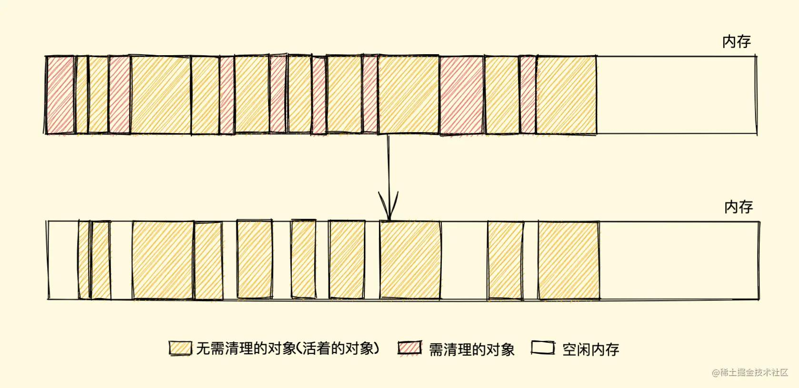

假设新建对象分配内存时需要大小为 size，由于空闲内存是间断的、不连续的，则需要对空闲内存列表进行一次单向遍历找出大于等于 size 的块才能为其分配


那如何找到合适的块呢？可以采取下面三种分配策略

+ First-fit，找到大于等于 size 的块立即返回
+ Best-fit，遍历整个空闲列表，返回大于等于 size 的最小分块
+ Worst-fit，遍历整个空闲列表，找到最大的分块，然后切成两部分，一部分 size 大小，并将该部分返回

这三种策略里面 Worst-fit 的空间利用率看起来是最合理，但实际上切分之后会造成更多的小块，形成内存碎片，所以不推荐使用，对于 First-fit 和 Best-fit 来说，考虑到分配的速度和效率 First-fit 是更为明智的选择

综上所述，标记清除算法或者说策略就有两个很明显的缺点

1. `内存碎片化`，空闲内存块是不连续的，容易出现很多空闲内存块，还可能会出现分配所需内存过大的对象时找不到合适的块
2. `分配速度慢`，因为即便是使用 First-fit 策略，其操作仍是一个 O(n) 的操作，最坏情况是每次都要遍历到最后，同时因为碎片化，大对象的分配效率会更慢

##### 优化方案：标记整理
标记整理（Mark-Compact）算法 就可以有效地解决，它的标记阶段和标记清除算法没有什么不同，只是标记结束后，标记整理算法会将活着的对象（即不需要清理的对象）向内存的一端移动，最后清理掉边界的内存


#### V8对GC的优化:分代式垃圾回收
V8 的垃圾回收策略主要基于分代式垃圾回收机制，V8 中将堆内存分为新生代和老生代两区域，采用不同的垃圾回收器也就是不同的策略管理垃圾回收

新生代的对象为存活时间较短的对象，简单来说就是新产生的对象，通常只支持 1～8M 的容量，而老生代的对象为存活事件较长或常驻内存的对象，简单来说就是经历过新生代垃圾回收后还存活下来的对象，容量通常比较大

新生代对象是通过一个名为 Scavenge 的算法进行垃圾回收，在 Scavenge算法 的具体实现中，主要采用了一种复制式的方法即 Cheney算法 ，Cheney算法 中将堆内存一分为二，一个是处于使用状态的空间我们暂且称之为 使用区，一个是处于闲置状态的空间我们称之为空闲区

当开始进行垃圾回收时，新生代垃圾回收器会对使用区中的活动对象做标记，标记完成之后将使用区的活动对象复制进空闲区并进行排序，随后进入垃圾清理阶段，即将非活动对象占用的空间清理掉。最后进行角色互换，把原来的使用区变成空闲区，把原来的空闲区变成使用区

`当一个对象经过多次复制后依然存活，它将会被认为是生命周期较长的对象，随后会被移动到老生代中`

老生代垃圾回收器来管理其垃圾回收执行，它的整个流程就采用的就是上文所说的标记清除算法了

新生代对象空间就采用并行策略，在执行垃圾回收的过程中，会启动了多个线程来负责新生代中的垃圾清理操作，这些线程同时将对象空间中的数据移动到空闲区域，这个过程中由于数据地址会发生改变，所以还需要同步更新引用这些对象的指针，此即并行回收


##### 增量标记与惰性清理的优缺？
增量标记与惰性清理的出现，使得主线程的停顿时间大大减少了，让用户与浏览器交互的过程变得更加流畅。但是由于每个小的增量标记之间执行了 JavaScript 代码，堆中的对象指针可能发生了变化，需要使用写屏障技术来记录这些引用关系的变化，所以增量标记缺点也很明显：

首先是并没有减少主线程的总暂停的时间，甚至会略微增加，其次由于写屏障机制的成本，增量标记可能会降低应用程序的吞吐量(吞吐量是指应用程序线程用时占程序总用时的比例。 例如,吞吐量99/100意味着100秒的程序执行时间应用程序线程运行了99秒, 而在这一时间段内GC线程只运行了1秒。)

三色标记法(暂停与恢复)：
+ 白色指的是未被标记的对象
+ 灰色指自身被标记，成员变量（该对象的引用对象）未被标记
+ 黑色指自身和成员变量皆被标记

V8 增量回收使用 **写屏障** (Write-barrier) 机制，即一旦有黑色对象引用白色对象，该机制会强制将引用的白色对象改为灰色，从而保证下一次增量 GC 标记阶段可以正确标记，这个机制也被称作 强三色不变性


##### 并发回收
它指的是主线程在执行 JavaScript 的过程中，辅助线程能够在后台完成执行垃圾回收的操作，辅助线程在执行垃圾回收的时候，主线程也可以自由执行而不会被挂起，**它需要额外实现一些读写锁机制**


#### 可能的内存泄漏场景
+ 意外的全局变量
+ this创建的意外的全局变量
+ 循环引用
```js
// 使用严格模式可避免
function fun(){
	f = 1000
}
```
```js
// 使用严格模式可避免
function fun(){
	this.f =1000
}
fun()
```
```js
var test = document.getElementById('test');
...... //绑定事件
test = null;//解除关联
```
```js
const refA = document.getElementById('refA');
document.body.removeChild(refA); // dom
console.log(refA, 'refA'); // console div
refA = null; //及时清除移除且不用的游离元素
console.log(refA, 'refA'); // 
```

### [10, 20, 30].map(parseInt)
在 JavaScript 中，map() 方法用于对数组的每个元素执行一个函数，并创建一个新数组，其结果是该函数在原始数组的每个元素上执行的结果。但是，当 map() 与 parseInt() 结合使用时，特别是在没有指定基数（即第二个参数）时，可能会产生意外的结果。

对于 parseInt() 函数，其接受两个参数：

1. 要解析的字符串
2. 解析时使用的基数（介于 2 和 36 之间）。如果没有提供基数，并且字符串以 "0x" 或 "0X" 开头，那么基数为 16（十六进制）。如果字符串以 "0" 开头且没有 "x" 或 "X"，那么 JavaScript 可能会将其解析为八进制数（但在 ECMAScript 5 严格模式以及之后的版本中，前导零被视为十进制）。

在 [10, 20, 30].map(parseInt) 的情况下，map() 会将数组的每个元素（这里是数字）转换为字符串，并作为 parseInt() 的第一个参数传递。同时，map() 的回调函数默认接收三个参数：当前元素的值、当前元素的索引和数组本身。在这里，由于我们没有为 map() 提供自定义的回调函数，它默认使用这些参数。因此，parseInt() 的第二个参数（基数）实际上是数组的索引。

所以，对于 [10, 20, 30].map(parseInt)：

+ 对于第一个元素 10（索引为 0）：parseInt('10', 0)，由于基数为 0 并且字符串不以 "0x" 或 "0X" 开头，所以将其解析为十进制数 10。
+ 对于第二个元素 20（索引为 1）：parseInt('20', 1)，由于基数为 1（这不是一个有效的基数），所以结果将是 NaN（不是一个数字）。
+ 对于第三个元素 30（索引为 2）：parseInt('30', 2)，由于基数为 2（二进制），但字符串 '30' 在二进制中不是有效的，所以结果将是 NaN。

因此，[10, 20, 30].map(parseInt) 的结果将是 [10, NaN, NaN]。

### 函数声明和函数表达式区别
```js
// 函数声明 函数提升
const res = sum(10, 20)
console.log(res)
function sum(x, y) {
    return x + y
}

// 函数表达式 直接报错
var res = sum(10, 20)
console.log(res)
var sum = function (x, y) {
    return x + y
}
```

### 严格模式要注意的地方
+ Module code is always strict mode code.
+ All parts of a ClassDeclaration or a ClassExpression are strict mode code.
+ `禁止意外创建全局变量，直接抛出错误`
+ `this 问题`
+ arguments 和参数列表的独立性，并且 arguments 不可修改
+ 给 NaN 赋值会抛出错误
+ 对象操作：给不可写属性赋值(writable: false)；给只读属性赋值(只有 get，没有 set)；给不可扩展对象新增属性
+ 严格模式要求参数名唯一，属性名唯一
+ 禁止八进制数字
+ 禁止对 primitive type 的变量加属性或方法
+ 禁止使用with
+ eval 不再为 surrounding scope 添加新的变量
+ **禁止delete 声明的变量，禁止delete 不可删除的属性或方法**

### LHS 和 RHS 是什么？会造成什么影响
LHS 是 Left Hand Side 的意思，左值查询一个变量，如果变量不存在，且在**非严格模式下，就会创建一个全局变量**。RHS 查询一个变量，如果变量不存在，就会报错 ReferenceError。

ReferenceError 同作用域判别失败相关，而 TypeError 则代表作用域判别成功了，但是对结果的操作是非法或不合理的。
```js
//Uncaught TypeError: b.push is not a function
var b=40;
b.push(1)
```

### == 和 ===
全等不会存在隐式转换问题

#### ==的注意之处
两等操作符存在隐式转换的情形。

```js
let obj = {valueOf:function(){return 1}}
let result1 = (obj == 1); // true
console.log(result1)//true

console.log(NaN == NaN) //false

let obj1 = {toString:function(){return 1}}
console.log(obj1 == 1)//true

// 运算操作时，valueOf的优先级高于toString
let obj2 = {toString:function(){return 1},valueOf:function(){return 2}}
console.log(obj2 == 1)//false
```

两等操作符总结：
1. 两个都为简单类型，字符串和布尔值都会转换成**数值**，再比较
2. 简单类型与引用类型比较，**对象转化成其原始类型的值**，再比较
3. 两个都为引用类型，**则比较它们是否指向同一个对象**
4. null 和 undefined 相等
5. 存在 NaN 则返回 false


#### []==![] {}==!{}的结果
```js
console.warn([] == ![])//true
console.warn({} == !{})//false

// Number([]) //=> 0
// [].valueOf() -> []
// [].toString() -> ''
//  Number('') -> 0
// Number({})// => NaN
// ({}).valueOf() -> {}
// ({}).toString() -> '[object Object]'
// Number('[object Object]') -> NaN
```

### 实现a==1&&a==2&&a==3
```js
//重写toString
let a={
	x:0,
	toString(){
		console.log(`执行${this.x}`)
		return ++this.x
	}
}

//数据劫持
var i=0
Object.defineProperty(window,"a",{
	get(){
		return ++i;
	}
})

//数组
var a=[1,2,3]
a.toString =a.shift

 
if(a==1&&a==2&&a==3){
	console.log("成功")
}

// + 先toString方法
// + null==undefined
// + NaN!=NaN
// + 能转变成数字的如果需要可以转成数字
```


### Object.is() 与比较操作符 “===”、“==” 的区别？
1. 使用双等号（==）进行相等判断时，如果两边的类型不一致，则会进行强制类型转化后再进行比较。
2. 使用三等号（===）进行相等判断时，如果两边的类型不一致时，不会做强制类型准换，直接返回 false。
3. 使用 Object.is 来进行相等判断时，一般情况下和三等号的判断相同，它处理了一些特殊的情况，比如 -0 和 +0 不再相等，两个 NaN是相等的。

### 判断对象是空对象
1. Object.keys()+length； Object.entries
2. JSON.stringify():不能包含复杂的结构，如函数等
3. for...in + **obj.hasOwnProperty(key)**

### `深拷贝和浅拷贝`


浅拷贝只复制对象的顶层属性和值，而深拷贝则会层层递归。

+ JavaScript中的`Object.assign()` `Object.create` 方法和数组和对象的`扩展运算符`（...）都执行的是浅拷贝。数组的concat和slice也属于浅拷贝
+ JSON.parse(JSON.stringify(obj))深拷贝,但是会忽略掉value是undefined,Symbol,function,也不能处理对象循环引用的问题,set类型数据和map类型会被处理为{}

```js
const fxArr = ["One", "Two", "Three"]
const fxArrs = fxArr.slice(0)
fxArrs[1] = "love";
console.log(fxArr) // ["One", "Two", "Three"]
console.log(fxArrs) // ["One", "love", "Three"]
```
```js
const fxArr = ["One", "Two", "Three"]
const fxArrs = fxArr.concat()
fxArrs[1] = "love";
console.log(fxArr) // ["One", "Two", "Three"]
console.log(fxArrs) // ["One", "love", "Three"]
```

### 数据类型
+ 基本类型： number string boolean undefined `null symbol` bigInt
+ 引用类型： object function array

Symbol 代表创建后独一无二且不可变的数据类型，它主要是为了解决可能出现的全局变量冲突的问题。

基本类型存储在栈中，引用类型存储在堆中


```js
let intNum = 55 // 10进制 55
let num1 = 070 // 8进制 56 (0开头)
let hexNum1 = 0xA //16进制 10(0x开头)
```
#### `判断数据类型的方法`
+ typeof可判断基础类型，函数类型和其他引用类型都返回object，注意null的特殊性
+ instanceOf可以用来测试构造函数的prototype属性是否出现在对象的`原型链`中的`任何位置`，它可以对引用类型准确判断，但是不能判断基础类型
+ Object.prototype.toString [object xxx]
+ 构造函数:存在风险，可以判断包括简单类型、引用类型的构造函数
+ Array.isArray 判断数组

```js
(2).constructor
//ƒ Number() { [native code] }
```

```js
function F1(){}
function F2(){}
F1.prototype = new F2()
// F1.prototype.constructor = F1
const f1 =new F1()

console.log(f1.constructor) //不注释的话为F1,注释的话为F2
console.log(f1 instanceof F1)//true
console.log(f1 instanceof F2)//true
```

### js内置对象
+ String
+ Boolean
+ Number
+ Array
+ Object
+ Function
+ Date
	- getYear
+ Math
	- abs
	- sqrt
	- max
	- min
+ RegExp

### undefined和null的区别
+ undefined是声明后未赋值，而null通常表示一个空的对象引用(空指针)
+ 在早期的 JavaScript 引擎中，为了性能优化，`变量类型信息`被存储在一个变量的`低位字节`中。这些类型标签被用来快速判断变量的类型。由于当时的设计决策，null 和某些对象类型`共享`了相同的低位字节表示，这导致了 typeof null 返回 "object"。而undefined的typeof就是undefined
+ 在两等情况下，二者相等，三等情况下则不相等
+ `null+1 =>1 undefined+1+1 =>NaN(null运算Number(null)=>0)`
+ `传参时，如果function fun(arg1=arg2,arg2),此时fun(null,xxx)不会报错，而fun(undefined,xxx)会报arg还未赋值就引用的错误`


### 数据结构
数据结构是计算机存储和组织数据的方式，它研究的是数据的`逻辑结构和物理结构`以及它们之间的相互关系

数据结构有多种分类，包括`数组、栈、链表、队列、树、图、字典、堆和散列表（哈希表）`等。

#### 数组和链表的应用场景

在前端开发中，链表和数组都是常用的数据结构，但它们有各自的特点和适用场景

1. 数组（Array）

特点：

+ 连续内存空间：数组的元素在内存中是`连续存储`的，这意味着访问数组中的任何元素都非常快（平均时间复杂度为`O(1)`）。
+ 固定大小：一旦数组被创建，其大小`通常是固定的`。虽然JavaScript中的数组是动态的，可以添加和删除元素，但内部实现可能会涉及到元素的移动和内存分配。
+ 随机访问：由于数组在内存中是连续存储的，所以可以通过索引直接访问任何元素。

适用场景：
+ 当需要`快速访问和修改特定位置`的元素时。
+ 当需要`保持元素的插入顺序`时。
+ 当处理大量静态数据或进行批量操作时。

2. 链表（Linked List）

特点：

+ 非连续内存空间：链表中的元素可以`分散`在内存中的任何位置，每个元素（节点）都包含数据和指向下一个元素的指针。
+ 动态大小：链表的大小可以`动态`地增长和缩小，因为节点可以根据需要添加或删除。
+ 顺序访问：访问链表中的元素通常需要从头节点开始，逐个遍历节点，直到找到所需的元素。这导致访问特定位置的元素的时间复杂度较高（平均时间复杂度为`O(n)`）。

适用场景：
+ 当需要在`任意位置插入或删除元素时`，链表的效率更高，因为不需要移动其他元素。
+ 当处理`大量动态数据`时，链表可以更有效地管理内存。
+ 当需要实现特定功能的数据结构（如栈、队列等）时，链表可以作为基础结构。

3. 对比
   + 空间复杂度：数组在内存使用上通常更紧凑，因为它们使用连续的内存空间。而链表由于每个节点都需要存储`指针`，可能会占用更多的空间。
   + 时间复杂度：访问数组中的特定元素通常更快，因为可以通过`索引`直接访问。而访问链表中的元素需要从头节点开始遍历，时间复杂度较高。但在`插入和删除操`作方面，链表通常比数组更高效。
   + 灵活性：链表在`动态调整大小和插入/删除元素`方面更加灵活，而数组则更适合处理`静态数据或进行批量操作`。

4. 总结
   
在选择使用数组还是链表时，需要根据具体的应用场景和需求来权衡。在大多数情况下，数组是前端开发中更常用的数据结构，因为它们提供了直观的访问方式和丰富的API。但在某些特定场景下，如需要频繁地插入或删除元素，或者实现特定的数据结构时，链表可能会是一个更好的选择。

### 字符串常用的方法
+ 增：**concat(拼接，不影响原字符串)**
+ 删：slice substr substring(都不影响原字符串)
+ 改：trim repeat padStart(填充) toLowerCase
+ 查：indexOf includes chartAt startWith
+ 转换方法： split(转为数组),可以是正则或者字符串
+ 正则方法：**match search(可以是正则或者字符串,返回第一个匹配的内容下标) replace**

```js
let colorText = "red,blue,green,yellow";
let colors1 = colorText.split(",");       // ["red", "blue", "green", "yellow"]
let colors2 = colorText.split(",", 2);    // ["red", "blue"]
let colors3 = colorText.split(/[e]+/);  // ['r', 'd,blu', ',gr', 'n,y', 'llow']
let colors4 = colorText.split('e');  // ['r', 'd,blu', ',gr', '', 'n,y', 'llow']
console.log(colors1)
console.log(colors2)
console.log(colors3)
```

```js
var str="Visit Runoob!"; 
var n=str.search("Runoob");
//6

let text = "cat,bat,sat,fat";
let pos = text.search(/at,f/);
console.log(pos); // 9
```

```js
var str="Visit Microsoft! Visit Microsoft!";
var n=str.replace("Microsoft","Runoob");
//"Visit Runoob! Visit Microsoft!"
var str2="Mr Blue has a blue house and a blue car";
var n2=str.replace(/blue/g,"red");
//"Mr Blue has a red house and a red car"
```

```js
//replace第二个参数还可以是函数
function htmlEscape(text) {
  return text.replace(/[<>"&]/g, function(match, pos, originalText) {
    switch(match) {
      case "<":
        return "&lt;";
      case ">":
        return "&gt;";
      case "&":
        return "&amp;";
      case "\"":
        return "&quot;";
    }       
  });
}
         
console.log(htmlEscape("<p class=\"greeting\">Hello world!</p>")); 
// "&lt;p class=&quot;greeting&quot;&gt;Hello world!&lt;/p&gt;"
```

#### match matchAll

match() 查找找到一个或多个正则表达式的匹配。
```js
var str="The rain in SPAIN stays mainly in the plain"; 
var n=str.match(/ain/g);
//ain,ain,ain
```

String.prototype.matchAll() 方法返回一个迭代器，它产生所有正则表达式匹配的结果，`包括捕获组`。
```js
const str = 'hello javascript hello css'
console.log(...str.matchAll(/(hel)(lo)/g))
//[ 'hello', 'hel', 'lo' ]  
//[ 'hello', 'hel', 'lo' ]
//浏览器打印会出现index和input等信息 ['hello', 'hel', 'lo', index: 0, input: 'hello javascript hello css', groups: undefined]
```
正则表达式 /(hel)(lo)/g 会查找字符串 str 中所有 hel 后面紧跟着 lo 的位置，并且因为它有两个捕获组 (hel) 和 (lo)，所以每个匹配项都会包含这两个捕获组。
```js
[  
  [完整匹配项, 捕获组1, 捕获组2, ...],  
  [完整匹配项, 捕获组1, 捕获组2, ...],  
  ...  
]
```
#### substring slice字符串处理区别
+ substring可以反向截取，既第二个参数可以比第一个参数小，而slcie不可以
+ slice支持负值，就是字符串末尾开始计算，而substring遇到负值自动归为0


### `数组常用的方法`
+ 增 push unshift splice `concat(只有它不影响原数组)`
+ 删 pop shift splice `slice(只有它不影响原数组)`
+ 改 splice
+ 查 find(返回第一个匹配的选项) indexOf includes
+ 排序 sort reverse(会修改原数组)
+ 转换方法 join
+ 迭代方法 some every map forEach reduce filter 
+ 其他 fill flat(函数扁平化) copyWithin arr.keys() arr.values() arr.entries()

```js
let arr = [4,1,3,5,7,9]
let a=arr.find(e=>{
	return(e>5)
})
console.log(a)//7
```

#### 影响到原数组的方法
+ vue2中重写了 `push pop unshift shift splice sort reverse`
+ fill copyWithin
```js
let arr = [1, 2, 3, 4, 5];  
arr.fill('a', 1, 3); // arr 现在是 [1, 'a', 'a', 4, 5]
```
```js
let arr = [1,3,5,7,9]
arr.copyWithin(-2,0,2)
console.log(arr)//[1, 3, 5, 1, 3]
```

#### 数组reduce方法应用场景
求和
```js
const arr = [10, 20, 30, 40, 50]
// const res = arr.reduce((sum, curVal, index, arr) => {
//     // console.log('reduce function ....')
//     // console.log('sum', sum)
//     // console.log('curVal', curVal)
//     // console.log('index', index)
//     // console.log('arr', arr)

//     return sum + curVal // 返回值，会作为下一次执行时的第一个参数 sum 的值
// }, 0)
const res = arr.reduce((sum, curVal) => sum + curVal, 0)
console.log('res', res)
```
计数
```js
 // 计数
const arr = [10, 20, 30, 40, 50, 10, 20, 30, 20]
const n = 30
const count = arr.reduce((count, val) => {
    return val === n ? count + 1 : count
}, 0)
console.log('count', count)
```
 
输出字符串
```js
// 输出字符串
const arr = [
    { name: '张三', age: '20' },
    { name: '李四', age: '21' },
    { name: '小明', age: '22' },
]
const str = arr.reduce((s, item) => {
    return `${s}${item.name} - ${item.age}\n`
}, '')
console.log(str)
```
去重等等……

#### 数组扁平化实现方案
1. 使用递归
2. reduce(递归)


```js
function flattenArrayWithReduce(arr) {  
    return arr.reduce((acc, val) => {  
        // 如果 val 是一个数组，则递归地调用 flattenArrayWithReduce  
        // 否则，直接添加到累加器数组中  
        return acc.concat(Array.isArray(val) ? flattenArrayWithReduce(val) : val);  
    }, []); // 累加器的初始值是一个空数组  
}  
  
// 示例  
const nestedArray = [1, [2, [3, 4], 5], 6];  
const flattenedArray = flattenArrayWithReduce(nestedArray);  
console.log(flattenedArray); // 输出: [1, 2, 3, 4, 5, 6]
```

3. 使用扩展运算符
4. 使用 flat 方法（ES2019）

```js
const nestedArray = [1, [2, [3, 4], 5], 6];  
const flattenedArray = nestedArray.flat(Infinity); // Infinity 确保无论嵌套多深，都能扁平化  
console.log(flattenedArray); // 输出: [1, 2, 3, 4, 5, 6]
```

5. 堆栈法

```js
function flattenArrayWithStack(arr) {  
	    const stack = [...arr]; // 将数组转换为堆栈  
	    const result = []; // 存放扁平``````													`			化后的结果  
	    while (stack.length > 0) {  
	        const current = stack.pop(); // 弹出堆栈顶部的元素  
	        if (Array.isArray(current)) {  
	            // 如果当前元素是数组，则将其元素推入堆栈  
	            for (let i = current.length - 1; i >= 0; i--) {  
	                stack.push(current[i]);  
	            }  
	        } else {  
	            // 如果当前元素不是数组，则添加到结果数组中  
	            result.push(current);  
	        }  
	    }  
	    return result;  
	}  
	  
	// 示例  
	const nestedArray = [1, [2, [3, 4], 5],[8,9,[10,11]], 6];  
	const flattenedArray = flattenArrayWithStack(nestedArray);  
	console.log(flattenedArray)//[6, 8, 9, 10, 11, 2, 3, 4, 5, 1]
```


### 数组中对象的排序
根据value从小到大排序
```js
	let arr1 = [
		{
			key:'z',
			value:3
		},
		{
			key:'t',
			value:5
		},
		{
			key:'sbxg',
			value:2
		},
		{
			key:'hrsm',
			value:1
		},
		{
			key:"zzdx",
			value:4
		}
	]
	
	let arr = arr1.sort(change)
	function change(v1,v2){
		return v1.value-v2.value
	}
	
	console.log(arr)
```


### 函数缓存

场景：[昂贵的函数调用执行复杂计算的函数][纯函数][重复输入的递归函数]
```js
const memoize = function (func, content) {
	 let cache = Object.create(null)
	
	 content = content || this
	 return (...key) => {
		 if (!cache[key]) {
		 cache[key] = func.apply(content, key)
	 }
	 console.log(cache)//{100,200: 300}
	 return cache[key]
	 }
	}
	var add = function (x,y) {
	 return x+y;
	}
	const calc = memoize(add);
	const num1 = calc(100,200)
	const num2 = calc(100,200) 
	console.warn(num1,num2)
```

### `event loop`
js是单线程，同一时间只能做一件事，而避免阻塞的方法就是事件循环

+ 同步任务：都在主线程(这里的主线程就是JS引擎线程)上执行，会形成一个执行栈
+ 异步任务：事件触发线程管理着一个任务队列，只要异步任务有了运行结果，就在任务队列之中放一个事件回调

+ macro-task(宏任务)：包括整体代码script，setTimeout，setInterval，setImmediate ()-Node,requestAnimationFrame (存在争议,但是符合宏任务特征)-浏览器，I/O 操作、UI 渲染（浏览器）.
+ micro-task(微任务)：Promise，process.nextTick（Node.js）,Object.observe,MutationObserver,在ECMAScript中，microtask也被称为jobs


#### event loop 宏任务 微任务 和dom渲染的关联
每一次 call stack（当前轮询结束） 结束，都会触发 DOM 渲染（**不一定非得渲染，就是给一次 DOM 渲染的机会！！！**）然后再进行 event loop。
+ 宏任务：DOM 渲染后再触发，ES 语法没有，JS 引擎不处理，浏览器（或 nodejs）干预处理。
+ 微任务：DOM 渲染前会触发，ES 语法标准之内，JS 引擎来统一处理。即，不用浏览器有任何干预，即可一次性处理完，更快更及时。


```html
<!DOCTYPE html>
<html>
  <head>
    <meta charset="utf-8">
    <title></title>
  </head>
  <script src="http://libs.baidu.com/jquery/2.0.0/jquery.min.js"></script>
  <body>
    <div id="container">
      
    </div>
  </body>
</html>
<script>
// 修改 DOM
const $p1 = $('<p>一段文字</p>')
const $p2 = $('<p>一段文字</p>')
const $p3 = $('<p>一段文字</p>')
$('#container')
    .append($p1)
    .append($p2)
    .append($p3)
console.log($('#container p'))
// 微任务：渲染之前执行（DOM 结构已更新，未渲染在页面上）
Promise.resolve().then(() => {
    const length = $('#container').children().length
    alert(`micro task ${length}`)
})

// 宏任务：渲染之后执行（DOM 结构已更新）
setTimeout(() => {
    const length = $('#container').children().length
    alert(`macro task ${length}`)
})
</script>
```


### Class和实例的关系以及原型链
1.	每个class都有显示原型prototype【class还有constructor和`__proto__`】
2.	每个实例都有隐式原型`__proto__`【实例无prototype，有constructor】
3.	实例的`__proto__`指向对应class的prototype

原型（prototype）主要指的是一个对象，它用于存储`共享属性和方法`。js每个函数都有一个prototype属性，这个属性是一个指针，指向一个对象，这个对象就是原型对象。可提高代码的复用性和效率。

原型链（prototype Chain）则是js实现继承的机制之一。每个对象都有一个`内部链接`指向另一个对象。这个链接被称为`对象的原型`。当试图访问一个对象的属性时，如果对象本身没有这个属性，那么js就会在这个对象的原型上寻找这个属性，这个原型对象自身也可能有原型，这样一层一层向上查找，就形成了一个链条，这就是原型链。

原型链不仅用于`实现继承`，还用于解决对象`属性查找`的问题。


特殊之处：Function的构造函数是自己；Function的prototype和`__proto__`都指向`Function.prototype`，Function作为对象时，它的`__proto__`指向它构造函数的prototype。Object的构造函数也是Function,同时`一切对象又是Object创建`。

> 一切函数对象（包括Object），都是继承Function对象 

#### 函数的特殊性
+ Person作为一个函数对象，它的隐式原型指向`Function.prototype`
+ Person的prototype作为一个普通对象，它的隐式原型指向`Object.prototype`
+ Function的`隐式原型和显示原型`则相等
+ Object作为一个函数对象，它的隐式原型指向Function.prototype
  
```js
function Person(){}
const person = new Person()
console.log(Person.__proto__ === Function.prototype) // true
console.log(Person.prototype.__proto__ === Object.prototype)// true
console.log(Function.__proto__ === Function.prototype)// true
console.log(Function.prototype.__proto__ === Object.prototype)// true
console.log(Object.__proto__ === Function.prototype)// true
console.log(Object.prototype.__proto__ === null)// true
```

### js如何实现继承
它允许创建一个新的类（或对象），该类（或对象）可以继承另一个类（或对象）的属性和方法。

#### `继承的方案`
+ 原型链继承：复用prototype方法，缺点：1.对象类型的属性会被其他实例修改2.打印无法直接看到继承的属性3.原型创建时无法传参
```js
// 无法定制化传参
Cat.prototype = new Animal();
Cat.prototype.constructor = Cat;
```

+ 盗用构造函数继承：子类可传参，不会共用对象，但是父类prototype方法无法继承
```js
function Child(){
	Parent.apply(this, [test]); 
}
```
+ 组合继承：结合原型链+构造函数，两者优点有，缺点：调用两次父类，浪费性能，且继承的属性子类已经通过盗用构造函数存在了，父类对象又存在了一份无用的


+ 原型式继承【用于字面量对象】,缺点：修改对象属性会改变其他对象的相关属性
```js
var obj = {
  name: "why",
  age: 18,
  arr:[]
}
var info = Object.create(obj)//浅拷贝
info.name =xxx 
info.arr.push(1)
```

+ 寄生式继承【用于字面量对象】，核心：`使用原型式继承获得一个目标对象的浅复制，然后增强这个浅复制的能力。`缺点同上
```js
function createAnother(original){
    var clone = Object.create(original);//通过调用函数创建一个新对象
	// 增加了某些功能
    clone.sayHi = function () {//以某种方式来增强这个对象
        console.log("Hi");
    };
    return clone; //返回这个对象
}
```

+ 寄生组合式继承：比较完美的方案
```js
function clone (parent, child) {
 // Object.create
 child.prototype = Object.create(parent.prototype);
 child.prototype.constructor = child;
}
function Parent6() {
 this.name = 'parent6';
 this.play = [1, 2, 3];
}
Parent6.prototype.getName = function () {
 return this.name;
}
function Child6() {
 Parent6.call(this);
 this.friends = 'child5';
}
clone(Parent6, Child6);
Child6.prototype.getFriends = function () {
 return this.friends;
}
let person6 = new Child6();
console.log(person6);
```


### `正则表达式`
正则表达式使用一种特殊的语法来定义模式，这些模式可以被用来搜索、匹配或替换文本。

```js
// 字面量方式
let regex = /pattern/;
// 构造函数方式
let regex1 = new RegExp('pattern');
```


#### 正则的贪婪模式和懒惰模式
+ 在匹配的过程中，尝试可能的顺序是从多往少的方向去尝试，显示bbb，然后再看整个正则是否能匹配，不能匹配时，突出一个b，即在bb的基础上，再尝试，以此类推，如果多个贪婪量词挨着，则深度优先搜索。
```js
const reg = /ab{1,3}c/
```
+ 在贪婪量词后加？就是惰性模式，尽可能少的匹配

```js
const str = 'sd2345s423987sd2342'
console.log(str.match(/\d{3,5}?/g))
// 因为增加了"?"符合，导致只要有符合3个连续数字的就返回。
// ["234", "423", "987", "234"]

console.log(str.match(/\d{3,5}/g))
// 去掉"?"后，变成了默认模式，就是贪婪匹配
// ["2345", "42398", "2342"]
```
```js
const string = "12345";
const regx = /\d{1,3}\d{1,3}/;
const reg1 = /(\d{1,3})\d{1,3}/; //括号表示分组
console.log( string.match(regx) );//['12345', index: 0, input: '12345', groups: undefined]
console.log( string.match(reg1) );//['12345', '123', index: 0, input: '12345', groups: undefined]
```


### 对象的一些方法
+ Object.is():严格判断两个值是否相等，与严格比较===基本一致，除了+0和-0，NaN和NaN与之不一致

```js
let f1= {k1:1}
let f2 =f1
console.log(+0 === -0) //true
console.log(NaN === NaN )//false
console.log(Object.is(+0, -0) )//false
console.log(Object.is(NaN, NaN) )//true
console.log(Object.is([], []) )//false
console.log(Object.is(f1, f2) )//true
```

+ Object.assign 用于合并对象将`源对象`(不包括原型)的所有`可枚举`属性复制到目标对象
```js
const target = { a: 1, b: 1 };
const source1 = { b: 2, c: 2 };
const source2 = { c: 3 };
Object.assign(target, source1, source2);
target // {a:1, b:2, c:3}
```

+ Object.fromEntries 键值对数组转对象

```js
console.warn(Object.fromEntries([
 ['foo', 'bar'],
 ['baz', 42]
]))

//{foo: 'bar', baz: 42}
```

+ Object.freeze 对象冻结

### new Object()和Object.cretate()以及Object.assign()区别
{}就是new Object的简单写法

Object.create() 静态方法以一个**现有对象作为原型**，创建一个新对象。
```
Object.create(proto, propertiesObject)
```

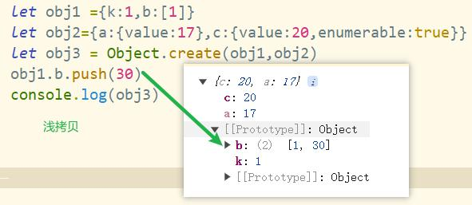

Object.assign() 静态方法将一个或者多个源对象中所有`可枚举`的`自有属性`复制到目标对象，并返回修改后的目标对象。
```
Object.assign(target, ...sources)
```
```js
const target = { a: 1, b: 2 };
const source = { b: 4, c: 5 };

const returnedTarget = Object.assign(target, source);

console.log(target);
// Expected output: Object { a: 1, b: 4, c: 5 }

console.log(returnedTarget === target);
// Expected output: true
```

### 关于对象的遍历方案
1. for-in 循环循环自身和原型上的属性,不包括Symbol，`如果该属性设置了不可遍历`，则会忽略，可结合obj.hasOwnProperty(key)去规避原型上的属性

```js
	const desc = Object.getOwnPropertyDescriptor(Object.prototype, 'toString');  
	console.log(desc.enumerable); //  false
	Object.prototype.addFun = function(){
		
	}
	// Object.getOwnPropertyDescriptor(obj,'x'),查出自身的属性的具体信息
	const addFun= Object.getOwnPropertyDescriptor(Object.prototype, 'addFun');
	console.log(addFun,addFun.enumerable); // true 

	function Animal(params){
　　　　this.species = "动物";
		this.animal=function(){
			console.log('1000'+params)
		};
		this.arr=[1,2,3,4];
		
　　}
	Animal.prototype.dosomething = function(){
		console.log("do something")
	}
　	function Cat(name,color){
　　　　this.name = name;
　　　　this.color = color;
　　}
	
	Cat.prototype = new Animal();
　　Cat.prototype.constructor = Cat;
　　var cat1 = new Cat("大毛","黄色");
	console.log(cat1)
	
	for(let item in cat1){
		console.log(item)
	}
```


2. Object.entries(obj)，Object.keys(obj)，Object.values(obj)只会给出对应的obj 自身的可遍历属性
3. **Object.getOwnPropertyNames(obj)** ：只获取对象自身的属性的key值，包括**可遍历的和不可遍历的属性**
4. 如果响应的属性key是Symbol设置的，那么是无法通过以上方法遍历的 ,可借助`Object.getOwnPropertySymbols`获取属性是symbol的

```js
let obj = {}
let age=Symbol();
let t1 =Symbol('t1')
obj[age]=18;
obj[t1]='t111'
Object.getOwnPropertySymbols(obj).forEach(el=>{
	console.log(obj[el])
	//18
	// t111
})
```
5. for of也可以遍历有iterator接口的对象

6. **Reflect.ownKeys** 方法返回一个由目标对象自身的属性键组成的数组。它的返回值等同于 Object.getOwnPropertyNames(target).concat(Object.getOwnPropertySymbols(target))。


#### for...of 对象适配
+ 借助generator

```js
function* objectEntries(obj) {
  let propKeys = Reflect.ownKeys(obj);

  for (let propKey of propKeys) {
    yield [propKey, obj[propKey]];
  }
}

let jane = { first: 'Jane', last: 'Doe' };

for (let [key, value] of objectEntries(jane)) {
  console.log(`${key}: ${value}`);
}
// first: Jane
// last: Doe
```


### this指向


this是一个关键字，它引用的是`当前执行上下文中`的对象。this的值取决于函数是如何被调用的，而不是函数被定义的位置。

第一种是函数调用模式，当一个函数不是一个对象的属性时，直接作为函数来调用时，this 指向全局对象。【在严格模式环境中，默认绑定的this指向undefined】
```js
function fn() {
    console.log(this); //window
};

function fn1() {
    "use strict";
    console.log(this); //undefined
};

var name = '听风是风';

fn(); 
fn1();
```
```js
// 如果在严格模式下调用不在严格模式中的函数，并不会影响this指向
var name = '听风是风';
function fn() {
    console.log(this); //window
    console.log(this.name); //听风是风
};

(function () {
    "use strict";
    fn();
}());
```
第二种是方法调用模式，如果一个函数作为一个对象的方法来调用时，this 指向这个对象。
```js
//如果函数调用前存在多个对象，this指向距离调用自己最近的对象
function fn() {
    console.log(this.name);
};
let obj = {
    name: '行星飞行',
    func: fn,
};
let obj1 = {
    name: '听风是风',
    o: obj
};
obj1.o.func() //行星飞行

//obj对象虽然obj1的属性，但它两原型链并不相同，并不是父子关系，由于obj未提供name属性，所以是undefined。
function fn() {
    console.log(this.name);
};
let obj = {
    func: fn,
};
let obj1 = {
    name: '听风是风',
    o: obj
};
obj1.o.func() //？？
```
```js
// 虽然obj对象并没有name属性，但顺着原型链，找到了产生自己的构造函数Fn，由于Fn原型链存在name属性，所以输出时间跳跃了。
function Fn() {};
Fn.prototype.name = '时间跳跃';

function fn() {
    console.log(this.name);
};

let obj = new Fn();
obj.func = fn;

let obj1 = {
    name: '听风是风',
    o: obj
};
obj1.o.func() //?
```
第三种是构造器调用模式，如果一个函数用 new 调用时，函数执行前会新创建一个对象，this 指向这个新创建的对象。

第四种是 apply 、 call 和 bind 调用模式，这三个方法都可以显示的指定调用函数的 this 指向。如果在使用call之类的方法改变this指向时，指向参数提供的是`null或者undefined`，那么 this 将指向全局对象。另外，在js API中部分方法也内置了显式绑定，以**forEach**为例：
```js
let obj1 = {
    name: '听风是风'
};
let obj2 = {
    name: '时间跳跃'
};
var name = '行星飞行';

function fn() {
    console.log(this.name);
};
fn.call(undefined); //行星飞行
fn.apply(null); //行星飞行
fn.bind(undefined)(); //行星飞行
let obj = {
    name: '听风是风'
};

[1, 2, 3].forEach(function () {
    console.log(this.name);//听风是风*3
}, obj);
```
这四种方式，使用构造器调用模式的优先级最高，然后是 apply、call和 bind 调用模式，然后是方法调用模式，然后是函数调用模式。


```js
function foo(a) {
  this.a = a;
}

const obj1 = {};
var bar = foo.bind(obj1);
bar(2);
console.log(obj1.a); // 2

var baz = new bar(3)
console.log(baz.a) // 3

console.log(obj1)//{a: 2}
```
bar 函数本身是通过 bind 方法构造的函数，其内部已经对将 this 绑定为 obj1，它再作为构造函数，通过 new 调用时，**返回的实例已经与 obj1 解绑**。

#### this隐式绑定丢失
隐式丢失最常见的就是作为`参数传递以及变量赋值` ,一个最常见的 this 绑定问题就是被隐式绑定的函数会丢失绑定对象，也就是说它会应用默认绑定，从而把 this 绑定到全局对象或者 undefined或者是新创建的隐式绑定的对象上，取决于是否是严格模式

```js
function foo() {
console.log( this.a );
}
var obj = {
a: 2,
foo: foo
};
var bar = obj.foo; // 函数别名！
var a = "oops, global"; // a 是全局对象的属性
//bar作为一个独立的函数被调用，而不是作为 obj 的方法被调用
bar(); // "oops, global"
obj.foo()//2
```
> 这种情况还有在callback回调时也可能会发生（doFoo( obj.foo )）此时的obj.foo相当于fn = obj.foo

注意，隐式绑定丢失并不是都会指向全局对象，比如下面的例子：
```js
var name = '行星飞行';
let obj = {
    name: '听风是风',
    fn: function () {
        console.log(this.name);
    }
};
let obj1 = {
    name: '时间跳跃'
}
obj1.fn = obj.fn;
obj1.fn(); //时间跳跃
```
虽然丢失了 obj 的隐式绑定，但是在赋值的过程中，**又建立了新的隐式绑定**，这里this就指向了对象 obj1。

#### this的案例

```js
const o1 = {
  text: 'o1',
  fn: function() {
		return this.text
  }
}

const o2 = {
  text: 'o2',
  fn: function() {
		return o1.fn();
  }
}

const o3 = {
  text: 'o3',
  fn: function() {
    var fn = o1.fn;
    return fn();
  }
}

console.log(o1.fn()); // o1
console.log(o2.fn()); // o1
console.log(o3.fn()); // undefined
```
如果需要让 console.log( o2.fn() ) 语句输出 o2，该怎么做?

一般面试者可能会想到使用 bind，clll，apply 来对 this 的指向进行干预，这确实是一种思路。 但是面试官可能还会接着问:如果不能使用 bind，call， apply，还有别的方法吗?

 这个问题可以考在面试者对基础知识的掌程深度及随机应变的思维能力。答案是，当然还有别的方法，如下。
```js
const o1 = {
  text: 'o1',
  fn: function() {
		return this.text
  }
}

const o2 = {
  text: 'o2',
  fn: o1.fn
}

console.log(o2.fn()); // o2
```
以上方法同样应用了那个重要的结论：this 指向最后调用它的对象。在上面的代码中，我们提前进行了赋值操作，将函数 fn 挂载到 o2对象上，fn 最终作为 o2 对象的方法被调用。

### bind和new的优先级问题以及箭头函数的指向
```js
function foo(a) {
	this.a = a
}

const obj1 = {}
var bar = foo.bind(obj1)
bar(2)
console.log(obj1.a)
var baz = new bar(3)
console.log(baz.a)
console.log(obj1.a)
//2
//3
//2
```
> bar 函数本身是通过 bind 方法构造的函数，其内部已经将 this 绑定为 obj1，当它再次作为构造函数通过 new 被调用时，返回的实例就已经与obj1解绑了。也就是说，new 绑定修改了 bind 绑定中的 this 指向，因此 new 绑定的优先级比显式 bind 绑定的更高。

```js
function foo() {  
  return a => {  
    console.log(this.a); // 这里的this.a引用的是obj1.a，因为箭头函数捕获了foo函数执行时的this值  
  };  
}  
  
const obj1 = { a: 2 };  
const obj2 = { a: 3 };  
  
const bar = foo.call(obj1); // bar现在是一个箭头函数，它捕获了obj1作为this的值  
bar.call(obj2); // 打印2，因为this.a引用的是obj1.a，忽略obj2  
```

在调用 foo.call(obj1) 时，foo 函数内部的 this 被绑定到了 obj1。然后，foo 函数返回了一个箭头函数，这个箭头函数捕获了 foo 函数执行时的 this 值，即 obj1。

因此，当您调用 bar.call(obj2) 时，您试图改变 bar 函数内部的 this 值，但这是不可能的，因为 bar 是一个箭头函数。箭头函数忽略 call、apply 或 bind 方法传入的 this 值。

由于 bar 内部的 console.log(this.a) 仍然引用的是 obj1.a（因为 bar 是一个捕获了 foo 函数 this 值的箭头函数），所以它会打印 2。

```js
var a = 123
const foo = () => a => {
	console. log(this.a)
}

const obj1 = { a: 2 }

const obj2 = { a: 3 }

const bar = foo.call(obj1)
bar.call(obj2)//123
```
在返回的箭头函数中，当试图访问 this.a。但是，`由于这是一个箭头函数，它不会绑定自己的 this 值，而是捕获其定义时所在上下文的 this 值`。在这种情况下，this 指向全局对象（在浏览器中是 window），而全局对象上有一个 a 属性，其值为 123。

```js
let a = 123
const foo = () => a => {
	console. log(this.a)
}

const obj1 = { a: 2 }

const obj2 = { a: 3 }

const bar = foo.call(obj1)
bar.call(obj2)//undefined
```
> 使用 const let声明的变量不会挂载到 window 全局对象上。因此，this 指向 windows 时，自然也找不到 a 变量了

#### call appy bind的用法和区别
都是JavaScript中用于改变函数执行上下文（即this的指向）的方法

1. call、apply只是临时的修改一次，即只在call或apply方法的那一次有效；当再次调用原函数的时候，它的指向还是原来的指向。而bind方法创建的新函数会`永久性地绑定this值`。
2. call和apply基本一致，除了传参有些不同
3. call和apply立刻执行，而bind则是返回一个函数，需要再次调用


### new操作做了什么
1. 创建一个新的`空对象`
2. 这个新对象内部的`[[prototype]]`特性被赋值为构造函数的`prototype`属性
3. `构造函数内部的this被赋值为这个新对象(即this指向新对象)`
4. 执行构造函数内部的代码:给对象`添加属性和方法`
5. 如果构造函数返回 `一个对象` ，则返回`该对象`；否则返回**刚创建的对象**(如果return 1等数字/字符串/布尔值会被引擎忽略，然后返回刚创建的对象)

```js
function fn()
{
 this.user = 'xxx';
 return {};
}
var a = new fn();
console.log(a.user); //undefined
```
```js
function fn()
	{
	 this.user = 'xxx';
	 // return null;//null和其他基本类型返回的都是实例对象本身
	 return'xxx1'
	}
	var a = new fn();
	console.log(a.user); //xxx
```

### JS基本类型的装箱与拆箱
装箱的概念：把基本类型转化为相应的对象。而装箱又分为`显式与隐式`

在 JavaScript 中，基本类型是没有属性和方法的，但是为了便于操作基本类型的值，在调用基本类型的属性或方法时 JavaScript 会在`后台隐式`地将基本类型的值转换为对象
```js
var s1  = new String("some text");
var s2 = s1.substring(2);
s1 = null;
```
JavaScript 也可以使用 `Object 函数`显式地将基本类型转换为包装类型：
```js
Object(1)
```
拆箱：将引用类型对象转换为对应的值类型对象，它是通过引用类型的valueOf()或者toString()方法来实现的。

二者并存的情况下，在数值运算中，优先调用了valueOf，字符串运算中，优先调用了toString。
```js
class A {
    valueOf() {
        return 2
    }
    toString() {
        return '哈哈哈'
    }
}
let a = new A()

console.log(String(a))  // '哈哈哈'   => (toString)
console.log(Number(a))  // 2         => (valueOf)
console.log(a + '22')   // '222'     => (valueOf)
console.log(a == 2)     // true      => (valueOf)
console.log(a === 2)    // false     => (严格等于不会触发隐式转换)
```
**Symbol.toPrimitive** 是一个内置的 Symbol 值，它是作为对象的函数值属性存在的，当一个对象转换为对应的原始值时，会调用此函数。

作用：同valueOf()和toString()一样，但是**优先级**要高于这两者

### new String 和String区别
```js
let a1 ='a1'
let a2 = new String('a2')
let a3 = String('a3')
a1.name='zs'
a2.name='ls'
a3.name='ww'
console.log(a1)
console.log(a2)
console.log(a3)
console.log(a1.name)
console.log(a2.name)
console.log(a3.name)
console.log(typeof a1)
console.log(typeof a2)
console.log(typeof a3)
console.log(a2+'333')
console.log(a2.name)
// a1
// String {'a2', name: 'ls'}
// a3
// undefined
// ls
// undefined
// string
// object
// string
//a2333
//ls
```
```js
let a4 = 'a4'
let a5 = String('a4')
let a6 =new String('a4')
console.log(a4===a5)//true
console.log(a4===a6)//false
```

### 事件 事件流
事件：html文档或浏览器发生的一种交互操作，如加载/鼠标事件/自定义事件等。

事件流则是描述事件在DOM（文档对象模型）元素间的传播顺序。事件流包括三个阶段：`事件捕获阶段、目标阶段和事件冒泡阶段`。


#### 事件模型
原始事件模型（DOM0级事件模型）和标准事件模型（DOM2级事件模型）在JavaScript中分别代表了不同的事件处理机制。
```html
<input type="button" onclick="fun()">
```
```js
var btn = document.getElementById('.btn');
btn.onclick = fun;
```
原始事件模型可通过html或者js绑定，绑定速度快，同一事件只支持一次绑定，多次绑定后者覆盖前者。

标准事件模型（DOM2级事件模型）则提供了更为完整和灵活的事件处理机制。它引入了事件传播的概念，包括事件捕获和事件冒泡两个阶段。

还提供了更多的事件处理方法和属性，如addEventListener()用于添加事件监听器，removeEventListener()用于移除事件监听器。可同一个元素多次绑定同一类事件

```js
addEventListener(eventType, handler, useCapture) //useCapture:默认false，非捕获阶段监听
```

##### event.eventPhase

+ Event.NONE：值为0，表示事件不在任何阶段。
+ Event.CAPTURING_PHASE：值为1，表示事件当前正在捕获阶段。
+ Event.AT_TARGET：值为2，表示事件已经到达其目标元素。
+ Event.BUBBLING_PHASE：值为3，表示事件当前正在冒泡阶段。

```html
<div id="div">
	22222
	<p id='p'>1111</p>
</div>
<script>
	var div = document.getElementById('div');
	var p = document.getElementById('p');
	function onClickFn (event) {
	 var tagName = event.currentTarget.tagName;
	 var phase = event.eventPhase;
	 if(phase == Event.AT_TARGET){
		 console.log('11111')
	 }
	 console.log(tagName, phase);
	}
	div.addEventListener('click', onClickFn, false);
	p.addEventListener('click', onClickFn, false);
</script>
```

点击1111


#### IE事件模型

IE事件模型主要基于冒泡型事件传播机制。

```js
attachEvent(eventType, handler)
detachEvent(eventType, handler)
```

#### 事件代理 

事件代理（Event Delegation），也被称为事件委托，其核心原理是DOM元素的事件冒泡。当有大量子元素需要触发事件时，事件代理可以将事件监听器绑定在父元素上，而非直接绑定在子元素上，这样数百个事件监听器就可以减少为一个，从而显著提高网页性能。

事件代理的好处主要有以下几点：

+ 性能优化：通过减少事件监听器的数量，可以`节省内存`并提升性能。
+ 方便添加子元素：当新增子对象时，无需再次对其绑定事件，因为父元素已经负责监听这些事件。
+ 灵活性和可维护性：通过事件代理，可以更加灵活地处理事件，并且便于维护代码。

> focus blur 不支持冒泡；mousemove mouseout 虽然支持，但是会影响性能不适合。

#### 阻止事件冒泡和默认事件
+ event.stopPropagation():仅阻止事件冒泡，不影响同一元素上其他相同类型的事件处理程序。
+ event.stopImmediatePropagation():阻止事件冒泡并且阻止该元素上同事件类型的监听器被触发 【除了停止事件继续捕捉或冒泡传递外，也阻止事件被传入同元素中注册的其它相同事件类型监听器。】
+ event.preventDefalut():阻止默认事件

```js
// 假设有一个 div 元素和两个点击事件处理程序  
const div = document.getElementById('myDiv');  
  
div.addEventListener('click', function(event) {  
  console.log('处理程序 1');  
  event.stopPropagation(); // 仅阻止冒泡  
});  
  
div.addEventListener('click', function(event) {  
  console.log('处理程序 2');  
});  
  
// 当 div 被点击时，控制台将输出 "处理程序 1"，因为 stopPropagation() 阻止了冒泡  
// 但 "处理程序 2" 仍然会执行，因为 stopPropagation() 不影响同一元素上的其他处理程序  
  
// 修改代码，使用 stopImmediatePropagation()  
div.addEventListener('click', function(event) {  
  console.log('处理程序 1');  
  event.stopImmediatePropagation(); // 阻止冒泡和其他处理程序  
});  
  
// 当 div 被点击时，控制台仅输出 "处理程序 1"，因为 stopImmediatePropagation() 阻止了冒泡和其他处理程序
```

### event.target和event.currentTarget二者含义
Event 接口的只读属性 currentTarget 表示的，标识是当事件沿着 DOM 触发时事件的`当前目标`。它总是指向事件绑定的元素，而 Event.target 则是`事件触发`的元素。
```js
<!DOCTYPE html>
<html>
  <body>
    <div id='k1'>22
      <div id='b1'>11111</div>
    </div>
  </body>
</html>
<script type="text/javascript">
  let b1 =document.getElementById('k1')
  b1.onclick =function (e){
    console.log(e.target)
    // 当点击在22上指向k1，点击11111上指向b1
    console.warn(e.currentTarget)
    // 一直都执行id=k1的div
  }
</script>
```

### 判断一个元素是否在可视区
对应的应用场景：【图片懒加载/列表的无限滚动/可点击链接的预加载】

+ getBoundingClientRect

```js
function isElementInView(element) {  
    var rect = element.getBoundingClientRect();  
    return (  
        rect.top >= 0 &&  
        rect.left >= 0 &&  
        rect.bottom <= (window.innerHeight || document.documentElement.clientHeight) &&  
        rect.right <= (window.innerWidth || document.documentElement.clientWidth)  
    );  
}  

var myElement = document.getElementById('my-element');  
if (isElementInView(myElement)) {  
    console.log('Element is in view.');  
} else {  
    console.log('Element is not in view.');  
}
```
+ IntersectionObserver:它可以在元素进入或离开视口时异步观察目标元素与其祖先元素或顶级文档视口的交叉状态。

```js
function observeElement(element) {  
    var observer = new IntersectionObserver(function(entries, observer) {  
        entries.forEach(function(entry) {  
            if (entry.isIntersecting) {  
                console.log('Element is in view.');  
            } else {  
                console.log('Element is not in view.');  
            }  
        });  
    });  
    observer.observe(element);  
}  
  
var myElement = document.getElementById('my-element');  
observeElement(myElement);
```

+ 滚动事件监听去判断 offsetTop scrollTop

### `监听一个div宽度变化`
```js
const ro = new ResizeObserver((entries, observer) => {  
	console.log(entries,observer)
	for (let entry of entries) {  
		console.log('Element:', entry.target);  
		console.log('Element size:', entry.contentRect);  
	}  
});  
	
const div = document.querySelector('#myDiv');  
ro.observe(div);
```

### MutationObserver触发机制及应用场景
+ 可以在`DOM修改`时`异步`执行回调
+ MutationObserver还可以用于监测元素的添加、删除、属性更改、文本内容变化等多种类型的DOM变化
+ 自动保存表单数据：当用户在表单中输入或修改数据时，MutationObserver可以监测到DOM的变化，并自动调用回调函数进行保存操作，实现数据的实时保存。
+ 动态内容加载：当页面中的内容是通过异步加载或动态生成时，MutationObserver可以用来监测内容的变化，并在变化发生后执行相应的操作，例如更新页面布局、添加事件监听器等。这在无限滚动加载的场景中尤为有用，当新的内容被加载到页面时，MutationObserver可以自动触发相应的处理逻辑。
```js
<!DOCTYPE html>
<html>
	<head>
		<meta charset="utf-8" />
		<meta name="viewport" content="width=device-width, initial-scale=1">
		<title></title>
	</head>
	<body>
		<div id="k"></div>
	</body>
</html>
<script type="text/javascript">
	let observer = new MutationObserver(() => console.log('<body> attributes changed'));
	
	observer.observe(document.body, { attributes: true });//页面初始化dom触发一次
	
	document.body.className = 'foo'; //更改触发一次
	console.log('Changed body class');
	setTimeout(()=>{
		document.getElementById("k").innerHTML=333//更改子元素或者非body的属性内容泽不会触发函数执行
		// document.body.className = 'foo1'; //如果不注释，会执行两次<body> attributes changed
	})
	//Changed body class
	// <body> attributes changed
	//回调的console是后执行的，表明回调并非与实际的DOM变化同步执行
</script>
```

### Js单线程详解
JavaScript和DOM渲染共用同一个线程。在浏览器中，有一个称为“主线程”的线程，它负责处理JavaScript代码的执行、布局和渲染。

当JavaScript代码执行时，它会阻塞主线程，这意味着浏览器无法同时执行其他任务，包括DOM渲染。因此，JavaScript代码的执行速度对网页的性能有很大的影响。为了避免这种情况，可以使用`Web Workers`在后台运行JavaScript代码，或者使用异步编程技术来避免阻塞主线程。

浏览器渲染进程是多线程的，它包括下面几个线程：

+ **GUI 渲染线程**:负责渲染浏览器界面，解析 HTML，CSS，构建 DOM 树和 RenderObject 树，布局和绘制等。
	1.	解析html代码(HTML代码本质是字符串)转化为浏览器认识的节点，生成DOM树，也就是DOM Tree
	2.	解析css，生成CSSOM(CSS规则树)
	3.	把DOM Tree 和CSSOM结合，生成Rendering Tree(渲染树)
当界面需要重绘（Repaint）或由于某种操作引发回流(reflow)时，该线程就会执行

GUI 渲染线程与 JS 引擎线程是互斥的，当 JS 引擎执行时 GUI 线程会被挂起（相当于被冻结了），GUI 更新会被保存在一个队列中等到 JS 引擎空闲时立即被执行。
+ **JS 引擎线程**:称为 JS 内核，负责处理 Javascript 脚本程序。（例如 V8 引擎）
	1. JS引擎线程负责解析Javascript脚本，运行代码。
	2. JS引擎一直等待着任务队列中任务的到来，然后加以处理，一个 Tab页（renderer进程）无论什么时候都只有一个JS线程在运行，JS程序同样注意，GUI渲染线程与JS引擎线程是互斥的，如果JS执行时间过长，会造成页面的渲染不连贯，页面渲染加载阻塞。
+ **事件触发线程**:归属于浏览器而不是 JS 引擎，用来控制事件循环（可以理解，JS 引擎自己都忙不过来，需浏览器另开线程协助）,用来控制事件循环，并且管理着一个事件队列(task queue)

当js执行碰到事件绑定和一些异步操作(如setTimeOut，也可来自浏览器内核的其他线程，如鼠标点击、AJAX异步请求等)，会走事件触发线程将对应的事件添加到对应的线程中 (比如定时器操作，便把定时器事件添加到定时器线程)，等异步事件有了结果，便把他们的回调操作添加到事件队列，等待js引擎线程空闲时来处理。

当对应的事件符合触发条件被触发时，该线程会把事件添加到待处理队列的队尾，等待 JS 引擎的处理

注意，由于 JS 的单线程关系，所以这些待处理队列中的事件都得排队等待 JS 引擎处理（当 JS 引擎空闲时才会去执行）
+ **定时触发器线程**:setInterval 与 setTimeout 所在线程

浏览器定时计数器并不是由JS引擎计数的,（因为JS引擎是单线程的, 如果处于阻塞线程状态就会影响记计准确）。因此通过单独线程来计时并触发定时（计时完毕后，添加到事件队列中，等待 JS 引擎空闲后执行）

注意，W3C 在 HTML 标准中规定，规定要求 setTimeout 中低于 4ms 的时间间隔算为 4ms。

+ **异步 http 请求线程**:在 XMLHttpRequest 在连接后是通过浏览器新开一个线程请求
将检测到状态变更时，如果设置有回调函数，异步线程就产生状态变更事件，将这个回调再放入事件队列中。再由 JavaScript 引擎执行。

### `本地存储和场景`
+ Cookies：它是由服务器发送到浏览器，并保存在浏览器上的一小段数据。Cookies主要用于跟踪会话信息，但由于其大小限制（通常不超过`4KB`）和每次`请求`都会发送到服务器的特性，不适合`大量数据`的存储。【标记用户和跟踪用户行为】
+ Web Storage API：包括localStorage和sessionStorage。提供了更大的存储空间，并且数据只保存在客户端，不会发送到服务器。
	- localStorage：数据没有过期时间，会一直保存在浏览器中，直到用户手动清除或通过JavaScript代码清除。它非常适合存储那些不需要经常变动的数据，如[用户设置、主题偏好、登录令牌]等。
	- sessionStorage：数据在页面会话结束时过期，即当页面关闭时数据会被清除。[敏感账号一次性登录]
+ IndexedDB：IndexedDB是一个事务型的数据库系统，用于客户端存储大量结构化数据（包括文件/二进制数据）。它使用索引来实现高性能搜索[在线文档编辑历史]
+ WebSQL：WebSQL是一个基于SQL的数据库API，允许在浏览器中存储、查询和管理数据。[停止维护]
+ File API 和 FileSystem API：这些API允许Web应用程序在用户的本地文件系统中读取和写入文件。然而，出于安全和隐私的考虑，这些API的使用受到严格限制，并且需要用户的明确许可。

#### cookie的修改注意
cookie必须domain和path一致才是修改的同一个，否则就是新增的另外一个cookie
```js
Set-Cookie:name=aa; domain=aa.net; path=/ #
document.cookie =name=bb; domain=aa.net; path=/ #
```

#### 使用js-cooke插件
1. 设置Cookie：你可以使用js-cookie来设置一个cookie，包括它的名称、值、过期时间等。

```js
import Cookies from 'js-cookie'
Cookies.set('username', 'John Doe');  
Cookies.set('user', { name: 'John Doe', age: 30 }, { expires: 7 }); // expires 7 days from now
```
2. 获取Cookie：你可以使用js-cookie来获取之前设置的cookie的值。

```js
const username = Cookies.get('username');
```

3. 删除Cookie：你可以使用js-cookie来删除一个或多个cookie。

```js
Cookies.remove('username');
```
4. 检查Cookie是否存在：你可以检查一个cookie是否已经被设置。

```js
if (Cookies.get('username')) {  
    // do something  
}
```

5. 处理cookie的属性：你还可以设置cookie的属性，如路径（path）、域（domain）、安全（secure）等

```js
Cookies.set('username', 'John Doe', { secure: true }); // cookie will be sent only over HTTPS
```

#### cookie查看范围和跨域携带
1. 一般来说，子域名可以读取上级域名的Cookie，但不能读取到下级域名的Cookie。这是因为Cookie的Domain属性指定了可以访问该Cookie的Web站点或域
2. 跨域请求携带Cookie的方法主要涉及到前后端的配置。

```js
// 全局配置
axios.defaults.withCredentials = true;//指示浏览器包含凭证信息 ,以允许携带跨站凭证（如cookie、HTTP认证及客户端SSL证明等 
```
```js
//单个接口配置
axios.get('http://example.com/api/data', { withCredentials: true })  
  .then(response => {  
    // 处理响应...  
  })  
  .catch(error => {  
    console.error(error);  
  });
```
后端配置：Access-Control-Allow-Credential配置
```js
const express = require('express');  
const cors = require('cors');  
const app = express();  
  
app.use(cors({  
  origin: 'http://frontend.example.com', // 允许跨域的域名  
  credentials: true, // 允许携带Credentials  
}));  
  
// ... 其他中间件和路由 ...  
  
app.listen(3000, () => {  
  console.log('Server running on port 3000');  
});
```


#### localstorange本地过期时间

```js
// 设置带有过期时间的数据  
function setWithExpiration(key, value, expirationTime) {  
    const now = new Date().getTime();  
    const item = {  
        value: value,  
        expiration: now + expirationTime  
    };  
    localStorage.setItem(key, JSON.stringify(item));  
}  
  
// 获取带有过期时间的数据  
function getWithExpiration(key) {  
    const itemStr = localStorage.getItem(key);  
    if (!itemStr) return null;  
  
    const item = JSON.parse(itemStr);  
    const now = new Date().getTime();  
    if (now > item.expiration) {  
        // 数据已过期，删除它  
        localStorage.removeItem(key);  
        return null;  
    }  
    return item.value;  
} 
```

#### localstorage监听
localstorage是浏览器多个标签共用的存储空间，所以可以用来实现多标签之间的通信 直接在window对象上添加监听即可
```js
window.onstorage = (e) => {console.log(e)}
// 或者这样
window.addEventListener('storage', (e) => console.log(e))
```
onstorage以及storage事件， 针对都是**非当前页面**对localStorage进行修改时才会触发，当前页面修改localStorage不会触发监听函数。

> sessionStorage不会触发该方法，而且，sessionStorage只是当前会话页面存储，不涉及跨页面存储

#### 需要在本页监听localstorage数据变化方案
```js
var orignalSetItem = localStorage.setItem;
	localStorage.setItem = function(key,newValue){
		var setItemEvent = new Event("setItemEvent");
		setItemEvent.key = key;
		setItemEvent.newValue = newValue;
		setItemEvent.oldValue = localStorage.getItem(key);
		window.dispatchEvent(setItemEvent);
		console.log(arguments)
		orignalSetItem.apply(this,arguments);
	}
	window.addEventListener("setItemEvent", function (e) {
		console.log('key: '+e.key);
		console.log('newValue: '+e.newValue);
		console.log('oldValue: '+e.oldValue);
	});
	localStorage.setItem("n1","1234");
	localStorage.setItem("n2","1234");

```

> 如果一个页面开多个窗口，其他的窗口还是会收到当前页面的storage事件

### 单点登录
单点登录（Single Sign-On，简称SSO）是一种在多个应用系统中，用户只需要登录一次就可以访问所有相互信任的应用系统的技术。

+ 同域名：cookie父子域名实现单点登录，父域名的cookie子域名能查看到，但子域名的cookie父域名默认是不能查看到的。
+ 不同域名：
	- 临时token拼接在url传给子系统（相对复杂，支持跨域，可扩展）
	- 主要前端去实现：使用Window.postMessage和iframe，给别的域传入信息

```js
// token
var token = result.data.token;
// iframe iframe HTML
var iframe = document.createElement("iframe");
iframe.src = "http://app1.com/localstorage.html";
document.body.append(iframe);
// postMessage() token iframe
setTimeout(function () {
 iframe.contentWindow.postMessage(token, "http://app1.com");
}, 4000);
setTimeout(function () {
 iframe.remove();
}, 6000);
// iframe HTML token
window.addEventListener('message', function (event) {
 localStorage.setItem('token', event.data)
}, false);
```

### `跨域`
跨域本质是浏览器基于同源策略的一种安全手段,端口域名协议一个不相同即为跨域.

一定要注意跨域是浏览器的限制，用抓包工具抓取接口数据，是可以看到接口已经把数据返回回来了，只是浏览器的限制，我们获取不到数据。

#### 解决方案
+ jsonp
+ websocket
+ 跨域资源共享
+ nginx反向代理(Proxy方案1)
+ 本地服务器代理-webpack/vite(Proxy方案2)
+ 服务端代理转发(Proxy方案3)
+ postMessage+iframe(不灵活，适合做些单点登录，传递信息之类的小技巧之类的)
+ document.domain + iframe跨域（只适合有共有的主域名情况）

```js
// Access-Control-Allow-Origin
app.use(async (ctx, next)=> {
  ctx.set('Access-Control-Allow-Origin', '*');
  ctx.set('Access-Control-Allow-Headers', 'Content-Type, Content-Length, Authorization, Accept, X-Requested-With , yourHeaderFeild');
  ctx.set('Access-Control-Allow-Methods', 'PUT, POST, GET, DELETE, OPTIONS');
  if (ctx.method == 'OPTIONS') {
    ctx.body = 200; 
  } else {
    await next();
  }
})
```

代理（Proxy）也称网络代理，是一种特殊的网络服务，允许一个（一般为客户端）通过这个服务与另一个网络终端（一般为服务器）进行非直接的连接。一些网关、路由器等网络设备具备网络代理功能。一般认为代理服务有利于保障网络终端的隐私或安全，防止攻击

```js
// 服务端代理转发
var express = require('express');
const proxy = require('http-proxy-middleware')
const app = express()
app.use(express.static(__dirname + '/'))
app.use('/api', proxy({ target: 'http://localhost:4000', changeOrigin: false
                      }));
module.exports = app
```

postMessage实现AB跨域页面通信，但是不推荐使用window.open，浏览器可能存在拦截等行为，使用iframe+postMessage

```bash
otherWindow.postMessage(message, targetOrigin, [transfer]);
```

```html
<!-- A页面 -->
<!DOCTYPE html>
<html>
	<head>
		<meta charset="utf-8" />
		<title></title>
	</head>
	<body>
		<button onclick="openHtml()">打开B页面</button>
		<button onclick="send()">发送消息</button>
	</body>
	<script>
		var win1,win2 ;
	    function send(){
			// 可以配置具体允许哪个端口去获取信息
			// 如http://127.0.0.1:5501
	    	// win1.postMessage("hide",'*');
			win2.postMessage("hide",'*');
	    }
		
		function openHtml(){
			// 可以跨域场景，也可以同源页面
			// win1 = window.open("http://127.0.0.1:8848/code/index.html")
			win2 = window.open("http://127.0.0.1:7000/index.html")
		}
	</script>
</html>
```
```html
<!-- B页面 -->
<!DOCTYPE html>
<html>
	<head>
		<meta charset="utf-8">
		<title></title>
	</head>
	<body>
		
	</body>
	<script>
		window.addEventListener('message',function(e){
		    console.log(e.data);
		},false);
	</script>
</html>

```

```html
<h1>父页面</h1>
<!-- <iframe id="iframe" src="http://127.0.0.1:8848/word/demo1/index2.html"></iframe> -->
<iframe id="iframe" src="./index2.html"></iframe>
<script>
	const iFrame = document.getElementById('iframe')
	//需要等到iframe中的子页面加载完成后才发送消息，否则子页面接收不到消息
	iFrame.onload = function(){
	  // <!-- iFrame.contentWindow获取到iframe的window对象 -->
	  iFrame.contentWindow.postMessage('父页面发送的消息','*');
	  // 这里可做限制，限制范围
	}
	
	
	window.addEventListener('message',e=>{
	    //<!-- 对消息来源origin做一下过滤，避免接收到非法域名的消息导致的xss攻击 -->
	    // if(e.origin===''){
			console.warn(e)
	        console.log(e.origin) //子页面URL，这里是http://b.index.com
	        console.log(e.source) // 子页面window对象，全等于iframe.contentWindow
	        console.log(e.data) //子页面发送的消息
	    // }
	},false)
	
</script>
```
```html
<html>
	<button id='child'>child</button>
</html>
<script>
	// 有发送就有接收，与postMessage配套使用的就是message事件
	window.addEventListener('message',e=>{
	    //<!-- 对消息来源origin做一下过滤，避免接收到非法域名的消息导致的xss攻击 -->
	    // if(e.origin==='http://a.index.com'){
	        console.log(e.origin) //父页面URL，这里是http://a.index.com
	        console.log(e.source) // 父页面window对象，全等于window.parent/window.top
	        console.log(e.data)  //父页面发送的消息
	    // }
	},false)
	
	const child =document.getElementById('child')
	child.onclick =function(){
		window.parent.postMessage('子页面发送的消息','*')
	}
	
</script>
```


### `web端常见的攻击方式`

+ 跨站脚本攻击（XSS攻击），攻击者利用Web应用未对用户提交的数据进行过滤或转义的漏洞，向网页中注入恶意脚本代码。（xss两大要素：攻击者输入恶意代码，浏览器执行恶意代码）前端校验只能解决输入的，如果绕开前端请求，直接构造请求就需要额外处理了。
	- 存储型：存储在数据库【论坛 私信】
	- 反射型：存在url中【网站跳转 搜索】
	- DOM型：由浏览器端完成
+ 跨站请求伪造（CSRF攻击），`攻击者诱导受害者进入第三方网站，该网站向被攻击网站发送跨站请求。`由于请求携带了受害者的合法cookie，因此验证通过，攻击得以完成。
+ SQL注入攻击
+ 点击劫持：目标网站客户以通过iframe嵌套【禁止内嵌top.location === window.locaation】；后台设置：X-FRAME-OPTIONS 禁止内嵌

```
XSRF流程
受害者登录一个受信任的网站A，并在本地生成Cookie。
在不登出网站A的情况下，受害者访问一个危险的网站B。
攻击者在网站B上设置一些恶意的代码或链接，诱导受害者点击或执行。
当受害者执行这些恶意操作时，他们的浏览器会携带网站A的Cookie向网站A发送请求。
网站A接收到请求后，由于Cookie是有效的，因此会误以为是用户自己发送的请求，并执行相应的操作。
```


为了防范CSRF攻击，可以采取以下措施：

+ **验证请求的来源**：服务器在接收到请求时，可以检查请求的来源是否合法，即是否来自受信任的域名。
+ 使用验证码：对于关键操作，可以要求用户输入验证码，以确保操作是由用户本人执行的。
+ 设置Token：服务器在用户登录后生成一个随机的Token，并将其保存在用户的Session中。在后续请求中，要求客户端携带这个Token。由于Token是随机的，攻击者很难伪造。
+ 避免在URL中传递敏感信息：敏感信息应该通过POST请求传递，而不是通过URL的查询参数。
+ 实施安全的Cookie策略：`设置HttpOnly属性`，防止JavaScript访问Cookie；设置Secure属性，确保Cookie只能通过HTTPS传输。

### 前端防护xss和xsrf攻击
【Cross Site Script】跨站脚本攻击 恶意攻击者往Web页面里插入恶意Script代码，当用户浏览该页之时，嵌入其中Web里面的Script代码会被执行，从而达到恶意攻击用户的目的。可以直接安装xss对应插件。
```js
function escape(str) {
  str = str.replace(/&/g, '&amp;')// h5之后可以不做转义，且&符号转义要放在第一个否则对其他的有干扰
  str = str.replace(/</g, '&lt;')
  str = str.replace(/>/g, '&gt;')
  str = str.replace(/"/g, '&quto;')
  str = str.replace(/'/g, '&#39;')
  str = str.replace(/`/g, '&#96;')
  str = str.replace(/\//g, '&#x2F;')
  str = str.replace(/ /g, '&#39;')
  return str
}
escape('<script>alert(1)</script>')
//&lt;script&gt;alert(1)&lt;&#x2F;script&gt;
```

当 5 < 7 作为 HTML 拼接页面时，可以正常显示：
```html
<div title="comment">5 &lt; 7</div>
```
当 5 < 7 通过 Ajax 返回，然后赋值给 JavaScript 的变量时，前端得到的字符串就是转义后的字符。这个内容不能直接用于 Vue 等模板的展示，也不能直接用于内容长度计算。不能用于标题、alert 等
可以看到，过滤并非可靠的，下面就要通过防止浏览器执行恶意代码：

在使用 .innerHTML、.outerHTML、document.write() 时要特别小心，不要把不可信的数据作为 HTML 插到页面上，而应尽量使用 .textContent、.setAttribute() 等

如果用 Vue/React 技术栈，并且不使用 v-html/dangerouslySetInnerHTML 功能，就在前端 render 阶段避免 innerHTML、outerHTML 的 XSS 隐患在使用 .innerHTML、.outerHTML、document.write() 时要特别小心，不要把不可信的数据作为 HTML 插到页面上，而应尽量使用 .textContent、.setAttribute() 等

CSP: Content-Security-Policy 内容安全策略(白名单制度)
+ 设置 HTTP 的 Content-Security-Policy 头部字段
+ 设置网页的`<meta>`标签。
+ form-action用来控制表单之类的，default-src用来控制其他的，如果需要放开某些白名单，需要写入在列表里
+ default-src会影响到img，要么也把img也配置上，要么如果只限制js的话可以吧**default-src改为script-src**

```js
<!DOCTYPE html>
<html>
    <head>
        <meta charset="utf-8">
        <title></title>
        <!-- 前端页面上设置，加了jquery就访问不了了-->
        <meta http-equiv="Content-Security-Policy" content="form-action 'self';default-src 'self';">
    </head>
    <body>
        <script src="http://ajax.aspnetcdn.com/ajax/jQuery/jquery-2.1.1.min.js"></script>
        <script type="text/javascript">
            console.log($)
        </script>
    </body>
</html>
```


```html
<!DOCTYPE html>
<html>
    <head>
        <meta charset="utf-8">
        <title></title>
        <!-- 前端页面上设置，加了jquery就访问不了了-->
        <meta http-equiv="Content-Security-Policy" 
		content="form-action 'self';default-src 'self' http://ajax.aspnetcdn.com/ajax/jQuery/jquery-2.1.1.min.js https://unpkg.com/vue@3/dist/vue.global.js;">
    </head>
    <body>
        <script src="http://ajax.aspnetcdn.com/ajax/jQuery/jquery-2.1.1.min.js"></script>
		<script src="https://unpkg.com/vue@3/dist/vue.global.js"></script>
        <script type="text/javascript">
            console.log($)
        </script>
    </body>
</html>
```


XSRF攻击：【Cross Site Request Forgery】跨站点伪造请求

通过在访问用户被认为已经通过身份验证的Web应用程序的页面中包含恶意代码或链接来工作。 
1.	**在请求地址中添加 token+(验证码) 并验证：限制从别的网址登录的可能**
2.	在HTTP 头中自定义属性并验证
3.	验证 HTTP Referer 字段 ( req.headers.referer )(不推荐，存在篡改和浏览器默认阻止)
4.	Get 请求不对数据进行修改
5.	不让第三方网站访问到用户 Cookie =>后台cookie配置设置 same-site 属性进行控制
6.	CORS是否必要[JSONP]，是否兼容老浏览器

### 如何捕获js异常
重点代码try…catch…

全局还可以使用window.onerror进行检测，压缩后的代码需要配合sourceMap找出对应的行列（对第三方库的定位不会太准确）

### `js计算精度丢失问题`
```js
0.1+0.2=== 0.3 false 
```
```js
1/3=0.3333...
```
可以有无限个3，但是计算机要存储，所以最后只能取`近似值`，当计算机存储后再取出就存在错误的可能。

对于整数，很容易转换成十进制或者二进制，而浮点数则不知道小数位数多少位，采取的是科学计数法。因为存储时有位数限制，某些十进制转二进制存在无限循环，二进制会采取舍入操作。

解决思路：转成整数
```js
function add(num1, num2) {
 const num1Digits = (num1.toString().split('.')[1] || '').length;
 const num2Digits = (num2.toString().split('.')[1] || '').length;
 const baseNum = Math.pow(10, Math.max(num1Digits, num2Digits));
 return (num1 * baseNum + num2 * baseNum) / baseNum;
}

console.log(add(0.1,0.2))
```

> Math.js BigDecimal.js

### script异步加载顺序
+ 如果脚本是模块化的并且不依赖任何脚本，则使用async.
+ 如果脚本依赖或被另一个脚本依赖，则使用defer.
+ 如果脚本很小并且被脚本所依赖，async那么使用内联script，在脚本上方没有放置属性async。
+ 也就是说async是乱序的，而defer是顺序执行，这也就决定了async比较适用于谷歌分析这类不依赖其他脚本的库。


### `ajax fetch axios`
1. AsynchronousJavascriptAndXML,异步 JavaScript 和XML
2. Fetch 的代码结构比起 ajax 简单多。fetch 不是 ajax 的进一步封装，而是原生 js，没有使用 XMLHttpRequest 对象.
	+ fetch 的优点：
		- 语法简洁，更加语义化
		- 基于标准 Promise 实现，支持 async/await
		- 更加底层，提供的 API 丰富（request, response）
		- 脱离了 XHR，是 ES 规范里新的实现方式
	+ fetch 的缺点：
		- fetch **只对网络请求报错**，对 400，500 都当做成功的请求，服务器返回 400，500 错误码时并不会 reject，只有网络错误这些导致请求不能完成时，fetch 才会被 reject。
		- fetch 默认不会带 cookie ， 需要添加配置项 ： fetch(url,{credentials: 'include'})
		- fetch **不支持 abort**，不支持超时控制，使用 setTimeout 及Promise.reject 的实现的超时控制并不能阻止请求过程继续在后台运行，造成了流量的浪费
		- fetch 没有办法原生监测请求的进度，而 XHR 可以
3. Axios 是一种基于 Promise 封装的 HTTP 客户端，其特点如下：
	+ 浏览器端发起 XMLHttpRequests 请求
	+ node 端发起 http 请求
	+ 支持 Promise API
	+ 监听请求和返回
	+ 对请求和返回进行转化
	+ 取消请求
	+ **自动转换 json 数据**
	+ **客户端支持抵御 XSRF 攻击**	

### `文件上传下载，原生js的实现原理`
文件上传和下载在原生JavaScript中的实现原理主要涉及到HTML表单的`<input type="file">`元素，用于用户选择文件，以及XMLHttpRequest（或现代的fetch API）或FormData对象用于发送文件到服务器，还有Blob和URL.createObjectURL用于处理和下载文件。

#### `文件上传`
HTML表单：使用`<input type="file">`元素允许用户选择一个或多个文件。
```html
<input type="file" id="fileInput" name="file">  
<button onclick="uploadFile()">上传</button>
```
JavaScript处理：当用户选择一个文件后，JavaScript可以通过监听change事件来获取文件对象。然后，可以使用FormData对象来构建包含文件的请求体，并通过XMLHttpRequest或fetch API将文件发送到服务器。
```js
function uploadFile() {  
    var fileInput = document.getElementById('fileInput');  
    var file = fileInput.files[0]; // 获取用户选择的第一个文件  
  
    var formData = new FormData();  
    formData.append('file', file);  
  
    var xhr = new XMLHttpRequest();  
    xhr.open('POST', '/upload-url', true);  
    xhr.upload.onprogress = function(e) {  
        // 处理上传进度  
    };  
    xhr.onload = function() {  
        if (this.status === 200) {  
            // 上传成功处理  
        }  
    };  
    xhr.send(formData);  
}
```


#### 文件下载
文件下载通常是通过服务器返回一个包含文件内容的HTTP响应来完成的。客户端可以通过创建一个新的`<a>`元素，并设置其href属性为文件的URL（可以是Blob URL或服务器上的URL），然后模拟点击该链接来触发下载。

服务器响应：服务器返回文件内容，并设置适当的Content-Type和Content-Disposition头。

JavaScript处理：如果文件是动态生成的（如Blob对象），可以使用URL.createObjectURL来创建一个指向Blob对象的URL，然后使用该URL来触发下载。

```js
function request () {
    const req = new XMLHttpRequest();
    req.open('POST', '<接口地址>', true);
    req.responseType = 'blob';
    req.setRequestHeader('Content-Type', 'application/json');
    req.onload = function() {
      const data = req.response;
      const a = document.createElement('a');
      const blob = new Blob([data]);
      const blobUrl = window.URL.createObjectURL(blob);
      download(blobUrl) ;
    };
    req.send('<请求参数：json字符串>');
  };
 
function download(blobUrl) {
  const a = document.createElement('a');
  a.style.display = 'none';
  a.download = '<文件名>';
  a.href = blobUrl;
  a.click();
  document.body.removeChild(a);
}
 
request();
```

使用Blob对象进行下载允许你在运行时动态生成文件内容，这使得你可以根据用户输入、计算结果或其他动态数据来创建文件。

静态内容则受限于预先定义的文件集合，这些文件在服务器上是固定的，不能在运行时更改。

### 文件传输前后端
1. 获取文件控件input
```html
<input type="file" class="upload_inp" accept=".png,.jpg,.jpeg">
```


2. 使用FormData上传
3. 也可以转base64上传，可以避免不同人传重复的多占据存储空间(需后端转图片对比hash)


4. 配置缩略图
	+ 基于获取的base64，可以直接给src
	+ window.URL.createObjectURL

```js
const file = e.target.files[0];
document.getElementById("k").src=window.URL.createObjectURL(file)
```

5. 前端配置hash，后台对比后，避免不同名字的同一张图片上传，也避免同名的图片不同的内容的被阻止上传
	- fileReader.readAsArrayBuffer(file);获取buffer
	- SparkMD5.ArrayBuffer读取，生动对应hash
	- fileReader.readAsDataURL:获取base64
	
```js
/* 文件缩略图 & 自动生成名字 */
(function () {
   
    let _file = null;
    // 把选择的文件读取成为BASE64
    const changeBASE64 = file => {
        return new Promise(resolve => {
            let fileReader = new FileReader();
            fileReader.readAsDataURL(file);
            fileReader.onload = ev => {
                resolve(ev.target.result);
            };
        });
    };
    const changeBuffer = file => {
        return new Promise(resolve => {
            let fileReader = new FileReader();
            fileReader.readAsArrayBuffer(file);
            fileReader.onload = ev => {
                let buffer = ev.target.result,
                    spark = new SparkMD5.ArrayBuffer(),
                    HASH,
                    suffix;
                spark.append(buffer);
                HASH = spark.end();//结束操作返回hash
                suffix = /\.([a-zA-Z0-9]+)$/.exec(file.name)[1];
                resolve({
                    buffer,
                    HASH,
                    suffix,
                    filename: `${HASH}.${suffix}`
                });
            };
        });
    };

    upload_button_upload.addEventListener('click', async function () {
        // 生成文件的HASH名字
        let {
            filename
        } = await changeBuffer(_file);
        let formData = new FormData();
        formData.append('file', _file);
        formData.append('filename', filename);
        instance.post('/upload_single_name', formData).then(data => {
            if (+data.code === 0) {
                alert(`文件已经上传成功~~,您可以基于 ${data.servicePath} 访问这个资源~~`);
                return;
            }
            return Promise.reject(data.codeText);
        }).catch(reason => {
            alert('文件上传失败，请您稍后再试~~');
        }).finally(() => {
            upload_abbre.style.display = 'none';
            upload_abbre_img.src = '';
            _file = null;
        });
    });


    // 文件预览，就是把文件对象转换为BASE64，赋值给图片的SRC属性即可
    upload_inp.addEventListener('change', async function () {
        let file = upload_inp.files[0],
            BASE64;
        if (!file) return;
        _file = file;
        upload_button_select.classList.add('disable');
        BASE64 = await changeBASE64(file);
        upload_abbre.style.display = 'block';
        upload_abbre_img.src = BASE64;
        upload_button_select.classList.remove('disable');
    });
    upload_button_select.addEventListener('click', function () {
        upload_inp.click();
    });
})();
```

6. 上传进度条

```js
await instance.post('/upload_single', formData, {
		// 文件上传中的回调函数 xhr.upload.onprogress
		onUploadProgress(ev) {
			let {
				loaded,
				total
			} = ev;
			upload_progress.style.display = 'block';
			upload_progress_value.style.width = `${loaded/total*100}%`;
		}
});
```

7. 多文件上传：请求循环处理

```html
<input type="file" class="upload_inp" multiple>
```
```js
      _files = _files.map(item => {
            let fm = new FormData,
                curLi = upload_list_arr.find(liBox => liBox.getAttribute('key') === item.key),
                curSpan = curLi ? curLi.querySelector('span:nth-last-child(1)') : null;
            fm.append('file', item.file);
            fm.append('filename', item.filename);
            return instance.post('/upload_single', fm, {
                onUploadProgress(ev) {
                    // 检测每一个的上传进度
                    if (curSpan) {
                        curSpan.innerHTML = `${(ev.loaded/ev.total*100).toFixed(2)}%`;
                    }
                }
            }).then(data => {
                if (+data.code === 0) {
                    if (curSpan) {
                        curSpan.innerHTML = `100%`;
                    }
                    return;
                }
                return Promise.reject();
            });
        });

        // 等待所有处理的结果
        Promise.all(_files).then(() => {
            alert('恭喜您，所有文件都上传成功~~');
        }).catch(() => {
            alert('很遗憾，上传过程中出现问题，请您稍后再试~~');
        }).finally(() => {
            changeDisable(false);
            _files = [];
            upload_list.innerHTML = '';
            upload_list.style.display = 'none';
        });
```

8. 拖拽上传:ev.dataTransfer.files

```js
/* 拖拽上传 */
(function () {
    let upload = document.querySelector('#upload6'),
        upload_inp = upload.querySelector('.upload_inp'),
        upload_submit = upload.querySelector('.upload_submit'),
        upload_mark = upload.querySelector('.upload_mark');
    let isRun = false;

    // 实现文件上传
    const uploadFile = async file => {
        if (isRun) return;
        isRun = true;
        upload_mark.style.display = 'block';
        try {
            let fm = new FormData,
                data;
            fm.append('file', file);
            fm.append('filename', file.name);
            data = await instance.post('/upload_single', fm);
            if (+data.code === 0) {
                alert(`恭喜您，文件上传成功，您可以基于 ${data.servicePath} 访问该文件~~`);
                return;
            }
            throw data.codeText;
        } catch (err) {
            alert(`很遗憾，文件上传失败，请您稍后再试~~`);
        } finally {
            upload_mark.style.display = 'none';
            isRun = false;
        }
    };

    // 拖拽获取 dragenter dragleave dragover drop
    /* upload.addEventListener('dragenter', function () {
        console.log('进入');
    });
    upload.addEventListener('dragleave', function () {
        console.log('离开');
    }); */
    upload.addEventListener('dragover', function (ev) {
        ev.preventDefault();
    });
    upload.addEventListener('drop', function (ev) {
        ev.preventDefault();
        let file = ev.dataTransfer.files[0];
        if (!file) return;
        uploadFile(file);
    });

    // 手动选择
    upload_inp.addEventListener('change', function () {
        let file = upload_inp.files[0];
        if (!file) return;
        uploadFile(file);
    });
    upload_submit.addEventListener('click', function () {
        upload_inp.click();
    });
})();
```

9. 大文件上传：断点续传

思想：切割分片，当中断或者错误后重传，后端返回分片中哪些已经传过了，前端过滤掉这些。

后端需要保存所有分片，当前端统计发现传完后，告诉后端去拼接成完成文件。


```js
(function () {
    let upload = document.querySelector('#upload7'),
        upload_inp = upload.querySelector('.upload_inp'),
        upload_button_select = upload.querySelector('.upload_button.select'),
        upload_progress = upload.querySelector('.upload_progress'),
        upload_progress_value = upload_progress.querySelector('.value');

    const checkIsDisable = element => {
        let classList = element.classList;
        return classList.contains('disable') || classList.contains('loading');
    };

    const changeBuffer = file => {
        return new Promise(resolve => {
            let fileReader = new FileReader();
            fileReader.readAsArrayBuffer(file);
            fileReader.onload = ev => {
                let buffer = ev.target.result,
                    spark = new SparkMD5.ArrayBuffer(),
                    HASH,
                    suffix;
                spark.append(buffer);
                HASH = spark.end();
                suffix = /\.([a-zA-Z0-9]+)$/.exec(file.name)[1];
                resolve({
                    buffer,
                    HASH,
                    suffix,
                    filename: `${HASH}.${suffix}`
                });
            };
        });
    };

    upload_inp.addEventListener('change', async function () {
        let file = upload_inp.files[0];
        if (!file) return;
        upload_button_select.classList.add('loading');
        upload_progress.style.display = 'block';

        // 获取文件的HASH
        let already = [],
            data = null,
            {
                HASH,
                suffix
            } = await changeBuffer(file);

        // 获取已经上传的切片信息
        try {
            data = await instance.get('/upload_already', {
                params: {
                    HASH
                }
            });
            if (+data.code === 0) {
                already = data.fileList;
                console.warn(`already`,already)
            }
        } catch (err) {}

        // 实现文件切片处理 「固定数量 & 固定大小」
        let max = 1024 * 100,
            count = Math.ceil(file.size / max),
            index = 0,
            chunks = [];
        if (count > 100) {
            max = file.size / 100;
            count = 100;
        }
        while (index < count) {
            chunks.push({
                file: file.slice(index * max, (index + 1) * max),
                filename: `${HASH}_${index+1}.${suffix}`
            });
            index++;
        }

        // 上传成功的处理
        index = 0;
        const clear = () => {
            upload_button_select.classList.remove('loading');
            upload_progress.style.display = 'none';
            upload_progress_value.style.width = '0%';
        };
        const complate = async () => {
            // 管控进度条
            index++;
            upload_progress_value.style.width = `${index/count*100}%`;

            // 当所有切片都上传成功，我们合并切片
            if (index < count) return;
            upload_progress_value.style.width = `100%`;
            try {
                data = await instance.post('/upload_merge', {
                    HASH,
                    count
                }, {
                    headers: {
                        'Content-Type': 'application/x-www-form-urlencoded'
                    }
                });
                if (+data.code === 0) {
                    alert(`恭喜您，文件上传成功，您可以基于 ${data.servicePath} 访问该文件~~`);
                    clear();
                    return;
                }
                throw data.codeText;
            } catch (err) {
                alert('切片合并失败，请您稍后再试~~');
                clear();
            }
        };

        // 把每一个切片都上传到服务器上
        chunks.forEach(chunk => {
            // 已经上传的无需在上传
            if (already.length > 0 && already.includes(chunk.filename)) {
                console.warn('已上传过了此部分')
                complate();
                return;
            }
            let fm = new FormData;
            fm.append('file', chunk.file);
            fm.append('filename', chunk.filename);
            instance.post('/upload_chunk', fm).then(data => {
                if (+data.code === 0) {
                    complate();
                    return;
                }
                return Promise.reject(data.codeText);
            }).catch(() => {
                alert('当前切片上传失败，请您稍后再试~~');
                clear();
            });
        });
    });

    upload_button_select.addEventListener('click', function () {
        if (checkIsDisable(this)) return;
        upload_inp.click();
    });
})();
```

### `token无感刷新`
1. token
2. refresh token
3. 拦截器中当401时使用refresh token去获取最新的token值

### js for 循环中break和return区别
在JavaScript中，for 循环中的 break 和 return 语句有着显著的区别，它们的行为和用途完全不同。

break:break 语句用于立即终止最内层的循环（for, while, do-while 或 label 语句）的执行。

它只影响包含它的循环结构，对其他代码没有影响。当 break 语句被执行时，程序会立即跳出循环，继续执行循环之后的代码。
```js
for (let i = 0; i < 10; i++) {  
  if (i === 5) {  
    break; // 当 i 等于 5 时，终止循环  
  }  
  console.log(i); // 只会打印 0 到 4  
}  
console.log('Loop ended.'); // 这条语句会被执行
```
return 语句用于从函数中返回一个值，并立即终止函数的执行。

**如果 return 语句出现在一个函数中，那么它会导致函数立即停止执行，并将控制权返回给调用该函数的代码。**

如果 return 语句出现在全局作用域或不在函数内部的任何地方，那么它通常会导致语法错误。
```js
function findFirstFive() {  
  for (let i = 0; i < 10; i++) {  
    if (i === 5) {  
      return i; // 当 i 等于 5 时，返回 i 并终止函数  
    }  
  }  
  console.log('Function ended.'); // 这条语句不会被执行，因为函数已经返回了
}  
console.log(findFirstFive()); // 输出 5  
```

### 前端控制并发请求
前端高并发的场景，需要发送大量的http请求，如果直接将所有的请求都放入浏览器queue中排队的话，势必会造成浏览器卡顿或者崩溃，这时候就需要一种机制来做控制。

1. 通过async await串行处理

```js
async getProSendList(){
	let listDB = [];
	for(let i in this.pageIds){
		await getProSendOutSheets(this.pageIds[i]).then(res=>{
			if(res.success){
				let db = res.data;
				list.push(db);
			}
		})
	}
	//此处的listDB就是最后整合的数据
}
```

> 请求是一条发送完成才会接着下一条发送，上面的时间看板显示请求是在一条线上的，因为用了keep-alive，复用同一条TCP链接，超长的 stalled 已经不存在了，但是这么请求的效率显然太慢了。浏览器默认支持6-8个请求，所以用这种方案也需要调整策略

2. 并发控制——使用**p-limit**插件

```js
import PLimit from 'p-limit'

// 限制五条并发
const pLimit = PLimit(5)
async getProSendList(){
	let listDB = [];
	for(let i in this.pageIds){
		listDB.push(pLimit(getProSendOutSheets(this.pageIds[i]).then(res=>{
			if(res.success){
				let db = res.data;
				return db;
			}
		})))
	}
	await Promise.all(listDB);
	//此处的listDB就是最后整合的数据
}
```

### 登录密码安全
前端存储秘钥不安全，有条件的可以使用https，通过后台动态接受秘钥，前端可以存储在单独的配置文件中。


```js
// 例如，使用 CryptoJS 进行密码加密（这里以SHA-256为例）
const password = '用户密码'; // 从用户输入获取密码

const encryptedPassword = CryptoJS.SHA256(password).toString();
// 将加密后的密码传输给后端
// 通常可以通过axios发送HTTP请求
axios.post('/login', { password: encryptedPassword })
  .then(response =&gt; {
    // 处理后端返回的响应
  })
  .catch(error =&gt; {
    // 处理错误
  });
```
```js

// 假设接收前端传来的加密密码，这里以SHA-256为例
@PostMapping("/login")
public ResponseEntity<String> login(@RequestBody Map<String, String>; request) {
    String receivedEncryptedPassword = request.get("password");
    // 对接收到的密码再进行加密（使用相同的算法和密钥）
    String serverSalt = "服务器存储的盐"; // 这是加密过程中的盐值
    String encryptedPassword = encryptPassword(receivedEncryptedPassword, serverSalt);
    // 与数据库中存储的加密密码比对
    String storedEncryptedPassword = "数据库中存储的加密密码"; // 从数据库中获取
    if (encryptedPassword.equals(storedEncryptedPassword)) {
        // 密码匹配，登录成功
        return ResponseEntity.ok("登录成功");
    } else {
        // 密码不匹配，登录失败
        return ResponseEntity.status(HttpStatus.UNAUTHORIZED).body("登录失败");
    }
}
// 这个方法用于对密码进行加密（这里仅是示例，请根据实际使用的算法进行适当的调整）
private String encryptPassword(String password, String salt) {
    // 这里可使用你选择的加密算法和盐值进行密码加密
    // 例如，SHA-256 + 盐值
    String encrypted = hashFunction(password + salt); // hashFunction代表哈希函数，需要根据实际使用的算法进行替换
    return encrypted;
}
```

#### CryptoJS
  CryptoJS 是一个 JavaScript 库，提供了一系列密码学函数和工具，用于加密、解密、生成摘要等任务。它支持多种加密算法，包括常见的对称加密算法（如 AES、DES）和非对称加密算法（如 RSA）。

```js
import CryptoJS from 'crypto-js';
Vue.prototype.cryptoJS = CryptoJS;
```
1. SHA256算法加密(碰撞测试远低于MD5)

```js
const password = 'hello world';
const res = this.cryptoJS.SHA256(password);
const plainRes = res.toString(); // 加密的结果
console.log('password 加密的结果是:', plainRes); // 
```

前后端判断逻辑

1. 用户输入账号密码
2. 前端对密码进行 SHA256 算法加密密码
3. 后端将前端传入的已加密的密码存入数据库
4. 用户再次登录时根据前端传入的已加密的密码与数据库中存入的密码进行比较，一致说明密码正确；否则错误

2. AES加密(相对安全)

```js
// AES 加密
decrypt(word, key, iv) {
  let srcs = this.cryptoJS.enc.Utf8.parse(word);
  const AES_JM_RES = this.cryptoJS.AES.encrypt(srcs, key, {
    // 对称加密算法主要有AES、DES、3DES / 非对称加密算法主要有RSA、DSA、RCC
    // iv(初始变量)
    // key(加密密钥)
    // mode(加密模式 主要有CBC(默认)、CFB、CTR、OFB、ECB)
    // padding(填充方式 主要有Pkcs7(默认)、Iso97971、AnsiX923、Iso10126、ZeroPadding)
    iv: iv,
    mode: this.cryptoJS.mode.CBC, // 选择模式为CBC
    padding: this.cryptoJS.pad.Pkcs7 // 选择填充方式为PKCS7
  });
  let encryptedBase64Data = this.cryptoJS.enc.Base64.stringify(AES_JM_RES.ciphertext);
  return encodeURIComponent(encryptedBase64Data);
}
// AES 解密
encrypt(word, key, iv) {
  word = decodeURIComponent(word);
  let encryptedHexStr = this.cryptoJS.enc.Base64.parse(word);
  let srcs = this.cryptoJS.enc.Base64.stringify(encryptedHexStr);
  let decrypt = this.cryptoJS.AES.decrypt(srcs, key,
    {
      iv: iv,
      mode: this.cryptoJS.mode.CBC,
      padding: this.cryptoJS.pad.Pkcs7,
    }
  );
  let decryptedStr = decrypt.toString(this.cryptoJS.enc.Utf8);
  return decryptedStr.toString();
}

// 样例
const password = 'hello world';
// 定义加密所需的参数
const key = this.cryptoJS.enc.Utf8.parse('1234567890abcdef'); // 设置密钥为16字节长度的十六进制字符串
const iv = this.cryptoJS.enc.Utf8.parse('abcdefghijklmnop'); // 初始化向量也必须是16字节长度的十六进制字符串
const str = this.decrypt(password, key, iv);
console.log('加密结果', str);
const str1 = this.encrypt(str, key, iv);
console.log('解密结果', str1);
```

3. DES加密(秘钥短，不再安全)
4. MD5加密(无法防止碰撞测试)
5. HMAC-SHA256

```js
// 示例中采用HMAC-SHA256算法对数据进行加密
// HMAC并不是一个加密算法，它是一种用于消息认证的技术，因此并不能进行解密操作
const password = 'hello world';
// 密钥 key 必须是安全存储和传输的。它不应该在客户端的代码中硬编码，也不应该在不安全的网络通道中传输。
const key = this.cryptoJS.enc.Utf8.parse('123456789');
// 计算 HMAC 
const hmac = this.cryptoJS.HmacSHA256(password, key);
console.log('HMAC加密结果:', hmac.toString()); 
// 9da40d794b56b945a8e382216b9778216326dd187f6b37e921ec28b63a09bdb0
```

### 对象保护不被修改
+ 闭包实现
+ Object.defineProperty

```js
var myObj={
    PI:3.1415926
}

Object.defineProperty(myObj,'PI',{
    value:3.1415926,
    writable:false,
    configurable:true,
})
myObj.PI = 2
console.log(myObj.PI);
```

3. Object.freeze():冻结一个对象，使其所有属性都变为不可修改，包括其内部的属性。

```js
const obj1 = {
    prop: 42,
};
  
Object.freeze(obj1);

obj1.prop=33
console.log(obj1);
//42
```

### onload 和 DOMContentLoaded
onload 和 DOMContentLoaded 都是用于确定何时执行JavaScript代码的事件，但它们的触发时机不同。

onload 事件在页面所有资源都加载完成后触发,相较于 onload，DOMContentLoaded 事件会更快地触发，因为它不等待所有资源的加载。

适用于需要在DOM加载完成后立即执行的代码，而无需等待其他资源的加载，如操作DOM元素、绑定事件等。

```js
window.onload = function() { ... } 
imgElement.onload = function() { ... }。
```
```js
document.addEventListener('DOMContentLoaded', function() { 
	... 
})
```

### ajax
在不刷新页面的前提下，与服务器交换数据并更新部分内容

通过XmlHttpRequest对象向服务器发送异步请求，然后从服务器拿到数据，最后通过JS操作DOM

创建xmh=> open=> send => state

### JWT
JWT (JSON Web Token) 是一种开放标准（RFC 7519）的方法，用于在双方之间安全地传输信息。这些信息可以是验证、授权、信息交换等。

JWT 的主要特点是其紧凑性、自包含性和安全性，使得它可以在不同的系统和服务之间轻松地进行身份验证和授权。

JWT 通常由三部分组成，它们之间用点（.）分隔：

+ Header：包含元数据，如签名算法的类型和JWT的类型。
+ Payload：包含需要传递的信息，如用户ID、权限等。
+ Signature：使用Header和Payload，以及一个密钥（secret）来生成，用于验证JWT的完整性和真实性。

在后续的请求中，前端需要将JWT包含在请求头中发送给后端，以便后端验证用户的身份和权限。

具体实现方式可能因前端框架和后端API的不同而有所差异。例如，在Axios等HTTP客户端库中，可以通过设置请求头中的Authorization字段来携带JWT。

### token放在cookie还是localstorange
都可以

放在cookie会自动发送，跨域需要单独配置，不过放cookie容易被CSRF攻击

localstorange需要手动添加，一般会加载axios请求拦截器中，虽然也存在xss攻击的可能，不过比较好防御


## ES6

### 扩展运算符 剩余运算符
+ 扩展运算符用三个点（...）表示，它可以用于将一个数组或对象的所有元素/属性**展开**到新的数组或对象中。`可实现浅拷贝`

```js
const arr1 = [1, 2, 3];  
const arr2 = [...arr1, 4, 5]; // [1, 2, 3, 4, 5]
```

+ 剩余运算符也用三个点（...）表示，但它用于将数组或对象的剩余元素/属性收集到一个新的变量中。

```js
function sum(a, b, ...rest) {  
  let total = a + b;  
  rest.forEach(num => total += num);  
  return total;  
}  
  
sum(1, 2, 3, 4, 5); // 返回 15
```

### 数组的静态方法
+ Array.isArray(obj):检测是否是数组
+ Array.from(arrayLike[, mapFunction[, thisArg]])
	- 从一个`类数组`或`可迭代`的对象创建一个新的数组实例
	- 可以提供一个映射函数作为第二个参数来转换每个元素
+ Array.of(...items):创建一个具有可变数量参数的新数组实例，不论参数数量或类型。
+ Array.prototype.slice():可以静态地通过 Array.prototype.slice.call(arrayLike) 的形式使用，将`类数组对象`或可迭代对象转换为真正的数组。

#### 创建数组的方法
1. Array.of
2. new Array
3. arr=[]确定length

```js
console.log(Array.of(7)) //[7]
console.log(Array.of(1, 2, 3))//[1,2,3]
console.log(Array(7))//[,,,,,,,]
console.log(Array(1, 2, 3))[1,2,3]

let arr = []
arr.length =10
console.log(arr) //[empty*10]
```

### Set和Map的应用
Set是一种叫做集合的数据结构，而Map是一种叫做字典的数据结构。
+ 集合：一堆**无序**相关联，且**不重复**的内存结构组成的组合
+ 字典：一些元素的集合，每个元素有一个称做key的域，不同元素的key各不相同

+ Set的方法
	- add
	- delete：返回布尔值
	- has
	- clear
	- keys() values() entries()
	- forEach
+ set的应用场景

```js
let a = new Set([1, 2, 3]);
let b = new Set([4, 3, 2]);
// 并集
let union = new Set([...a, ...b]);
// Set {1, 2, 3, 4}
// 交集
let intersect = new Set([...a].filter(x => b.has(x)));
// set {2, 3}
// a相对于b的差集
let difference = new Set([...a].filter(x => !b.has(x)));
// Set {1}
```

+ Map的方法
	- size
	- set
	- get
	- has
	- delete：返回布尔值
	- clear

#### weakSet weakMap
+ weakSet的成员只能使用引用对象
+ weakMap的key也只能是引用对象，二者都没size属性和forEach，无法遍历
+ 外面的引用消失，二者里面的引用也会自动消失

```js
// 非引用变量
let ws=new WeakSet();
let weakSet=new WeakSet([2,3]);
console.log(weakSet) // error

// 成员为引用变量
let obj1={name:1}
let obj2={name:1}
let ws=new WeakSet([obj1,obj2]);
console.log(ws) //WeakSet {{…}, {…}}
```

应用场景：处理dom

```js
const wm = new WeakMap();
const element = document.getElementById('example');
wm.set(element, 'some information');
wm.get(element) // "some information"
```

### Decorator应用场景
装饰器，其本质就是一个普通的函数，用于扩展类属性和类方法。（装饰器模式）

+ 代码可读性更强，装饰器命名相当于一个注释
+ 在不改变原有代码情况下，对原有的功能进行扩展
+ 可以添加在类上，也可以添加在类的属性方法上
+ decorator 就是一个普通函数，只不过它接收 3 个参数，与 Object.defineProperty 一致。
+ 作用在方法上的 decorator 接收的第一个参数（ target ）是**类的 prototype**；如果把一个 decorator 作用到类上，则它的第一个参数 target 是**类本身**

```js
class Dog {
  @readonly
  bark () {
    return 'wang!wang!'
  }
}

let dog = new Dog()
dog.bark = 'bark!bark!'
// Cannot assign to read only property 'bark' of [object Object]
// <=====>
// 步骤 1
function Dog () {}

// 步骤 2
Object.defineProperty(Dog.prototype, 'bark', {
  value: function () { return 'wang!wang!' },
  enumerable: false,
  configurable: true,
  writable: true
})
```

```js
function doge (isDoge) {
  // 不传参
  // target.isDoge = true
  
  //传参
  return function(target) {
    target.isDoge = isDoge
  }
}

@doge(true)
class Dog {}

console.log(Dog.isDoge)
// true
```

作用在类属性方法上亦可以这样
```js
function enumerable (isEnumerable) {
  return function(target, key, descriptor) {
    descriptor.enumerable = isEnumerable
  }
}

// 属性方法上不建议直接改target，因为是类的原型，影响所有的
// function enumerable (target, key, descriptor){
// 	descriptor.enumerable  =true
// }

class Dog {
  @enumerable(false)
  eat () { }
}

```
多个装饰器时，类似洋葱圈模式，先从外到内，再有内到外
```js
function dec(id){
 console.log('evaluated', id);
 return (target, property, descriptor) =>console.log('executed', id);
}
class Example {
 @dec(1)
 @dec(2)
 method(){}
}
// evaluated 1
// evaluated 2
// executed 2
// executed 1
```
> 应用场景：react-redux的connect，类的混入某些新属性或者修改属性


### Proxy的应用场景

```js
var proxy = new Proxy(target, handler)
```
```js
var person = {
 name: "aaa"
};
var proxy = new Proxy(person, {
 get: function(target, propKey) {
 return Reflect.get(target,propKey)
 }
});
// proxy.name 
```

取消代理

```js
Proxy.revocable(target, handler);
```

应用场景

+ 拦截，监视外部对象访问
+ 降低函数或类的复杂度
+ 在复杂操作前对操作进行校验和所需资源进行管理
+ 观察者模式

```js
const queuedObservers = new Set();
const observe = fn => queuedObservers.add(fn);
const observable = obj => new Proxy(obj, {set});
function set(target, key, value, receiver) {
 const result = Reflect.set(target, key, value, receiver);
 queuedObservers.forEach(observer => observer());
 return result;
}
```

### `ES6中的Module`
模块，是能够单独命名独立完成一定功能的程序语句的集合。

作用：代码抽象，封装，复用，依赖管理。

没有模块化，方法和变量不易维护，容易污染全局作用域。加载资源方式使用script从上往下，后期不容易维护。

+ AMD(Asynchronous ModuleDefinition),异步模块定义，采用异步方式加载模块。所有依赖模块的语句，都定义在一个回调函数中，等到模块加载完之后，这个回调函数才会运行

```js
// 以reqiure.js为例
/** main.js / **/
// config()
require.config({
 baseUrl: "js/lib",
 paths: {
 "jquery": "jquery.min", // js/lib/jquery.min.js
 "underscore": "underscore.min",
 }
});
//
require(["jquery","underscore"],function($,_){
 // some code here
});
```

+ ES Module设计思想静态化，使得`编译`时就能确定依赖关系，以及输入输出的变量，而commonjs和amd只有在运行时才能确定

```js
// 只加载三个方法，其他方法不加载
import { stat, exists, readFile } from 'fs';
```
```js
// CommonJS
let { stat, exists, readfile } = require('fs');
//
let _fs = require('fs');
let stat = _fs.stat;
let exists = _fs.exists;
let readfile = _fs.readfile;
```

### 箭头函数与普通函数
1. 箭头函数比普通函数更加简洁
2. 箭头函数没有自己的this它只会在自己作用域的上一层继承this。所以箭头函数中this的指向在它在定义时已经确定了，之后不会改变。
3. call()、apply()、bind()等方法不能改变箭头函数中this的指向
4. 箭头函数**不能**作为**构造函数**使用
5. 箭头函数没有自己的arguments
6. 箭头函数没有**prototype**
7. 箭头函数不能用作**Generator函数**，不能使用yeild关键字

### Map与Object和 Set与Array的区别
相对于对象，Map的key不仅是字符串，也可以使其他的，Map数据结构是有序的且Map的查询速度也是非常快的。

Set是无序的，且不能重复，如果不考虑顺序的场景，可以优选替代Array。

unshift速度很慢，需要调整位置
```js
// arr 有多慢？
const arr = []
for (let i  = 0; i < 100 * 10000; i++) {
    arr.push(i)
}
console.time('arr unshift')
arr.unshift('a')
console.timeEnd('arr unshift')
console.time('arr push')
arr.push('b')
console.timeEnd('arr push')
console.time('arr find')
arr.includes(500000)
console.timeEnd('arr find')

// set 有多快？
const set = new Set()
for (let i  = 0; i < 100 * 10000; i++) {
    set.add(i)
}
console.time('set add')
set.add('a')
console.timeEnd('set add')
console.time('set find')
set.has(500000)
console.timeEnd('set find')
```


### `Promise`
+ 三种状态 pending resolved rejected
+ then函数正常返回resolved，里面有报错返回rejected[如果有返回值，那么对应的then或者catch能拿到]
+ catch函数正常返回resolved，里面有报错返回rejected[同上]

```js
Promise.resolve().then(() => {
    console.log(1) //1
    }).catch(() => {
        console.log(2)
    }).catch(() => {
        console.log(2)
}).catch(() => {
        console.log(2)
    }).then((val) => {
    console.warn(val)//undefined
        console.log(3)//3
})
```

```js
Promise.resolve().then(() => { // 返回 rejected 状态的 promise
    console.log(1)
    throw new Error('erro1')
}).catch((e) => { // 返回 resolved 状态的 promise
  console.log(e)  //Error: erro1
    console.log(2) // 2
}).catch(() => { 
    console.log(2)
}).catch(() => { 
    console.log(2)
}).then(() => {
    console.log(3)//3
})
```

#### 应用场景
+ 图片加载

```js
const preloadImage = function (path) {
 return new Promise(function (resolve, reject) {
 const image = new Image();
 image.onload = resolve;
 image.onerror = reject;
 image.src = path;
 });
};
```

### async await
async 函数返回结果都是 `Promise 对象`（如果函数内没返回 Promise ，则自动封装一下）
```js
async function fn2() {
    return new Promise(() => {})
}
console.log( fn2() ) //Promise {<pending>}

async function fn1() {
    return 100
}
console.log( fn1() ) // 相当于 Promise.resolve(100)
```
**await相当于Promise的then.**

+ await 后面跟 Promise 对象：会阻断后续代码，`等待状态变为 resolved` ，才获取结果并继续执行
+ await 后续跟非 Promise 对象：会直接返回该值，不过也是要等其他同步代码执行完后。如const f = await 400 ，内部相当于做了转换const f= await Promise.resolve(400)

```js
!(async function () {
    const p1 = new Promise(() => {})
    await p1
    console.log('p1') // 不会执行
})()

!(async function () {
    const p2 = Promise.resolve(100)
    const res = await p2
    console.log(res) // 100
})()

!(async function () {
    const res = await 100
    console.log(res) // 100
})()

!(async function () {
    const p3 = Promise.reject('some err')
    const res = await p3 
    // new_file.html:34 Uncaught (in promise) some err
    console.log(res) // 不会执行
})()
//使用try…catch捕获异常
(async function () {
    const p4 = Promise.reject('some err')
    try {
        const res = await p4
        console.log(res)
    } catch (ex) {
        console.error(ex)
    }
})()
```

#### async await异步本质
await是同步写法，但本质还是异步调用。即只要遇到了await ，**后面的代码都相当于放在callback里。**

await虽然会异步调用，但是它后面的函数是立刻执行的。
```js
async function async1 () {
  console.log('async1 start')
  await async2()
  console.log('async1 end') // 关键在这一步，它相当于放在 callback 中，最后执行
}

async function async2 () {
  console.log('async2')
}

console.log('script start')
async1()
console.log('script end')
```

### Generator理解和应用
Generator通过yield标识位和next()方法调用，实现函数的分段执行。

function与函数名之间有一个星号 * ；函数体内部使用 yield 表达式，定义不同的内部状态。箭头函数不能用来定义生成器函数。

```js
//它内部有两个 yield表达式（hello和world），即该函数有三个状态：hello，world 和 return 语句（结束执行）。
function* helloWorldGenerator() {
  yield 'hello';
  yield 'world';
  return 'ending';
}
var hw = helloWorldGenerator();
```
```js
hw.next()
// { value: 'hello', done: false } 
hw.next()
// { value: 'world', done: false }
hw.next()
// { value: 'ending', done: true }
hw.next()
// { value: undefined, done: true }
```
生成器对象实现了Iterator接口，它默认的迭代器是自引用的。

```js
function *fun(){}
const test =fun()
console.log(test === test[Symbol.iterator]())//true
```

```js
function* helloWorldGenerator(x,y) {
  const f1 = yield(x+'hello');
  const f2 = 3 * (yield (y+'world'+f1));
  console.log(f1,f2)// 1 6
  return 'ending';
}
var hw = helloWorldGenerator(20,50);
const v1= hw.next() 
const v2 = hw.next(1)
const v3 = hw.next(2)
console.warn(v1,v2,v3)
// {value: "20hello", done: false} {value: "50world1", done: false} {value: "ending", done: true}
```
1. 初始化生成器:
	+ 调用 helloWorldGenerator(20,50) 来初始化生成器，并传入参数 20,50。
	+ 生成器函数内部的 x 被赋值为 20,y为50。
2. 第一次调用 hw.next():
	+ 生成器函数开始执行，直到遇到第一个 yield 表达式 yield(x+'hello')。
	+ x 的值是 20，所以 yield 的值是 '20hello'。
	+ 生成器暂停执行，返回 { value: '20hello', done: false }。
	+ v1 接收这个对象，所以 v1.value 是 '20hello'，v1.done 是 false。
	+ `此时 f1 还没有被赋值`。
3. 第二次调用 hw.next(1):
	+ 生成器恢复执行，并将 1 赋值给yield的右边(或者yield整体) const f1 = yield(x+'hello') 中的 `f1`。
	+ 接着，执行到 const f2 = 3 * (yield (y+'world'+f1))，生成器再次暂停执行。
	+ yield 3 * (yield (y+'world'+f1)) 的值是 `50world1`。(y的50，f1的1)
	+ 生成器返回 { value: "50world1", done: false }。
	+ v2 接收这个对象。
	+ **此时 f2 还没有被计算，因为它依赖于下一次 next() 方法的参数。**
4. 第三次调用 hw.next(2):
	+ 生成器恢复执行，并将 2 用于计算 const f2 =  3 * (yield (y+'world'+f1)) 中的 f2，即 f2 被赋值为 3 * 2 = 6。
	+ 然后执行 console.log(f1, f2)，输出 1 6。
	+ 生成器函数返回 'ending'，并结束执行。
	+ 生成器返回 { value: 'ending', done: true }。
	+ v3 接收这个对象，所以 v3.value 是 'ending'，v3.done 是 true。

> for...of循环可以 自动遍历 Generator 函数运行时生成的Iterator对象，且此时不再需要调用next方法。

### `实现解构let [a,b] = {a:1,b:2}`

```js
// Object.prototype[Symbol.iterator] = function (){
// 	return Object.values(this)[Symbol.iterator]()
// }
Object.prototype[Symbol.iterator] = function* () {  
  yield* Object.values(this);  
};
let [a,b] = {a:1,b:3}
console.log(a,b)
```


## Typescript

### never类型的应用场景

```js
interface Foo {
    type: 'foo'
  }
  
  interface Bar {
    type: 'bar'
  }
// 当业务新增新的种类，但是没有及时去配置对应的方法
interface Foo1{
    type:'foo1'
}
  
  type All = Foo | Bar |Foo1
  
function handleValue(val: All) {
    switch (val.type) {
      case 'foo':
        // 这里 val 被收窄为 Foo
        break
      case 'bar':
        // val 在这里是 Bar
        break
      default:
        // val 在这里是 never
        const exhaustiveCheck: never = val
        break
    }
  }
```

### `联合类型的类型收窄操作`
联合类型可以使用`typeof instanceof 等值 真值 in操作符 赋值语句`等进行收窄操作，帮助代码正常运行
```js
function printId(id: number | string) {
    if (typeof id === "string") {
      console.log(id.toUpperCase());
    } else {
      console.log(id);
    }
}
```
```js
let x = Math.random()*10>5?100:'only';
x=1000
//x=true//不能将类型“boolean”分配给类型“string | number”。
```

### 类型谓词is
isString 是一个类型守卫函数，它检查传入的 value 是否是字符串类型。**如果是，它返回 true，并且 TypeScript 编译器会将 value 的类型推断为 string。**

适用于联合类型和未知类型处理。
```js
function isString(value: unknown): value is string {  
    return typeof value === "string";  
}
```
应用场景：
```js
// 判断参数是否为string类型, 返回布尔值
function isString(s:unknown):boolean{
    return typeof s === 'string'
  }

  // 判断参数是否为字符串,是在调用转大写方法
  function ifUpperCase(str:unknown){
    // 虽然isString是用来判断是否是字符串，但是ifUpperCase无法知道返回的true和false代表的是什么
    if(isString(str)){
      str.toUpperCase()
      // (parameter) str: unknown
      // 报错:类型“unknown”上不存在属性“toUpperCase”
    }
  }
```
```js
// 使用类型谓词可以解决上述问题
function isString(s:unknown):s is string{
    return typeof s === 'string'
}
```

```js
// 接口 interfaceA
interface interfaceA {
  name: string;
  age: number;
}

// 接口 interfaceB
interface interfaceB {
  name: string;
  phone: number;
}

// 推断类型
const obj1 = { name: "andy", age: 2 };
// const obj1: {name: string;age: number;}

const obj2 = { name: "andy", phone: 2 };
// const obj2: {name: string;phone: number;}

// 创建数组
// arr1, 创建两个interfaceA[]数组, 数组每一项都是 obj1
const arr1 = new Array<interfaceA>(2).fill(obj1);
// const arr1: interfaceA[]

// arr2, 创建两个interfaceB[]数组, 数组每一项都是 obj2
const arr2 = new Array<interfaceB>(2).fill(obj2);
// const arr2: interfaceB[]

// 合并两种类型数组,
//  arr3类型就是一个联合数组
const arr3 = [...arr1, ...arr2];
// const arr3: (interfaceA | interfaceB)[]


const target = arr3[0];
// const target: interfaceA | interfaceB  

// Ok获取两个结构共有的属性
console.log(target.name);

// 获取两个接口不同的属性报错:
// console.log(target.phone); 
// 报错: 类型“interfaceA”上不存在属性“phone”

// console.log(target.age);
// 报错:  类型“interfaceB”上不存在属性“age”


// 通过泛型定义通用类型保护函数
function isOfType<T>(
  target: unknown,
  prop: keyof T
): target is T {
  return (target as T)[prop] !== undefined;
}

// 类型保护
if (isOfType<interfaceA>(target, "age")) {
  console.log(target.age);
} 
if (isOfType<interfaceB>(target, "phone")) {
  console.log(target.phone);
}
```

### unknow类型和any类型的区别
+ unknown：只能赋值给unknown或any类型的变量。any：可以赋值给任何类型的变量，也可以接收任何类型的值。
+ unknown 类型在被确定为某个类型之前，不能被进行诸如函数执行、实例化等操作，一定程度上对类型进行了保护

```js
let value: unknown

let value1: unknown = value   // OK
let value2: any = value       // OK

let value4: number = value    // Error
let value5: string = value    // Error
let value7: any[] = value     // Error
```
```js
let value: unknown

value = true             // OK
value = []               // OK
value = new TypeError()  // OK
```

### 混入和类型拓展操作 交叉类型的应用
```js
type Person = {  
  name: string;  
  age: number;  
};  
  
type Employee = {  
  companyId: string;  
  role: string;  
};  
  
type PersonEmployee = Person & Employee;  
  
const personEmployee: PersonEmployee = {  
  name: "Alice",  
  age: 30,  
  companyId: "ABC123",  
  role: "Manager"  
};
```

```js
function extend<T, U>(first: T, second: U): T & U {
  let f = first as T & U
  for(const key in second) {
    (f)[key] = second[key] as any
  }
  return f
}
class Person {
  constructor(public name: string) { }
}
class ConsoleLogger {
  log() {
	  console.log('log')
  } 
}

let jim = extend(new Person('Jim'), new ConsoleLogger())
let n = jim.name
jim.log()//log
```

### interface 和 type的各自应用场景
+ 接口可以实现 `extends 和 implements`,类型别名可以借助`&`进行继承,实现类应用type也可以借助implements
+ 类型别名并不会创建新类型，是对原有类型的引用，而接口会定义一个新类型。
+ 接口只能用于定义对象类型，而类型别名的声明方式除了对象之外还可以定义`交叉、联合、原始类型`等。
+ TS推荐尽可能的使用接口来规范代码。

```js
type Tree<T, U> = {
  left: T,
  right: U
}

let f:Tree<string,number> ={
  left:'30',
  right:20
}

type brand = string
type used = true | false

const str: brand = 'imooc'
const state: used = true
```

### 泛型Generics
泛型就是类型的参数化：Generics是指在定义函数、接口或类的时候，不预先指定具体的类型，而在使用的时候再指定类型的一种特性。

```js
function generic<T>() {}
interface Generic<T> {}
class Generic<T> {}
```

#### 泛型定义实际应用


### 约束泛型
有时候想操作某类型的一组值，并且知道这组值具有什么样的属性。在loggingIdentity例子中，想访问arg的length属性，但是编译器并不能证明每种类型都有length属性，所以就报错了。
```js
function loggingIdentity<T>(arg: T): T {
    console.log(arg.length);  // Error: T doesn't have .length
    return arg;
}
```
相比于操作any所有类型，想要限制函数去处理任意带有.length属性的所有类型。 只要传入的类型有这个属性，就允许，就是说至少包含这一属性。 为此，需要列出对于T的约束要求。定义一个接口来描述约束条件。创建一个包含.length属性的接口，使用这个接口和extends关键字来实现约束：
```js
interface LengthDefine {
    length: number;
}

function loggingIdentity<T extends LengthDefine>(arg: T): T {
    console.log(arg.length);
    return arg;
}

// loggingIdentity(1) //error 类型“number”的参数不能赋给类型“ILength”的参数。
loggingIdentity([1,2,3])// 正确
```

### keyof
keyof 可以获取对象/接口的**可访问索引字符串**字面量类型

在 TypeScript 中，keyof 是一个操作符，它返回一个对象类型的所有公开属性的联合类型。这与 JavaScript 中的 Object.keys 函数有些相似，但 Object.keys 返回的是一个包含所有属性名称的数组，而 keyof 返回的是一个类型。

```js
interface User {
  id: number,
  phone: string,
  nickname: string,
  readonly department: string,
}

class Token{
  private secret: string | undefined
  public accessExp: number = 60 * 60
  public refreshExp: number = 60 * 60 * 24 * 30 * 3
}

//let user: keyof User // let user: "id" | "phone" | "nickname" | "department"

let user: keyof User ='nickname'
console.log(user)//nickname
type token = keyof Token // type token = "accessExp" | "refreshExp"
```

索引访问操作符（T[K]），可以访问类私有的属性的类型，`但是不推荐`


```js
// T是Person类型。
// K可以是'name'、'position'或'age'中的一个或多个。
// T[K]可以是string（如果K是'name'或'position'）或number（如果K是'age'）。
//所以T[K]的完整类型是string | number。
// T[K][]则是一个数组，其中的元素可以是string或number。
function pluck<T, K extends keyof T>(o: T, names: K[]): T[K][] {
  return names.map(n => o[n])
}

interface Person {
  name: string
  position: string
  age: number
}
let person: Person = {
  name: 'Evan',
  position: 'Software Engineer',
  age: 27
}

let values: unknown[] = pluck(person, ['name', 'age'])
console.log(values)//[ 'Evan', 27 ]
```

### keyof any
```js
keyof any //string | number | symbol
```


虽然我们可以将布尔值作为属性访问器的参数，但它们实际上被当作字符串 'true' 和 'false' 来处理。

因此，keyof 操作符返回的对象键类型不包括 boolean

### 映射类型
映射类型可以将已知类型的每个属性都变为可选的或者只读的。**使用 Readonly 与 Partial 关键字**

> [P in keyof T]: T[P] 是一个映射类型语法，它遍历 T 的所有属性（键名）

```js
interface Person{
  name: string
  age: number
}

type PersonOptional = Partial<Person>
type PersonReadonly = Readonly<Person>
```
呈现结果
```js
type PersonOptional = {
  name?: string
  age?: number
}
type PersonReadonly = {
  readonly name: string
  readonly age: number
}
```
实现原理
```js
type Readonly<T> = {
  readonly [K in keyof T]: T[K]
}
type Partial<T> = {
  [K in keyof T]?: T[K]
}
```

### `部分高级特性的实现`
ts内置的一些常用工具类型，简化ts的操作。它们都是基于泛型实现的，并且内置的，可直接使用。

+ Exclude<T, U> – 从 T 中剔除可以赋值给 U 的类型。
+ Extract<T, U> – 提取 T 中可以赋值给 U 的类型。
+ NonNullable<T> – 从 T 中剔除 null 和 undefined。

```js
type MyType = string | number | null | undefined;  
  
// 使用 NonNullable<T> 排除 null 和 undefined  
type NonNullableMyType = NonNullable<MyType>;
//type NonNullableMyType = string | number  
```

+ ReturnType<T> – 获取函数返回值类型。

```js
// 定义一个函数类型  
type MyFunctionType = () => string;  
  
// 使用 ReturnType<T> 获取 MyFunctionType 的返回类型  
type MyFunctionReturnType = ReturnType<MyFunctionType>;  //string
```

+ InstanceType<T> – 获取构造函数类型的实例类型。

```js
// 原理
type InstanceType<T extends abstract new (...args: any) => any>
 = T extends abstract new (...args: any) => infer R ? R : any;
```
```js
class C {
  x = 0;
  y = 0;
}
 
type T0 = InstanceType<typeof C>;
     
// type T0 = C

let f:T0 ={
  x:0,
  y:0
}//正确

let f1:C ={
  x:0,
  y:0
}//正确
```

+ Partial<T> - 设置可选部分类等
+ Required<T> - 将可选全部转为必选
+ Readonly<T> - 只读
+ **Record:将 K 中的所有属性值都转换为 T 类型，并返回新的对象类型**

```js
type Record<K extends keyof any, T> = {
    [P in K]: T;
};
```

```js
  type TKeys = 'A' | 'B' | 'C'

  interface IPeople {
    name:string,
    age?: number,
    sex: string
  }

  type TRecord = Record<TKeys, IPeople>
  
  // 等同于
//   type TRecord = {
//     B: IPeople;
//     C: IPeople;
//     A: IPeople;
//   }
```

### Ts中的Pick，Omit，Extract和Exclude区别
1. Pick(选择)

通俗的说法就是：`在已经定义的对象中选取一些`

pick<T，keys>：从Type中选择一系列属性来构造新类型，属性来源于keys


```js
// 实现源码
type Pick<T, K extends keyof T> = { [P in K]: T[P]; }
```

pick两个类型变量：1.表示选择谁的属性 2.表示选择哪几个属性（**传入属性名，只能是第一个 类型变量中存在的属性**）
```js
interface Props{
    id:string
    title:string
    children:number[]
}
type PickProps= Pick<Props,'id'|'title'>
```
生成的新类型，只有id，title两个属性类型 相当于
```js
interface Props{
    id:string
    title:string
}
```

2. Omit（省略）

通俗的说法就是：在已经定义的对象中删除一些，留下剩下的 omit<T，keys>：从Type中选取所有的属性值，然后移除一系列属性值，属性值来源于keys。

```js
type Omit<T, K extends keyof any> = Pick<T, Exclude<keyof T, K>>;
```

生成一个新的类型，该类型拥有T中除了K属性以外的所有属性 例子如下：

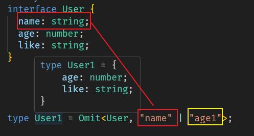

3. Exclude（排除/不包括）

通俗的说就 返回没有含有的那个 Exclude<T,U> `从第一个联合类型参数中，将第二个联合类型中出现的联合项全部排除`，只留下没有出现过的参数。

```js
// 实现原理
type Exclude<T, U> = T extends U ? never : T;
```

```js
type T00 = Exclude<'a' | 'b' | 'c' | 'd', 'a' | 'c' | 'f'>  // 'b' | 'd'
```

4. Extract (提取/包括）

通俗的说就 返回含有的那个 Extract<T,U>提取Type中所有能够赋值给Union的属性，将这些属性构成一个新的类型

传入两个泛型，如果 T 是 U 的子类型则返回，不是则返回 never

```js
type Extract<T, U> = T extends U ? T : never;
```
```js
type A = "age" | "name";
type B = "like" | "eat" | "name";
type C = Extract<A, B>; //'name'
```

### infer 推断使用
infer会根据当前场景推断出具体类型
```js
type ElementOf<T> = T extends Array<infer E> ? E : boolean;

type Tuple = string[];
// Tuple是string[]，推断出E是string
type TupleToUnion = ElementOf<Tuple>

let k20t1:TupleToUnion ='30'

console.log(k20t1)//“30”

// number extends Array<?> =>不成立，走boolean
let k20t2:ElementOf<number> = true
```

```js
type T1 = { name: string };
type T2 = { age: number };

type K2<T> = T extends { a: (x: infer U) => void; b: (x: infer U) => void }
  ? U
  : never;

interface Props {
  a: (x: T1) => void;
  b: (x: T2) => void;
}

type k3 = K2<Props>;

const app: k3 = {
  name: "k17",
  age: 30,
};
console.log(app); //{ name: 'k17', age: 30 }
```

### 数组的只读和多维数组
```js
var arr_name:number[][][]=[ [[1]],[[2,3,4]] ]
console.log(arr_name)
```
```js
let arr: ReadonlyArray<number> = [1,2,3,4,5];
arr[0] = 6; // Index signature in type 'readonly number[]' only permits reading
```
```js
let arr:readonly number[] = [1,2,3,4,5];
console.log(arr)
//let arr1:readonly Array<number> = [1,2,3,4,5];
//'readonly' type modifier is only permitted on array and tuple literal types.
//console.log(arr1)
```


### 元组和可选项
元组不推荐越界设置，除非没有定元组的长度
```js
const list: [number, ...string[]] = [10, 'a', 'b', 'c']
list.push(122)
console.log(list[4])//122
```
```js
let list: [number, string?, boolean?]
list = [10, 'Sherlock', true]
list = [10, 'Sherlock']
console.log(list)
// list = [10]
```

### ts函数
```js
const add: (x: number, y: number) => string = function(x: number, y: number): string {
  return (x + y).toString()
}
```

#### this和函数
```js
type ThisType1 = { name: string };
//这里的this如果要传，必须是第一个位置，且他是作为类型注解而不是参数
function eating(this: ThisType1, message: string) {
  console.log(arguments)
  console.log(this.name + " eating", message);
}

const info = {
  name: "why",
  eating: eating,
};

// 隐式绑定
info.eating("哈哈哈");

// 显示绑定
eating.call({name: "kobe"}, "呵呵呵")
eating.apply({name: "james"}, ["嘿嘿嘿"])
```


### 构造函数定义
```js
class Ctor {
  //类里顶一个参数s类型sting
  s: string
  //再定义一个构造函数，这个函数需要传入一个s参数string类型，然后把参数s赋值给this.s
  constructor(s: string) {
      this.s = s
  }
}

//1.通过type来定义一个构造签名,取名为SomeConstructor,后面是对象
type f1 = new (s: string)=> Ctor
type SomeConstructor = {

  //在对象里先定义一个调用签名 格式：(函数的参数:参数的类型):返回的类型/构造的类
  new (s: string): Ctor
  // new 关键字表示这是一个构造函数
  // (s: string) 构造函数的 参数列表，表示这个构造函数 接受一个类型为string的参数s
  // :Ctor是构造函数的返回类型
}
//3.使用函数 参数为Ctor:类型为type定义好的类型名:SomeConstructor
function Fn(Ctor: SomeConstructor) {
  //Ctor: SomeConstructor可以理解为一个构造函数，那么这里就可以调用这个函数了,Ctor('字符串')，
  //但是这里只实现了调用签名，并没有实现构造签名，在ts里要实现构造签名，
  //需要在type SomeConstructor={}对象里的方法添加一个new,这样它就是一个构造函数类型了,
  //那么在这里的Ctor('字符串')前面也要加一个new才能够被实例化。
  //如果要返回这个实例，前面再加一个return，那么这里就返回了一个构造函数的实例了
 return new Ctor('字符串');
}

//4.调用函数,传入的参数是构造函数类型，这里传入Ctor
const fn = Fn(Ctor)
//5.打印，运行
console.log(fn.s);
```

### 函数中extends约束
Type extends { length: number } 是一个泛型约束，它限制了泛型参数 Type 必须是一个拥有 length 属性的对象，并且这个 length 属性的类型是 number。
```js
function longest<Type extends { length: number }>(a: Type, b: Type) {
  if (a.length >= b.length) {
    return a;
  } else {
    return b;
  }
}
 
// longerArray is of type 'number[]'
const longerArray = longest([1, 2], [1, 2, 3]);
// longerString is of type 'alice' | 'bob'
const longerString = longest("alice", "bob");
// Error! Numbers don't have a 'length' property
const notOK = longest(10, 100);
// 类型“number”的参数不能赋给类型“{ length: number; }”的参数。
```

### 函数的重载
注意重载的兼容性，以及参数和返回值的实现性
```js
function reverse(x: string): string
function reverse(x: number): number
//兼容参数
function reverse(target: string | number) {
  if (typeof target === 'string') {
	// return string
    return target.split('').reverse().join('')
  }
  if (typeof target === 'number') {
	// return number
    return +[...target.toString()].reverse().join('')
  }
}
console.log(reverse('imooc'))   // coomi
console.log(reverse(23874800))  // 847832
```

### TS类的关键字
1. static: 关键字用于定义类的数据成员（属性和方法）为静态的，静态成员可以直接通过类名调用。
2. public（默认） : 公有，可以在任何地方被访问。
3. protected : 受保护，可以被其自身以及其子类和父类访问。
4. private : 私有，只能被其定义所在的类访问。
5. 通过 readonly 关键字将属性设置为只读的。只读属性必须在声明时或构造函数里被初始化。
	- readonly如果定义的是对象，和js一样，可以修改里面的属性值，但是不能直接改这个对象

### 抽象类的作用
抽象类是一种特殊的类，它不能被实例化。抽象类主要用于为其他类提供一个基础的框架或结构，同时它可以包含一些抽象方法和非抽象方法。

1. 定义公共接口：抽象类可以定义一组公共的属性和方法，这些属性和方法将由继承它的子类共享和实现。
2. 实现代码复用：抽象类可以包含非抽象方法（即具体方法），这些方法可以直接在子类中继承和使用，从而实现代码复用。
3. 强制子类实现某些方法：抽象类可以包含抽象方法，这些方法在抽象类中只有声明而没有实现。任何继承自抽象类的子类都必须实现这些抽象方法，否则子类也将成为一个抽象类。这有助于确保子类遵循某种特定的行为模式。
4. 提供类型安全：通过抽象类，你可以确保只有符合特定接口（即继承自抽象类）的类才能被用作某个特定类型的对象。这有助于在编译时捕获类型错误，提高代码的可维护性和可读性。
5. 实现设计模式：抽象类经常用于实现各种设计模式，如工厂模式、模板方法模式、策略模式等。这些设计模式通过使用抽象类来定义通用行为和结构，从而使代码更加灵活和可扩展。
6. 提供多态性：多态性是面向对象编程的三大特性之一，它允许不同类型的对象对同一消息做出响应。抽象类可以作为多态性的基础，子类可以通过重写抽象类中的方法来提供不同的实现。

```js
abstract class Animal {
  abstract makeSound(): void;
  move(): void {
      console.log('roaming the earch...');
  }
}

class Dog extends Animal {
  makeSound() {
    console.log('bark bark bark...')
  }
}

const dog = new Dog()

dog.makeSound()  // bark bark bark...
dog.move()       // roaming the earch...
```

### TS类的重写
```js
class Jspang{
  public name:string
  public age : number
  public skill: string
  constructor(name:string,age:number,skill:string){
      this.name = name
      this.age = age
      this.skill = skill
  }
  public interest(){
      console.log('xxx')
  }
}

class JsShuai extends Jspang{
  public xingxiang:string = '帅气'
// 子类重写方法
  public interest(){
  //如果有需要，可以继续借用父类的方法和自己的方法组合
      super.interest()
      console.log('建立电商平台')
  }
  public zhuangQian(){
      console.log('一天赚了一个亿')
  }
}
```

### 类和接口
类和接口都可以定义对象，但是类适合复杂情况，接口只是在编译阶段使用，最后打包回移除

类则一直存在在代码中


## Vue2

### `Vue 生命周期`
Vue生命周期是指Vue实例对象从创建开始到销毁的过程。

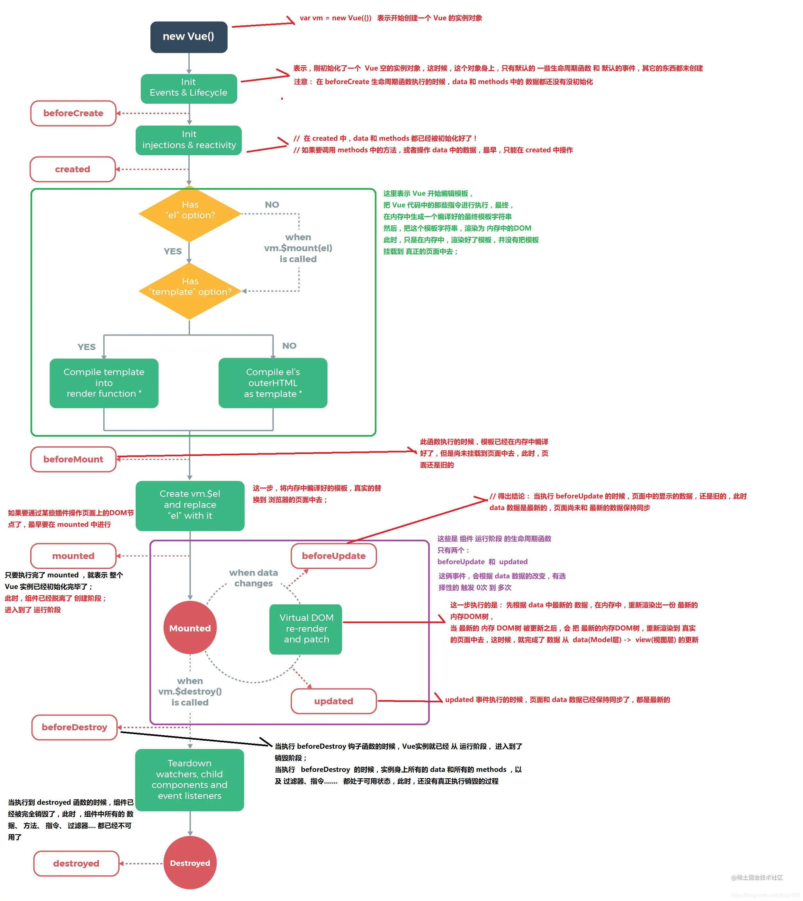

#### mounted created 请求数据
+ 如果不涉及到操作dom，created时机更早更好
+ 如果mounted有对dom处理，那需放在mounted处理
+ 如果考虑到SSR，SSR 不支持 beforeMount 、mounted 钩子函数，放在 created 中有助于一致性。

### 数据双向绑定
模型Model的变动会改变视图View,View变动会影响Model


### `Vue双向绑定的原理`


+ Model  代表数据模型，数据和业务逻辑都在Model层中定义；
+ View 视图层 代表UI视图，负责数据的展示；
+ ViewModel  负责监听 Model 中数据的改变并且控制视图的更新，处理用户交互操作； Model 和 View 并无直接关联，而是通过 ViewModel 来进行联系的，Model 和 ViewModel 之间有着双向数据绑定的联系。因此当 Model 中的数据改变时会触发 View 层的刷新，View 中由于用户交互操作而改变的数据也会在 Model 中同步。


### vue页面初始化闪烁
因为在 Vue 代码尚未解析之前，尚无法控制页面中 DOM 的显示，所以看见模板字符串等代码。
```css
[v-cloak] {
display: none;
}
<div v-cloak>{{ message }}</div>
```

### `Vue组件通信方式`
1. props 和 $emit
2. ref:父组件通过获取子节点的引用`this.refs.xx.childmethods`，子组件可以`this.$parent.fathermethods`,注意时间，父组件如果调用子组件的方法，不要不要选择在created的时候，而是应该放在**mouted**时候，而子组件调用父组件的方法可以写在created时候，类似koa的洋葱模型。

```html
 <ChildData v-model="myapp" ref="zz"/>
 <script>
 import ChildData from './ChildData.vue'
 export default {
     mounted(){
		 // 调用子组件的add方法
         this.$refs.zz.add()
         console.log(this.$refs.zz)
     }
 }
 </script>
```

3. EventBus
4. parent root children
5. **attrs 和listeners和inheritAttrs**

inheritAttrs：默认为true, 会自动在挂载组件元素上属性值,如props声明了属性，则挂载未被声明的属性；false时会关闭自动挂载到组件根元素上属性。`注意：这个选项不影响 class 和 style 绑定。`


6. Provide 和 Inject
7. Vuex

$root[不要随意使用，耦合性太高]
```js
// 根组件
// this.$root 引用的是 Vue 实例的根实例，无论你在哪个子组件中调用它，它都会指向同一个根实例 
// this.$root.$emit('myname') 可以在任何组件内部被调用，不仅仅是根组件
new Vue({
  render: h => h(App),
  methods: {  
    showAlert: function() {  
      alert('Message from root method!');  
      this.$root.$emit('myname')
    }  
  }  
}).$mount('#app')
```
```html
// 后代组件可以触发根组件的方法
<button @click="$root.showAlert()">Call root method</button>  
```
```js
// 也可以监听或者派发事件，在其他的组件中可以监听接受到派发事件
  export default {
    mounted(){
      console.log(this.$root)
     
      this.$root.$on('myname',()=>{
        console.log('后代组件监听')
      })
      this.$root.$on('app',()=>{
        console.log('apppp')
      })
    },
    methods:{
        childFun(){
            console.log(this.$root)
            this.$root.$emit('kkk',1000)
        }
    }
  }
```

provide 和inject
```js
  provide() {   
    return{
      for1: this.k,
      arr:this.arr,
      test:this.test
    }   //重要一步，在父组件中注入一个变量
  },
  methods:{
    changeF(){
      this.k++ //简单类型后代组件不会随之改变
      this.arr=[2] // 直接重新给值不会
      this.test.f=30 //只修改对应属性后代组件可以改变
    }
  }
```


当通过 provide 提供了一个简单类型（如数字、字符串、布尔值等）的变量（如 for1: this.k），后代组件注入的是这个变量的值的拷贝，而不是变量本身的引用。

如果修改的是数组或对象的属性（如 this.test.f = 30），并且这个数组或对象是通过 provide 提供的，那么后代组件注入的是这个数组或对象的引用的拷贝。由于你并没有改变这个引用的值（你只是修改了它所引用的对象的一个属性），后代组件看到的仍然是同一个对象的引用，所以当对象的属性改变时，后代组件也会看到这个改变。


```js
//
class Bus {
 constructor() {
	this.callbacks = {}; //
 }
 $on(name, fn) {
	this.callbacks[name] = this.callbacks[name] || [];
	this.callbacks[name].push(fn);
 }
 $emit(name, args) {
	if (this.callbacks[name]) {
	this.callbacks[name].forEach((cb) => cb(args));
 }
 }
}

// main.js
Vue.prototype.$bus = new Bus() //方案1 自己写bus
//
Vue.prototype.$bus = new Vue() //方案2 Vue2自身支持
```

```html
// child props foo
<p>{{$attrs.foo}}</p>

// parent
<HelloWorld foo="foo"/>
```

 组件通过 Child2 间接地与 Grandson 组件通信，传递属性和监听事件，而 Child2 组件仅作为属性和事件的**“中继站”**。这种模式在构建大型 Vue.js 应用程序时非常有用，因为它允许你构建可重用的组件，同时保持组件之间的解耦。
```html
// Grandson communication/index.vue 祖辈
<Child2 msg="lalala" @some-event="onSomeEvent"></Child2>

// Child2 父辈
<Grandson v-bind="$attrs" v-on="$listeners"></Grandson>

// v-bind="$attrs"：这个指令将父组件传递给 Child2 的所有`未被 Child2 组件显式声明的属性`
//（props）`向下传递`给 Grandson 组件。在这个例子中，msg 属性就是这样被传递的。

// v-on="$listeners"：这个指令将父组件（即 Grandson communication/index.vue）
// 监听的所有事件监听器传递给 `Grandson 组件`。这意味着 some-event 事件监听器也会被传递给 Grandson 组件。

// Grandson
<div @click="$emit('some-event', 'msg from grandson')">
	{{msg}}
</div>
```

```js
// 一个组件监听
this.$parent.on('add',this.add)
// 另一个组件发出自定义事件
this.$parent.emit('add')
```

### `data的写法是函数不是对象的原因`
+ 如果根实例对象，data可以使函数也可以是对象
+ 如果是组件实例对象，则必须是函数，目的是为了防止公用data会造成数据污染，使用函数返回一个全新的data对象

### vue直接给对象添加属性的问题
vue2的响应式依赖Object.defineProperty去添加`依赖收集触发`，但是这个操作是在编译模板时已经触发了，现在手动添加，无法感知到，所以vue2提供了Vue.set()方法，去再次触发`收集依赖`。

### `v-if和v-for的优先级`
vue2中通过编译后发现，v-for的优先级高于v-if，vue3中v-if高于v-for，但是不建议v-if和v-for放在一个层级.

如果是items这个数据内部某些值不展示，则可以考虑借助computed去过滤掉
```js
<template v-if="isShow">
 <p v-for="item in items">
</template>
```
```js
computed: {
 items: function() {
	 return this.list.filter(function (item) {
		return item.isShow
	})
 }
}
```

### 计算属性computed和methods的区别

计算属性会基于它们的依赖关系进行**缓存**，提高性能；只有依赖的数据发生变化，计算属性才会重新进行计算。

### v-show v-if的应用场景
1. 都是从页面移除元素，v-show的原理是display:none，成为游离页面还可再用，v-if则是直接删除。
2. 频繁切换用v-show
3. v-show的切换只是css的变化，v-if切换会触发生命周期(true:beforeCreated=>...=>mounted,false:beforeDestory=>destoryed),事件监听器和子组件也会适当的销毁和重建

### vue中key的原理
key是每一个vnode的唯一id，是diff的一种优化侧率，根据key，可以更准确更快找到对应的vnode节点


### Vue.extend 和 Vue.component
Vue.extend() 是 Vue.js 中的一个全局 API，它用于创建一个“子类”或“扩展”的 Vue 构造器。这个扩展的构造器可以用来创建可复用的组件构造器，这些构造器可以用来创建新的 Vue 组件实例。

在某些情况下，可能需要`动态地创建组件实例`，或者需要一种更底层的、编程式的方式来创建组件，这时 Vue.extend() 就非常有用。

```js
// 创建一个扩展的 Vue 构造器  
const MyComponent = Vue.extend({  
  template: '<div>这是一个通过 Vue.extend 创建的组件</div>'  
});  
  
// 使用这个扩展的构造器来创建组件实例  
const instance = new MyComponent().$mount();  
  
// 假设你有一个 DOM 元素，你可以将组件挂载到这个元素上  
// document.body.appendChild(instance.$el);  
  
// 在实际开发中，你通常不会直接这样做，而是将这个扩展的构造器注册为全局或局部组件  
// 并在模板中使用它
```

Vue.component：在内部，它实际上也调用了 Vue.extend 来创建一个构造器，但随后它还进行了组件的注册和命名等额外操作。因此，你可以将 Vue.component 看作是 Vue.extend 和组件注册的结合体。

### `vue中mixin的理解和应用场景`
Mixin是面向对象程序设计语言中的类，提供了方法实现。`其他类可以访问mixin类的方法而不必成为其子类。`

Mixin类通常作为功能模块使用，在需要该功能时“混入”，有利于代码复用有避免多继承的复杂。

Vue的mixin本质就是一个js对象，包括data，components，methods，created等

```js
export function initMixin (Vue: GlobalAPI) {
 Vue.mixin = function (mixin: Object) {
 this.options = mergeOptions(this.options, mixin)
 return this
 }
}
```

```js
var myMixin = {
 created: function () {
	this.hello()
 },
 methods: {
	hello: function () {
		console.log('hello from mixin!')
	}
 }
}
// 局部混入
Vue.component('componentA',{
 mixins: [myMixin]
})
```
> 全局混入可能对第三方插件也有影响，一般用于插件的编写
```js
//全局混入
Vue.mixin({
 created: function () {
	console.log(" ")
 }
})
```
#### mixin注意事项
+ 组件 data, methods，computed等 `优先级`高于 mixin data, methods,computed... 优先级(存在相同的组件覆盖混入)
+ 生命周期函数，先执行 mixin 里面的，再执行组件里面的(`数组形式`，都会执行)

```js
const toggle = {
    data() {
		return {
		 isShowing: false,
		 test:{
			go:'20',
			f:10000
		 }
		}
    }
}
export default toggle
```
```html
<template>
  <div id="app">
   {{test}}
  </div>
</template>

<script>
import toggle from './view-01/mixin.js'
export default {
  name: 'App',
  mixins:[toggle],
  data(){
    return {
      test:{
        f:120
      }
    }
  }
}
</script>
```
Mixins 在 Vue.js 中的实现原理主要基于 `JavaScript 的对象合并和原型链机制。`

+ 替换型:props inject methods computed 重复的会被替换
+ 合并型:data 类似Object.assign(mixins.data,this.data)
+ 队列型:watch 生命周期 =>合并成一个数组，依次执行

#### mixins 和 composition api的优缺点

1. Mixins的优缺点
+ 优点：
	- 代码复用：如方法、计算属性、生命周期钩子等。
	- 逻辑共享：通过混入多个mixin对象，可以将不同的功能组合在一起，为组件提供更多的能力，使得组件更加灵活和可扩展。
	- 解耦逻辑：将与UI无关的逻辑（如数据处理、网络请求等）抽取为mixin，有助于将组件的关注点更集中在UI层面，提高代码的可读性和可维护性。
+ 缺点：
	- 命名冲突
	- 难以追踪
	- 维护困难
2. Composition API的优缺点
+ 优点：
	- 更灵活的代码组织：Composition API支持将逻辑代码以函数或一组相关联的函数形式封装为可复用的组合式函数，使得代码组织更加直观和模块化。
	- 逻辑复用和组合：通过组合式函数，可以更轻松地在组件之间复用和共享逻辑代码，减少代码的冗余。
+ 缺点：
	- 与Options API的兼容性：在迁移或混合使用两种API时可能会遇到一些挑战
	- 可能过度使用：虽然组合式函数提供了灵活的代码组织方式，但过度使用可能会导致代码结构变得复杂和难以理解。

### vue中的修饰符
修饰符处理更多的dom细节，专注做逻辑方面操作

1. 表单 v-model.lazy v-model.trim v-model.number(如果输入值无法被parseFloat解析则返回原值)
2. 事件 @click.stop(等于event.stopPropagation) @submit.prevent(等于event.preventDefalut) @click.self(对当前元素自身触发函数) @click.capture(捕获方式) @scroll.passvie(lazy模式，减少触发频率) `@click.native(让组件像html一样可以监听根元素的原生事件,加在原生标签不生效)`
3. 鼠标键盘：@keyup.keyCode @click.middle...
4. v-bind修饰符：async props camel

#### 注意修饰符顺序
+ @click.prevent.self(阻止所有点击) 
+ @click.self.prevent(阻止当前元素的点击)

### `v-bind:value.sync`
简易写法，这样子组件需要通知父组件改变值时，`只需简单触发事件`即可，不过vue3由于加强了v-model，不需要.sync这种用法。
```html
// 父组件操作
<comp :myMessage.sync="bar"></comp>
// 子组件操作
this.$emit('update:myMessage',params);
```
相当于下面的简写
```html
// 父组件操作
<comp :myMessage="bar" @update:myMessage="func"></comp>
func(e){
	this.bar = e;
}
// 子组件操作
func2(){
 this.$emit('update:myMessage',params);
}
```

### `vue中的$nextTick`
在下次DOM更新循环结束之后执行延迟回调，在修改数据之后立即使用这个方法，可以获取更新后的DOM。

nextTick的核心是利用了如 `Promise、MutationObserver、setImmediate、setTimeout` 的原生 JavaScript 方法来模拟对应的微/宏任务的实现，本质是为了利用JavaScript的这些异步回调任务队列来实现 Vue 框架中自己的异步回调队列。

#### 为什么要有$nextTick

```js
{{num}}
for(let i=0; i<100000; i++){
 num = i
}
```
如果没有nextTick，那么每次num变动，都会更新视图。有了nextTick，只需要更新一次，`本质是一种性能优化策略。`

> 实现回调的机制分别可能是Promise.then>MutationObserver>setImmediate>setTimeout(降级操作)

```js
export let isUsingMicroTask = false
if (typeof Promise !== 'undefined' && isNative(Promise)) {
  //判断1：是否原生支持Promise
  const p = Promise.resolve()
  timerFunc = () => {
    p.then(flushCallbacks)
    if (isIOS) setTimeout(noop)
  }
  isUsingMicroTask = true
} else if (!isIE && typeof MutationObserver !== 'undefined' && (
  isNative(MutationObserver) ||
  MutationObserver.toString() === '[object MutationObserverConstructor]'
)) {
  //判断2：是否原生支持MutationObserver
  let counter = 1
  const observer = new MutationObserver(flushCallbacks)
  const textNode = document.createTextNode(String(counter))
  observer.observe(textNode, {
    characterData: true
  })
  timerFunc = () => {
    counter = (counter + 1) % 2
    textNode.data = String(counter)
  }
  isUsingMicroTask = true
} else if (typeof setImmediate !== 'undefined' && isNative(setImmediate)) {
  //判断3：是否原生支持setImmediate
  timerFunc = () => {
    setImmediate(flushCallbacks)
  }
} else {
  //判断4：上面都不行，直接用setTimeout
  timerFunc = () => {
    setTimeout(flushCallbacks, 0)
  }
}
```

#### 使用场景

+ 想要获取最新的dom结构

```js
this.message = '修改值'
console.log(this.$el.textContent) // => '原始值'
this.$nextTick(function () {
 console.log(this.$el.textContent) // => '最新值'
})
```
+ 回调：$nextTick返回一个promise对象，可以用async await完成相同的事

```js
this.message = '修改值'
console.log(this.$el.textContent) // => '原始值'
await this.$nextTick()
console.log(this.$el.textContent) // => '最新值'
```

### `v-model自定义组件实现`
1. v-model是语法糖，可以用在自定义组件中，会被解析为value和@input事件
2. 如果子组件中完全没用到input，select，textarea，checkbox也是可以用v-model，如例myinput.vue
3. 默认子组件接受value，触发事件input，但是可以通过子组件中的model修改props中的名字和事件触发的名字，如myinput2.vue
4. (如果不是用model，那么参数仍然是value，触发条件仍然是input事件)
5. 注意checkbox修改的值是e.target.checked,不是e.target.value

使用 v-model好处是`无需记特定的 prop 字段名`，即可绑定到组件中的值，降低组件的使用成本。其次，应该尽量将「重复的逻辑处理」放在子组件中，这样子才会让组件的封装更有意义。

应用场景：**子组件想要使用父组件的值,又想去改父组件的值**

#### v-bind:sync
vue3已废弃，vue3可以同时给一个组件加多个v-model，不需要再用sync
```html
<!--语法糖.sync-->
<my-component :value.sync="value" />
<!--编译后的写法-->
<my-component 
  :value="msg" 
  @update:value="(val) => value = val"
```
与v-model 编译不同之处
```html
<!--v-model写法-->
<my-component type="text" v-model="value">
<!--编译后的写法-->
<my-component type="text"
  :value="value"
  @input="value = $event.target.value"
>
```

父组件
```html
<template>
  <div id="app">
    <ParentData/>
  </div>
</template>
<script>
import ParentData from '../src/02vmodel/ParentData.vue'
export default {
  name: 'App',
  components: {
    ParentData
  },
 
}
</script>
```

子组件
```html
<template>
    <div>
        child - {{ value }}
        <button @click="add">child add</button>
    </div>
</template>
<script>
export default {
    props:['value'],
    methods: {
      add(){
        this.$emit("input",this.value+1)
      }
    }
}
</script>
```

父子组件都可以使用到value，且子组件触发emit，父组件会自动更新value


#### Vue3中的v-model不同之处


```html
<ChildComponent v-model:title="pageTitle" v-model:content="pageContent" />

<!-- 是以下的简写： -->

<ChildComponent
  :title="pageTitle"
  @update:title="pageTitle = $event"
  :content="pageContent"
  @update:content="pageContent = $event"/>

```

### `diff算法`
diff 算法是一种通过同层的树节点进行比较的高效算法

其有两个特点：
+ 比较只会在同层级进行, 不会跨层级比较(`深度优先，同层比较`)
+ 在diff比较的过程中，循环从两边向中间比较

diff 算法在很多场景下都有应用，在 vue 中，作用于虚拟 dom 渲染成真实 dom 的新旧 VNode 节点比较

#### Vue中diff算法怎样降低时间复杂度
当页面进行渲染后，会生成一个虚拟DOM保存在内存中，节点发生变化时又生成新的虚拟DOM，传统的Diff算法是通过遍历循环对比新的虚拟DOM与之前保存的旧的虚拟DOM之间的变化（两层嵌套时间复杂度为O（n^2） ），如果每个节点都有变化则需要更新的操作，所以传统的Diff算法的时间复杂度是O(n ^3)。如果DOM的节点非常多，显然这个代价也是非常高的。
优化后的diff算法O(n)：
1. 只同级比较，不跨级比较
2. tag不同，直接删除重建，不再深度比较
3. tag和key两者新旧相同，则认为是相同节点，不再深度比较


如同Snabbdom中，调用patch(elem,vnode)和patch(vnode,newVnode);

在updateChildren中，可以快速利用key和tag去判断是否是同一个元素。如果是，借助patchVode进行对比，判断到底该怎么去操作它的新旧值，是removeVnodes还是addVnodes内容，是children还是text等。

### Vue中组件和插件有什么区别
组件就是把图形、非图形的各种逻辑均抽象为一个统一的概念（组件）来实现开发的模式，在Vue中每一个.vue文件都可以视为一个组件.插件通常用来为 Vue 添加全局功能。

1. 编写形式:组件可以.vue，可以看利用Vue.component编写，而插件需要调用install，注册使用use

```js
MyPlugin.install = function (Vue, options) {
  // 1. 添加全局方法或 property
  Vue.myGlobalMethod = function () {
    // 逻辑...
  }
   // 2. 添加全局资源
    Vue.directive('my-directive', {
      bind (el, binding, vnode, oldVnode) {
        // 逻辑...
      }
      ...
    })
  
    // 3. 注入组件选项
    Vue.mixin({
      created: function () {
        // 逻辑...
      }
      ...
    })
  
    // 4. 添加实例方法
    Vue.prototype.$myMethod = function (methodOptions) {
      // 逻辑...
    }
}
//安装
Vue.use(插件名字,{ /* ... */} )
```

2. 应用场景
	+ 组件 (Component) 是用来构成你的 App 的业务模块，它的目标是 App.vue
	+ 插件 (Plugin) 是用来增强你的技术栈的功能模块，它的目标是 Vue 本身，简单来说，插件就是指对Vue的功能的增强或补充


### 自定义指令的应用场景
1. 按钮权限控制：通过后台返回的权限控制表，对需要控制的按钮进行匹配，v-xxx控制显示或者隐藏

```html
<el-button
	type="primary"
	v-hasPermi="['cms:communityAnnouncement:add']"
	@click="handlerExport"
>导出</el-button> 
```
```js
import store from '@/store'

export default {
  inserted(el, binding, vnode) {
    const { value } = binding
    const all_permission = '*:*:*'
    const permissions = store.getters && store.getters.permissions

    if (value && value instanceof Array && value.length > 0) {
      const permissionFlag = value
      const hasPermissions = permissions.some(permission => {
        return all_permission === permission || permissionFlag.includes(permission)
      })
      if (!hasPermissions) {
        el.parentNode && el.parentNode.removeChild(el)
      }
    } else {
      throw new Error(`请设置操作权限标签值`)
    }
  }
}
```

2. v-throttle： 防止重复表单提交

```js
// 1.设置v-throttle自定义指令
Vue.directive('throttle', {
  bind: (el, binding) => {
    let throttleTime = binding.value; // 节流时间
    if (!throttleTime) { // 用户若不设置节流时间，则默认2s
      throttleTime = 2000;
    }
    let cbFun;
    el.addEventListener('click', event => {
      if (!cbFun) { // 第一次执行
        cbFun = setTimeout(() => {
          cbFun = null;
        }, throttleTime);
      } else {
        event && event.stopImmediatePropagation();
      }
    }, true);
  },
});
// 2.为button标签设置v-throttle自定义指令
<button @click="sayHello" v-throttle>提交</button>
```

3. 一键复制
4. 自动聚焦
5. 活动埋点

```js
Vue.directive('track', {  
  // 当被绑定的元素挂载到 DOM 中时……  
  bind(el, binding, vnode) {  
    // 确保element有一个唯一的事件处理器  
    if (!el.hasAttribute('data-track-bound')) {  
      el.setAttribute('data-track-bound', 'true');  
      el.addEventListener('click', (event) => {  
        // 这里你可以自定义你的埋点数据  
        // binding.value 可能是一个函数，返回埋点数据，或者是一个直接的对象  
        let trackData = typeof binding.value === 'function' ? binding.value(event, el) : binding.value;  
  
        // 发送埋点数据到你的服务器或第三方服务  
        // 这里只是简单地将数据打印到控制台  
        console.log('Track event:', trackData);  
  
        // 如果你使用的是第三方埋点库，你可以调用它的API来发送数据  
        // analytics.trackEvent(trackData);  
      });  
    }  
  },  
  // 指令与元素解绑的时候调用  
  unbind(el) {  
    // 移除之前添加的事件监听器  
    el.removeEventListener('click', el._trackClickHandler);  
    el.removeAttribute('data-track-bound');  
  }  
});
```


### vue过滤器
vue3已废弃

```js
filters: {
  capitalize: function (value) {
    if (!value) return ''
    value = value.toString()
    return value.charAt(0).toUpperCase() + value.slice(1)
  }
}
```

注意：当全局过滤器和局部过滤器重名时，会采用局部过滤器

过滤器可串联，可传参。filterA 被定义为接收单个参数的过滤器函数，表达式 message 的值将作为参数传入到函数中。然后继续调用同样被定义为接收单个参数的过滤器函数 filterB，将 filterA 的结果传递到 filterB 中。
```html
{{ message | filterA | filterB }}
{{ message | filterA('arg1', arg2) }}
```

### vue插槽slot
通过插槽可以让用户可以拓展组件，去更好地复用组件和对其做定制化处理

+ 默认插槽

```html
<!-- 子组件 -->
<template>
    <slot>
      <p>插槽后备的内容</p>
    </slot>
</template>
```
```html
<!-- 父组件 -->
<Child>
  <div>默认插槽</div>  
</Child>
```

+ 具名插槽:子组件用name属性来表示插槽的名字，不传为默认插槽

```html
<template>
    <slot>插槽后备的内容</slot>
    <slot name="content">插槽后备的内容</slot>
</template>
```
```html
<child>
    <template v-slot:default>具名插槽</template>
    <!-- 具名插槽 插槽名做参数 -->
    <template v-slot:content>内容...</template>
</child>
```


+ 作用域插槽：子组件在**作用域上绑定属性**来将子组件的信息传给父组件使用，这些属性会被挂在**父组件v-slot**接受的对象上

父组件中在使用时通过v-slot:（简写：#）获取子组件的信息，在内容中使用

```html
<template> 
  <slot name="footer" testProps="子组件的值">
          <h3>没传footer插槽</h3>
    </slot>
</template>
```
```html
<child> 
    <!-- 把v-slot的值指定为作用域上下文对象 -->
    <template v-slot:default="slotProps">
      来自子组件数据：{{slotProps.testProps}}
    </template>
    <template #default="slotProps">
      来自子组件数据：{{slotProps.testProps}}
    </template>
</child>
```

### vue虚拟dom
真实dom的一个映射，在Javascript对象中，虚拟DOM 表现为一个 Object对象。并且最少包含标签名 (tag)、属性 (attrs) 和子元素对象 (children) 三个属性，不同框架对这三个属性的名命可能会有差别。

作用：可描述dom，同时适用于**跨平台开发**，vue可以对这颗抽象树进行创建节点,删除节点以及修改节点的操作， 经过`diff算法`得出一些需要修改的`最小单位`,再更新视图，减少了dom操作，提高了性能.


用传统的原生api或jQuery去操作DOM时，浏览器会从构建DOM树开始从头到尾执行一遍流程

当你在一次操作时，需要更新10个DOM节点，浏览器没这么智能，收到第一个更新DOM请求后，并不知道后续还有9次更新操作，因此会马上执行流程，最终执行10次流程

而通过VNode，同样更新10个DOM节点，虚拟DOM不会立即操作DOM，而是将这10次更新的diff内容保存到本地的一个js对象中，最终将这个js对象一次性attach到DOM树上，避免大量的无谓计算.


### Vue.observable
Vue.observable 是 Vue 2.x 中的一个方法，它返回一个可以响应 Vue 组件中变化的对象。这个对象类似于 Vue 组件的 data 对象，但不是 Vue 实例的一部分。这可以用于在多个组件或实例之间共享状态。

```js
import Vue from 'vue';  
  
const state = Vue.observable({  
  count: 0  
});
function increment() {  
  state.count++;  
}
```
在vue文件中使用
```html
<template>  
  <div>  
    <p>Count: {{ count }}</p>  
    <button @click="incrementCount">Increment</button>  
  </div>  
</template>  
  
<script>  
import { state, increment } from './wherever-you-stored-them';  
  
export default {  
  computed: { 
	// 用computed接收数据
    count() {  
      return state.count;  
    }  
  },  
  methods: {  
    incrementCount() {  
      increment();  
    }  
	// 可以这样写incrementCount:increment
  }  
}  
</script>
```

应用场景：在非父子组件通信时，可以使用通常的bus或者使用vuex，但是实现的功能不是太复杂，而使用上面两个又有点繁琐。

> vue3中就不继续推荐了

### vue处理错误
在Vue 中，则是定义了一套对应的错误处理规则给到使用者，且在源代码级别，对部分必要的过程做了一定的错误处理。
+ 后端接口返回错误
+ 代码自身编写问题

```js
//axios拦截器
apiClient.interceptors.response.use(
  response => {
    return response;
  },
  error => {
    if (error.response.status == 401) {
      router.push({ name: "Login" });
    } else {
      message.error("出错了");
      return Promise.reject(error);
    }
  }
);
```

#### vue前端代码错误处理

```js
//全局设置错误处理
Vue.config.errorHandler = function (err, vm, info) {
  // handle error
  // `info` 是 Vue 特定的错误信息，比如错误所在的生命周期钩子
  // 只在 2.2.0+ 可用
}
```
```js
Vue.component('cat', {
    template:`
        <div>
			<h1>Cat: </h1>
        	<slot></slot>
        </div>`,
    props:{
        name:{
            required:true,
            type:String
        }
    },
    errorCaptured(err,vm,info) {
        console.log(`cat EC: ${err.toString()}\ninfo: ${info}`); 
        return false;
    }

});

//子组件 dontexist不存在时
Vue.component('kitten', {
    template:'<div><h1>Kitten: {{ dontexist() }}</h1></div>',
    props:{
        name:{
            required:true,
            type:String
        }
    }
});

// cat EC: TypeError: dontexist is not a function
// info: render
```

### `vue keep-alvie`
keep-alive是vue中的内置组件，能在组件切换过程中将状态保留在内存中，防止重复渲染DOM

keep-alive 包裹动态组件时，会缓存不活动的组件实例，而不是销毁它们

```html
<keep-alive include="a,b">
  <component :is="view"></component>
</keep-alive>

<!-- 正则表达式 (使用 `v-bind`) -->
<keep-alive :include="/a|b/">
  <component :is="view"></component>
</keep-alive>

<!-- 数组 (使用 `v-bind`) -->
<keep-alive :include="['a', 'b']">
  <component :is="view"></component>
</keep-alive>
```
设置了 keep-alive 缓存的组件，会多出两个生命周期钩子（activated与deactivated）：

+ activated：当组件被激活时调用，即该组件第一次渲染后，以及每次从缓存中被“激活”时。
+ deactivated：当组件被停用时调用，即该组件从当前视图被移除，但并没有被销毁，而是被缓存起来。

首次进入组件时：beforeRouteEnter > beforeCreate > created> mounted > `activated` > ... ... > beforeRouteLeave > `deactivated`

再次进入组件时：beforeRouteEnter >`activated` > ... ... > beforeRouteLeave > `deactivated`

keep-alive是vue中内置的一个组件,可以看到该组件没有template，而是用了render，在组件渲染的时候会自动执行render函数
```js
export default {
  name: 'keep-alive',
  abstract: true,

  props: {
    include: [String, RegExp, Array],
    exclude: [String, RegExp, Array],
    max: [String, Number]
  },

  created () {
    this.cache = Object.create(null)
    this.keys = []
  },

  destroyed () {
    for (const key in this.cache) {
      pruneCacheEntry(this.cache, key, this.keys)
    }
  },

  mounted () {
    this.$watch('include', val => {
      pruneCache(this, name => matches(val, name))
    })
    this.$watch('exclude', val => {
      pruneCache(this, name => !matches(val, name))
    })
  },

  render() {
    /* 获取默认插槽中的第一个组件节点 */
    const slot = this.$slots.default
    const vnode = getFirstComponentChild(slot)
    /* 获取该组件节点的componentOptions */
    const componentOptions = vnode && vnode.componentOptions

    if (componentOptions) {
      /* 获取该组件节点的名称，优先获取组件的name字段，如果name不存在则获取组件的tag */
      const name = getComponentName(componentOptions)

      const { include, exclude } = this
      /* 如果name不在inlcude中或者存在于exlude中则表示不缓存，直接返回vnode */
      if (
        (include && (!name || !matches(include, name))) ||
        // excluded
        (exclude && name && matches(exclude, name))
      ) {
        return vnode
      }

      const { cache, keys } = this
      /* 获取组件的key值 */
      const key = vnode.key == null
        // same constructor may get registered as different local components
        // so cid alone is not enough (#3269)
        ? componentOptions.Ctor.cid + (componentOptions.tag ? `::${componentOptions.tag}` : '')
        : vnode.key
     /*  拿到key值后去this.cache对象中去寻找是否有该值，如果有则表示该组件有缓存，即命中缓存 */
      if (cache[key]) {
        vnode.componentInstance = cache[key].componentInstance
        // make current key freshest 移除这个组件当前位置，添加到最后位置
        remove(keys, key)
        keys.push(key)
      }
        /* 如果没有命中缓存，则将其设置进缓存 */
        else {
        cache[key] = vnode
        keys.push(key)
        // prune oldest entry
        /* 如果配置了max并且缓存的长度超过了this.max，则从缓存中删除第一个 */
        if (this.max && keys.length > parseInt(this.max)) {
          pruneCacheEntry(cache, keys[0], keys, this._vnode)
        }
      }

      vnode.data.keepAlive = true
    }
    return vnode || (slot && slot[0])
  }
}
```
```js
// 组件销毁时函数
function pruneCacheEntry (
  cache: VNodeCache,
  key: string,
  keys: Array<string>,
  current?: VNode
) {
  const cached = cache[key]
  /* 判断当前没有处于被渲染状态的组件，将其销毁*/
  if (cached && (!current || cached.tag !== current.tag)) {
    cached.componentInstance.$destroy()
  }
  cache[key] = null
  remove(keys, key)
}
```

#### 缓存后如何获取数据
1. 每次组件渲染的时候，都会执行beforeRouteEnter
```js
beforeRouteEnter(to, from, next){
    next(vm=>{
        console.log(vm)
        // 每次进入路由执行
        vm.getData()  // 获取数据
    })
}
```
2. 在keep-alive缓存的组件被激活的时候，都会执行actived钩子(服务端渲染期间不会被调用)
```js
activated(){
   this.getData() // 获取数据
},
```

### Keep-alive和v-if一起使用情况
```html
<keep-alive>
   <myCom v-if="keyVal" />
<otherCom v-else />
</keep-alive>
```
在切换keyVal的值为false和true时，当第一次切换到两个组件的时候，myCom 与 otherCom 的mounted、activated生命周期都会被触发（先mounted后activated），等再次切换回来的时候，只会触发activated，注意此处也可以用component is的代替，代码规范上也更合适一些。
```html
<keep-alive>
      <component :is="keyVal?'myCom':'otherCom '"></component>
</keep-alive>
```
注意点：正常理解v-if会删除dom重新创建，但是组件外套keep-alive之后，虽然确实会移除dom（可以打开控制台发现dom确实被移除了），但是dom结构会保存在缓存中，当被v-if为true时候直接搬回来，并不会再重新绘制dom，就**不会激发mounted生命周期**。

### Vue动态组件和异步组件
```html
<!-- 使用场景：tab切换，常配合keep-alive使用
使用关键：内置组件 + is属性 -->
 
<!-- 内置组件： <component></component>
is属性：绑定一个变量，其值为组件名称字符串，eg:     -->
<component :is="com"></component>
<script>
import Left from './LeftComponent.vue'
import Right from './RightComponent.vue'
data(){
    com: 'Left'
}
```
Vue.js中的异步组件可以通过使用import()方法来实现。import()方法是ES2015中的一个语法，用于动态地加载JavaScript模块。在Vue.js中，可以使用import()方法来动态地加载和渲染组件。

### `Vuex的使用`
Mutations：处理原子操作

Actions：可以处理多个Mutations和异步操作

+ state => 基本数据(数据源存放地)
+ getters => 从基本数据派生出来的数据
+ mutations => 提交更改数据的方法，同步
+ actions => 像一个装饰器，包裹 mutations，使之可以异步。
+ modules => 模块化 Vuex


### vuex辅助函数
可以使用map辅助函数使代码更精简
```html
<template>
  <div>
    <h2>这是计数器页面</h2>
    <div>
      <div>计数：{{count}}  -  {{countAlias}}</div>
      <div>双倍计数：{{doubleCount}}  -  {{doubleCountAlias}}</div>
      <br/>
      <button @click="increment">+1</button>
      <div>
        增加值 <input type="text" v-model="num" />
        <button @click="incrementBy(num)">=</button>
      </div>
      <div>
        <button @click="asyncAdd">异步加10</button>
      </div>
    </div>
  </div>
</template>
<script>
import { mapState, mapGetters, mapMutations, mapActions } from 'vuex'
export default {
  name: 'index',
  data () {
    return {
      num: 0,
      localCount: 10
    }
  },
  // computed:mapState(['a','b']),
  //如果computed只获取store中的数据且不需要转换，那么可以直接使用mapState，不需要解构
  //mapState本身返回的就是个对象
  computed: {
    /*
    * ------------------------------------------------------------
    * mapState
    */
    // 【传统形式】
    // count () {
    //   return this.store.state.count
    // },
    // 【对象形式】
    ...mapState({
      // 箭头函数可使代码更简练
      count: state => state.count,
      // 传字符串参数 'count' 等同于 `state => state.count`
      // 使用这种方式可以更简洁地为state生成的计算属性定义一个别名
      countAlias: 'count',

      // 为了能够使用 `this` 获取局部状态，必须使用常规函数
      countPlusLocalState (state) {
        return state.count + this.localCount
      }
    }),
    // 【数组形式】
    // 当映射的计算属性的名称与 state 的子节点名称相同时，我们也可以给 mapState 传一个字符串数组。
    ...mapState([
      // 映射 this.count 为 store.state.count
      'count'
    ]),
    /*
    * ------------------------------------------------------------
    * mapGetters
    */

    // 【传统形式】
    // doubleCount () {
    //   return this.store.getters.doubleCount
    // }

    // 【对象形式】
    // 如果你想将一个 getter 属性另取一个名字，使用对象形式
    ...mapGetters({
      // 把 `this.doubleCountAlias` 映射为 `this.store.getters.doubleCount`
      doubleCountAlias: 'doubleCount'
    }),

    // 【数组形式】
    ...mapGetters(['doubleCount'])
  },
  methods: {
    /*
    * ------------------------------------------------------------
    * mapMutations
    */
    // 【传统形式】
    // 自增1
    // increment () {
    //   this.store.commit('increment')
    // },
    // // 加指定的值
    // incrementBy (amount) {
    //   this.store.commit('incrementBy', amount)
    // },
    // 【数组形式】
    ...mapMutations([
      'increment', // 将 `this.increment()` 映射为 `this.store.commit('increment')`

      // `mapMutations` 也支持载荷：
      'incrementBy' // 将 `this.incrementBy(amount)` 映射为 `this.store.commit('incrementBy', amount)`
    ]),
    // 【对象形式】
    ...mapMutations({
      add: 'increment' // 将 `this.add()` 映射为 `this.store.commit('increment')`
    }),

    // // 异步加1
    // asyncAdd () {
    //   this.store.dispatch('asyncAddAction')
    // }

    /*
    * ------------------------------------------------------------
    * mapActions
    */
   // 【数组形式】
    ...mapActions([
      'asyncAddAction', // 将 `this.asyncAddAction()` 映射为 `this.store.dispatch('asyncAddAction')`
    ]),
    // 【对象形式】
    ...mapActions({
      asyncAdd: 'asyncAddAction' // 将 `this.asyncAdd()` 映射为 `this.$store.dispatch('asyncAddAction')`
    })
  }
}
</script>
```

当 Vuex store 被命名空间（namespaced）时，也可以使用这个函数创建具有命名空间的辅助函数。
```js
import { createNamespacedHelpers } from 'vuex'  
const { mapState, mapActions } = createNamespacedHelpers('moduleName')  
export default {  
  computed: {  
    ...mapState(['localCount'])  
  },  
  methods: {  
    ...mapActions(['localIncrement'])  
  }  
}
```

### 介绍Vue的模板编译
`模版指的就是template属性。vue内部会将template字符串转化成render函数进行渲染。render函数返回虚拟节点，再将虚拟节点转化成真实DOM。`（模版=>方法=>节点）
而编译过程就是template转换render函数的过程。

如何将template转换成render函数？
1. 通过正则匹配字符串，将template模版转换成AST语法树 - parserHTML
2. 对静态语法做静态标记 - markUP
3. 重新生成代码 - codeGen

⚠️注意：开发时尽量不要使用template

因为将template转化成render方法需要在运行时进行编译操作，会有性能损耗。同时引用带有compiler包的vue体积也会变大。默认.vue文件中的template处理是通过vue-loader来进行处理的，并不是通过运行时的编译。（默认vue项目中引入的vue.js是不带有compiler模块的。）

有些场景，可直接使用render代替template写法，template是静态的，不灵活。
```js
new Vue({
  router,
  store,
  render: h => h(App)
}).$mount('#app')
```


### SPA
单页应用，它通过动态重写当前页面来与用户交互，这种方法避免了页面之间切换打断用户体验在单页应用中


#### 原理和SEO优化


1. 服务端渲染 nuxt.js
2. 静态化
	 + 通过程序将动态页面抓取成静态页面
	 + WEB服务的 URL Rewrite
3. 使用phantom.js针对爬虫处理


#### SPA首屏加载优化
首屏时间（First Contentful Paint），指的是浏览器从响应用户输入网址地址，到首屏内容渲染完成的时间，此时整个网页不一定要全部渲染完成，但需要展示当前视窗需要的内容

```js
// 方案一：
document.addEventListener('DOMContentLoaded', (event) => {
    console.log('first contentful painting');
});
// 方案二：
performance.getEntriesByName("first-contentful-paint")[0].startTime

// performance.getEntriesByName("first-contentful-paint")[0]
// 会返回一个 PerformancePaintTiming的实例，结构如下：
{
  name: "first-contentful-paint",
  entryType: "paint",
  startTime: 507.80000002123415,
  duration: 0,
};
```

1. 加载慢可能的原因
	+ 网络延时问题
	+ 资源文件体积是否过大
	+ 资源是否重复发送请求去加载了
	+ 加载脚本的时候，渲染内容堵塞了

2. 解决方案
	+ 减小入口文件积：懒加载 分包
	+ 静态资源本地缓存：浏览器缓存 service-worker localstorage
	+ UI框架按需加载
	+ 图片资源的压缩
	+ 组件重复打包:假设A.js文件是一个常用的库，现在有多个路由使用了A.js文件，这就造成了重复下载,需要构建工具提取，如在webpack的config文件中，修改CommonsChunkPlugin的配置，minChunks为3表示会把使用3次及以上的包抽离出来，放进公共依赖文件，避免了重复加载组件(在 Webpack 4 及以上版本中,CommonsChunkPlugin 已经被废弃，取而代之的是 optimization.splitChunks 配置。splitChunks 配置允许你更加灵活和细致地控制代码拆分和公共依赖的提取。)[CommonsChunkPlugin 的主要作用就是将公共的代码模块提取出来，生成一个新的 chunk 文件，这样浏览器在加载页面时就可以缓存这个公共的 chunk 文件，后续加载其他页面时就可以复用已经缓存的公共代码，避免重复下载。]
	+ 开启GZip压缩
	+ 使用SSR
	+ http2
	+ CDN
	+ 提高代码使用率：利用代码分割，将脚本中无需立即调用的代码在代码构建时转变为异步加载的过程

#### hisotory路由404
nginx需要额外配置：只需要配置将任意页面都重定向到 index.html，把路由交由前端处理
```bash
server {
  listen  80;
  server_name  www.xxx.com;

  location / {
    index  /data/dist/index.html;
    try_files $uri $uri/ /index.html;
  }
}
```

> hash 模式下，仅 hash 符号之前的内容会被包含在请求中，如 website.com/#/login 只有 website.com 会被包含在请求中 ，因此对于服务端来说，即使没有配置location，也不会返回404错误

### 第三方库没有babel降级，vuecli怎么处理
```js
// vue.config.js  
module.exports = {  
  transpileDependencies: [  
	'module-name/library-name', // 出现问题的那个库
    // 或者  
    /some-dependency-/, // 使用正则表达式来匹配多个依赖  
  ],  
  // 其他配置...  
}
```
但非常老旧的项目可能依然无法解决


看看Babel有没有办法可以即能够处理CommonJS模块，又能够处理ES6 module模块呢？Babel里面有这么一个配置sourceType，如果把sourceType设置为`unambiguous`就可以解决这个问题。


这样Babel就会根据模块文件中有没有import/export来决定使用哪种解析模块的方式。在vue.config.js中添加了transpileDependencies选项的配置，然后在项目中的Babel配置文件中添加了如下的配置：

```js
module.exports = {
  ...  // 省略的配置
  sourceType: 'unambiguous',
  ...  // 省略的配置
};
```
可以解决问题，但是，这样的话会有一些风险，因为就算不使用import/export语句的这些模块也可能是完全有效的ES6 module，所以这样的话就有可能会出现一些意外的情况。

可以利用overrides这个配置选项将我需要的第三方包使用unambiguous的处理方式，然后其他的第三方库都按照之前的方式处理不就可以了。


```js
// babel.config.js
module.exports = {
  ...  // 省略的配置
  overrides: [
    {
      include: './node_modules/module-name/library-name/name.common.js',  // 使用的第三方库
      sourceType: 'unambiguous'
    }
  ],
  ...  // 省略的配置
};
```


### vue项目性能优化
1. 尽量减少 data 中的数据，data 中的数据都会增加 getter 和 setter，会收集对应的 watcher
2. v-if 和 v-for 不能连用
3. `如果需要使用 v-for 给每项元素绑定事件时使用事件代理`
4. SPA 页面采用 keep-alive 缓存组件
5. key 保证唯一
6. 使用路由懒加载、异步组件
7. 防抖、节流
8. 第三方模块按需导入
9. 长列表滚动到可视区域动态加载
10. 图片懒加载
11. 压缩代码
12. Tree Shaking/Scope Hoisting(对作用域进行提升，并且让webpack打包后的代码更小、运行更快，开发环境需自己配置，生成环境默认开启)
13. 使用 cdn 加载第三方模块
14. splitChunks 抽离公共文件

Scope Hoisting：


### vue路由传参方式

路由的一部分
```js
{
  path: '/qq',
  name: 'Qq',
  component:Qq
},
```
> 当需要跳转的时候，既可以用path跳转也可以用name跳转


1. params模式

```js
//params传参 使用name
this.$router.push({
  name:'second',
  params: {
    id:'20180822',
    name: 'query'
  }
})

//params接收参数
this.id = this.$route.params.id ;
this.name = this.$route.params.name ;

//路由

{
path: '/second/:id/:name',
name: 'second',
component: () => import('@/view/second')
}
```

2. query模式：问号的形式拼接在路由后

```js
//传参: 
this.$router.push({
        path:'/xxx',
        query:{
          id:id
        }
      })
  
//接收参数:
this.$route.query.id
```
```js
router.push(`/meetingdetail?id=${v}`)
```


## Vue3
vue3 整个源码是通过 monorepo的方式维护的，根据功能将不同的模块拆分到packages目录下面不同的子目录中


monorepo（单体仓库）`是一种将多个项目或包存储在同一个代码仓库中的管理方式`。在 monorepo 中，所有的项目或包共享相同的依赖和配置，这使得跨项目或跨包的代码共享、重构和测试变得更加容易。

Monorepo 的主要优势包括：

+ 代码共享：不同项目之间可以更容易地共享代码，减少重复劳动和代码冗余。
+ 依赖管理：所有项目或包使用相同的依赖版本，减少了版本冲突和兼容性问题。
+ 统一构建和测试：可以对整个 monorepo 进行统一的构建和测试，提高开发效率。

### `与Vue2的不同`
1. 速度更快
	+ 重写了虚拟Dom实现
	+ 编译模板的优化（PatchFlag）
	+ 更高效的组件初始化
	+ update性能提高1.3~2倍
	+ SSR速度提高了2~3倍
	+ `将静态节点的定义，提升到父作用域，缓存起来`
	+ `缓存事件，空间换时间`
2. 体积更小
	+ 通过`tree-shaking`功能，可以将无用模块“剪辑”，仅打包需要的
	+ 移除过滤器+内联模板+.sync+on.native等其他功能可替代的语法
3. 更易维护：`compositon Api` + options Api
4. `响应式原理：Object.defineProperty + Proxy`
5. 更好的`Typescript`支持
6. 编译器重写


#### 功能改变
+ fragments： 支持多根节点
+ Teleport：传送门
+ suspense：加载一步组件loading
+ composition Api
+ createRenderer:能够构建自定义渲染器，能够将 vue 的开发模型扩展到其他平台

```html
<button @click="showToast" class="btn">打开 toast</button>
<!-- to 属性就是目标位置 -->
<teleport to="#teleport-target">
    <div v-if="visible" class="toast-wrap">
        <div class="toast-msg">我是一个 Toast 文案</div>
    </div>
</teleport>
```

+ 组件上 v-model 用法已更改
+ `<template v-for>`和 非 v-for节点上key用法已更改
+ 在同一元素上使用的 v-if 和 v-for 优先级已更改
+ v-bind="object" 现在排序敏感
+ v-for 中的 ref 不再注册 ref 数组
+ 自定义指令 API 已更改为与组件生命周期一致
+ data 应始终声明为函数
+ 来自 mixin 的 data 选项现在可简单地合并
+ attribute 强制策略已更改
+ 移除$on，$off和$once 实例方法
+ 移除过滤filter
+ 移除内联模板 attribute
+ 移除.sync
+ 移除$destroy 实例方法。用户不应再手动管理单个Vue 组件的生命周期。在 Vue 3 中，$destroy 方法已经被完全移除，进一步强调了开发者应该依赖 Vue 的自动生命周期管理，而不是手动去销毁组件或实例。
+ CreateAPP
+ emit
+ 生命周期
+ 多事件
+ 异步组件的写法

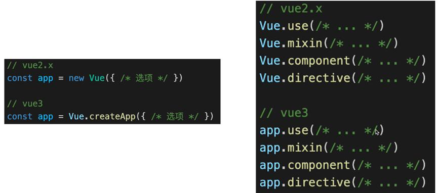

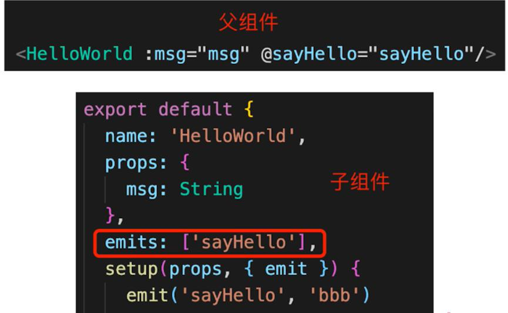


### v-on.native修饰符移除，怎么去操作组件的事件

在 Vue 3 中，直接在父组件模板中监听子组件的原生事件（如 <Child @click="add"/>）通常不会工作，除非子组件的**根元素**实际上是一个**原生元素**
```html
<template>
  <h1>{{ count }}</h1>
  <Child @click="add"/>
</template>
```


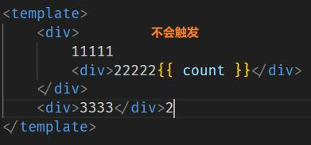

其他解决方案
```html
<!-- Child.vue -->  
<template>  
  <button @click="handleClick">Click me</button>  
</template>  
  
<script>  
export default {  
  methods: {  
    handleClick() {  
      // 触发一个名为 'custom-click' 的自定义事件  
      this.$emit('custom-click');  
    }  
  }  
}  
</script>  
  
<!-- Parent.vue -->  
<template>  
  <h1>{{ count }}</h1>  
  <Child @custom-click="add"/>  
</template>  
<script>  
import Child from './Child.vue';  
export default {  
  components: {  
    Child  
  },  
  data() {  
    return {  
      count: 0  
    };  
  },  
  methods: {  
    add() {  
      this.count++;  
    }  
  }  
}  
</script>
```

### vue2和vue3异步组件用法
在Vue 2中，你可以通过动态import()语法或工厂函数的方式来实现异步组件的加载。
```js
export default {  
  components: {  
    AsyncComponent: () => import('./AsyncComponent.vue')  
  },  
}
```
工厂函数允许你更细粒度地控制异步组件的加载，包括指定加载状态、错误状态等。(V2.3.0+ 新增)
```js
const AsyncComponent = () => ({  
  component: import('./AsyncComponent.vue'),  
  loading: LoadingComponent, // 加载时显示的组件  
  error: ErrorComponent, // 加载失败时显示的组件  
  delay: 200, // 显示加载组件之前的延迟时间，单位ms  
  timeout: 3000 // 加载组件的超时时间，单位ms  
});  

export default {  
  components: {  
    AsyncComponent  
  },  
  // ...  
}
```
错误处理:当异步组件加载失败时，如果你指定了error组件，Vue会自动渲染这个组件。但是，如果你想要更细粒度的错误处理，你可以在全局配置或组件级别的配置中设置错误处理器。
```js
Vue.config.errorHandler = function (err, vm, info) {  
  // 处理错误  
  console.error('Caught an error:', err);  
  // 你可以在这里记录错误，发送报告等  
};
```
组件级别的处理
```js
const AsyncComponent = () => {  
  return new Promise((resolve, reject) => {  
    import('./AsyncComponent.vue')  
      .then(component => {  
        resolve({  
          component  
          // 其他选项...  
        });  
      })  
      .catch(err => {  
        // 处理错误  
        console.error('Failed to load AsyncComponent:', err);  
        reject(err);  
      });  
  });  
};
```
在Vue 3中，引入了`defineAsyncComponent`函数来更简洁、更明确地定义异步组件。

这个函数接受一个返回Promise的加载函数作为参数，该Promise在解析时应该返回组件定义。Vue 3还提供了更丰富的选项，如loadingComponent、errorComponent、delay和timeout，用于定制加载状态、错误处理和超时行为。
```js
import { defineAsyncComponent } from 'vue'

const AsyncComp = defineAsyncComponent(() => {
  return new Promise((resolve, reject) => {
    // ...从服务器获取组件
    resolve(/* 获取到的组件 */)
  })
})
// ... 像使用其他一般组件一样使用 `AsyncComp`
```
```js
import { defineAsyncComponent } from 'vue'

const AsyncComp = defineAsyncComponent(() =>
  import('./components/MyComponent.vue')
)
```
```js
const AsyncComp = defineAsyncComponent({
  // 加载函数
  loader: () => import('./Foo.vue'),
  // 加载异步组件时使用的组件
  loadingComponent: LoadingComponent,
  // 展示加载组件前的延迟时间，默认为 200ms
  delay: 200,
  // 加载失败后展示的组件
  errorComponent: ErrorComponent,
  // 如果提供了一个 timeout 时间限制，并超时了
  // 也会显示这里配置的报错组件，默认值是：Infinity
  timeout: 3000
})
```

### `vue3的Composition Api的好处`
1. 不需要像options API一个功能代码跳转很多地方
2. 当混入时，不会像mixins存在数据来源不清晰，和多个混入容易冲突的情况

```js
import { onMounted, onUnmounted, reactive } from "vue";
export function useMove() {
  const position = reactive({
    x: 0,
    y: 0,
  });

  const handleKeyup = (e) => {
    console.log(e.code);
    // 上下左右 x y
    switch (e.code) {
      case "ArrowUp":
        // y.value--;
        position.y--;
        break;
      case "ArrowDown":
        // y.value++;
        position.y++;
        break;
      case "ArrowLeft":
        // x.value--;
        position.x--;
        break;
      case "ArrowRight":
        // x.value++;
        position.x++;
        break;
    }
  };

  onMounted(() => {
    window.addEventListener("keyup", handleKeyup);
  });

  onUnmounted(() => {
    window.removeEventListener("keyup", handleKeyup);
  });

  return { position };
}
```

```html
<template>
  <div>
    Mouse position: x {{ x }} / y {{ y }}
  </div>
</template>

<script>
import { useMove } from "./useMove";
import { toRefs } from "vue";
export default {
  setup() {
    const { position } = useMove();
    const { x, y } = toRefs(position);
    return {
      x,
      y,
    };

  },
};
</script>
```
可以看到，整个数据来源清晰了，即使去编写更多的 hook 函数，也不会出现命名冲突的问题

#### Composition API 和 React hooks 对比
1. 前者setup只会调用一次，而后者函数会被多次调用
2. 前者无需useMemo useCallback缓存，因为setup只调用一次
3. 前者无需顾虑调用顺序，而后者需要保证hooks的执行顺序
4. ref+reactive理解难于useState

### vue3性能提升主要体现在哪几个方面
回顾Vue2，每个组件实例都对应一个 watcher 实例，它会在组件渲染的过程中把用到的数据property记录为依赖，当依赖发生改变，触发setter，则会通知watcher，从而使关联的组件重新渲染


```html
<template>
    <div id="content">
        <p class="text">静态文本</p>
        <p class="text">静态文本</p>
        <p class="text">{{ message }}</p>
        <p class="text">静态文本</p>
        ...
        <p class="text">静态文本</p>
    </div>
</template>
```
可以看到，组件内部只有一个动态节点，剩余一堆都是静态节点，所以这里很多 `diff 和遍历`其实都是不需要的，造成`性能浪费`

因此，Vue3在编译阶段，做了进一步优化。主要有如下：
+ diff算法优化:vue3在diff算法中相比vue2增加了静态标记,已经标记静态节点的p标签在diff过程中则不会比较，把性能进一步提高


+ 静态提升：对不参与更新的元素，会做静态提升，只会被创建一次，在渲染时直接复用

```html
<span>你好</span>

<div>{{ message }}</div>
```

```js
// 没做静态提升
export function render(_ctx, _cache, $props, $setup, $data, $options) {
  return (_openBlock(), _createBlock(_Fragment, null, [
    _createVNode("span", null, "你好"),
    _createVNode("div", null, _toDisplayString(_ctx.message), 1 /* TEXT */)
  ], 64 /* STABLE_FRAGMENT */))
}
```
```js
// 做了静态提升
const _hoisted_1 = /*#__PURE__*/_createVNode("span", null, "你好", -1 /* HOISTED */)

export function render(_ctx, _cache, $props, $setup, $data, $options) {
  return (_openBlock(), _createBlock(_Fragment, null, [
    _hoisted_1,
    _createVNode("div", null, _toDisplayString(_ctx.message), 1 /* TEXT */)
  ], 64 /* STABLE_FRAGMENT */))
}

```
静态内容_hoisted_1被放置在render 函数外，每次渲染的时候只要取 _hoisted_1 即可

同时 _hoisted_1 被打上了 PatchFlag ，静态标记值为 -1 ，特殊标志是负整数表示永远不会用于 Diff

+ 事件监听缓存

```js
export const render = /*#__PURE__*/_withId(function render(_ctx, _cache, $props, $setup, $data, $options) {
  return (_openBlock(), _createBlock("div", null, [
    _createVNode("button", { onClick: _ctx.onClick }, "点我", 8 /* PROPS */, ["onClick"])
                                             // PROPS=1<<3,// 8 //动态属性，但不包含类名和样式
  ]))
})
```
```js
// 开启了缓存后，没有了静态标记。也就是说下次diff算法的时候直接使用
export function render(_ctx, _cache, $props, $setup, $data, $options) {
  return (_openBlock(), _createBlock("div", null, [
    _createVNode("button", {
      onClick: _cache[1] || (_cache[1] = (...args) => (_ctx.onClick(...args)))
    }, "点我")
  ]))
}
```

+ SSR优化:当静态内容大到一定量级时候，会用createStaticVNode方法在客户端去生成一个static node，这些静态node，会被直接innerHtml，就不需要创建对象，然后根据对象渲染

+ 源码体积：相比Vue2，Vue3整体体积变小了，除了移出一些不常用的API，最重要的是Tree shanking。任何一个函数，如ref、reavtived、computed等，仅仅在用到的时候才打包，没用到的模块都被摇掉，打包的整体体积变小

+ 响应式系统：vue3采用proxy重写了响应式系统，因为proxy可以对整个对象进行监听，所以不需要深度遍历。

### vue3proxy取代defineProperty API原因
+ 检测不到对象属性的添加和删除
+ 数组API方法无法监听到
+ 需要对每个属性进行遍历监听，如果`嵌套对象`，需要`深层监听`，造成性能问题
+ Object.defineProperty只能遍历对象属性进行劫持

+ Proxy直接可以劫持整个对象，并返回一个新对象，我们可以只操作新的对象达到响应式目的
+ Proxy可以直接监听数组的变化（push、shift、splice）
+ Proxy有多达13种拦截方法,不限于apply、ownKeys、deleteProperty、has等等，这是Object.defineProperty不具备的
+ **Proxy 不兼容IE，也没有 polyfill**

### defineComponent
是一个函数，用于显式地定义一个 Vue 组件。虽然 Vue 3 在很多情况下可以自动推断组件的定义（即，即使你不使用 defineComponent，它也能正常工作），但 defineComponent 提供了一些额外的功能，比如更好的类型推断和更明确的代码结构。
```js
import { defineComponent } from 'vue';  
export default defineComponent({  
  name: 'MyComponent',  
  props: {  
    // 定义 props  
  },  
  setup() {  
    // 组件逻辑  
    return {  
      // 暴露给模板的响应式数据  
    };  
  },  
});
```

### 如何理解ref reactive toRef toRefs

#### ref
1. 生成 **值类型** 的 **响应式** 数据
2. 可用于模板和reactive
3. 通过.value修改值
4. 可获取dom元素

```html
<template>
    <p>ref demo {{ageRef}} {{state.name}}</p>
</template>

<script>
import { ref, reactive } from 'vue'

export default {
    name: 'Ref',
    setup() {
        const ageRef = ref(20) // 值类型 响应式
        const nameRef = ref('双越')
		  // ref可以直接用在reactive里
        const state = reactive({
            name: nameRef
        })

        setTimeout(() => {
            console.log('ageRef', ageRef.value)

            ageRef.value = 25 // .value 修改值
            nameRef.value = '双越A'
        }, 1500);

        return {
            ageRef,
            state
        }
    }
}
</script>
```

```html
<template>
    <p ref="elemRef">我是一行文字</p>
</template>
<script>
import { ref, onMounted } from 'vue'
export default {
    name: 'RefTemplate',
	setup() {
	 // 和模板里的ref同名
        const elemRef = ref(null)
	//在mounted之后才可以获取dom元素
        onMounted(() => {
            console.log('ref template', elemRef.value.innerHTML, elemRef.value)
        })
        return {
            elemRef
        }
    }
}
</script>
```

#### reactive
reactive一般用来定义响应式对象。不可直接解构，会丢失响应式的效果，想要属性具有响应式可借助toRef或者toRefs

#### toRef
1. 针对一个响应式对象（reactive封装）的prop
2. 创建一个ref，具有响应式
3. 两者保持引用关系

```html
<template>
   <p>toRef demo - {{ageRef}} - {{state.name}} {{state.age}}</p>
</template>

<script>
import { ref, toRef, reactive } from 'vue'

export default {
    name: 'ToRef',
    setup() {
        const state = reactive({
            age: 20,
            name: '双越'
        })

        const age1 = computed(() => {
            return state.age + 1
        })

        // // toRef 如果用于普通对象（非响应式对象）,
        //产出的结果不具备响应式,可在界面上显示
        // const state = {
        //     age: 20,
        //     name: '双越'
        // }

        const ageRef = toRef(state, 'age')
        setTimeout(() => {
            state.age = 25
        }, 1500)
        setTimeout(() => {
            ageRef.value = 30 // .value 修改值
        }, 3000)

        return {
            state,
            ageRef
        }
    }
}
```

#### toRefs
1. 将一个响应式对象（reactive封装）转为普通对象
2. 普通对象的每个属性都是ref，具有响应式
3. 两者保持引用关系

```html
<template>
    <p>toRefs demo {{age}} {{name}}</p>
</template>
<script>
import { ref, toRef, toRefs, reactive } from 'vue'
export default {
    name: 'ToRefs',
    setup() {
        const state = reactive({
            age: 20,
            name: '双越'
        })
        const stateAsRefs = toRefs(state) // 将响应式对象，变成普通对象
        // const { age: ageRef, name: nameRef } = stateAsRefs // 每个属性，都是 ref 对象
        // return {
        //     ageRef,
        //     nameRef
        // }
        setTimeout(() => {
            state.age = 25
        }, 1500)

       return stateAsRefs
       // return toRefs(state) √√√√
       // return {...stateAsRefs} //当如果有其他属性时适用 √√√√
       // return {...state}//xxxx错误 不再具有响应式
       // return {state} √√√√ 但是模板中{{state.age}} {{state.name}} 不方便
    }
}
</script>
```
使用toRefs，合成函数返回响应式对象，可方便解构


#### 为何需要ref
1. 直接返回值类型，会丢失响应式
2. 在setup、computed、合成函数中都有可能返回值类型

#### 为何需要.vuale
1. Ref是一个响应式对象，value存储值
2. 通过.value属性的get set实现响应式
3. 用于模板、reactive中【vue编译自己控制】，不需要加.value，其他情况需要【js自己获取】

举个例子，如果是有.value，那么改变的是对象中属性，对象因为引用关系，也会变化，而错误的写法，是值类型的变化，改变了值，就没关联了。

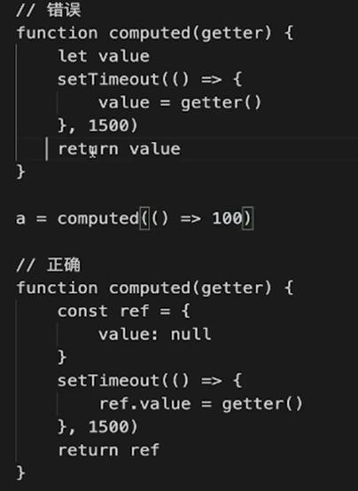

### computed和methods
computed() 方法期望接收一个 getter 函数，返回值为一个计算属性 ref。和其他一般的 ref 类似，你可以通过 publishedBooksMessage.value 访问计算结果。计算属性 ref 也会在模板中自动解包，因此在模板表达式中引用时无需添加 .value。

Vue 的计算属性会自动追踪响应式依赖。它会检测到 publishedBooksMessage 依赖于 author.books，所以当 author.books 改变时，任何依赖于 publishedBooksMessage 的绑定都会同时更新。
```html
<script setup>
import { reactive, computed } from 'vue'

const author = reactive({
  name: 'John Doe',
  books: [
    'Vue 2 - Advanced Guide',
    'Vue 3 - Basic Guide',
    'Vue 4 - The Mystery'
  ]
})

// 一个计算属性 ref
const publishedBooksMessage = computed(() => {
  return author.books.length > 0 ? 'Yes' : 'No'
})
</script>

<template>
  <p>Has published books:</p>
  <span>{{ publishedBooksMessage }}</span>
</template>
```

```js
<p>{{ calculateBooksMessage() }}</p>

// 组件中
function calculateBooksMessage() {
  return author.books.length > 0 ? 'Yes' : 'No'
}
```

两种方式在结果上确实是完全相同的，然而，不同之处在于计算属性值会基于其响应式依赖被缓存。一个**计算属性仅会在其响应式依赖更新时才重新计算**。这意味着只要 author.books 不改变，无论多少次访问 publishedBooksMessage 都会立即返回先前的计算结果，而不用重复执行 getter 函数。

#### 计算属性可写形式
通过同时提供 getter 和 setter 来创建
```html
<script setup>
import { ref, computed } from 'vue'

const firstName = ref('John')
const lastName = ref('Doe')

const fullName = computed({
  // getter
  get() {
    return firstName.value + ' ' + lastName.value
  },
  // setter
  set(newValue) {
    // 注意：我们这里使用的是解构赋值语法
    [firstName.value, lastName.value] = newValue.split(' ')
  }
})
</script>
```


### Vue3中watch和watchEffect的区别
1. 两者都可以监听data属性的变化
2. Watch需要明确监听哪个属性，如果监听多个属性可第一个参数要写成数组形式，第二个处理函数的参数也要注意处理
3. watchEffect会根据其中的属性，自动监听其变化
4. watch 的第一个参数可以是不同形式的“数据源”：它可以是一个 ref (包括计算属性)、一个响应式对象、一个 getter 函数、或多个数据源组成的数组

#### 监听ref
```js
watch(numberRef, (newNumber, oldNumber) => {
        console.log('ref watch', newNumber, oldNumber)
    }
    // , {
    //     immediate: true // 初始化之前就监听，可选
    // }
)
```

#### 监听reactive
注意，**不能**直接侦听**响应式对象**的属性值，例如:
```js
const obj = reactive({ count: 0 })

// 错误，因为 watch() 得到的参数是一个 number
watch(obj.count, (count) => {
  console.log(`Count is: ${count}`)
})
```
这里需要用一个返回该属性的 getter 函数：
```js
// 提供一个 getter 函数
watch(
  () => obj.count,
  (count) => {
    console.log(`Count is: ${count}`)
  }
)
```

```js
// getter函数
 watch(
    // 第一个参数，确定要监听哪个属性
    () => state.age,

    // 第二个参数，回调函数
    (newAge, oldAge) => {
        console.log('state watch', newAge, oldAge)
    },

    // 第三个参数，配置项
    {
        immediate: true, // 初始化之前就监听，可选
        // deep: true // 深度监听
    }
)
```
#### Watch监听多个
```js
 //监听两个值，fooRef，barRef;变化后foo bar值；变化前的值prevFoo prevBar
watch([fooRef, barRef], ([foo, bar], [prevFoo, prevBar]) => {
  /* ... */
})
watchEffect初始化要收集数据一定会执行一次
watchEffect(() => {
    // 初始化时，一定会执行一次（收集要监听的数据）
    console.log('hello watchEffect')
})
```

watchEffect，则会在副作用发生期间追踪依赖。它会在同步执行过程中，自动追踪所有能访问到的响应式属性。这更方便，而且代码往往更简洁，`但有时其响应性依赖关系会不那么明确。`

> watchEffect() 允许自动跟踪回调的响应式依赖。如果你需要侦听一个嵌套数据结构中的几个属性，watchEffect() 可能会比深度侦听器更有效，因为它将只跟踪回调中被使用到的属性，而不是递归地跟踪所有的属性。

### 侦听器触发时机和停止
默认情况下，侦听器回调会在父组件更新 (如有) 之后、所属组件的 DOM 更新之前被调用。这意味着如果你尝试在侦听器回调中访问所属组件的 DOM，那么 DOM 将处于更新前的状态。

如果想在侦听器回调中能访问被 Vue 更新之后的所属组件的 DOM
```js
watch(source, callback, {
  flush: 'post'
})

watchEffect(callback, {
  flush: 'post'
})
```
后置刷新的 watchEffect() 有个更方便的别名 watchPostEffect()
```js
import { watchPostEffect } from 'vue'

watchPostEffect(() => {
  /* 在 Vue 更新后执行 */
})
```
还可以创建一个同步触发的侦听器，它会在 Vue 进行任何更新之前触发
```js
watch(source, callback, {
  flush: 'sync'
})

watchEffect(callback, {
  flush: 'sync'
})
```
同步触发的 watchEffect() 有个更方便的别名 watchSyncEffect()
```js
import { watchSyncEffect } from 'vue'

watchSyncEffect(() => {
  /* 在响应式数据变化时同步执行 */
})
```

在 setup() 或 `<script setup>` 中用同步语句创建的侦听器，会自动绑定到宿主组件实例上，并且会在宿主组件卸载时自动停止。因此，在大多数情况下，你无需关心怎么停止一个侦听器。

一个关键点是，侦听器必须用同步语句创建：如果用异步回调创建一个侦听器，那么它不会绑定到当前组件上，你必须手动停止它，以防内存泄漏。如下方这个例子：

```html
<script setup>
import { watchEffect } from 'vue'

// 它会自动停止
watchEffect(() => {})

// ...这个则不会！
setTimeout(() => {
  watchEffect(() => {})
}, 100)
</script>
```
要手动停止一个侦听器，请调用 watch 或 watchEffect 返回的函数：
```js
const unwatch = watchEffect(() => {})

// ...当该侦听器不再需要时
unwatch()
```

### Setup中如何获取组件实例
```js
<script>
import { onMounted, getCurrentInstance } from 'vue'

export default {
    name: 'GetInstance',
    data() {
        return {
            x: 1,
            y: 2
        }
    },
    setup() {
        // 没有this
        console.log('this1', this)

        onMounted(() => {
            console.log('this in onMounted', this)
            console.log('x', instance.data.x)
        })
        
        const instance = getCurrentInstance()
        //还没实例化，也获取不到，需要在onMounted中获取
        console.log('instance', instance)
    },
    mounted() {
        //options API 可以继续使用this
        console.log('this2', this)
        console.log('y', this.y)
    }
}
</script>
```

### reactive() 的局限性
1. 有限的值类型：它只能用于对象类型 (对象、数组和如 Map、Set 这样的集合类型)。它不能持有如 string、number 或 boolean 这样的原始类型。

2. 不能替换整个对象：由于 Vue 的响应式跟踪是通过属性访问实现的，因此我们必须始终保持对响应式对象的相同引用。这意味着我们不能轻易地“替换”响应式对象，因为这样的话与第一个引用的响应性连接将丢失：

```js
let state = reactive({ count: 0 })

// 上面的 ({ count: 0 }) 引用将不再被追踪
// (响应性连接已丢失！)
state = reactive({ count: 1 })
```

3. 对解构操作不友好：当我们将响应式对象的原始类型属性解构为本地变量时，或者将该属性传递给函数时，我们将丢失响应性连接：

```js
const state = reactive({ count: 0 })

// 当解构时，count 已经与 state.count 断开连接
let { count } = state
// 不会影响原始的 state
count++

// 该函数接收到的是一个普通的数字
// 并且无法追踪 state.count 的变化
// 必须传入整个对象以保持响应性
callSomeFunction(state.count)
```

由于这些限制，建议使用 **ref()** 作为声明响应式状态的主要 API。


### ref作为作为 reactive 对象的属性注意
一个 ref 会在作为响应式对象的属性被访问或修改时自动解包。换句话说，它的行为就像一个普通的属性：
```js
const count = ref(0)
const state = reactive({
  count
})

console.log(state.count) // 0

state.count = 1
console.log(count.value) // 1
```
如果将一个新的 ref 赋值给一个关联了已有 ref 的属性，那么它会**替换掉旧的 ref**：
```js
const otherCount = ref(2)

state.count = otherCount
console.log(state.count) // 2
// 原始 ref 现在已经和 state.count 失去联系
console.log(count.value) // 1
```

#### 数组和集合的注意事项
与 reactive 对象不同的是，当 ref 作为响应式数组或原生集合类型 (如 Map) 中的元素被访问时，它**不会被解包**：

```js
const books = reactive([ref('Vue 3 Guide')])
// 这里需要 .value
console.log(books[0].value)

const map = reactive(new Map([['count', ref(0)]]))
// 这里需要 .value
console.log(map.get('count').value)
```


### ref在模板中解包的注意事项
**在模板渲染上下文中，只有顶级的 ref 属性才会被解包。**

在下面的例子中，count 和 object 是顶级属性，但 object.id 不是：
```js
const count = ref(0)
const object = { id: ref(1) }
```
因此，这个表达式按预期工作：
```js
{{ count + 1 }}
```
...但这个不会：
```js
{{ object.id + 1 }}
```
渲染的结果将是 [object Object]1，因为在计算表达式时 object.id 没有被解包，仍然是一个 ref 对象。为了解决这个问题，我们可以将 id 解构为一个顶级属性：
```js
const { id } = object

{{ id + 1 }}
```
现在渲染的结果将是 2。

另一个需要注意的点是，如果 `ref 是文本插值的最终计算值` (即 {{ }} 标签)，那么它将被解包，因此以下内容将渲染为 1：
```js
{{ object.id }}
```
该特性仅仅是文本插值的一个便利特性，等价于 {{ object.id.value }}。

### shallowRef()
和 ref() 不同，浅层 ref 的内部值将会原样存储和暴露，并且不会被深层递归地转为响应式。只有对 .value 的访问是响应式的。

shallowRef() 常常用于对大型数据结构的性能优化或是与外部的状态管理系统集成。
```js
<template>
   <div>--{{ state?.count ? state.count : 'xxx'}}--hhh</div>
   <button @click="change">+++</button>
</template>

<script lang="ts" setup>
import { shallowRef, triggerRef} from 'vue';

const state = shallowRef({ count: 1 })

// 不会触发更改
state.value.count = 2
state.value = { count: 12 }
setTimeout(() => {
    // state.value = { count: 16 } //① 会更改
    state.value.count = 20 //有①会更改成20，没有不会变动
}, 1000);
function change (){
    state.value.count = 2000 // 不会触发
    // triggerRef(state)  //增加这行会更新成2000
    // state.value = { count: 1600 }// 会触发
}

state.value.count = 25 //初始化
</script>
```
>注意25变成20的前提：第一是在settimeout中，第二state.value = { count: 16 }这行代码触发了


> shallowRef就不要state.value.count写这种，真的写这种也需要用triggerRef(state)保证触发

### ref、isRef、customRef、triggerRef、shallowRef
ref绑定基本数据类型为proxy响应对象、isRef判断是否为ref对象
```js
<script setup lang="ts">
import { ref, isRef } from 'vue';
// ref 将msg变量变成一个’双向绑定‘变量
const msg: {} = ref({ name: 'name' });
const cahngeMsg = () => {
  // isRef判断变量 是不是’双向绑定‘变量
  console.log(isRef(msg, 'msg')); //true
};
</script>
```
customRef:工厂函数实现get和set适合去做防抖之类的
```js
<template>
   <div>{{ myRef }}</div>
    <button @click="add">+++</button>
</template>

<script lang="ts" setup>
import { isRef } from 'vue';
import { useCustomRef } from './useDemo';

const myRef = useCustomRef('Hello')  

console.log(isRef(myRef),myRef)

function add(){
    myRef.value=50
    console.log(isRef(myRef),myRef)

}
</script>
```
```js
import { customRef, ref } from 'vue'  
export function useCustomRef(initialValue:any) {  
    const state = ref(initialValue)  
    const customRef1 = customRef((track, trigger) => {  
      // 当第一次访问get方法时，运行这个副作用  
      let firstTime = true  
      return {  
        get() {  
          track() // 告诉Vue这个依赖项依赖于这个Ref  
          if (firstTime) {  
            console.log('This is the first time accessing the value!')  
            firstTime = false  
            return 'something'
          }  
          return state.value  
        },  
        set(newValue) {  
          state.value = newValue  
          trigger() // 告诉Vue这个Ref的值已经改变，需要更新所有依赖项  
        }  
      }  
    })  
    return customRef1
  }  
```
triggerRef：强制更新页面DOM,强制触发依赖于一个浅层 ref 的副作用，这通常在对浅引用的内部值进行深度变更后使用。
```js
triggerRef(message)
```

### script setup
可以使用 `<script setup>` 来大幅度地简化代码

```html
<script setup>
import { ref } from 'vue'

const count = ref(0)

function increment() {
  count.value++
}
</script>

<template>
  <button @click="increment">
    {{ count }}
  </button>
</template>
```

### Vue3中 script setup props emit 向父组件暴露数据用法
+ 定义属性 defineProps
+ 定义事件defineEmits
+ 暴露数据给父组件 defineExpose

顶级变量，可直接用于template不需要return导出
```js
<script setup>
import { defineProps, defineEmits } from 'vue'

// 定义属性
const props = defineProps({
    name: String,
    age: Number
})

// 定义事件，defineEmits返回一个emit
const emit = defineEmits(['change', 'delete'])
function deleteHandler() {
    emit('delete', 'aaa')
}

</script>
<template>
    <p>Child2 - name: {{props.name}}, age: {{props.age}}</p>
    <button @click="$emit('change', 'bbb')">change</button>
    <button @click="deleteHandler">delete</button>
</template>
```
使用了 `<script setup>` 的组件是默认私有的：一个父组件无法访问到一个使用了 `<script setup>` 的子组件中的任何东西，除非子组件在其中通过 defineExpose 宏显式暴露
```js
//child3Ref
<script setup>
//子组件
import { ref, defineExpose } from 'vue'

const a = ref(101)
const b = 201

defineExpose({
    a,
    b
})

</script>

// 父组件组件
<child-3 ref="child3Ref"></child-3>
<script>
onMounted(() => {
    // 拿到 Child3 组件的一些数据
    console.log(child3Ref.value)
    console.log(child3Ref.value.a)
    console.log(child3Ref.value.b)
})
</script>
```

### 事件参数
有时需要在内联事件处理器中访问原生 DOM 事件。可以向该处理器方法传入一个特殊的 $event 变量，或者使用内联箭头函数：
```html
<!-- 使用特殊的 $event 变量 -->
<button @click="warn('Form cannot be submitted yet.', $event)">
  Submit
</button>

<!-- 使用内联箭头函数 -->
<button @click="(event) => warn('Form cannot be submitted yet.', event)">
  Submit
</button>
```
```js
function warn(message, event) {
  // 这里可以访问原生事件
  if (event) {
    event.preventDefault()
  }
  alert(message)
}
```

### vue3生命周期


### defineModel() V3.4


```html
<script setup>
import Child from './Child.vue'
import { ref } from 'vue'

const msg = ref('Hello World!')
</script>

<template>
  <h1>{{ msg }}</h1>
  <Child v-model="msg" />
</template>
```
```html
//child
<script setup>
const model = defineModel()
</script>

<template>
  <span>My input</span> <input v-model="model">
</template>
```


defineModel() 返回的值是一个 ref。它可以像其他 ref 一样被访问以及修改，不过它能起到在父组件和当前变量之间的双向绑定的作用：

+ 它的 .value 和父组件的 v-model 的值同步；
+ 当它被子组件变更了，**会触发父组件绑定的值一起更新。**

defineModel 是一个便利宏。编译器将其展开为以下内容：

1. 一个名为 modelValue 的 prop，本地 ref 的值与其同步；
2. 一个名为 update:modelValue 的事件，当本地 ref 的值发生变更时触发。


### `vue2和vue3的依赖注入区别`

***在Vue 2中，provide 和 inject 的绑定本身并不是可响应的*** 。这是因为Vue 2的响应式系统是基于 Object.defineProperty 实现的，它只能检测到对象属性的读写操作，但不能检测到新属性的添加或旧属性的删除。因此，如果你使用 provide 提供了一个对象，并在后续修改了该对象的属性，这个变化是不会自动传递给通过 inject 接收该对象的子组件的。


如果想要响应式，可以通过一些方法间接地实现响应式的效果。

一种常见的方法是，使用 Vue 的响应式系统（例如 Vue.observable 或 Vue 实例的 data 属性）来包装你想要提供的数据，并在 provide 中提供这个响应式对象的引用。
```js
export default {  
  data() {  
    return {  
      // 这是一个响应式数据  
      sharedData: {  
        message: 'Hello from Parent'  
      }  
    };  
  },  
  provide() {  
    // 提供 sharedData 的一个属性或整个对象  
    return {  
      // 你可以直接提供整个对象，但这样可能会暴露过多的内部状态  
      // sharedData: this.sharedData,  
  
      // 或者只提供你需要的属性，这样更加安全  
      sharedMessage: this.sharedData.message  
    };  
  },  
  // ... 其他选项  
}
```
```js
export default {  
  inject: ['sharedMessage'],  
  // ... 其他选项  
  mounted() {  
    console.log(this.sharedMessage); // 输出: Hello from Parent  
  
    // 注意：这里你不能直接修改 this.sharedMessage，因为它只是一个值引用  
    // 如果你想要修改原始数据，你需要另外提供修改数据的方法  
  },  
  // ... 其他选项  
}
```

***在Vue 3中，provide 和 inject 的行为并没有改变，它们本身仍然不是可响应的*** 。但是，由于Vue 3采用了基于Proxy的响应式系统，这个系统可以检测到对象属性的添加、删除和修改。因此，如果你提供了一个可响应的对象（**例如使用 ref 或 reactive 创建的对象** ）作为 provide 的值，那么该对象的属性变化将会自动传递给通过 inject 接收该对象的子组件。

注意的是，不能直接修改通过 inject 接收到的对象。因为 provide 的值在组件树中是共享的.为了避免这种情况，你可以使用 readonly 函数来创建一个只读版本的对象，并将其作为 provide 的值。这样，你就可以确保组件不会意外地修改到 provide 的值。

### 动态组件
```html
<!-- currentTab 改变时组件也改变 -->
<component :is="tabs[currentTab]"></component>
```

当使用 `<component :is="..."> `来在多个组件间作切换时，被切换掉的组件会被卸载。我们可以通过 <KeepAlive> 组件强制被切换掉的组件仍然保持“存活”的状态。

### 全局注册和局部注册组件优缺点
全局注册虽然很方便，注册完后可以在任何地方使用，但是并未使用的组件无法在生产打包时被自动移除；全局注册在大型项目中使项目的依赖关系变得不那么明确。

在父组件中使用子组件时，不太容易定位子组件的实现。和使用过多的全局变量一样，这可能会影响应用长期的可维护性。

局部注册的组件需要在使用它的父组件中显式导入，并且只能在该父组件中使用。它的优点是使组件之间的依赖关系更加明确，并且对 tree-shaking 更加友好。

不过在使用 `<script setup>` 的单文件组件中，导入的组件可以直接在模板中使用

### 插槽的理解
插槽内容可以访问到父组件的数据作用域，因为插槽内容本身是在父组件模板中定义的。
```html
<!-- 子组件 -->
<div class="container">
  <header>
    <slot name="header"></slot>
  </header>
  <main>
    <slot></slot>
  </main>
  <footer>
    <slot name="footer"></slot>
  </footer>
</div>
```
```html
<!-- 父组件 -->
<BaseLayout>
  <template v-slot:header>
    <!-- header 插槽的内容放这里 -->
  </template>
</BaseLayout>
```
#### 条件插槽
需要根据插槽是否存在来渲染某些内容，可以结合使用 $slots 属性与 v-if 来实现
```html
<template>
  <div class="card">
    <div v-if="$slots.header" class="card-header">
      <slot name="header" />
    </div>
    <div v-if="$slots.default" class="card-content">
      <slot />
    </div>
    <div v-if="$slots.footer" class="card-footer">
      <slot name="footer" />
    </div>
  </div>
</template>
```
#### 动态插槽
```html
<base-layout>
  <template v-slot:[dynamicSlotName]>
    ...
  </template>

  <!-- 缩写为 -->
  <template #[dynamicSlotName]>
    ...
  </template>
</base-layout>
```
#### 作用域插槽
在某些场景下插槽的内容可能想要同时使用父组件域内和子组件域内的数据。要做到这一点，我们需要一种方法来让子组件在渲染时将一部分数据提供给插槽。

可以像对组件传递 props 那样，向一个插槽的出口上传递 attributes：


### `pinia对比vuex`

Vuex和Pinia都是Vue.js的状态管理库，但它们在设计、使用、体积和社区支持等方面存在一些区别。以下是关于Vuex和Pinia的主要区别：

1. 设计和使用：
	+ Vuex：采用**全局单例模式**，通过一个store对象来管理所有的状态。组件通过store对象来获取和修改状态。Vuex提供了强大的生态系统，适用于复杂的项目和对状态管理有更高要求的开发者。
	+ Pinia：采用了**中心化架构**，将状态分布在多个模块里，每个模块都有自己独特的状态。Pinia允许使用多个store实例，每个组件都拥有自己的store实例，通过在组件中创建store实例来管理状态。Pinia提供了简单的API来管理应用程序的状态，更适用于初学者和快速开发项目。
2. 数据修改：
	+ Vuex：通过mutations和actions来修改状态，提供了State、Getters、Mutations和Modules等模块化的管理方式。
	+ Pinia：**没有mutations**，只有state、getters和actions。Pinia没有modules配置，每一个独立的仓库都是通过defineStore生成出来的，提供了扁平结构来更好地进行代码分割且没有命名空间。
3. 体积和复杂程度：
	+ Vuex：作为Vue.js的官方状态管理库，在Vue.js中广泛使用，拥有强大的生态系统。Vuex的体积相对较大，但功能丰富，适用于复杂的项目。
	+ Pinia：是一个很小且较新的库，操作简单。Pinia的体积约1KB，相对较小，提供了简单直观且可扩展的方式来组织和访问应用程序的状态。
4. TypeScript支持：
	+ Vuex：从Vue 2.x版本开始引入对TypeScript支持，但需要使用额外的插件来实现类型检查。
	+ Pinia：在设计之初就对TypeScript提供了原生的支持，提供了更好的类型推导和类型检查。
5. 语法和使用：
	+ Vuex：使用了传统的mutations和actions方法来修改state里边的状态，语法较为固定。
	+ Pinia：语法上比Vuex更容易理解和使用灵活，提供了更好的TypeScript支持，且支持Vue 2和Vue 3。
6. 适用场景：
	+ Vuex：更适合复杂的项目和对状态管理有更高要求的开发者。
	+ Pinia：更适合初学者和快速开发项目，特别是当项目对TypeScript要求很高时。

```js
// stores/counter.js
import { defineStore } from 'pinia'
export const useCounterStore = defineStore('counter', {
  state: () => {
    return { count: 0 }
  },
  // 也可以这样定义
  // state: () => ({ count: 0 })
  actions: {
    increment() {
      this.count++
    },
  },
})
```
组件中使用
```html
<script setup>
import { useCounterStore } from '@/stores/counter'
const counter = useCounterStore()
counter.count++
// 自动补全！ ✨
counter.$patch({ count: counter.count + 1 })
// 或使用 action 代替
counter.increment()
</script>
<template>
  <!-- 直接从 store 中访问 state -->
  <div>Current Count: {{ counter.count }}</div>
</template>
```

### vue插件的场景
1. 通过 app.component() 和 app.directive() 注册一到多个全局组件或自定义指令。
2. 通过 app.provide() 使一个资源可被注入进整个应用。
3. 向 app.config.globalProperties 中添加一些全局实例属性或方法
4. 一个可能上述三种都包含了的功能库 (例如 vue-router)。

```js
// plugins/i18n.js
export default {
  install: (app, options) => {
    // 注入一个全局可用的 $translate() 方法
    app.config.globalProperties.$translate = (key) => {
      // 获取 `options` 对象的深层属性
      // 使用 `key` 作为索引
	  console.log(key)
      return key.split('.').reduce((o, i) => {
        if (o) return o[i]
      }, options)
    }
  }
}
```
```js
import i18nPlugin from './plugins/i18n'
app.use(i18nPlugin, {
  greetings: {
    hello: 'Bonjour!'
  }
})
```
表达式 $translate('greetings.hello') 就会在运行时被替换为 Bonjour! 了。

#### 插件中的 Provide / Inject
在插件中，我们可以通过 provide 来为插件用户供给一些内容。举例来说，我们可以将插件接收到的 options 参数提供给整个应用，让任何组件都能使用这个翻译字典对象。
```js
// plugins/i18n.js
export default {
  install: (app, options) => {
    app.provide('i18n', options)
  }
}
```
```js
<script setup>
import { inject } from 'vue'
const i18n = inject('i18n')
console.log(i18n.greetings.hello)
</script>
```

### v-memo(v3.2)
用于提高渲染能力。它接收一个数组作为参数，当数组中的值与上次渲染时的值相同时，Vue会跳过该元素及其子元素的更新渲染，直接复用缓存中的内容进行渲染。这样可以有效减少前端渲染耗时，特别是在处理大数据时。
```html
<template>  
  <div>  
    <input type="text" v-model="searchText" />  
    <div v-for="item in filteredList" :key="item.id" v-memo="[item.id, searchText]">  
      <!-- 列表项内容 -->  
    </div>  
  </div>  
</template>  
  
<script>  
export default {  
  data() {  
    return {  
      searchText: '',  
      list: [...], // 假设这是你的1000+条数据列表  
    };  
  },  
  computed: {  
    filteredList() {  
      return this.list.filter(item => item.name.includes(this.searchText));  
    },  
  },  
};  
</script>
```

### vue高阶组件
高阶组件（Higher-Order Components, HOCs）是一个函数，该函数接收一个组件并返回一个新的组件。高阶组件在Vue中并不像在React中那样常见，因为Vue的组件系统已经提供了很多功能，如`mixins、slots、scoped slots和provide/inject`等。然而，高阶组件在某些场景下仍然是一个有用的模式。

下面是一个简单的Vue 3高阶组件的例子，它用于给任何传入的组件添加一个新的props和一个新的事件监听器
```js
// 高阶组件  
function withLogging(WrappedComponent) {  
  return {  
    name: `WithLogging(${WrappedComponent.name})`,  
    props: WrappedComponent.props,  
    emits: WrappedComponent.emits ? [...WrappedComponent.emits, 'log'] : ['log'],  
    setup(props, { emit }) {  
      // 这里可以添加一些通用的逻辑，比如日志记录  
      const logMessage = () => {  
        console.log(`Component ${WrappedComponent.name} was rendered with props:`, props);  
        emit('log', `Component ${WrappedComponent.name} logged a message`);  
      };  
      // 返回WrappedComponent的setup函数的结果，并添加我们自己的逻辑  
      const wrappedComponentInstance = WrappedComponent.setup(props, {  
        ...context,  
        emit: (...args) => {  
          logMessage(); // 在每次emit之前都进行日志记录  
          emit(...args);  
        },  
      });  
      // 如果有render函数，则返回一个包装过的render函数  
      if (WrappedComponent.render) {  
        return () => h(WrappedComponent, {  
          ...wrappedComponentInstance,  
          // 可以添加额外的props或slots  
        });  
      }  
      // 如果没有render函数，则直接返回wrappedComponentInstance  
      return wrappedComponentInstance;  
    },  
  };  
}  
// 示例组件  
const MyComponent = {  
  name: 'MyComponent',  
  props: {  
    msg: String,  
  },  
  setup(props) {  
    // 组件逻辑...  
    return {  
      // ...返回的数据和方法  
    };  
  },  
  render() {  
    // 渲染逻辑...  
  },  
};  
// 使用高阶组件  
const LoggedMyComponent = withLogging(MyComponent);  
// 在父组件中使用LoggedMyComponent  
// ...
```

### vue渲染机制
从高层面的视角看，Vue 组件挂载时会发生如下几件事：

1. 编译：Vue 模板被编译为渲染函数：即用来返回虚拟 DOM 树的函数。这一步骤可以通过构建步骤提前完成，也可以通过使用运行时编译器即时完成。
2. 挂载：运行时渲染器调用渲染函数，遍历返回的虚拟 DOM 树，并基于它创建实际的 DOM 节点。这一步会作为响应式副作用执行，因此它会追踪其中所用到的所有响应式依赖。
3. 更新：当一个依赖发生变化后，副作用会重新运行，这时候会创建一个更新后的虚拟 DOM 树。运行时渲染器遍历这棵新树，将它与旧树进行比较，然后将必要的更新应用到真实 DOM 上去。


## React

React，用于构建用户界面的 JavaScript 库。遵循组件设计模式、声明式编程范式和函数式编程概念，以使前端应用程序更高效

使用虚拟 DOM 来有效地操作 DOM，遵循从高阶组件到低阶组件的`单向数据流`

### 说说React特性
+ JSX 语法
+ 单向数据绑定:单向数据流比双向绑定更安全，速度更快
+ 虚拟 DOM
+ 声明式编程:声明式编程是一种编程范式，它关注的是你要做什么，而不是如何做
+ Component：可组合可复用可重用

### React18更新了哪些
+ 并发模式
+ 更新 render API
+ 自动批处理
+ Suspense 支持 SSR
+ startTransition
+ useTransition
+ useDeferredValue
+ useId
+ 提供给第三方库的 Hook

### state 和 props 区别
1. state

一个组件的显示形态可以由`数据状态和外部参数`所决定，而数据状态就是 state，一般在 constructor 中**初始化**

当需要修改里面的值的状态需要通过调用 setState 来改变，从而达到更新组件内部数据的作用，并且重新调用组件 render 方法：

```js
class Button extends React.Component {
  constructor() {
    super();
    this.state = {
      count: 0,
    };
  }

  updateCount() {
    this.setState((prevState, props) => {
      return { count: prevState.count + 1 };
    });
  }

  render() {
    return (
      <button onClick={() => this.updateCount()}>
        Clicked {this.state.count} times
      </button>
    );
  }
}
```

setState 还可以接受第二个参数，它是一个函数，会在 setState 调用完成并且组件开始重新渲染时被调用，可以用来监听渲染是否完成
```js
this.setState(
  {
    name: "JS每日一题",
  },
  () => console.log("setState finished")
);
```

2. props

组件从概念上看就是一个函数，可以接受一个参数作为输入值，这个参数就是 props，所以可以把 props 理解为`从外部传入组件内部的数据`

react 具有单向数据流的特性，所以他的主要作用是从父组件向子组件中传递数据

props 除了可以传字符串，数字，还可以传递**对象，数组甚至是回调函数**

```js
class Welcome extends React.Component {
  render() {
    return <h1>Hello {this.props.name}</h1>;
  }
}

const element = <Welcome name="Sara" onNameChanged={this.handleName} />;
```
上述 name 属性与 onNameChanged 方法都能在子组件的 props 变量中访问

在子组件中，props 在内部不可变的，如果想要改变它看，只能通过外部组件传入新的 props 来重新渲染子组件，否则子组件的 props 和展示形式不会改变

### super() 和 super(props) 区别
在 React 中，类组件基于 ES6，所以在 constructor 中必须使用 super

在调用 super 过程，无论是否传入 props，React 内部都会将 porps 赋值给组件实例 porps 属性中

如果只调用了 super()，那么 **this.props** 在 super() 和构造函数结束之间仍是 undefined

### 类组件和函数组件的区别
1. 两者最明显的区别在于编写形式的不同，同一种功能的实现可以分别对应类组件和函数组件的编写形式

```js
// 函数组件
function Welcome(props) {
  return <h1>Hello, {props.name}</h1>;
}

//类组件
class Welcome extends React.Component {
  constructor(props) {
    super(props)
  }
  render() {
    return <h1>Hello, {this.props.name}</h1>
  }
}
```

2. 状态管理：在hooks出来之前，函数组件就是无状态组件，不能保管组件的状态，不像类组件中调用setState，如果想要管理state状态，可以使用useState

```js
const FunctionalComponent = () => {
    const [count, setCount] = React.useState(0);
    return (
        <div>
            <p>count: {count}</p >
            <button onClick={() => setCount(count + 1)}>Click</button>
        </div>
    );
};
```

3. 生命周期：函数组件无生命周期，不过 useEffect Hook 看做 componentDidMount ， componentDidUpdate 和 componentWillUnmount 这三个函数的组合

```js
useEffect(() => {
	 console.log(2) //useEffect第二个参数设为空数组，那么就没有依赖，就只改变一次，否则会一直重复设置timer
	 // 而实际上timer只要自己执行一次，后面就每隔一秒自动setDate就好了，如果没有设置好依赖项，
	 //每隔一秒都会执行一次console.log(2)，然后再执行生成一个timer，这是完全没有必要的
	 const timer = setInterval(() => {
	 setDate(new Date());
	 }, 1000);
	 return () => clearInterval(timer);//组件卸载的时候执行，这个return函数相当于 componentWillUnmount
	 }, []);// 第二个参数是依赖更新项，相当于 componentDidUpdate
```

#### react组件创建方式
+ React.createClass
+ ES6 class
+ 函数式组件

```js
var MyComponent = React.createClass({  
  propTypes: {  
    // 定义props的类型和是否必需  
    name: React.PropTypes.string.isRequired,  
  },  
  
  getDefaultProps: function() {  
    // 定义默认的props  
    return {  
      name: 'John Doe',  
    };  
  },  
  
  getInitialState: function() {  
    // 定义初始的state  
    return {  
      count: 0,  
    };  
  },  
  
  handleClick: function() {  
    // 处理点击事件  
    this.setState({  
      count: this.state.count + 1,  
    });  
  },  
  
  render: function() {  
    // 渲染组件  
    return (  
      <div>  
        <p>Hello, {this.props.name}!</p>  
        <p>You clicked {this.state.count} times.</p>  
        <button onClick={this.handleClick}>Click Me</button>  
      </div>  
    );  
  },  
});  
  
ReactDOM.render(<MyComponent />, document.getElementById('root'));
```

#### 类组件的this绑定
```js
class IndexPage extends React.Component{
  constructor(props) {
    super(props)

    this.event1 = this.event1.bind(this, 1);
  }

  event1(a, e) {
    console.log('event1', a, e);    // 1 {}
  }
  event2(a, e) {
    console.log('event2', a, e);    // 2 {}
  }
  event3(a, e) {
    console.log('event3', a, e);    // 3 {}
  }
  event4 = (e) => {
    console.log('event4', e);       // {}
  }
  // fun = this.event1 => fun() => this隐式丢失指向window
  render() {
    return (
      <div>
        <button onClick={ this.event1 }>event1</button>
        <button onClick={ (e) => { this.event2(2, e) } }>event2</button>
        <button onClick={ this.event3.bind(this, 3) }>event3</button>
        <button onClick={ this.event4 }>event4</button>
      </div>
    );
  }
}
```

### react受控组件和非受控组件
+ 受控组件，简单来讲，就是受控制的组件，组件的状态**全程响应外部数据**

```js
class TestComponent extends React.Component {
  constructor (props) {
    super(props);
    this.state = { username: 'lindaidai' };
  }
  render () {
    return <input name="username" value={this.state.username} />
  }
}
```

在输入框输入内容的时候，会发现输入的内容并无法显示出来，也就是input标签是一个可读的状态

这是因为value被`this.state.username`所控制住。当用户输入新的内容时，this.state.username并不会自动更新，这样的话input内的内容也就不会变了

如果想要解除被控制，可以为input标签设置`onChange`事件，输入的时候触发事件函数，在函数内部实现state的更新，从而导致input框的内容页发现改变

因此，受控组件一般需要**初始状态**和一个**状态更新事件**函数

+ 非受控组件，简单来讲，就是不受我们控制的组件，一般情况是在初始化的时候接受`外部数据`，然后自己在`内部存储其自身状态`，当需要时，可以使用 ref 查询 DOM并查找其当前值：

```js
import React, { Component } from 'react';

export class UnControll extends Component {
  constructor (props) {
    super(props);
    this.inputRef = React.createRef();
  }
  handleSubmit = (e) => {
    console.log('我们可以获得input内的值为', this.inputRef.current.value);
    e.preventDefault();
  }
  render () {
    return (
      <form onSubmit={e => this.handleSubmit(e)}>
        <input defaultValue="lindaidai" ref={this.inputRef} />
        <input type="submit" value="提交" />
      </form>
    )
  }
}
```

大部分时候推荐使用受控组件来实现表单，因为在受控组件中，表单数据由React组件负责处理

如果选择非受控组件的话，控制能力较弱，表单数据就由DOM本身处理，但更加方便快捷，代码量少


### react事件机制
React基于浏览器的事件机制自身实现了一套事件机制，包括事件注册、事件的合成、事件冒泡、事件派发等

在React中这套事件机制被称之为`合成事件`

合成事件是 React模拟原生 DOM事件所有能力的一个事件对象，即浏览器原生事件的跨浏览器包装器

根据 W3C规范来定义合成事件，兼容所有浏览器，拥有与浏览器原生事件相同的接口，例如：

```js
const button = <button onClick={handleClick}>按钮</button>
```

如果想要获得原生DOM事件，可以通过**e.nativeEvent**属性获取

```js
const handleClick = (e) => console.log(e.nativeEvent);;
const button = <button onClick={handleClick}>按钮</button>
```

虽然onclick看似绑定到DOM元素上，但实际并不会把事件代理函数直接绑定到真实的节点上，而是把所有的事件绑定到结构的最外层，使用一个统一的事件去监听

这个事件监听器上维持了一个映射来保存所有组件内部的事件监听和处理函数。当组件挂载或卸载时，只是在这个统一的事件监听器上插入或删除一些对象

当事件发生时，首先被这个统一的事件监听器处理，然后在映射里找到真正的事件处理函数并调用。这样做简化了事件处理和回收机制，效率也有很大提升


关于React合成事件与原生事件执行顺序，可以看看下面一个例子
```js
import  React  from 'react';
class App extends React.Component{

  constructor(props) {
    super(props);
    this.parentRef = React.createRef();
    this.childRef = React.createRef();
  }
  componentDidMount() {
    console.log("React componentDidMount！");
    this.parentRef.current?.addEventListener("click", () => {
      console.log("原生事件：父元素 DOM 事件监听！");
    });
    this.childRef.current?.addEventListener("click", () => {
      console.log("原生事件：子元素 DOM 事件监听！");
    });
    document.addEventListener("click", (e) => {
      console.log("原生事件：document DOM 事件监听！");
    });
  }
  parentClickFun = () => {
    console.log("React 事件：父元素事件监听！");
  };
  childClickFun = () => {
    console.log("React 事件：子元素事件监听！");
  };
  render() {
    return (
      <div ref={this.parentRef} onClick={this.parentClickFun}>
        <div ref={this.childRef} onClick={this.childClickFun}>
          分析事件执行顺序
        </div>
      </div>
    );
  }
}
export default App;
```

```
原生事件：子元素 DOM 事件监听！ 
原生事件：父元素 DOM 事件监听！ 
React 事件：子元素事件监听！ 
React 事件：父元素事件监听！ 
原生事件：document DOM 事件监听！ 
```

```
React 所有事件都挂载在 document 对象上
当真实 DOM 元素触发事件，会冒泡到 document 对象后，再处理 React 事件
所以会先执行原生事件，然后处理 React 事件
最后真正执行 document 上挂载的事件
```


所以想要阻止不同时间段的冒泡行为，对应使用不同的方法，对应如下：

阻止合成事件间的冒泡，用e.stopPropagation()

阻止合成事件与最外层 document 上的事件间的冒泡，用e.nativeEvent.stopImmediatePropagation()

阻止合成事件与除最外层document上的原生事件上的冒泡，通过判断e.target来避免

```js
document.body.addEventListener('click', e => {   
    if (e.target && e.target.matches('div.code')) {  
        return;    
    }    
    this.setState({   active: false,    });   }); 
}
```

### react构建组件方式
+ 函数式创建
+ 通过 React.createClass 方法创建
+ 继承 React.Component 创建

```js
// 已不推荐
function HelloComponent(props) /* context */{
  return React.createElement(
    "div",
    null,
    "Hello ",
    props.name
  );
}
```

### react生命周期
React整个组件生命周期包括从创建、初始化数据、编译模板、挂载Dom→渲染、更新→渲染、卸载等一系列过程

react16.4之后

+ 创建阶段
	- constructor
	- getDerivedStateFromProps：该方法是新增的生命周期方法，是一个`静态方法`，因此不能访问到组件的实例；执行时机：`组件创建和更新阶段`，不论是props变化还是state变化，也会调用。在每次render方法前调用，第一个参数为即将更新的props，第二个参数为上一个状态的state，可以比较props 和 state来加一些限制条件，防止无用的state更新。该方法需要返回一个新的对象作为`新的state`或者`返回null表示state状态不需要更新`
	- render
	- componentDidMount：组件挂载到真实DOM节点后执行，其在render方法之后执行
+ 更新阶段
	- getDerivedStateFromProps
	- shouldComponentUpdate:用于告知组件本身基于当前的props和state是否需要重新渲染组件，默认情况返回true.执行时机：到新的props或者state时都会调用，通过返回true或者false告知组件更新与否,一般情况，不建议在该周期方法中进行深层比较，会影响效率,同时也不能调用setState，否则会导致无限循环调用更新
	- render
	- getSnapshotBeforeUpdate:该周期函数在render后执行，执行之时DOM元素还没有被更新,此方法的目的在于获取组件更新前的一些信息，比如组件的滚动位置之类的，在组件更新后可以根据这些信息恢复一些UI视觉上的状态
	- componentDidUpdate
+ 卸载阶段
	- componentWillUnmount


旧版生命周期


```js
class MyComponent extends React.Component {  
  static getDerivedStateFromProps(nextProps, prevState) {  
    // 不能使用 this.state 或 this.props  
    // 只能使用 nextProps 和 prevState  
    if (nextProps.someProp !== prevState.someProp) {  
      return { someProp: nextProps.someProp };  
    }  
    return null;  
  }  
  
  constructor(props) {  
    super(props);  
    this.state = { someProp: props.someProp };  
  }  
  
  render() {  
    // ...  
  }  
}
```

### react组件间通信
+ 父组件向子组件传递
+ 子组件向父组件传递
+ 兄弟组件之间的通信
+ 父组件向后代组件传递: React.createContext() || useContext ,Context 提供了一种在组件之间共享值而无需显式地通过每一层组件传递 props 的方式
+ 非关系组件传递：redux

```js
// 兄弟组件借助父组件为中间层
class Parent extends React.Component {
  constructor(props) {
    super(props)
    this.state = {count: 0}
  }
  setCount = () => {
    this.setState({count: this.state.count + 1})
  }
  render() {
    return (
      <div>
        <SiblingA
          count={this.state.count}
        />
        <SiblingB
          onClick={this.setCount}
        />
      </div>
    );
  }
}
```

#### context类组件和函数组件的使用
+ React.createContext
+ xxx.Provider
+ xxx.Consumer

```js
import React,{Component} from 'react'
import P1 from './P1.js'
export const MyContext = React.createContext();
  
export default class G1 extends Component{
    constructor(props){
        super(props)
        this.state ={val:10}
    }
    componentDidMount(){
        setTimeout(() => {
            this.setState({val:this.state.val+1})
        }, 2000);
    }
    render(){
        return (<div>
            <MyContext.Provider value={this.state.val}>
                <P1/>
            </MyContext.Provider>
        </div>)
    }
}
```
```js
import React,{Component} from 'react'
import C1 from './C1.js'
import C2 from './C2.js'
export default class P1 extends Component{
    render(){
        return (<div>
            <C1 />
            <C2/>
        </div>)
    }
 
}
```
```js
import React,{Component} from 'react'
import { MyContext } from './G1'
export default class C1 extends Component{
    render(){
        return (<div>
            <MyContext.Consumer>  
                {value => <div>{value}222</div>}
            </MyContext.Consumer>  
        </div>)
    }

}
```
```js
import React, { useContext } from 'react';  
import { MyContext } from './G1'
  
export default function C2() {  
  const value = useContext(MyContext);  
  // 使用 value 来渲染组件  
  return value;  
}
```


### react高阶组件的理解和应用
在React中，高阶组件即接受一个或多个组件作为参数并且返回一个组件，本质也就是一个函数，并不是一个组件
```js
const EnhancedComponent = highOrderComponent(WrappedComponent);
```
上述代码中，该函数接受一个组件WrappedComponent作为参数，返回加工过的新组件EnhancedComponent

高阶组件的这种实现方式，本质上是一个**装饰者设计模式**
#### 高阶函数
JavaScript中的高阶函数是指那些操作其他函数的函数。换句话说，**高阶函数可以接受函数作为参数，或者返回一个函数作为结果。**

高阶函数在JavaScript编程中非常有用，因为它们允许我们创建更加通用和可重用的代码。通过高阶函数，我们可以将函数作为参数传递给其他函数，从而在不同的上下文中执行相同的操作。同时，高阶函数也可以返回新的函数，这些函数可以根据需要定制行为。

常见的JavaScript高阶函数包括map()、filter()、reduce()等数组方法，以及setTimeout()、setInterval()等异步操作函数。这些函数都接受一个或多个函数作为参数，并在内部执行这些函数。

#### 高阶组件
```js
//最基本的高阶组件的编写模板
import React, { Component } from 'react';

export default (WrappedComponent) => {
  return class EnhancedComponent extends Component {
    // do something
    render() {
      return <WrappedComponent />;
    }
  }
}
```
通过对传入的原始组件 WrappedComponent 做一些你想要的操作（比如操作 props，提取 state，给原始组件包裹其他元素等），从而加工出想要的组件 EnhancedComponent

把通用的逻辑放在高阶组件中，对组件实现一致的处理，从而实现代码的复用

所以，高阶组件的主要功能是**封装并分离组件的通用逻辑**，让通用逻辑在组件间更好地被复用

#### 高阶组件的应用场景
高阶组件能够提高代码的复用性和灵活性，在实际应用中，常常用于与核心业务无关但又在多个模块使用的功能，如权限控制、日志记录、数据校验、异常处理、统计上报等

```js
import React, { Component } from 'react'

function withPersistentData(WrappedComponent) {
  return class extends Component {
    componentWillMount() {
      let data = localStorage.getItem('data');
        this.setState({data});
    }
    
    render() {
      // 通过{...this.props} 把传递给当前组件的属性继续传递给被包装的组件WrappedComponent
      return <WrappedComponent data={this.state.data} {...this.props} />
    }
  }
}

class MyComponent2 extends Component {  
  render() {
    return <div>{this.props.data}</div>
  }
}

const MyComponentWithPersistentData = withPersistentData(MyComponent2)
```

### react过渡动画
在react中实现过渡动画效果会有很多种选择，如react-transition-group，react-motion，Animated，以及原生的CSS都能完成切换动画

#### react-transition-group
在react中，react-transition-group是一种很好的解决方案，其为元素添加`enter，enter-active，exit，exit-active`这一系列勾子

可以帮助我们方便的实现组件的入场和离场动画

其主要提供了三个主要的组件：

+ CSSTransition：在前端开发中，结合 CSS 来完成过渡动画效果
+ SwitchTransition：两个组件显示和隐藏切换时，使用该组件
+ TransitionGroup：将多个动画组件包裹在其中，一般用于列表中元素的动画

1. CSSTransition

其实现动画的原理在于，当CSSTransition的in属性置为true时，CSSTransition首先会给其子组件加上xxx-enter、xxx-enter-active的class执行动画

当动画执行结束后，会移除两个class，并且添加-enter-done的class

所以可以利用这一点，通过css的transition属性，让元素在两个状态之间平滑过渡，从而得到相应的动画效果

当in属性置为false时，CSSTransition会给子组件加上xxx-exit和xxx-exit-active的class，然后开始执行动画，当动画结束后，移除两个class，然后添加-enter-done的class

```js
import React from 'react'
import './test.css'
import { CSSTransition } from 'react-transition-group';
export default class App2 extends React.PureComponent {

  state = {show: true};

  onToggle = () => this.setState({show: !this.state.show});

  render() {
    const {show} = this.state;
    return (
      <div className={'container'}>
        <div className={'square-wrapper'}>
          <CSSTransition
            in={show}
            timeout={500}
            classNames={'fade'}
            unmountOnExit={true}
          >
            <div>12345</div>
          </CSSTransition>
        </div>
        <Button onClick={this.onToggle}>toggle</Button>
      </div>
    );
  }
}
```
```css
.fade-enter {
  opacity: 0;
  transform: translateX(100%);
}

.fade-enter-active {
  opacity: 1;
  transform: translateX(0);
  transition: all 500ms;
}

.fade-exit {
  opacity: 1;
  transform: translateX(0);
}

.fade-exit-active {
  opacity: 0;
  transform: translateX(-100%);
  transition: all 500ms;
}
```

2. SwitchTransition可以完成两个组件之间切换的炫酷动画

比如有一个按钮需要在on和off之间切换，我们希望看到on先从左侧退出，off再从右侧进入

SwitchTransition中主要有一个属性mode，对应两个值：

+ in-out：表示新组件先进入，旧组件再移除；
+ out-in：表示就组件先移除，新组建再进入
+ SwitchTransition组件里面要有CSSTransition，不能直接包裹想要切换的组件
+ 里面的CSSTransition组件不再像以前那样接受in属性来判断元素是何种状态，取而代之的是key属性

```js
import React from 'react'
import './test.css'

import { SwitchTransition, CSSTransition } from "react-transition-group";

export default class SwitchAnimation extends React.PureComponent {
  constructor(props) {
    super(props);

    this.state = {
      isOn: true
    }
  }

  render() {
    const {isOn} = this.state;

    return (
      <SwitchTransition mode="in-out">
        <CSSTransition classNames="btn"
                       timeout={500}
                       key={isOn ? "on1" : "off1"}>
          {
          <button onClick={this.btnClick.bind(this)}>
            {isOn ? "on1": "off1"}
          </button>
        }
        </CSSTransition>
      </SwitchTransition>
    )
  }

  btnClick() {
    this.setState({isOn: !this.state.isOn})
  }
}
```
```css
.btn-enter {
  transform: translate(100%, 0);
  opacity: 0;
}

.btn-enter-active {
  transform: translate(0, 0);
  opacity: 1;
  transition: all 500ms;
}

.btn-exit {
  transform: translate(0, 0);
  opacity: 1;
}

.btn-exit-active {
  transform: translate(-100%, 0);
  opacity: 0;
  transition: all 500ms;
}
```

3. TransitionGroup

当有一组动画的时候，就可将这些CSSTransition放入到一个TransitionGroup中来完成动画

同样CSSTransition里面没有in属性，用到了key属性

TransitionGroup在感知children发生变化的时候，先保存移除的节点，当动画结束后才真正移除

其处理方式如下：

+ 插入的节点，先渲染dom，然后再做动画
+ 删除的节点，先做动画，然后再删除dom

```js
import './test.css'

import React, { PureComponent } from 'react'
import { CSSTransition, TransitionGroup } from 'react-transition-group';

export default class GroupAnimation extends PureComponent {
  constructor(props) {
    super(props);

    this.state = {
      friends: []
    }
  }

  render() {
    return (
      <div>
        <TransitionGroup>
          {
            this.state.friends.map((item, index) => {
              return (
                <CSSTransition classNames="friend" timeout={300} key={index}>
                  <div>{item}</div>
                </CSSTransition>
              )
            })
          }
        </TransitionGroup>
        <button onClick={e => this.addFriend()}>+friend</button>
      </div>
    )
  }

  addFriend() {
    this.setState({
      friends: [...this.state.friends, "coderwhy"]
    })
  }
}
```
```css
.friend-enter {
    transform: translate(100%, 0);
    opacity: 0;
}

.friend-enter-active {
    transform: translate(0, 0);
    opacity: 1;
    transition: all 500ms;
}

.friend-exit {
    transform: translate(0, 0);
    opacity: 1;
}

.friend-exit-active {
    transform: translate(-100%, 0);
    opacity: 0;
    transition: all 500ms;
}
```


### react捕获错误

```js
class ErrorBoundary extends React.Component {
  constructor(props) {
    super(props);
    this.state = { hasError: false };
  }

  static getDerivedStateFromError(error) {
    // 更新 state 使下一次渲染能够显示降级后的 UI
    return { hasError: true };
  }

  componentDidCatch(error, errorInfo) {
    // 你同样可以将错误日志上报给服务器
    logErrorToMyService(error, errorInfo);
  }

  render() {
    if (this.state.hasError) {
      // 你可以自定义降级后的 UI 并渲染
      return <h1>Something went wrong.</h1>;
    }

    return this.props.children; 
  }
}
```

下面这些情况无法捕获到异常：

+ 事件处理
+ 异步代码
+ 服务端渲染
+ 自身抛出来的错误

在react 16版本之后，会把渲染期间发生的所有错误打印到控制台.

可以利用trycatch或者window.addEventListener('error', function(event) { ... })去处理

### 对React refs 的理解，应用场景
React 中的 Refs提供了一种方式，`允许访问 DOM节点或在 render方法中创建的 React元素`

本质为`ReactDOM.render()返回的组件实例`，如果是渲染组件则返回的是组件实例，如果渲染dom则返回的是具体的dom节点

+ ~~传入字符串，使用时通过 this.refs.传入的字符串的格式获取对应的元素(弃用)~~
+ 传入对象，对象是通过 React.createRef() 方式创建出来，使用时获取到创建的对象中存在 **current** 属性就是对应的元素
+ 传入函数，该函数会在 DOM 被挂载时进行回调，这个函数会传入一个 元素对象，可以自己保存，使用时，直接拿到之前保存的元素对象即可
+ 传入hook，hook是通过 useRef() 方式创建，使用时通过生成hook对象的 current 属性就是对应的元素

```html
<input	ref='k'/>
<!-- 废弃 -->
```
```js
import React, { Component, createRef } from 'react';  
  
// 类组件  
class MyClassComponent extends Component {  
  myMethod() {  
    console.log('My method was called!');  
    // 这里可以执行其他逻辑  
  }  
  render() {  
    return <div>This is a class component</div>;  
  }  
}  
  
// 父组件  
class ParentComponent extends Component {  
  constructor(props) {  
    super(props);  
    // 创建一个 ref  
    this.myClassComponentRef = createRef();  
  }  
  
  componentDidMount() {  
    // 通过 ref 访问类组件实例，并调用其方法  
    this.myClassComponentRef.current.myMethod();  
  }  
  render() {  
    return (  
      <div>  
        <MyClassComponent ref={this.myClassComponentRef} />  
      </div>  
    );  
  }  
}  
export default ParentComponent;
```
```js
import React, { PureComponent } from 'react';
class App extends PureComponent {
    constructor(props) {
        super(props)
        this.titleRef = null     // 定义一个初始值
    }
    render() {
        return (
            <div>
                <h1 ref={arg => this.titleRef = arg}>Hello,React</h1>
                <button onClick={e => this.changeText()}>函数改变文本</button>
            </div>
        );
    }
    changeText() {
        console.log(this.titleRef)
        this.titleRef.innerHTML = "Hello"
    }
}
export default App;
```
```js
function App(props) {
  const myref = useRef()
  return (
    <>
      <div ref={myref}></div>
    </>
  )
}
```
#### 应用场景
过多使用refs，会使组件的实例或者是DOM结构暴露，违反组件封装的原则

例如，避免在 Dialog 组件里暴露 open() 和 close() 方法，最好传递 isOpen 属性

但下面的场景使用refs非常有用：

+ 对Dom元素的焦点控制、内容选择、控制
+ 对Dom元素的内容设置及媒体播放
+ 对Dom元素的操作和对组件实例的操作
+ 集成第三方 DOM 库

### setState执行机制
一个组件的显示形态可以由数据状态和外部参数所决定，而数据状态就是state

当需要修改里面的值的状态需要通过调用setState来改变，从而达到更新组件内部数据的作用


```js
changeText() {
    this.state.message = "你好啊,李银河";
}// 无作用
```
会发现页面并不会有任何反应，但是state的状态是已经发生了改变，这是因为React并不像vue2中调用Object.defineProperty数据响应式或者Vue3调用Proxy监听数据的变化

必须通过**setState**方法来告知react组件state已经发生了改变

```js
Component.prototype.setState = function(partialState, callback) {
  invariant(
    typeof partialState === 'object' ||
      typeof partialState === 'function' ||
      partialState == null,
    'setState(...): takes an object of state variables to update or a ' +
      'function which returns an object of state variables.',
  );
  this.updater.enqueueSetState(this, partialState, callback, 'setState');
};
```
可以看到setState第一个参数可以是一个对象，或者是一个函数，而第二个参数是一个回调函数，用于可以实时的获取到更新之后的数据

#### setState更新类型
+ 异步更新

```js
changeText() {
  this.setState({
    message: "你好啊"
  })
  console.log(this.state.message); // Hello World
}
//最终打印结果为Hello world，并不能在执行完setState之后立马拿到最新的state的结果
```

如果想要立刻获取更新后的值，在第二个参数的回调中更新后会执行
```js
changeText() {
  this.setState({
    message: "你好啊"
  }, () => {
    console.log(this.state.message); // 你好啊
  });
}
```

+ 同步更新

```js
changeText() {
  setTimeout(() => {
    this.setState({
      message: "你好啊
    });
    console.log(this.state.message); // 你好啊
  }, 0);
}
```
```js
componentDidMount() {
  const btnEl = document.getElementById("btn");
  btnEl.addEventListener('click', () => {
    this.setState({
      message: "你好啊,李银河"
    });
    console.log(this.state.message); // 你好啊,李银河
  })
}
```

+ 在**组件生命周期或React合成事件**中，setState是异步
+ 在**setTimeout或者原生dom事件**中，setState是同步

#### 批量更新

```js
handleClick = () => {
    this.setState({
        count: this.state.count + 1,
    })
    console.log(this.state.count) // 1

    this.setState({
        count: this.state.count + 1,
    })
    console.log(this.state.count) // 1

    this.setState({
        count: this.state.count + 1,
    })
    console.log(this.state.count) // 1
}
```
点击按钮触发事件，打印的都是 1，页面显示 count 的值为 2

对同一个值进行多次 setState， setState 的批量更新策略会对其进行覆盖，取最后一次的执行结果,上述的例子，实际等价于如下：

```js
Object.assign(
  previousState,
  {index: state.count+ 1},
  {index: state.count+ 1},
  ...
)
```
如果是下一个state依赖前一个state的话，推荐给setState一个参数传入一个function
```js
onClick = () => {
    this.setState((prevState, props) => {
      return {count: prevState.count + 1};
    });
    this.setState((prevState, props) => {
      return {count: prevState.count + 1};
    });
}
```

> 而在setTimeout或者原生dom事件中，由于是同步的操作，所以并不会进行覆盖现象

### react render理解
render函数在react中有两种形式
```js
class Foo extends React.Component {
    render() {
        return <h1> Foo </h1>;
    }
}
```
在函数组件中，指的是函数组件本身
```js
function Foo() {
    return <h1> Foo </h1>;
}
```
在render中，我们会编写jsx，jsx通过babel编译后就会转化成我们熟悉的js格式
```js
return (
  <div className='cn'>
    <Header> hello </Header>
    <div> start </div>
    Right Reserve
  </div>
)
```
```js
return (
  React.createElement(
    'div',
    {
      className : 'cn'
    },
    React.createElement(
      Header,
      null,
      'hello'
    ),
    React.createElement(
      'div',
      null,
      'start'
    ),
    'Right Reserve'
  )
)
```

在react中，这个元素就是虚拟DOM树的节点，接收三个参数：

+ type：标签
+ attributes：标签属性，若无则为null
+ children：标签的子节点

这些虚拟DOM树最终会渲染成真实DOM

在render过程中，React 将新调用的 render函数返回的树与旧版本的树进行比较，这一步是决定如何更新 DOM 的必要步骤，然后进行 diff 比较，更新 DOM树

#### render的触发时机
render的执行时机主要分成了两部分：
1. 类组件调用 setState 修改状态
```js
class Foo extends React.Component {
  state = { count: 0 };

  increment = () => {
    const { count } = this.state;
    const newCount = count < 10 ? count + 1 : count;
    this.setState({ count: newCount });
  };

  render() {
    const { count } = this.state;
    console.log("Foo render");
    return (
      <div>
        <h1> {count} </h1>
        <button onClick={this.increment}>Increment</button>
      </div>
    );
  }
}
```
点击按钮，则调用setState方法，无论count是否发生变化，控制台都会输出Foo render，证明render执行了

2. 函数组件通过useState hook修改状态
```js
function Foo() {
  const [count, setCount] = useState(0);

  function increment() {
    const newCount = count < 10 ? count + 1 : count;
    setCount(newCount);
  }
  console.log("Foo render");
  return (
    <div>
      <h1> {count} </h1>
      <button onClick={increment}>Increment</button>
    </div>
  );
}
```
函数组件通过useState这种形式更新数据，当数组的值不发生改变了，就不会触发render

总结：render函数里面可以编写JSX，转化成createElement这种形式，用于生成虚拟DOM，最终转化成真实DOM；一旦执行了setState就会执行render方法，useState 会判断当前值有无发生改变确定是否执行render方法，***一旦父组件发生渲染，子组件也会渲染***


### react中怎样避免子组件无效渲染和减少计算渲染
+ shouldComponentUpdate，当父组件的更新导致所有子组件都重新渲染，但某些子组件的 props 并未实际改变时；不过不要滥用，会影响性能
+ 16.3引入React.PureComponent(跟shouldComponentUpdate原理基本一致，通过对 props 和 state的浅比较结果来实现)
+ 函数组件中React.memo 是一个高阶组件，它会对组件的 props 进行浅比较，如果 props 没有变化，则不会重新渲染组件。
+ useMemo:当依赖项变化时采取执行
+ useCallback

```js
import React from 'react';  

export default class C2 extends React.Component{
  constructor(props){
    super(props)
    console.log(this.props)
    this.state ={foo:this.props.foo}
  }
  shouldComponentUpdate(v1,v2){
    console.log(v1,v2)
    if(v1.foo === v2.foo) return false
    return true
  }
  render(){
    console.log('c2')
    return <div>--{this.props.foo}--</div>
  }
}
```

```js
import React from 'react';  

let MyComponent = React.memo(function MyComponent({ foo }) {  
  console.log('MyComponent rendered');  
  return <div>{foo}</div>;  
});  
export default MyComponent

  
// 当 foo 属性变化时，组件会重新渲染  
// 当 foo 属性没有变化时，组件不会重新渲染
```

```js
import React, { useMemo } from 'react';  

export default  function ExpensiveComputationComponent({ numbers }) {  
  // 使用 useMemo 来缓存计算结果  
  const computedNumbers = useMemo(() => {  
    console.log('c2usememo') //父组件变化影响numbers才执行

    // 假设这是一个昂贵的计算过程  
    return numbers.map(num => num * 2);  
  }, [numbers]); // 只有在 numbers 数组变化时才会重新计算  
  console.log('c2') //父组件变化会执行
  return (  
    <div>  
      {computedNumbers.map((num, index) => (  
        <p key={index}>{num}</p>  
      ))}  
    </div>  
  );  
}
```
使用 useCallback 来记忆 handleClick 函数，这样，即使 ParentComponent 重新渲染，handleClick 的引用也不会改变  
```js
 const handleClick = useCallback(() => {  
	console.log(111) // 点击会持续打印
    setCount(count + 1); //在handleClick的闭包环境中，count的值始终是useCallback首次执行时的count值
  }, []); 
  
  // 初始化触发一次
  <ChildComponent onClick={handleClick} />  
```


### React Jsx转换成真实DOM过程
+ 使用React.createElement或JSX编写React组件，实际上所有的 JSX 代码最后都会转换成React.createElement(...) ，Babel帮助完成了这个转换的过程。
+ createElement函数对key和ref等特殊的props进行处理，并获取defaultProps对默认props进行赋值，并且对传入的孩子节点进行处理，最终构造成一个虚拟DOM对象
+ ReactDOM.render将生成好的虚拟DOM渲染到指定容器上，其中采用了批处理、事务等机制并且对特定浏览器进行了性能优化，最终转换为真实DOM

jsx
```html
<div>
  < img src="avatar.png" className="profile" />
  <Hello />
</div>
```
babel编译
```js
React.createElement(
  "div",
  null,
  React.createElement("img", {
    src: "avatar.png",
    className: "profile"
  }),
  React.createElement(Hello, null)
);
```
React.createElement其被调用时会传入标签类型type，标签属性props及若干子元素children，作用是生成一个虚拟Dom对象

```js
function createElement(type, config, ...children) {
    if (config) {
        delete config.__self;
        delete config.__source;
    }
    // ! 源码中做了详细处理，⽐如过滤掉key、ref等
    const props = {
        ...config,
        children: children.map(child =>
   typeof child === "object" ? child : createTextNode(child)
  )
    };
    return {
        type,
        props
    };
}
function createTextNode(text) {
    return {
        type: TEXT,
        props: {
            children: [],
            nodeValue: text
        }
    };
}
export default {
    createElement
};
```
render

```js
function render(vnode, container) {
    console.log("vnode", vnode); // 虚拟DOM对象
    // vnode _> node
    const node = createNode(vnode, container);
    container.appendChild(node);
}

// 创建真实DOM节点
function createNode(vnode, parentNode) {
    let node = null;
    const {type, props} = vnode;
    if (type === TEXT) {
        node = document.createTextNode("");
    } else if (typeof type === "string") {
        node = document.createElement(type);
    } else if (typeof type === "function") {
        node = type.isReactComponent
            ? updateClassComponent(vnode, parentNode)
        : updateFunctionComponent(vnode, parentNode);
    } else {
        node = document.createDocumentFragment();
    }
    reconcileChildren(props.children, node);
    updateNode(node, props);
    return node;
}

// 遍历下子vnode，然后把子vnode->真实DOM节点，再插入父node中
function reconcileChildren(children, node) {
    for (let i = 0; i < children.length; i++) {
        let child = children[i];
        if (Array.isArray(child)) {
            for (let j = 0; j < child.length; j++) {
                render(child[j], node);
            }
        } else {
            render(child, node);
        }
    }
}
function updateNode(node, nextVal) {
    Object.keys(nextVal)
        .filter(k => k !== "children")
        .forEach(k => {
        if (k.slice(0, 2) === "on") {
            let eventName = k.slice(2).toLocaleLowerCase();
            node.addEventListener(eventName, nextVal[k]);
        } else {
            node[k] = nextVal[k];
        }
    });
}

// 返回真实dom节点
// 执行函数
function updateFunctionComponent(vnode, parentNode) {
    const {type, props} = vnode;
    let vvnode = type(props);
    const node = createNode(vvnode, parentNode);
    return node;
}

// 返回真实dom节点
// 先实例化，再执行render函数
function updateClassComponent(vnode, parentNode) {
    const {type, props} = vnode;
    let cmp = new type(props);
    const vvnode = cmp.render();
    const node = createNode(vvnode, parentNode);
    return node;
}
export default {
    render
};
```

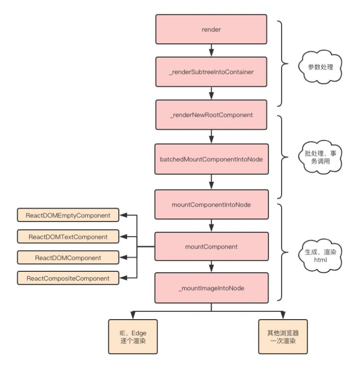

### Fiber架构的理解
JavaScript引擎和页面渲染引擎两个线程是互斥的，当其中一个线程执行时，另一个线程只能挂起等待

如果 JavaScript 线程长时间地占用了主线程，那么渲染层面的更新就不得不长时间地等待，界面长时间不更新，会导致页面响应度变差，用户可能会感觉到卡顿

而这也正是 React 15 的 `Stack Reconciler`所面临的问题，当 React在渲染组件时，从开始到渲染完成整个过程是一气呵成的，无法中断

如果组件较大，那么js线程会一直执行，然后等到整棵VDOM树计算完成后，才会交给渲染的线程

这就会导致一些用户交互、动画等任务无法立即得到处理，导致卡顿的情况
	
#### React Fiber
React16 实现了新的基于 requestIdleCallback 的调度器（因为 requestIdleCallback 兼容性和稳定性问题，自己实现了 polyfill），通过任务优先级的思想，在高优先级任务进入的时候，中断 reconciler。

为了适配这种新的调度器，推出了 FiberReconciler，将原来的树形结构（vdom）转换成 Fiber 链表的形式（child/sibling/return），整个 Fiber 的遍历是基于循环而非递归，可以随时中断。

+ 为每个增加了优先级，优先级高的任务可以中断低优先级的任务。然后再重新，注意是重新执行优先级低的任务
+ 增加了异步任务，调用requestIdleCallback api，浏览器空闲的时候执行
+ dom diff树变成了链表，一个dom对应两个fiber（一个链表），对应两个队列，这都是为找到被中断的任务，重新执行

从架构角度来看，Fiber 是对 React核心算法（即调和过程）的重写

从编码角度来看，Fiber是 React内部所定义的一种数据结构，它是 Fiber树结构的节点单位，也就是 React 16 新架构下的虚拟DOM

一个 fiber就是一个 JavaScript对象，包含了元素的信息、该元素的更新操作队列、类型，其数据结构如下：
```js
type Fiber = {
  // 用于标记fiber的WorkTag类型，主要表示当前fiber代表的组件类型如FunctionComponent、ClassComponent等
  tag: WorkTag,
  // ReactElement里面的key
  key: null | string,
  // ReactElement.type，调用`createElement`的第一个参数
  elementType: any,
  // The resolved function/class/ associated with this fiber.
  // 表示当前代表的节点类型
  type: any,
  // 表示当前FiberNode对应的element组件实例
  stateNode: any,

  // 指向他在Fiber节点树中的`parent`，用来在处理完这个节点之后向上返回
  return: Fiber | null,
  // 指向自己的第一个子节点
  child: Fiber | null,
  // 指向自己的兄弟结构，兄弟节点的return指向同一个父节点
  sibling: Fiber | null,
  index: number,

  ref: null | (((handle: mixed) => void) & { _stringRef: ?string }) | RefObject,

  // 当前处理过程中的组件props对象
  pendingProps: any,
  // 上一次渲染完成之后的props
  memoizedProps: any,

  // 该Fiber对应的组件产生的Update会存放在这个队列里面
  updateQueue: UpdateQueue<any> | null,

  // 上一次渲染的时候的state
  memoizedState: any,

  // 一个列表，存放这个Fiber依赖的context
  firstContextDependency: ContextDependency<mixed> | null,

  mode: TypeOfMode,

  // Effect
  // 用来记录Side Effect
  effectTag: SideEffectTag,

  // 单链表用来快速查找下一个side effect
  nextEffect: Fiber | null,

  // 子树中第一个side effect
  firstEffect: Fiber | null,
  // 子树中最后一个side effect
  lastEffect: Fiber | null,

  // 代表任务在未来的哪个时间点应该被完成，之后版本改名为 lanes
  expirationTime: ExpirationTime,

  // 快速确定子树中是否有不在等待的变化
  childExpirationTime: ExpirationTime,

  // fiber的版本池，即记录fiber更新过程，便于恢复
  alternate: Fiber | null,
}
```

Fiber把渲染更新过程拆分成多个子任务，每次只做一小部分，做完看是否还有剩余时间，如果有继续下一个任务；如果没有，挂起当前任务，将时间控制权交给主线程，等主线程不忙的时候在继续执行

即可以中断与恢复，恢复后也可以复用之前的中间状态，并给不同的任务赋予不同的优先级，其中每个任务更新单元为 React Element 对应的 Fiber节点

实现的上述方式的是requestIdleCallback方法

window.requestIdleCallback()方法将在浏览器的空闲时段内调用的函数排队。这使开发者能够在主事件循环上执行后台和低优先级工作，而不会影响延迟关键事件，如动画和输入响应

首先 React 中任务切割为多个步骤，分批完成。在完成一部分任务之后，将控制权交回给浏览器，让浏览器有时间再进行页面的渲染。等浏览器忙完之后有剩余时间，再继续之前 React 未完成的任务，是一种合作式调度。

该实现过程是基于 Fiber节点实现，作为静态的数据结构来说，每个 Fiber 节点对应一个 React element，保存了该组件的类型（函数组件/类组件/原生组件等等）、对应的 DOM 节点等信息。

作为动态的工作单元来说，每个 Fiber 节点保存了本次更新中该组件改变的状态、要执行的工作。

每个 Fiber 节点有个对应的 React element，多个 Fiber节点根据如下三个属性构建一颗树：
```js
// 指向父级Fiber节点
this.return = null
// 指向子Fiber节点
this.child = null
// 指向右边第一个兄弟Fiber节点
this.sibling = null
```
通过这些属性就能找到下一个执行目标

### react中key的作用
跟Vue一样，React 也存在 Diff算法，而元素key属性的作用是用于判断元素是新创建的还是被移动的元素，从而减少不必要的元素渲染

因此key的值需要为每一个元素赋予一个确定的标识

如果列表数据渲染中，在数据后面插入一条数据，key作用并不大，如下：
```js
this.state = {
    numbers:[111,222,333]
}

insertMovie() {
  const newMovies = [...this.state.numbers, 444];
  this.setState({
    movies: newMovies
  })
}

<ul>
    {
        this.state.movies.map((item, index) => {
            return <li>{item}</li>
        })
    }
</ul>
```
前面的元素在diff算法中，前面的元素由于是完全相同的，并不会产生删除创建操作，在最后一个比较的时候，则需要插入到新的DOM树中

因此，在这种情况下，元素有无key属性意义并不大

下面再来看看在前面插入数据时，使用key与不使用key的区别：
```js
insertMovie() {
  const newMovies = [000 ,...this.state.numbers];
  this.setState({
    movies: newMovies
  })
}
```
当拥有key的时候，react根据key属性匹配原有树上的子元素以及最新树上的子元素，像上述情况只需要将000元素插入到最前面位置

当没有key的时候，所有的li标签都需要进行修改

同样，并不是拥有key值代表性能越高，如果说只是文本内容改变了，不写key反而性能和效率更高

主要是因为不写key是将所有的文本内容替换一下，节点不会发生变化

而写key则涉及到了节点的增和删，发现旧key不存在了，则将其删除，新key在之前没有，则插入，这就增加性能的开销

### react diff算法
跟Vue一致，React通过引入Virtual DOM的概念，极大地避免无效的Dom操作，使我们的页面的构建效率提到了极大的提升

传统diff算法通过循环递归对节点进行依次对比，效率低下，算法复杂度达到 O(n^3)，react将算法进行一个优化，复杂度降维O(n)

#### 原理
react中diff算法主要遵循三个层级的策略：
+ tree层级(对整个组件树进行遍历和比较的过程)
	- DOM节点跨层级的操作不做优化，只会对相同层级的节点进行比较
	- 只有删除、创建操作，没有移动操作
+ conponent 层级
	- 如果是同一个类的组件，则会继续往下diff运算，如果不是一个类的组件，那么直接删除这个组件下的所有子节点，创建新的
+ element 层级:对于比较同一层级的节点们，每个节点在对应的层级用唯一的key作为标识;提供了 3 种节点操作，分别为 **INSERT_MARKUP(插入)、MOVE_EXISTING (移动)和 REMOVE_NODE (删除)**


react发现新树中，R节点下没有了A，那么直接删除A，在D节点下创建A以及下属节点，上述操作中，只有删除和创建操作


当component D换成了component G 后，即使两者的结构非常类似，也会将D删除再重新创建G


通过key可以准确地发现新旧集合中的节点都是相同的节点，因此无需进行节点删除和创建，只需要将旧集合中节点的位置进行移动，更新为新集合中节点的位置


+ index： 新集合的遍历下标。
+ oldIndex：当前节点在老集合中的下标
+ maxIndex：在新集合访问过的节点中，其在老集合的最大下标

如果当前节点在新集合中的位置比老集合中的位置靠前的话，是不会影响后续节点操作的，这里这时候被动字节不用动

操作过程中只比较oldIndex和maxIndex，规则如下：
+ 当oldIndex>maxIndex时，将oldIndex的值赋值给maxIndex
+ 当oldIndex=maxIndex时，不操作
+ `当oldIndex<maxIndex时，将当前节点移动到index的位置`

diff过程如下：
+ 节点B：此时 maxIndex=0，oldIndex=1；满足 maxIndex< oldIndex，因此B节点不动，此时maxIndex= Math.max(oldIndex, maxIndex)，就是1
+ 节点A：此时maxIndex=1，oldIndex=0；不满足maxIndex< oldIndex，因此A节点进行移动操作，此时maxIndex= Math.max(oldIndex, maxIndex)，还是1
+ 节点D：此时maxIndex=1, oldIndex=3；满足maxIndex< oldIndex，因此D节点不动，此时maxIndex= Math.max(oldIndex, maxIndex)，就是3
+ 节点C：此时maxIndex=3，oldIndex=2；不满足maxIndex< oldIndex，因此C节点进行移动操作，当前已经比较完了

当ABCD节点比较完成后，diff过程还没完，还会整体遍历老集合中节点，看有没有没用到的节点，有的话，就删除

> old>max,max更新为新值，元素不懂，`当old<max`，则移动元素到对应的max标记的位置

#### 简单类型加key和不加key的性能

由于dom节点的移动操作开销是比较昂贵的，没有key的情况下要比有key的性能更好
```js
1.加key
<div key='1'>1</div>             <div key='1'>1</div>     
<div key='2'>2</div>             <div key='3'>3</div>  
<div key='3'>3</div>  ========>  <div key='2'>2</div>  
<div key='4'>4</div>             <div key='5'>5</div>  
<div key='5'>5</div>             <div key='6'>6</div>  
操作：节点2移动至下标为2的位置，新增节点6至下标为4的位置，删除节点4。

2.不加key
<div>1</div>             <div>1</div>     
<div>2</div>             <div>3</div>  
<div>3</div>  ========>  <div>2</div>  
<div>4</div>             <div>5</div>  
<div>5</div>             <div>6</div> 
操作：修改第1个到第5个节点的innerText
```

### react hooks的理解
Hook 是 React 16.8 的新增特性。它可以在不编写 class 的情况下使用 state 以及其他的 React 特性，其本质是一系列特殊的函数。

#### 常见的hooks
+ useState
+ useEffect
+ useCallback
+ useMemo
+ useRef
+ useReducer:React中用于管理组件内部状态的一个强大工具，它使得状态管理更加灵活和可维护
+ useContext:获取上下文数据

+ useNavigate
+ useLocation
+ useParams
+ useSearchParams

```js
import React, { useState, useEffect } from 'react';
function Example() {
  const [count, setCount] = useState(0);
 
  useEffect(() => {    document.title = `You clicked ${count} times`;  });
  return (
    <div>
      <p>You clicked {count} times</p >
      <button onClick={() => setCount(count + 1)}>
        Click me
      </button>
    </div>
  );
}
```


在组件中调用useReducer：在组件函数内部，调用useReducer并传入reducer函数和状态的初始值。useReducer返回一个数组，第一个元素是当前的状态，第二个元素是一个dispatch函数，用于分发动作。
```js
  
import React, { useReducer } from 'react';  

function reducer(state, action) {  
  switch (action.type) {  
    case 'increment':  
      return { count: state.count + 1 };  
    case 'decrement':  
      return { count: state.count - 1 };  
    default:  
      throw new Error();  
  }  
}

export default function Counter() {  
  const [state, dispatch] = useReducer(reducer, { count: 0 });  
  return (  
    <div>  
      <p>Count: {state.count}</p>  
      <button onClick={() => dispatch({ type: 'increment' })}>Increment</button>  
      <button onClick={() => dispatch({ type: 'decrement' })}>Decrement</button>  
    </div>  
  );  
}
```


useMemo类似vue computed
```js
const doubleCount = useMemo(() => {  
	console.log('Calculating doubleCount');  
	return count * 2;  
  }, [count]);  
```

useCallback
```js
// 使用 useCallback 创建一个记忆化的回调函数  
  // 依赖项数组中包含所有可能导致回调函数内部逻辑变化的变量  
  const handleClick = useCallback(() => {  
    console.log('handleClick called with value:', value);  
    // 你可以在这里执行任何需要记忆化引用的操作  
  }, [value]);
```

#### hooks作用
hooks能够更容易解决状态相关的重用的问题：
+ 每调用useHook一次都会生成一份独立的状态
+ 通过自定义hook能够更好的封装我们的功能

编写hooks为函数式编程，每个功能都包裹在函数中，整体风格更清爽，更优雅


#### 自定义hooks

```js
import { useState } from 'react';  
  
// 自定义Hook: useCounter  
function useCounter() {  
  // 使用useState初始化计数值为0  
  const [count, setCount] = useState(0);  
  
  // 定义一个增加计数的函数  
  const increment = () => {  
    setCount(count + 1);  
  };  
  
  // 返回计数状态和增加计数的函数  
  return [count, increment];  
}  
  
// 使用自定义Hook的组件  
function CounterComponent() {  
  // 使用自定义Hook获取计数状态和增加计数的函数  
  const [count, increment] = useCounter();  
  
  return (  
    <div>  
      <p>Count: {count}</p>  
      <button onClick={increment}>Increment</button>  
    </div>  
  );  
}  
  
export default CounterComponent;
```

### `react 性能优化`
当想要更新一个子组件的时候，如下图绿色部分：


理想状态只调用该路径下的组件render：


但是react的默认做法是调用所有组件的render，再对生成的虚拟DOM进行对比（黄色部分），如不变则不进行更新


从上图可见，黄色部分diff算法对比是明显的性能浪费的情况

主要手段是通过shouldComponentUpdate、PureComponent、React.memo

除此之外， 常见性能优化常见的手段有如下：
+ 避免使用内联函数
+ 使用 React Fragments 避免额外标记
+ 使用 Immutable
+ 懒加载组件
+ 事件绑定方式
+ 服务端渲染
+ 组件拆分、合理使用hooks等性能优化手段

如果使用内联函数，则每次调用render函数时都会创建一个新的函数实例
```js
import React from "react";

export default class InlineFunctionComponent extends React.Component {
  render() {
    return (
      <div>
        <h1>Welcome Guest</h1>
        <input type="button" onClick={(e) => { this.setState({inputValue: e.target.value}) }} value="Click For Inline Function" />
      </div>
    )
  }
}
```
应该在组件内部创建一个函数，并将事件绑定到该函数本身。这样每次调用 render 时就不会创建单独的函数实例
```js
import React from "react";

export default class InlineFunctionComponent extends React.Component {
  
  setNewStateData = (event) => {
    this.setState({
      inputValue: e.target.value
    })
  }
  
  render() {
    return (
      <div>
        <h1>Welcome Guest</h1>
        <input type="button" onClick={this.setNewStateData} value="Click For Inline Function" />
      </div>
    )
  }
}
```

使用Reac.memo，只有当前props发生变化才重新渲染，注意：根据需求考虑使用
```jsx
import { useMemo,memo } from "react";

type XC1Props = {  
    count: number;  
  };  
export default  memo(function XC1({count}:XC1Props){
    console.log('xc1')

    const doubleCount = useMemo(() => {  
        console.log('Calculating doubleCount');  
        return count * 2;  
      }, [count]);  
    console.warn('doubleCount',doubleCount)
    return (
        <div>11111</div>
    )
})
```
使用PureComponent:同上
```js
import React from 'react'
type XC1Props = {  
    count: number;  
  };  
export default class XC2 extends React.PureComponent<XC1Props,any> {
    constructor(props:XC1Props){
        super(props)
        console.log(props.count)
        this.state = {
            myval : this.props.count
        }
    }
    componentDidMount(): void {
        console.log('xc2','componentDidMount')
    }
    componentDidUpdate(prevProps: Readonly<any>, prevState: Readonly<{}>, snapshot?: any): void {
        console.log('xc2','componentDidUpdate')
    }
    render(): React.ReactNode {
        return (
            <div>2222---{ this.state.myval } ---{this.props.count}</div>
        )
    }
}
```

### react-router理解
react-router主要分成了几个不同的包：
1. react-router: 实现了路由的核心功能
2. react-router-dom： 基于 react-router，加入了在浏览器运行环境下的一些功能
3. react-router-native：基于 react-router，加入了 react-native 运行环境下的一些功能
4. react-router-config: 用于配置静态路由的工具库

react-router-dom v6版本修改了很多属性
```
默认即精确匹配
移除了子组件的props中默认带着的histroy等属性，现在需要借助useHistory hooks去获取
移除了redirect，用<Navigate to="/" replace />取代
移除了switch，用routes取代
```

+ NavLink:封装的a，加持了activeStyle【活跃时（匹配时）的样式】和activeClassName（添加className用）
+ useSearchParams 是 React Router DOM 库中用于处理 URL 查询参数（query parameters）的 React Hook。
+ useLocation 是 react-router-dom 库中的一个钩子（hook），它主要用于获取当前路由的位置信息。通过 useLocation，可以访问到当前 URL 的详细信息，包括 pathname（路径名）、search（查询字符串）以及 hash（哈希部分）等。
```js
import { BrowserRouter as Router, Route, Routes,NavLink } from "react-router-dom";  
import Contact from "./component/Contact";
import About  from "./component/About";
import Detail from "./component/Detail";
export default function App() {  
  return (  
    <Router>  
      <main>  
        <nav>  
          <ul>  
            <li>  
              <a href="/">Home</a>  
            </li>  
            <li>  
              <a href="/about">About</a>  
            </li>  
            <li>  
              <a href="/contact">Contact</a>  
            </li>  
           
          </ul>  
          <NavLink to="/" exact activeStyle={{color: "red"}}>首页</NavLink>

          {/* {userName && (  
          <NavLink to={`/about/${userName}`}>About</NavLink>  
        )}   */}
          <NavLink to="/about/tom" activeStyle={{color: "red"}}>关于</NavLink>
          <NavLink to="/contact" activeStyle={{color: "red"}}>链接</NavLink>
          //   传参
		  <NavLink to={{
              pathname: "/detail2", 
              query: {name: "kobe", age: 30},
              state: {height: 1.98, address: "洛杉矶"},
              search: "?apikey=123"
            }}>
            详情2
        </NavLink>
        </nav>  
        <Routes>  
          <Route path="/" element={<h1>Welcome to Home!</h1>} /> 
		   // 传参
          <Route path="/about/:name" element={<About/>} />  
          <Route path="/contact" element={ <Contact/> } />  
          <Route path="/detail2" element={ <Detail/> } />  

        </Routes>  
      </main>  
    </Router>  
  );  
}
```

```js
import {Fragment} from 'react'
import { useNavigate } from 'react-router-dom';  
const Contact = () =>{
   const navigate = useNavigate();  
   return <Fragment>
      <h1>Contact</h1>
      <button onClick={() => navigate("/")}>Go to home</button>
    </Fragment>
};

  export default Contact
```
```js
import { Fragment, useEffect } from "react";
import { Navigate, useLocation,useParams } from "react-router-dom";
const About = () => {
  const { name } = useParams();  
  const location = useLocation();

  useEffect(() => {
    console.log(name);
  }, [name, location]);

  // 如果 name 不是 "tom"，则重定向到根路径
  if (name !== "tom") {
    return <Navigate to="/" replace />; // 使用 Navigate 组件进行重定向
  }
  return (
    <Fragment>
      <h1>About {name}</h1>
    </Fragment>
  );
};

export default About;
```
```js
import { Fragment, useEffect } from "react";
// import {Redirect} from 'react-router-dom'
import { Navigate, useLocation,useParams, useSearchParams } from "react-router-dom";
const Detail = (props) => {
   
    const val = useLocation()// {pathname: '/detail2', search: '?apikey=123', hash: '', state: null, key: 'gv3sr6yo'}
    const [search] = useSearchParams() //123

    console.log(search.get('apikey'))

    // console.log(val1)
  return (
    <Fragment>
      <h1> Detail </h1>
    </Fragment>
  );
};

export default  Detail ;

```

#### useSearchParams的应用

```js
import { useSearchParams } from 'react-router-dom';  
  
function MyComponent() {  
  // 使用 useSearchParams 获取当前的查询参数对象  
  let [searchParams] = useSearchParams();  
  
  // 读取查询参数  
  let param1 = searchParams.get('param1');  
  let param2 = searchParams.get('param2');  
  
  // 修改查询参数  
  function handleUpdateParam1(event) {  
    searchParams.set('param1', event.target.value);  
    // 注意：调用 searchParams 的方法并不会自动更新 URL，你需要使用下面的方式触发更新  
  }  
  
  // 触发 URL 更新  
  function handleSubmit(event) {  
    event.preventDefault();  
    // 使用 replace 或 push 来导航到新 URL  
    window.history.replaceState({}, '', `${window.location.pathname}?${searchParams}`);  
  }  
  
  return (  
    <form onSubmit={handleSubmit}>  
      <label>  
        Param 1:  
        <input  
          type="text"  
          value={param1 || ''}  
          onChange={handleUpdateParam1}  
        />  
      </label>  
      {/* 其他表单字段和提交按钮 */}  
    </form>  
  );  
}  
  
export default MyComponent;
```

#### react路由传参的形式
动态路由
```html
<NavLink to="/detail/abc123">详情</NavLink>
<Route path="/detail/:id" component={Detail}/>
```
search传递参数
```js
<NavLink to="/detail2?name=why&age=18">详情2</NavLink>
<Route path="/detail2" component={Detail2}/>
```
to传入对象或字符串
```js
<NavLink to={{
    pathname: "/detail2", 
    query: {name: "kobe", age: 30},
    state: {height: 1.98, address: "洛杉矶"},
    search: "?apikey=123"
  }}>
  详情2
</NavLink>
<Route path="/detail2" component={Detail2}/>
```

### redux工作原理
它基于一个称为存储的状态容器的概念，组件可以从该容器中作为 props 接收数据。

更新存储区的唯一方法是向存储区发送一个操作，该操作被传递到一个reducer中。reducer接收操作和当前状态，并返回一个新状态，触发订阅的组件重新渲染。


### 项目中使用redux，结构划分
Redux 是一个用于可预测和可维护的全局状态管理的 JS 库。Redux遵循三大基本原则：

+ 单一数据源
+ state 是只读的
+ 使用纯函数来执行修改

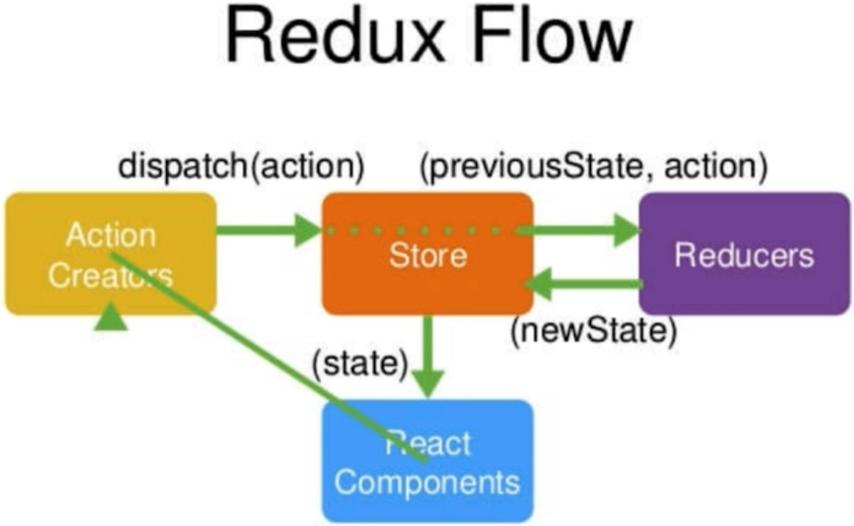


#### react-redux redux-thunk
+ react-redux 减少手动订阅解除订阅和组件导入store的繁琐问题

+ reudx-thunk action 通常被设计为包含 type 属性（可能还有其他属性）的纯对象。如果试图派发一个函数，Redux 本身不会知道如何处理它，需要借助中间件

```js
//store/index.js
 import {createStore,compose,applyMiddleware} from 'redux'
 import reducer from './reducer.js'
 import thunk from 'redux-thunk'
 
 const composeEnhancers =window.__REDUX_DEVTOOLS_EXTENSION_COMPOSE__ ?   
     window.__REDUX_DEVTOOLS_EXTENSION_COMPOSE__({}) : compose;
 	
 const enhancer = composeEnhancers(
   applyMiddleware(thunk),
 );
 //如果不需要使用多个中间件，如不使用window.__REDUX_DEVTOOLS_EXTENSION_COMPOSE__，
 //createStore第二个参数可以直接写成applyMiddleware(thunk)
 const store =createStore(
 reducer,
 enhancer
 ); 
 
 export default store; 
```
```js
//actionCreators.js
 export const getInputValue=(value)=>({
     type:'change_input_value',
     value
 })
 export const orgin=(value)=>({
 	type:"orgin",
 	value
 })
 
 // 如果没有配置react-thunk，那么在actionCreator中使用返回的是函数会报错
 // Actions must be plain objects. Use custom middleware for async actions.
 // 还可以进行异步操作，比如像后台发起请求等候反馈结果
 export const getorgin= ()=>{
 	return (dispatch) => {
 		setTimeout(()=>{
 			const res=[1,2,3,4,5,6];
 			const action=orgin(res)
 			dispatch(action)
 		},3000)
 	}
 }
```


## Angular
Angular 是一个应用设计框架与开发平台，旨在创建高效而精致的单页面应用。

### `angular生命周期`


> ngOnChanges注意：这发生得比较频繁，所以在这里执行的任何操作都会显著影响性能。如果你的组件没有输入属性，或者你使用它时没有提供任何输入属性，那么框架就不会调用 ngOnChanges()。


### `angular组件通信`

#### 父组件传值(也可以是函数)给子组件
父组件js
```js
import { Component, OnInit } from '@angular/core';

@Component({
  selector: 'app-parent',
  templateUrl: './parent.component.html',
  styleUrls: ['./parent.component.less']
})
export class ParentComponent implements OnInit {
  //声明一个需要传递给子组件的变量
  public msg: string = "我是parent组件传递过来的msg"
  constructor() { }
  ngOnInit(): void {
  }
  //声明一个需要传递给子组件的函数
  parentRun(){
    console.log("this is function of parent")
  }

}
```
父组件页面
```html
<p>我是父组件</p>
<!-- 引入子组件 -->
<!-- 这里的写法是 [msg] 是我们需要发送的变量，这里的名字可以自己定义，后面"msg"是我们ts文件中定义的变量 -->
<!-- 这里需要注意的是，我们传递给子组件函数的时候不可以加()，因为加上以后代表函数的执行 -->
<app-children [msg]="msg" [parentRun]="parentRun"></app-children>
```
子组件
```js
//这里我们需要引入angular核心模块中的Input模块进行接收父组件的变量值
import { Component, OnInit,Input } from '@angular/core';

@Component({
  selector: 'app-children',
  templateUrl: './children.component.html',
  styleUrls: ['./children.component.less']
})
export class ChildrenComponent implements OnInit {
  //使用@Input装饰器进行接收父组件的变量值
  @Input() msg:any
  //使用@Input装饰器接收父组件的函数
  @Input() parentRun:any
  constructor() { }
  ngOnInit(): void {
  }
  /**
   * @function run 子组件本地函数
   */
  run(){
    //通过this进行执行父组件的函数
    this.parentRun()
  }
}
```
子组件页面
```html
<!-- 直接使用{{}}进行变量值的获取，这里的写法和vue的基本是一致的 -->
<p>{{msg}}</p>
<!-- 这里和vue的区别在于，vue调用函数是需要@click，angular需要的是(click) 只是语法上的区别，执行过程是一致的 -->
<button (click)="run()">
    执行parentRun
</button>
```

> 子组件调用父组件的方法，注意里的this指向，parentFun里的操作的this仍然是指向子组件的。

#### 子组件传值(函数)给父组件
方案1：ViewChild
```js
//这里我们需要引入angular核心模块中的Input模块进行接收父组件的变量值
import { Component, OnInit,Input } from '@angular/core';
......
export class ChildrenComponent implements OnInit {
  public childmsg:any = "我是子组件中即将被父组件进行获取的变量"
  childfunc(){
    console.log("我是子组件的函数")
  }
  /**
   * @function run 子组件本地函数
   */
  run(){
    console.log("this is run")
  }
}
```
父组件
```html
<!-- 这里给子组件起一个节点名字，为后续父组件获取该节点的值提供名字 -->
<app-children #childrenNode></app-children>
<button (click)="passfun()"> 执行子组件的childfunc方法</button>
```
```js
// 引入angular核心模块的viewchild模块
import { Component, OnInit,ViewChild } from '@angular/core';
......
export class ParentComponent implements OnInit {
//使用viewchild装饰器进行节点值的获取
  @ViewChild('childrenNode') children:any
  parentRun(){
  //通过viewchild进行子组件数据的获取
    console.log(this.children)
    console.log(this.children.childmsg)
  }
  //父组件执行子组件的函数
  passfun(){
    this.children.childfunc()
  }
}
```

方案2：通过@Output触发父组件的方法
```js
//这里需要引入angular核心模块中的Input模块进行接收父组件的变量值
import { Component, OnInit,Input,Output,EventEmitter } from '@angular/core';

@Component({
  selector: 'app-children',
  templateUrl: './children.component.html',
  styleUrls: ['./children.component.less']
})
export class ChildrenComponent implements OnInit {
  constructor() { }
  //通过Output进行子组件给父组件传递数据 childOut 是自己随意起的名字
  @Output() public childOut = new EventEmitter()
  ngOnInit(): void {
  }
  //声明一个使用output方式传递数据的函数
  passOutput(){
    this.childOut.emit("我是子组件的output方法")
  }
}
```
父组件
```html
<!-- 父组件引用子组件 -->
<!-- (childOut) 就是子组件中自己起的名字,不可更改，$event非必写，这里就是子组件传递的数据，但是写的话只能写$event-->
<app-children (childOut)="parentInput($event)"></app-children>
```
```js
// 父组件
export class ParentComponent implements OnInit {
  //通过output进行子组件数据的获取
  parentInput(e:any){
    console.log("执行了....")
    console.log(e)
  }
}
```

#### 跨层级通信
1. rxjs

```js
import { Injectable } from '@angular/core';
import { Observable, Subject } from 'rxjs';

export enum EmitType{
    // 无
    None,
    // 左侧目录更新
    LeftMenu
}

export interface IEmitMessageParams{
    type:EmitType, // 类型
    from:string, // 来自哪个文件，主要定位异常的触发
    message?:any, //发送信息
}

@Injectable({
  providedIn: 'root'
})
export class EmitMessage {
  private subject = new Subject<any>();

  sendMessage(message: IEmitMessageParams) {
    this.subject.next(message);
  }

  clearMessage() {
    this.subject.next();
  }

  getMessage(): Observable<any> {
    return this.subject.asObservable();
  }
}
```

```js
import { Component } from '@angular/core';
import { MessageService } from '../message.service';

@Component({
  selector: 'app-home',
  template: `
    <div>
      <h1>Home</h1>
      <button (click)="sendMessage()">Send Message</button>
      <button (click)="clearMessage()">Clear Message</button>
    </div>
  
  `
})

export class HomeComponent {
  constructor(private messageService: MessageService) { }
  sendMessage(): void { // 发送消息
	this.emitMessage.sendMessage({
	  type: EmitType.LeftMenu,
	  from: 'data-set'
	})
  }

  clearMessage(): void { // 清除消息
    this.messageService.clearMessage();
  }
}
```
```js
import { Component, OnDestroy } from '@angular/core';
import { Subscription } from 'rxjs';
import { MessageService } from './message.service';
@Component({
  selector: 'my-app',
  template: `
      <div *ngIf="message">{{message.text}}</div>
      <app-home></app-home>
    `
})
export class AppComponent implements OnDestroy {
  message: any;
  subscription: Subscription;
  constructor(private messageService: MessageService) {
     // 监听是否需要更新
     this.subscription = this.emitMessage.getMessage().subscribe((message:IEmitMessageParams) => {
       if(message?.type === EmitType.LeftMenu){
         this.menuData = []
         this.getMenuData(false)
       }
     });
  }

  ngOnDestroy() {
    this.subscription.unsubscribe();
  }
}

```

2. NgRx
	+ Store：类似于Redux中的Store，它是Angular应用中全局状态的单一来源。Store是一个可观察对象，当状态发生变化时，它会发出新的状态值。
	+ Actions：描述应用中发生的事件或操作的对象。它们被发送到Reducer以触发状态更新。
	+ Reducers：纯函数，它们根据Actions改变应用的状态。它们接收当前的状态和一个Action作为参数，并返回一个新的状态。
	+ Effects：用于处理异步操作（如API调用）的副作用。它们监听特定的Actions，执行异步操作，并在操作完成后发出新的Actions。
	+ Selectors：用于从Store中选择特定部分的状态。它们允许组件以声明式方式从Store中获取所需的数据。

### angular-cli 命令行命令
1. ng new `<project-name> 或 ng n <project-name>`：创建一个新的Angular项目。
2. ng generate `<entity> 或 ng g <entity>`：根据模板生成文件。`<entity>` 可以是组件（component）、服务（service）、管道（pipe）、指令（directive）、枚举（enum）、类（class）、接口（interface）等。

```
例如：
ng g component my-component：生成名为my-component的组件。
ng g service my-service：生成名为my-service的服务。
```

3. ng build：将Angular应用程序编译到输出目录中（默认为dist/）。
4. ng serve：启动一个本地开发服务器，并实时重新编译项目文件。

### 属性定义

```html 
 <!-- 可自定义属性需加前缀attr -->
 <div [attr.abc]="f1" [id]="f2">2221</div>
```

### angular事件以及事件优化


### Angular独立组件模式与传统基于模块
如果没有特别指定，默认情况下项目可能不会自动生成app.module.ts文件。这一变化反映了Angular框架逐渐倾向于使用更简洁的独立组件（Standalone Components）模式，`这是一种与传统基于模块（NgModule）体系并行的组件定义方式。`

在Angular中，组件、指令、管道等以前都需要在@NgModule中声明和导出，以便它们能在应用的其他部分被使用。而独立组件则不需要挂在任何模块下，可以直接在其它组件中通过其选择器使用，简化了配置和依赖管理。

如果仍然希望使用传统的 NgModule 结构，并生成 app.module.ts 文件，您可以在创建项目时使用 `--no-standalone `选项。例如：
```
ng new my-app --no-standalone
```
这将确保新项目中包含传统的 app.module.ts 文件，按照经典的方式组织和管理应用程序模块。

独立组件（Standalone Components）模式是Angular 14引入的新特性，它提供了一种更轻量级的方式来定义和使用组件，与传统的基于 NgModule 的组件模式相比，有以下几个主要区别：

1. 模块依赖：
	+ 传统模式：组件必须在一个 NgModule 中声明，才能在应用中使用。组件的依赖（如指令、服务等）通过 NgModule 的 imports 和 exports 进行管理。
	+ 独立模式：组件可以直接在没有 NgModule 的情况下声明和使用。这意味着你可以创建一个组件而不必将其放入 NgModule，减少了模块间的耦合。
2. 导入和导出：
	+ 传统模式：组件、指令、管道等需要在 NgModule 的 declarations 中声明，并可能通过 exports 导出来供其他模块使用。
	+ 独立模式：组件可以单独导出和导入，无需通过 NgModule。这简化了组件之间的引用，但可能会导致更多单独的导入语句。
3. 服务提供：
	+ 传统模式：服务通常在 NgModule 的 providers 数组中注册，这样它们在整个模块范围内可用。
	+ 独立模式：组件可以有自己的局部服务提供商，但这需要使用 providers 属性直接在组件级别声明，限制了服务的可见范围。
4. 懒加载：
	+ 传统模式：模块可以被配置为懒加载，以优化应用的初始加载性能。
	+ 独立模式：独立组件不适用于懒加载，因为它们不与 NgModule 相关联。不过，仍然可以通过其他方式实现类似的功能，比如路由级别的懒加载。
5. 模块化：
	+ 传统模式： NgModule 通常用于组织功能相关的组件和共享资源，提供了一种强模块化的结构。
	+ 独立模式：组件可以独立存在，使得模块化更加灵活，但也可能导致整体结构变得松散。
6. 代码组织：
	+ 传统模式：通常有一个统一的 app.module.ts 文件来管理核心应用组件和全局资源。
	+ 独立模式：代码组织可能更分散，每个组件都有自己的独立性，这可能导致需要更多的文件管理和组织策略。
	
独立组件模式旨在提高开发效率，减少不必要的模块化开销，同时允许更细粒度的代码复用。然而，对于大型复杂应用，传统的 NgModule 模式可能更适合保持代码的组织和可维护性。开发者可以根据项目的规模和需求选择适合的模式。


## DOM
文档对象模型（DOM）是 HTML 和 XML 文档的编程接口。Dom的数据结构是一颗树。

DOM包含了以下几种类型的节点：

+ 元素节点（Element Nodes）：元素节点对应HTML或XML文档中的标签，如`<div>、<p>、<span>`等。是文档结构的主要组成部分，可包含其他类型的节点，如属性节点、文本节点等。
+ 属性节点（Attribute Nodes）：代表了元素的属性，如class、id等。包含了元素的附加信息，通常用于定义元素的样式、行为或与其他元素的关联。
+ 文本节点（Text Nodes）：实际文本内容,位于元素节点内部，用于显示给用户或作为其他类型节点的数据。
+ 注释节点（Comment Nodes）
+ 文档节点（Document Nodes）：文档节点代表了整个HTML或XML文档。它是DOM树的根节点，包含了文档中的所有其他节点。
+ 文档类型节点（Document Type Nodes）：这种节点通常代表文档类型定义（DTD）或XML文档中的DOCTYPE声明，它提供了关于文档类型和版本的信息。
+ 文档片段节点（Document Fragment Nodes）：这是一种特殊的节点类型，它并不直接对应于文档中的任何部分。文档片段节点用于临时存储一组DOM节点，以便进行高效的DOM操作。

### DOM操作节点的基本API
+ 创建节点
    - 元素 document.createElement('div')
    - 文本 document.createTextNode('xxx')，`appendChild`添加到对应的元素节点
    - 文档碎片 document.createDocumentFragment()
    - 属性 document.createAttribute('custom')，需要`setAttributeNode`设置上对应的属性
+ 获取节点
	- document.querySelector('#id/.class/div')返回`首个符合`要求，没有则返回null
	- document.querySelectorAll
	- getElementById、getElementsByClassName、getElementsByTagName...
+ 更新节点
	- innerHTML
	- innerText（不返回隐藏文本），textContent（返回所有文本）
+ 添加节点
	- innerHTML
	- appendChild: 把一个子节点添加到父节点最后位置
	- `insertBefore`:parentElement.insertBefore(newElement, referenceElement),子节点添加到目标节点前
	- setAttribute：添加/修改属性节点
+ 删除节点
	- removeChild：会变成`游离`的元素，可再度利用，需要手动处理才可以真实删除。

```js
// 创建一个新的元素  
	var elem = document.createElement('div');  
	elem.innerHTML='1000'
	  
	// 创建一个新的属性节点  
	var attr = document.createAttribute('data-custom');  
	var attr1 = document.createAttribute('id');  
	// 为新属性设置值  
	attr.value = 'Hello, world!';  
	attr1.value= 'china'
	  
	// 将新属性附加到元素上  
	elem.setAttributeNode(attr);  
	elem.setAttributeNode(attr1);
	  
	// 现在，你可以将这个元素添加到DOM中  
	document.body.appendChild(elem);
	
	console.log(document.getElementById('china').innerHTML)//1000

  // 更简便的方式
  var elem1 = document.createElement('div');  
	elem1.setAttribute('data-custom11', 'Hello, world!');  
	document.body.appendChild(elem1)
```

```js
// 删除一个节点，先找到父级节点，再调用删除方法
const self = document.getElementById('to-be-removed');
const parent = self.parentElement;
const removed = parent.removeChild(self);
removed === self; // true

// 移除事件监听器（如果有的话）  
removed.removeEventListener('click', someFunction);  
// ... 移除其他事件监听器  
  
// 将引用设置为null  
removed = null;
```


#### innerHTML outerHTML createTextNode innerText textContent异同

+ 相对于createTextNode而言，innerHTML和innerText可能会比通过DOM API逐个添加节点更快，因为它允许浏览器`一次性解析和渲染HTML内容`
+ innerHTML 属性可以设置或获取指定元素内部的HTML内容。可以解析HTML标签、实体字符等，并将它们转换为相应的DOM元素或字符。在使用 innerHTML 时，应始终确保内容是安全的或进行适当的转义(`防止XSS攻击`)
+ 使用 createTextNode **只会添加纯文本内容**，不会解析HTML标签或实体字符。createTextNode `更安全`，因为它不涉及HTML解析；在大型文档中，直接操作DOM节点可能会比使用 innerHTML 更慢一些，它所触发的 DOM 操作（如附加节点）可能会间接导致`重排`和重绘
+ outerHTML 属性用于获取或设置描述某个元素（包括其所有属性和内容）的序列化 HTML。当设置一个元素的 outerHTML 属性时，浏览器会尝试用新的 HTML 替换旧的元素。然而，如果这个元素没有父节点（即它是一个孤立的节点，没有附加到 DOM 中的任何位置），浏览器就无法执行替换操作，因此会`抛出错误`
+ innerText 是一个属性，用于获取或设置元素的文本内容。它获取的是元素内所有文本内容的拼接，包括子元素的文本内容
+ **textContent** 属性获取或设置指定元素的文本内容及其所有后代元素的文本内容。由于它只处理文本内容，不涉及 HTML 解析，因此通常比 innerHTML 更快
+ innerText 知道文本的渲染外观，而 textContent 不知道。所以展示时innerText会自动过滤掉隐藏的元素标签里的文本和一些不渲染的文本

```js
// 创建一个 div 元素  
var div = document.createElement('div');  
  
// 使用 innerHTML 设置 div 的内部 HTML 内容  
div.innerHTML = '这是通过 innerHTML 添加的文本，包括 <b>粗体</b> 文字。<div style="color:red">red</div>';  
  
// 将 div 元素添加到文档的 body 中  
document.body.appendChild(div);
```


```js
// 创建一个 div 元素  
var div = document.createElement('div');  
  
// 使用 createTextNode 创建一个文本节点  
var textNode = document.createTextNode(
'这是通过 innerHTML 添加的文本，包括 <b>粗体</b> 文字。<div style="color:red">red</div>'
);  
  
// 将文本节点附加到 div 元素  
div.appendChild(textNode);  
  
// 将 div 元素添加到文档的 body 中  
document.body.appendChild(div);
```


```js
var newElement = document.createElement('div');  
newElement.textContent = 'Some content';  
document.body.appendChild(newElement); // 先附加到 body  
newElement.outerHTML = '<a>这是通过 innerHTML 添加的文本，包括 <b>粗体</b> 文字。<div style="color:red">red</div></a>'
```


```html
<body>
		<h3>源元素：</h3>
		<p id="source">
		  <style>
		    #source {
		      color: red;
		    }
		    #text {
		      text-transform: uppercase;
		    }
		  </style>
		  <span id="text">
		    来看看<br />
		    这段文字<br />
		    在下方怎么表示。
		  </span>
		  <span style="display:none">隐藏文字</span>
		</p>
		<h3>textContent 结果：</h3>
		<textarea id="textContentOutput" rows="6" cols="30" readonly>…</textarea>
		<h3>innerText 结果：</h3>
		<textarea id="innerTextOutput" rows="6" cols="30" readonly>…</textarea>
		
</body>
<script>
	const source = document.getElementById("source");
	const textContentOutput = document.getElementById("textContentOutput");
	const innerTextOutput = document.getElementById("innerTextOutput");
	
	textContentOutput.value = source.textContent;
	innerTextOutput.value = source.innerText;
</script>
```


### property 和attribute使用
1. Attribute：HTML属性，书写在标签内的属性，使用setAttribute()和getAttribute()进行设置和获取。
2. Property：DOM属性，html标签对应的DOM节点属性，使用 .属性名 或者 ['属性名']进行设置和获取。

简单理解，Attribute就是dom节点自带的属性，例如html中常用的id、class、title、align等;而Property是这个DOM元素作为对象，其附加的内容，例如childNodes、firstChild等。

另外，常用的Attribute，例如id、class等，已经被作为Property附加到DOM对象上，可以和Property一样取值和赋值。但是自定义的Attribute，就不会有这样的优待。

两者都可能造成重新渲染，**优先使用Property**。

不管是修改attribute还是property都会影响到对方的属性值，但是输入框的input value比较特殊例外！

```html
<!DOCTYPE html>
<html>
	<head>
		<meta charset="utf-8" />
		<meta name="viewport" content="width=device-width, initial-scale=1">
		<title></title>
	</head>
	<body>
		<div class="switch">
			<input type="text" value="1" name="sex" class="k1">男
			
	</div>
	</body>
</html>
<script type="text/javascript">
	let a=document.querySelectorAll('input')[0];
	console.log(a.value===a.getAttribute('value'))//true
	a.setAttribute('value',99);
	console.log(a.value===a.getAttribute('value'))//true
	a.value="19"
	console.log(a.value===a.getAttribute('value'))//false
	console.log(a.value)//19
	console.log(a.getAttribute("value"))//99
	a.setAttribute('value',88)
	console.log(a.value)//19
	console.log(a.getAttribute("value"))//88
</script>

```

1. 如果input在html中初始设置了value，在没有任何input.value=“xxx”这种操作时，input.value===input.getAttribute("value");而且还可以继续通过input.setAttribute('value','xxx')来更改新值，input.value会同步修改。
2. 当修改了input.value='xxx'后，input.getAttribute('value')和input.value似乎再也没任何交集了，input.value会反映在页面上的input框中的数据,而input的attribue中的value也就是打开控制台里的元素结构会看到`<input type="text" value="1" name="sex" class="k1">`是某个值，这个值只能通过setAttribute来修改
3. value的Attriubte和property没有映射关系

### 说说 Real DOM 和 Virtual DOM 的区别？优缺点？
Real DOM，真实 DOM，意思为文档对象模型，是一个结构化文本的抽象，在页面渲染出的每一个结点都是一个真实 DOM结构


Virtual Dom，本质上是以 JavaScript 对象形式存在的对 DOM 的描述

创建虚拟 DOM 目的就是为了更好将虚拟的节点渲染到页面视图中，虚拟 DOM 对象的节点与真实 DOM 的属性一一照应

```js
// 创建 h1 标签，右边千万不能加引号
const vDom = <h1>Hello World</h1>; 
// 找到 <div id="root"></div> 节点
const root = document.getElementById("root"); 
// 把创建的 h1 标签渲染到 root 节点上
ReactDOM.render(vDom, root); 
```
JSX 实际是一种语法糖，在使用过程中会被 babel 进行编译转化成 JS 代码
```js
const vDom = React.createElement(
  'h1'，
  { className: 'hClass', id: 'hId' },
  'hello world'
)
console.log(vDom)
```


JSX 通过 babel 的方式转化成 React.createElement 执行，返回值是一个对象，也就是虚拟 DOM

1. 两者的区别如下：
	+ 虚拟 DOM 不会进行排版与重绘操作，而真实 DOM 会频繁重排与重绘
	+ 虚拟 DOM 的总损耗是“虚拟 DOM 增删改+真实 DOM 差异增删改+排版与重绘”，真实 DOM 的总损耗是“真实 DOM 完全增删改+排版与重绘”

传统的原生 api 或 jQuery 去操作 DOM 时，浏览器会从构建 DOM 树开始从头到尾执行一遍流程

当你在一次操作时，需要更新 10 个 DOM 节点，浏览器没这么智能，收到第一个更新 DOM 请求后，并不知道后续还有 9 次更新操作，因此会马上执行流程，最终执行 10 次流程

而通过 VNode，同样更新 10 个 DOM 节点，虚拟 DOM 不会立即操作 DOM，而是将这 10 次更新的 diff 内容保存到本地的一个 js 对象中，最终将这个 js 对象一次性 attach 到 DOM 树上，避免大量的无谓计算


2. 真实 DOM 的优势：易用
3. 缺点：
	+ 效率低，解析速度慢，内存占用量过高
	+ 性能差：频繁操作真实 DOM，易于导致重绘与回流

使用虚拟 DOM 的优势如下：
+ 简单方便：如果使用手动操作真实 DOM 来完成页面，繁琐又容易出错，在大规模应用下维护起来也很困难
+ 性能方面：使用 Virtual DOM，能够有效避免真实 DOM 数频繁更新，减少多次引起重绘与回流，提高性能
+ 跨平台：React 借助虚拟 DOM，带来了跨平台的能力，一套代码多端运行

缺点：
+ 在一些性能要求极高的应用中虚拟 DOM 无法进行针对性的极致优化
+ 首次渲染大量 DOM 时，由于多了一层虚拟 DOM 的计算，速度比正常稍慢

### Window.onload和 DOMContentLoaded（即ready）区别
如非必要，优先使用DOMContentLoaded（jquery采用），体验感更好

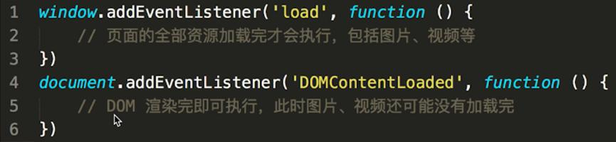

### 服务端返回xml
1. **DOMParser** 可以将存储在字符串中的 XML 或 HTML 源代码解析为一个 DOM Document。
2. xhr.responseXML拿到XML数据

```js
var xhr = new XMLHttpRequest();  
xhr.open('GET', 'your-xml-url.xml', true);  
xhr.onreadystatechange = function () {  
    if (xhr.readyState === 4 && xhr.status === 200) {  
        var xmlString = xhr.responseText; // 获取 XML 字符串  
        var parser = new DOMParser();  
        var xmlDoc = parser.parseFromString(xmlString, "text/xml"); // 解析 XML 字符串  
  
        // 现在你可以使用 xmlDoc 来访问和操作 XML 数据了  
        // 例如，获取根元素的第一个子元素的文本内容：  
        var rootElement = xmlDoc.documentElement; // 获取根元素  
        var firstChild = rootElement.firstChild; // 获取根元素的第一个子元素  
        var textContent = firstChild.textContent || firstChild.innerText; // 获取文本内容  
        console.log(textContent);  
    }  
};  
xhr.send();
```
```js
fetch('your-xml-url.xml')  
    .then(response => response.text()) // 获取 XML 字符串  
    .then(xmlString => {  
        var parser = new DOMParser();  
        var xmlDoc = parser.parseFromString(xmlString, "text/xml"); // 解析 XML 字符串  
  
        // 现在你可以使用 xmlDoc 来访问和操作 XML 数据了  
        // ...  
    })  
    .catch(error => {  
        console.error('Error fetching and parsing the XML:', error);  
    });
```

```xml
<items>  
    <item>  
        <id>1</id>  
        <name>Item 1</name>  
    </item>  
    <item>  
        <id>2</id>  
        <name>Item 2</name>  
    </item>  
    <!-- 更多的item -->  
</items>
```
```js
// 假设你的XML URL是'data.xml'  
var xmlUrl = 'data.xml';  
  
var xhr = new XMLHttpRequest();  
xhr.open('GET', xmlUrl, true);  
xhr.onload = function() {  
    if (xhr.status === 200) {  
        // 解析XML  
        var xmlDoc = xhr.responseXML;  
        var items = []; // 创建一个空数组来存储解析后的数据  
  
        // 获取所有的<item>元素  
        var itemNodes = xmlDoc.getElementsByTagName('item');  
        for (var i = 0; i < itemNodes.length; i++) {  
            var itemId = itemNodes[i].getElementsByTagName('id')[0].textContent;  
            var itemName = itemNodes[i].getElementsByTagName('name')[0].textContent;  
  
            // 将每个item的数据添加到数组中  
            items.push({ id: itemId, name: itemName });  
        }  
  
        // 假设你有一个ID为'itemList'的列表元素  
        var listElement = document.getElementById('itemList');  
  
        // 清空列表  
        listElement.innerHTML = '';  
  
        // 填充列表  
        items.forEach(function(item) {  
            var listItem = document.createElement('li');  
            listItem.textContent = item.name; // 或者你可以添加更复杂的HTML结构  
            listElement.appendChild(listItem);  
        });  
    }  
};  
xhr.send();
```
```html
<ul id="itemList">  
    <!-- 数据将通过JavaScript动态填充到这里 -->  
</ul>
```

### 前端图片转base64
1. 使用HTML `` 标签
	+ 通过创建一个img标签，并监听其load事件，可以在图片加载完成后获取Base64编码。
	+ 使用JavaScript的`toDataURL()`方法将图片转换为Base64编码的Data URL。

```js
  
<script>  
document.getElementById('image').onload = function() {  
    var base64 = this.toDataURL('image/jpeg');  
    console.log(base64); // 输出Base64编码的图片数据  
};  
</script>
```
2. 使用File API（特别是FileReader对象）
	+ 如果有一个File对象或Blob对象（通常来自文件输入元素或拖放API），可以使用FileReader API来读取文件内容并转换为Base64。
	+ 实例化FileReader对象，并调用其readAsDataURL()方法以Data URL的方式读取文件内容。
	+ 在onload事件处理函数中，通过e.target.result获取到转换后的Base64编码字符串。

```js
const reader = new FileReader();  
reader.onload = function(e) {  
	// 加载完成后获取对应的数据
    const base64 = e.target.result; // 这就是Base64编码的图片数据  
    console.log(base64);  
};  
// file就是该文件
reader.readAsDataURL(file); // file是File或Blob对象
```

### 如何获取文档中任意一个元素距离文档 document 顶部的距离？
1. HTMLElement.offsetTop 为只读属性，它返回`当前元素相对于其 offsetParent 元素的顶部`内边距的距离。

通过遍历目标元素、目标元素的父节点、父节点的父节点......依次溯源，并累加这些遍历过的节点相对于其最近祖先节点（且 position 属性非 static）的偏移量，向上直到 document，累加即可得到结果。
```js
const offset = ele => {
    let result = {
        top: 0,
        left: 0
    }
    // 当前 DOM 节点的 display === 'none' 时, 直接返回 {top: 0, left: 0}
    if (window.getComputedStyle(ele)['display'] === 'none') {
        return result
    }
    let position
    const getOffset = (node, init) => {
        if (node.nodeType !== 1) {
            return
        }
        position = window.getComputedStyle(node)['position']
        if (typeof(init) === 'undefined' && position === 'static') {
            getOffset(node.parentNode)
            return
        }
        result.top = node.offsetTop + result.top - node.scrollTop
        result.left = node.offsetLeft + result.left - node.scrollLeft
        if (position === 'fixed') {
            return
        }
        getOffset(node.parentNode)
    }
    getOffset(ele, true)
    return result
}
```

2. 方案2：getBoundingClientRect，用来描述一个元素的具体位置，这个位置的下面四个属性都是相对于视口左上角的位置而言的。


```js
const offset = ele => {
    let result = {
        top: 0,
        left: 0
    }
    // 当前为 IE11 以下，直接返回 {top: 0, left: 0}
    if (!ele.getClientRects().length) {
        return result
    }

    // 当前 DOM 节点的 display === 'none' 时，直接返回 {top: 0, left: 0}
    if (window.getComputedStyle(ele)['display'] === 'none') {
        return result
    }

    result = ele.getBoundingClientRect()
    var docElement = ele.ownerDocument.documentElement

    return {
        top: result.top + window.pageYOffset - docElement.clientTop,
        left: result.left + window.pageXOffset - docElement.clientLeft
    }
}
```

node.ownerDocument.documentElement 的用法可能大家比较陌生，ownerDocument 是 DOM 节点的一个属性，它返回当前节点的顶层的 document 对象。ownerDocument 是文档，documentElement 是根节点。事实上，ownerDocument 下含 2 个节点：

`<!DocType>`

`documentElement`

docElement.clientTop，clientTop 是一个元素顶部边框的宽度，不包括顶部外边距或内边距。

### document.write 和 innerHTML 的区别
document.write 只能重绘整个页面

innerHTML 可以重绘页面的一部分

### property 和attribute
Attribute：HTML属性，书写在标签内的属性，使用setAttribute()和getAttribute()进行设置和获取。

Property：DOM属性，html标签对应的DOM节点属性，使用 .属性名 或者 ['属性名']进行设置和获取。

简单理解，Attribute就是dom节点自带的属性，例如html中常用的id、class、title、align等;而Property是这个DOM元素作为对象，其附加的内容，例如childNodes、firstChild等。

另外，常用的Attribute，例如id、class等，已经被作为Property附加到DOM对象上，可以和Property一样取值和赋值。但是自定义的Attribute，就不会有这样的优待。


## BOM

### BOM的含义
**浏览器对象模型（Browser Object Model）**的简称，它提供了一组JavaScript API，用于管理浏览器窗口和框架。

BOM的核心是window，它表示浏览器的一个实例。

+ navigator.userAgent：判断浏览器类型

#### moveTo moveBy scrollTo scrollBy resizeTo resizeBy

+ To:类似绝对，moveTo，以左上方原点，移动scrollTo，窗口滚动条横向最左侧或者纵向最上方位置计算，resizeTo：设置为宽高多少的窗口
+ By:类似相对，moveBy，以当前位置为原点，移动，scrollBy，以滚动条当前位置，挪动，resizeBy：以当前宽高为基准，增减

```js
window.resizeTo(800, 600); // 将窗口大小调整为800像素宽，600像素高
window.resizeBy(100, -50); // 将窗口宽度增加100像素，高度减少50像素

window.scrollTo(0, 1000); // 将窗口滚动到垂直位置1000像素处
window.scrollBy(50, -100); // 将窗口向右滚动50像素，向上滚动100像素

window.moveTo(0, 0); // 将窗口左上角移动到屏幕左上角  
window.moveBy(50, 100); // 将窗口向右移动50像素，向下移动100像素  
```

### location

它提供了关于当前窗口或标签页中显示的URL的信息，并允许你解析URL的各个部分，以及重定向浏览器到新的URL


+ hash改变，不会发送请求，因为 hash 部分（即URL中 # 符号及其后面的部分）通常用于表示页面内的某个位置或状态
+ 而路由history模式，由于使用了History API【`history.pushState()` 和 `history.replaceState()`（在不重新加载页面的情况下修改历史记录）】，它们不会导致页面重新加载或发送HTTP请求到服务器。相反，前端js代码会监听这些URL变化，并相应地更新页面内容或组件，从而实现SPA中的无刷新页面导航。

### history
History 对象是 window 对象的一部分，可通过 window.history 属性对其进行访问。

属性	|描述
--|--
length|	返回浏览器历史列表中的 URL 数量。

方法	|描述
---|--
back()	|加载 history 列表中的前一个 URL。
forward()|	加载 history 列表中的下一个 URL。
go()	|可加载历史列表中的某个具体的页面。

go() 方法。
```js
history.go(number) //-1上一个页面，1前进一个页面
```

### 获取当前页面URL参数
```js
// // 传统方式
function query(name) {
    const search = location.search.substr(1) // 类似 array.slice(1)
     //a=30&b=40&c=50&d=60
    const reg = new RegExp(`(^|&)${name}=([^&]*)(&|$)`, 'i')
    const res = search.match(reg)
    console.warn(res)
    if (res === null) {
        return null
    }
    return res[2]
}
// 第一位匹配到的全局，后面依次是每个小括号对应的
// ([^&]*)：非&符号的内容
console.warn(query('a'))
//  ['&c=50&', '&', '50', '&', index: 9, input: 'a=30&b=40&c=50&d=60', groups: undefined]
console.warn(query('c'))
// ['a=30&', '', '30', '&', index: 0, input: 'a=30&b=40&c=50&d=60', groups: undefined]
```
也可以不使用正则，利用&符合=号拆分两次获取。

利用URLSearchParams这个API，注意兼容性
```js
function query(name) {
        const search = location.search
        const p = new URLSearchParams(search)
        return p.get(name)
    }
console.log( query('b') )
```


## 移动端

### 上拉加载下拉刷新实现
上拉加载本质是触底


```js
scrollTop + clientHeight >= scrollHeight
```
```js
let clientHeight = document.documentElement.clientHeight; //
let scrollHeight = document.body.scrollHeight;
let scrollTop = document.documentElement.scrollTop;
let distance = 50; // 50
if ((scrollTop + clientHeight) >= (scrollHeight - distance)) {
 console.log("xxx");
}
```

下拉刷新则是监听touch事件


### `rem em vw vh dpr`
1.	rem: 相对大小，但相对的只是HTML根元素
2.	em:  继承父级元素的字体大小
3.	vw:window.innerWidth = 100vw
4.	vh:window.innerHeight = 100vh
5.	vmax:取vh/vw中大值
6.	vmin: 取vh/vw中小
7.	dpr（设备像素比）：是指`设备物理像素的个数`除以`设备独立像素`的大小。物理像素是手机屏幕上一个一个的发光的点，大小是固定的；独立像素也叫做逻辑像素，css设置的像素大小就是逻辑像素。

`window.devicePixelRatio`可获取，无缩放的情况下，1个css像素 === 一个设备独立像素

设备像素：设备像素（device pixels），又称为物理像素，从屏幕在工厂生产出的那天起，它上面设备像素点就固定不变了，单位为pt

设备独立像素（Device Independent Pixel）：与设备无关的逻辑像素，代表可以通过程序控制使用的虚拟像素，是一个总体概念

iPhone 3GS 和 iPhone 4/4s 的尺寸都是 3.5 寸，但 iPhone 3GS 的分辨率是 320x480，iPhone 4/4s 的分辨率是 640x960

这意味着，iPhone 3GS 有 320 个物理像素，iPhone 4/4s 有 640 个物理像素

> 我们统一 iPhone 3GS 和 iPhone 4/4s 都是 320 个虚拟像素，只是在 iPhone 3GS 上，最终 1 个虚拟像素换算成 1 个物理像素，在 iphone 4s 中，1 个虚拟像素最终换算成 2 个物理像素


#### 移动端1px实现
+  border-image:需要图片
+  background-image：因为每个边框都是线性渐变颜色实现，因此无法实现圆角。
+  box-shadow:不好控制
+  媒体查询：兼容性
+  :after transform (其实无非是把1px缩放为0.5px，**0.5px并不是所有都支持**(iOS8以上支持)。)

```html
<!DOCTYPE html>  
<html lang="en">  
<head>  
<meta charset="UTF-8">  
<meta name="viewport" content="width=device-width, initial-scale=1.0">  
<title>1px Border with Transform and After</title>  
<style>  
  .border-1px {  
    position: relative;  
    background-color: white;  
  }  
  .border-1px::after {  
    content: "";  
    position: absolute;  
    left: 0;  
    top: 0;  
    width: 200%;  
    height: 200%;  
    border: 1px solid #000;  
    transform: scale(0.5);  
    transform-origin: 0 0;  
    box-sizing: border-box;  
    pointer-events: none; /* 防止影响点击事件 */  
  }  
</style>  
</head>  
<body>  
<div class="border-1px" style="width: 200px; height: 100px;">  
  使用transform和伪元素的1px边框  
</div>  
</body>  
</html>
```

+  viewport + rem

```html
<meta name="viewport" id="WebViewport" content="initial-scale=1, maximum-scale=1, minimum-scale=1, user-scalable=no">
```
```js
var viewport = document.querySelector("meta[name=viewport]")
if (window.devicePixelRatio == 1) {
    viewport.setAttribute('content', 'width=device-width, initial-scale=1, maximum-scale=1, minimum-scale=1, user-scalable=no')
} 
if (window.devicePixelRatio == 2) {
    viewport.setAttribute('content', 'width=device-width, initial-scale=0.5, maximum-scale=0.5, minimum-scale=0.5, user-scalable=no')
} 
if (window.devicePixelRatio == 3) {
    viewport.setAttribute('content', 'width=device-width, initial-scale=0.333333333, maximum-scale=0.333333333, minimum-scale=0.333333333, user-scalable=no')
} 
var docEl = document.documentElement;
var fontsize = 10 * (docEl.clientWidth / 320) + 'px';
docEl.style.fontSize = fontsize;
```
+ svg，postcss-write-svg(小插件，只适合画直线)

#### 移动端2X3X图
+ srcset

```html

```
+ 媒体查询 兼容性差，目前之余IOS8+才支持，在IOS7及其以下、安卓系统都是显示0px。

```css
.my-element {  
  /* 默认背景图像，用于1倍像素密度的设备 */  
  background-image: url('my-image@1x.png');  
}  
  /* 针对2倍像素密度的设备 */
@media (-webkit-min-device-pixel-ratio: 2), (min-resolution: 192dpi) { 
  .my-element {  
    background-image: url('my-image@2x.png');  
  }  
}  
  
	/* 针对3倍像素密度的设备 */  
@media (-webkit-min-device-pixel-ratio: 3), (min-resolution: 288dpi) {  
  .my-element {  
    background-image: url('my-image@3x.png');  
  }  
}
```

+ js处理

```js
function setAppropriateImageSrc() {  
  var image = document.getElementById('my-image');  
  var dpr = window.devicePixelRatio || 1;  
  var src;  
  
  if (dpr >= 3) {  
    src = 'my-image@3x.png';  
  } else if (dpr >= 2) {  
    src = 'my-image@2x.png';  
  } else {  
    src = 'my-image@1x.png';  
  }  
  
  image.src = src;  
}  
  
window.onload = setAppropriateImageSrc;  
// 如果需要监听窗口大小变化，可以添加以下事件监听器  
window.onresize = setAppropriateImageSrc;
```

### 移动端兼容问题
1. 当设置overflow：scroll/auto,在ios上会卡顿
	+ -webkit-overflow-scrolling:touch
2. 安卓环境placeholder文字设置会偏上
	+  input有placeholder不设置行高
3. 移动端字体小于12px异常提示
	+ 把字体放大一倍，再使用transform缩小
4. ios下input按钮设置为disabled属性为true显示异常
	+ input[type=button]{opacity:1}
5. 安卓手机下取消语音输入按钮
	+ input::-webkit-input-speech-button{display:none}
6. ios下取消input输入框在输入英文首字母默认大写
	+ `<input autocapitaliz='off' autocorrect='off'>`
7. 禁止ios识别长串数字为电话
	+ `<meta content='telephone=no' name='format-detection'/>`


## 小程序


### `登录`
小程序登录是通过微信官方提供的登录能力, 获取微信提供的用户身份标识。通俗一点，	`也就是获取openId, unionId。`

1.登录流程
整体小程序登录可以分为两个阶段

第一阶段：是小程序 & 开发服务器 & 微信服务器三端交互，获取微信的相关登录凭证。

第二阶段：小程序 & 开发服务器交互，获取自定义的登录态，如cookie, 或者JWT等。


code: 当前用户的临时登录凭证code。

session_key: 会话密钥，是对用户数据加密签名的密钥。用于服务端解析微信加密回传的用户数据。用于解析前端通过小程序 api 获取的encryptedData。

从流程图中我们可以看出，因为前端只调用了wx.login这个 api，且这个 api 的调用不要用户授权，所以其实在不依赖于其他账号体系的情况下，当前这种流程就可以获取用户微信的登录状态。而用户也是无感知的（没有授权弹窗弹起）。

```js
// 前端代码
<button @tap="handleWxLogin">openid：wxLogin</button>

...

handleWxLogin() {
  wx.login({
    success(res) {
      if (res.code) {
        // 发送code临时登录凭证到后端
        wx.request({
          url: 'http://localhost:3000/wxLogin',
          data: {
            code: res.code
          }
        });
      } else {
        console.log('登录失败！' + res.errMsg);
      }
    }
  });
}

// 后端代码
async wxLogin(code) {
    // 这里我们请求了微信服务器登录凭证校验接口，
    const res = await axios.get('https://api.weixin.qq.com/sns/jscode2session', {
      params: {
        appid: this.appid,
        secret: this.secret,
        js_code: code,
        grant_type: 'authorization_code',
      },
    });
    return res.data.openid;
}

// jscode2session接口返回示例如下
{
 "openid":"xxxxxx",
 "session_key":"xxxxx",
 "unionid":"xxxxx",
 "errcode":0,
 "errmsg":"xxxxx"
}
```

#### 不同的登录方式


左边的小程序，它需要获取手机号，来关联用户在 58 平台上的账号体系，所以这种情况下，会用到手机号登录。

右边的小程序，它虽然不用关联平台数据，但是在使用场景中，还是需要用户头像和昵称来给用户一个清晰的认知，告诉用户已经登录成功，如果直接放一个openid串，或者使用随机昵称，体验上会很不友好。

获取手机号有两种方式：
1. 前端通过wx.login获取用户的session_key, 并通过button组件，open-type=getPhoneNumber获取加密数据传给后端，后端通过解密，获取用户数据。

我们传给后端的加密数据，就是下图标注的部分：


```js
// 前端代码
<button open-type="getPhoneNumber" @getphonenumber="getPhoneNumber">电话号码：解析加密数据</button>

...

getPhoneNumber(e) {
  wx.request({
    url: 'http://localhost:3000/getUserProfile',
    data: {
      encryptedData: e.$wx.detail.encryptedData,
      iv: e.$wx.detail.iv
    }
  });
}

// 后端代码
async getUserProfile(encryptedData, iv) {
    // 根据小程序appid、当前登录用户的sessionKey、前端获取的加密数据encryptedData、和向量iv解密获得手机号
    const pc = new WXBizDataCrypt(this.appid, this.sessionKey);

    const data = pc.decryptData(encryptedData, iv);

    return data;
}

// 解密方法
function WXBizDataCrypt(appId, sessionKey) {
  this.appId = appId;
  this.sessionKey = sessionKey;
}

WXBizDataCrypt.prototype.decryptData = function (encryptedData, iv) {
  // base64 decode
  const sessionKey = Buffer.from(this.sessionKey, 'base64');
  encryptedData = Buffer.from(encryptedData, 'base64');
  iv = Buffer.from(iv, 'base64');

  try {
    // 解密
    const crypto = require('crypto');
    const decipher = crypto.createDecipheriv('aes-128-cbc', sessionKey, iv);
    decipher.setAutoPadding(true);
    var decoded = decipher.update(encryptedData, 'binary', 'utf8');
    decoded += decipher.final('utf8');

    decoded = JSON.parse(decoded);
  } catch (err) {
    throw new Error('Illegal Buffer');
  }

  return decoded;
};

module.exports = WXBizDataCrypt;
```

> 因为解密时需要用到登录时获取的sessionKey，所以这个方法一定要在wx.login服务端获取了session_key的情况才能使用。

2. 方案二：前端通过button组件，**open-type=getPhoneNumber**获取code传给后端，后端通过调用凭据（access_token）和 code 去微信服务器请求。


```js
// 前端代码
<button open-type="getPhoneNumber" @getphonenumber="getPhoneNumberByCode">电话号码：code换取</button>

...

getPhoneNumberByCode(e) {
  wx.request({
    url: 'http://localhost:3000/getUserProfileByCode',
    data: {
      code: e.$wx.detail.code
    }
  });
}

// 后端代码
async getUserProfileByCode(code) {
    // 首先获取服务端与微信服务器交互的 接口调用凭证
    if (!this.accessToken) {
      const accessTokenRes = await axios.get(
        `https://api.weixin.qq.com/cgi-bin/token?grant_type=client_credential&appid=${this.appid}&secret=${this.secret}`,
      );
      this.accessToken = accessTokenRes.data.access_token;
    }

    // 然后根据前端获取的code去微信服务器做解析
    const res = (await axios.post(
      `https://api.weixin.qq.com/wxa/business/getuserphonenumber?access_token=${this.accessToken}`,
      {
        code,
      },
    )) as any;

    return res.data.phone_info;
}

// 正常返回数据结构如下
{
    "errcode":0,
    "errmsg":"ok",
    "phone_info": {
        "phoneNumber":"xxxxxx",
        "purePhoneNumber": "xxxxxx",
        "countryCode": 86,
        "watermark": {
            "timestamp": 1637744274,
            "appid": "xxxx"
        }
    }
}
```

### 小程序头像获取
1. 通过 getUserInfo 获取。
2. 回收 getUserInfo，通过 getUserProfile 获取[1]。

getUserInfo会记录之前授权的状态，导致如果用户点击过不允许，那小程序后续就不会再调起微信授权，导致用户使用流程中断。所以提供了getUserProfile方法，每一次都会调起授权。下图为两个方法的流程图：


```html
<button @tap="getUserInfo">getUserInfo_获取用户信息</button>
<button @tap="getUserProfile">getUserProfile_获取用户信息</button>
<button open-type="chooseAvatar" @chooseavatar="getUserAvatar">获取用户头像</button>
<image class="avatar" src="{{avatarUrl}}" />
<input type="nickname" placeholder="请输入昵称"/>
```

> 微信官方在2022年10月回收了getUserInfo和getUserProfile这两个接口获取用户信息的能力。
> 头像选择:需要将 button 组件 open-type 的值设置为 chooseAvatar，当用户选择需要使用的头像之后，可以通过 bindchooseavatar 事件回调获取到头像信息的临时路径。


### 微信小程序使用微信的wx.openid 和自己的账号密码登录有什么区别
微信小程序使用微信的wx.openid和自己的账号密码登录在多个方面存在显著的区别。以下是这些区别的详细解释：

1. 认证机制
	+ wx.openid：当用户使用微信小程序并通过微信授权登录时，小程序会调用wx.login()接口获取一个临时的登录凭证code。这个code会被发送到开发者服务器，并与小程序的AppID和AppSecret结合，向微信服务器请求换取用户的openid和`session_key`。openid是用户在小程序中的唯一标识，而`session_key`则是会话密钥，用于加密和解密用户数据。
	+ 自己的账号密码：这种方式依赖于小程序自己维护的用户账号和密码系统。用户需要在小程序中输入自己的账号和密码进行登录，然后小程序会将这些信息与自己的数据库中的信息进行比对验证。
2. 安全性
	+ wx.openid：由于openid和session_key是由微信服务器颁发的，因此具有较高的安全性。`session_key`可用于加密用户敏感数据，进一步提升了用户数据的安全性。
	+ 自己的账号密码：安全性取决于小程序自己实现的账号密码管理系统的强度。如果小程序没有采用足够的安全措施，比如明文存储密码、简单的密码验证逻辑等，那么用户账号和密码的安全性就会受到威胁。
3. 用户体验
	+ wx.openid：用户无需在小程序中输入额外的账号和密码信息，只需点击授权登录即可，因此用户体验较为流畅。
	+ 自己的账号密码：用户需要在小程序中输入自己的账号和密码，这可能会增加用户的操作步骤和登录时间，降低用户体验。
4. 关联性和唯一性
	+ wx.openid：openid是用户在微信生态中的唯一标识，可以用于在不同的小程序之间关联用户身份。如果开发者拥有多个小程序或公众号，可以通过openid来识别同一个用户在不同应用中的身份。
	+ 自己的账号密码：用户在小程序中的账号是独立的，与其他应用或平台无关。如果用户在不同的应用中都有账号，需要分别进行登录和管理。
5. 数据同步和共享
	+ wx.openid：由于openid是微信生态中的统一标识，因此可以方便地实现用户数据在不同应用之间的同步和共享。
	+ 自己的账号密码：用户数据需要在小程序自己的系统中进行管理和维护，与其他应用之间难以实现数据的同步和共享。
	
综上所述，微信小程序使用微信的wx.openid和自己的账号密码登录在认证机制、安全性、用户体验、关联性和唯一性以及数据同步和共享等方面都存在显著的区别。开发者在选择使用哪种登录方式时，需要根据自己的业务需求和实际情况进行权衡和选择。

### 小程序分包


### uniapp 工程配置
```
┌─uniCloud              云空间目录，支付宝小程序云为uniCloud-alipay，阿里云为uniCloud-aliyun，腾讯云为uniCloud-tcb（详见uniCloud）
│─components            符合vue组件规范的uni-app组件目录
│  └─comp-a.vue         可复用的a组件
├─utssdk                存放uts文件
├─pages                 业务页面文件存放的目录
│  ├─index
│  │  └─index.vue       index页面
│  └─list
│     └─list.vue        list页面
├─static                存放应用引用的本地静态资源（如图片、视频等）的目录，注意：静态资源都应存放于此目录
├─uni_modules           存放uni_module 详见
├─platforms             存放各平台专用页面的目录，详见
├─nativeplugins         App原生语言插件 详见
├─nativeResources       App端原生资源目录
│  ├─android            Android原生资源目录 详见
|  └─ios                iOS原生资源目录 详见
├─hybrid                App端存放本地html文件的目录，详见
├─wxcomponents          存放小程序组件的目录，详见
├─unpackage             非工程代码，一般存放运行或发行的编译结果
├─main.js               Vue初始化入口文件
├─App.vue               应用配置，用来配置App全局样式以及监听 应用生命周期
├─pages.json            配置页面路由、导航条、选项卡等页面类信息，详见
├─manifest.json         配置应用名称、appid、logo、版本等打包信息，详见
├─AndroidManifest.xml   Android原生应用清单文件 详见
├─Info.plist            iOS原生应用配置文件 详见
└─uni.scss              内置的常用样式变量
```

### uniapp获取openid
小程序会调用wx.login()接口获取一个临时的登录凭证code。这个code会被发送到开发者服务器，并与小程序的AppID和AppSecret结合，向微信服务器请求换取用户的openid和`session_key`。openid是用户在小程序中的唯一标识，而`session_key`则是会话密钥，用于加密和解密用户数据。
```js
uni.login({
	 provider: 'weixin', //使用微信登录
	  success: function (loginRes) {
		console.log(loginRes);
	  }
})
```

### pages.json
```json
{
	"pages": [ //pages数组中第一项表示应用启动页，参考：https://uniapp.dcloud.io/collocation/pages
		{
			"path": "pages/index/index",
			"style": {
				"navigationBarTitleText": "uni-app"
			}
		}
	    ,{
            "path" : "pages/list/list",
            "style" :                                                                                    
            {
                "navigationBarTitleText": "",
                "enablePullDownRefresh": false
            }
            
        }
    ],
	"globalStyle": {
		"navigationBarTextStyle": "black",
		"navigationBarTitleText": "uni-app",
		"navigationBarBackgroundColor": "#F8F8F8",
		"backgroundColor": "#F8F8F8"
	}
}
```

### tabBar
在 pages.json 中提供 tabBar 配置，不仅仅是为了方便快速开发导航，更重要的是在App和小程序端提升性能。在这两个平台，底层原生引擎在启动时无需等待js引擎初始化，即可直接读取 pages.json 中配置的 tabBar 信息，渲染原生tab。
```json
"tabBar": {
	"color": "#7A7E83",
	"selectedColor": "#3cc51f",
	"borderStyle": "black",
	"backgroundColor": "#ffffff",
	"list": [{
		"pagePath": "pages/component/index",
		"iconPath": "static/image/icon_component.png",
		"selectedIconPath": "static/image/icon_component_HL.png",
		"text": "组件"
	}, {
		"pagePath": "pages/API/index",
		"iconPath": "static/image/icon_API.png",
		"selectedIconPath": "static/image/icon_API_HL.png",
		"text": "接口"
	}]
}
```

> 如果不考虑兼容微信小程序，可用iconfont代替iconPath

### rpx
750rpx = 屏幕宽度，小程序设计稿按750px设计（最初的iPhone6尺寸），是个相对单位
```
750 * 元素在设计稿中的宽度 / 设计稿基准宽度
```
举例说明：

1. 若设计稿宽度为 640px，元素 A 在设计稿上的宽度为 100px，那么元素 A 在 uni-app 里面的宽度应该设为：750 * 100 / 640，结果为：117rpx。
2. 若设计稿宽度为 375px，元素 B 在设计稿上的宽度为 200px，那么元素 B 在 uni-app 里面的宽度应该设为：750 * 200 / 375，结果为：400rpx。

### static文件夹作用
为什么需要static这样的目录？

uni-app编译器根据pages.json扫描需要编译的页面，并根据页面引入的js、css合并打包文件。

对于本地的图片、字体、视频、文件等资源，如果可以直接识别，那么也会把这些资源文件打包进去，但如果这些资源以变量的方式引用， 比如：`<image :src="url"></image>`，甚至可能有更复杂的函数计算，此时编译器无法分析。

那么有了static目录，编译器就会把这个目录整体复制到最终编译包内。这样只要运行时确实能获取到这个图片，就可以显示。

当然这也带来一个注意事项，如果static里有一些没有使用的废文件，也会被打包到编译包里，造成体积变大。

另外注意，static目录支持特殊的平台子目录，比如web、app、mp-weixin等，这些目录存放专有平台的文件，这些平台的文件在打包其他平台时不会被包含。

`非 static 目录下的文件（vue组件、js、css 等）只有被引用时，才会被打包编译。`

**css、less/scss 等资源不要放在 static 目录下，建议这些公用的资源放在自建的 common 目录下。**

static目录和App原生资源目录有关系吗？

uni-app支持App原生资源目录nativeResources，下面有assets、res等目录。但和static目录没有关系。

static目录下的文件，在app第一次启动时，解压到了app的外部存储目录（external-path）。（uni-app x 从3.99+不再解压）

所以注意控制static目录的大小，`太大的static目录和太多文件，会造成App安装后第一次启动变慢`。

### 常用的组件

```
<view> 容器
<text> 文本
<scroll-view> 滚动区
<swiper> 轮播图
<image> 图片，注意mode不同设置的图形会有所不同，与原生的img标签有所不同
<video> autopaly在muted(静音模式)下可以生效
<navigator> 路由跳转，注意open-type不同模式
<form> 表单
<picker> 下方弹出选择框
<rich-text> 富文本，v-html兼容型不好，使用富文本，推荐数据Array，如要使用 HTML String，某些小程序不支持，则需自己将 HTML String 转化为 nodes 数组，可使用 html-parser 转换
```


```js
<template>
	<view>
		<view class="page-body">
			<view class="btn-area">
				<navigator url="navigate/navigate?title=navigate" hover-class="navigator-hover">
					<button type="default">跳转到新页面</button>
				</navigator>
				<navigator url="redirect/redirect?title=redirect" open-type="redirect" hover-class="other-navigator-hover">
					<button type="default">在当前页打开</button>
				</navigator>
				<navigator url="/pages/tabBar/extUI/extUI" open-type="switchTab" hover-class="other-navigator-hover">
					<button type="default">跳转tab页面</button>
				</navigator>
			</view>
		</view>
	</view>
</template>
<script>
// navigate.vue页面接受参数
export default {
	onLoad: function (option) { //option为object类型，会序列化上个页面传递的参数
		console.log(option.id); //打印出上个页面传递的参数。
		console.log(option.name); //打印出上个页面传递的参数。
	}
}
</script>
```

url有长度限制，太长的字符串会传递失败，可使用窗体通信、全局变量，或encodeURIComponent等多种方式解决，如下为encodeURIComponent示例。
```html
<navigator :url="'/pages/navigate/navigate?item='+ encodeURIComponent(JSON.stringify(item))"></navigator>
```
```js
// navigate.vue页面接受参数
onLoad: function (option) {
	const item = JSON.parse(decodeURIComponent(option.item));
}
```

注意绑定在form上的`@submit = formSubmit`事件，它可以获取我们输入的所有值，对应选项加上`name`即可。

数据在`e.detail.value`中可见

```html
<!-- 本示例未包含完整css，获取外链css请参考上文，在hello uni-app项目中查看 -->
<template>
	<view>
		<view>
			<form @submit="formSubmit" @reset="formReset">
				<view class="uni-form-item uni-column">
					<view class="title">switch</view>
					<view>
						<switch name="switch" />
					</view>
				</view>
				<view class="uni-form-item uni-column">
					<view class="title">checkbox</view>
					<checkbox-group name="checkbox">
						<label>
							<checkbox value="checkbox1" /><text>选项一</text>
						</label>
						<label>
							<checkbox value="checkbox2" /><text>选项二</text>
						</label>
					</checkbox-group>
				</view>
				<view class="uni-btn-v">
					<button form-type="submit">Submit</button>
					<button type="default" form-type="reset">Reset</button>
				</view>
			</form>
		</view>
	</view>
</template>
```
```html
<script>
	export default {
		data() {
			return {
			}
		},
		methods: {
			formSubmit: function(e) {
				console.log('form发生了submit事件，携带数据为：' + JSON.stringify(e.detail.value))
				var formdata = e.detail.value
				uni.showModal({
					content: '表单数据内容：' + JSON.stringify(formdata),
					showCancel: false
				});
			},
			formReset: function(e) {
				console.log('清空数据')
			}
		}
	}
</script>
```

### 常用的API
```
uni.navigateTo(OBJECT) 路由相关
uni.showToast(OBJECT) 提示框
uni.showModal(OBJECT) 可交互提示操作框
uni.showActionSheet(OBJECT)底部弹出菜单
uni.setNavigationBarTitle(OBJECT) 对导航条标题设置
uni.setNavigationBarColor(OBJECT) 对导航条颜色设置 【换肤】
uni.showNavigationBarLoading(OBJECT) 导航条title前加loading
uni.setTabBarItem(OBJECT) 动态设置tabbar的某一项 【管理员与普通用户】【vip动态权限调整】
uni.setTabBarStyle(OBJECT) 动态设置 tabBar 的整体样式 【换肤】
uni.request(OBJECT) 请求处理
uni.setStorage(OBJECT) 缓存，可存储对象，不需要转字符串
```
setNavigationBarColor参数


```js
uni.setTabBarItem({
  index: 0,
  text: 'text',
  iconPath: '/path/to/iconPath',
  selectedIconPath: '/path/to/selectedIconPath'
})
```

> 注意: 设置 iconfont 属性时，pages.json iconfontSrc 需要指定字体文件

### 吸附顶部兼容
uni-app 提供内置 CSS 变量


### uniapp换肤
1. 主题部分配置css变量 
2. API 调整头部和底部 【uni.setNavigationBarTitleText】【uni.setNavigationBarColor】【uni.setTabBarStyle】【uni.setTabBarItem】
3. 存储主题【uni.setStorageSync】【uni.getStorageSync】

### uni.switchTab uni.navigateTo uni.redirectTo  uni.reLaunch  的区别
1. uni.switchTab(OBJECT)
	+ 用途：用于跳转到 tabBar 页面，`并关闭其他非 tabBar 页面`。
	+ 行为：跳转到应用内的某个 tabBar 页面，并关闭其他非 tabBar 页面。tabBar 页面之间的跳转。
	+ 注意：`只能在 app.json 中注册的 tabBar 页面中使用。`
2. uni.navigateTo(OBJECT)
	+ 用途：保留当前页面，跳转到应用内的某个页面。**但是不能跳到 tabBar 页面。**
	+ 行为：使用 uni.navigateTo 跳转后，当前页面会保留在内存中，并显示在跳转页面的左上角（左上角会有一个返回按钮）。
	+ 返回：用户可以通过点击左上角的返回按钮，返回到上一个页面。
	+ 限制：非 tabBar 页面最多可以打开 5 个，当打开第 6 个页面时，第 1 个页面将被关闭。
3. uni.redirectTo(OBJECT)
	+ 用途：关闭当前页面，跳转到应用内的某个页面。**但是不允许跳转到 tabBar 页面。**
	+ 行为：与 uni.navigateTo 类似，但关闭当前页面。
	+ 注意：不允许跳转到 tabBar 页面。
4. uni.reLaunch(OBJECT)
	+ 用途：**关闭所有页面，打开到应用内的某个页面。**
	+ 行为：关闭所有页面，然后打开到应用内的某个页面。
	+ 用途：可以从一个页面直接跳转到另一个页面，并清空之前的页面栈。

总结
1. uni.switchTab：用于 tabBar 页面之间的跳转。
2. uni.navigateTo：保留当前页面，跳转到其他页面。
3. uni.redirectTo：关闭当前页面，跳转到其他页面（但不能是 tabBar 页面）。
4. uni.reLaunch：关闭所有页面，打开到应用内的某个页面。

### easycom组件
传统vue组件，需要安装、引用、注册，三个步骤后才能使用组件。easycom将其精简为一步。

只要组件路径符合规范（具体见下），就可以不用引用、注册，直接在页面中使用。

路径规范指：
1. 安装在项目根目录的components目录下，并符合components/组件名称/组件名称.vue
2. 安装在uni_modules下，路径为uni_modules/插件ID/components/组件名称/组件名称.vue

```
┌─components
│  └─comp-a
│    └─comp-a.vue      符合easycom规范的组件
└─uni_modules          [uni_module](/plugin/uni_modules.md)中符合easycom规范的组件
   └─uni_modules
     └─uni-list
       └─components
         └─uni-list
           └─ uni-list.vue
```

> 在组件名完全一致的情况下，easycom引入的优先级低于手动引入（区分连字符形式与驼峰形式）。

### 路由跳转传参的获取
```js
//在起始页面跳转到test.vue页面并传递参数
uni.navigateTo({
	url: 'test?id=1&name=uniapp'
});
```
当在H5中，可以直接使用$route.query.id获取，但是为了兼容微信小程序,通过onLoad生命周期可以获取参数
```js
onLoad(val){
	console.log(val)
}
```

### vue和nvue区别
uni-app App 端内置了一个基于 weex 改进的原生渲染引擎，提供了原生渲染能力。

在 App 端，如果使用 vue 页面，则使用 `webview 渲染`；如果使用 nvue 页面(native vue 的缩写)，则使用`原生渲染`。一个 App 中可以同时使用两种页面，比如首页使用 nvue，二级页使用 vue 页面。

虽然 nvue 也可以多端编译，输出 H5 和小程序，**但 nvue 的 css 写法受限**，`所以如果你不开发 App，那么不需要使用 nvue。`


### uniapp兼容各端编译
uni-app 是一个使用 Vue.js 开发所有前端应用的框架，它允许开发者编写一次代码，发布到多个平台，包括 iOS、Android、H5、以及各种小程序（如微信、支付宝、百度等）。为了兼容各端编译，uni-app 提供了一些条件编译和平台特有的API或组件。

```html
<template>  
    <view>  
        <!-- 只在H5平台上显示 -->  
        <view v-if="process.env.VUE_APP_PLATFORM === 'h5'">这是H5平台</view>  
  
        <!-- 只在微信小程序上显示 -->  
        <view v-if="process.env.VUE_APP_PLATFORM === 'mp-weixin'">这是微信小程序</view>  
  
        <!-- 通用代码 -->  
        <view>这是通用代码</view>  
    </view>  
</template>  
  
<script>  
export default {  
    // ...  
    created() {  
        // 这里可以通过uni.getSystemInfoSync().platform来判断当前平台  
        // 但为了兼容编译，我们通常使用环境变量来判断  
        console.log(process.env.VUE_APP_PLATFORM); // 输出当前平台，如 'h5', 'mp-weixin' 等  
    }  
    // ...  
}  
</script>
```
```html
<template>  
    <view>  
        <!-- 在App和小程序中使用原生导航栏 -->  
        <view v-if="isAppOrMpPlatform">  
            <!-- 使用平台特有的API或组件 -->  
        </view>  
  
        <!-- 在H5中使用自定义导航栏 -->  
        <view v-else>  
            <!-- 使用H5的样式和布局 -->  
        </view>  
    </view>  
</template>  
  
<script>  
export default {  
    computed: {  
        isAppOrMpPlatform() {  
            // 假设我们有一个方法来判断当前是否是App或小程序平台  
            return /mp-/.test(process.env.VUE_APP_PLATFORM) || process.env.VUE_APP_PLATFORM === 'app-plus';  
        }  
    },  
    // ...  
}  
</script>
```
```html
<template>  
    <view class="container">  
        <!-- 内容 -->  
    </view>  
</template>  
  
<style scoped>  
.container {  
    /* 通用样式 */  
    width: 100%;  
    height: 100vh;  
    display: flex;  
    flex-direction: column;  
}  
  
/* 只在H5上生效的样式 */  
/* #ifdef H5 */  
.container {  
    background-color: #f0f0f0;  
}  
/* #endif */  
  
/* 只在微信小程序上生效的样式 */  
/* #ifdef MP-WEIXIN */  
.container {  
    background-color: #eee;  
}  
/* #endif */  
</style>
```
```html
<script>  
export default {  
    data() {  
        return {  
            // ...  
        };  
    },  
    methods: {  
        // 通用方法  
        commonMethod() {  
            // ...  
        },  
  
        // 条件编译方法，仅在小程序或App中执行  
        // #ifdef MP || APP  
        platformSpecificMethod() {  
            // 这里可以调用小程序或App特有的API  
            // 例如，调用uni.getSystemInfoSync()获取系统信息  
            const systemInfo = uni.getSystemInfoSync();  
            console.log('当前平台:', systemInfo.platform);  
        },  
        // #endif  
  
        // 仅在H5中执行的方法  
        // #ifdef H5  
        h5OnlyMethod() {  
            // 这里可以编写H5特有的代码  
            // 例如，使用window对象  
            console.log('这是H5平台');  
        },  
        // #endif  
  
        onLoad() {  
            // 通用加载逻辑  
            // ...  
  
            // 根据平台调用对应的方法  
            // #ifdef MP || APP  
            this.platformSpecificMethod();  
            // #endif  
  
            // #ifdef H5  
            this.h5OnlyMethod();  
            // #endif  
        }  
    },  
    // ...  
}  
</script>
```

### uniapp 应用的生命周期、页面的生命周期、组件的生命周期
```
应用的生命周期

onLaunch——当uni-app 初始化完成时触发（全局只触发一次）
onShow——当 uni-app 启动，或从后台进入前台显示
onHide——当 uni-app 从前台进入后台
onError——当 uni-app 报错时触发
onUniNViewMessage——对 nvue 页面发送的数据进行监听，可参考 nvue 向 vue 通讯
onUnhandledRejection——对未处理的 Promise 拒绝事件监听函数（2.8.1+）
onPageNotFound——页面不存在监听函数
onThemeChange——监听系统主题变化 
页面的生命周期

onInit——监听页面初始化，其参数同 onLoad 参数，为上个页面传递的数据，参数类型为 Object（用于页面传参），触发时机早于 onLoad
onLoad——监听页面加载，其参数为上个页面传递的数据，参数类型为 Object（用于页面传参），参考示例
onShow——监听页面显示。页面每次出现在屏幕上都触发，包括从下级页面点返回露出当前页面
onReady——监听页面初次渲染完成。注意如果渲染速度快，会在页面进入动画完成前触发
onHide——监听页面隐藏
onUnload——监听页面卸载
onResize——监听窗口尺寸变化
组件的生命周期
uni-app 组件支持的生命周期，与vue标准组件的生命周期相同

beforeCreate——在实例初始化之后被调用。
created——在实例创建完成后被立即调用。
beforeMount——在挂载开始之前被调用。
mounted——挂载到实例上去之后调用。详见 注意：此处并不能确定子组件被全部挂载，如果需要子组件完全挂载之后在执行操作可以使用$nextTickVue官方文档
beforeUpdate——数据更新时调用，发生在虚拟 DOM 打补丁之前。
updated——由于数据更改导致的虚拟 DOM 重新渲染和打补丁，在这之后会调用该钩子。
beforeDestroy——实例销毁之前调用。在这一步，实例仍然完全可用。
destroyed——Vue 实例销毁后调用。调用后，Vue 实例指示的所有东西都会解绑定，所有的事件监听器会被移除，所有的子实例也会被销毁。
```


## node

### 为什么拼接目录不用相对目录要用path处理
因为node启动命令会调用process.cwd()去拼接对应的路径，如果是在当前文件夹则没问题，如果是node a/index.js路径就是拿的a的路径


而使用path处理可帮助解决不同系统路径`/\`等不同造成的困扰

__dirname一直指向运行的当前文件目录
```js
path.resolve(__dirname,'./index.js')
```

### koa洋葱模型
为了更直观地理解上述的执行流程，可以把每个中间件当做 1 个大任务，然后在以 next 函数为分界点，在把每个大任务拆解为 3 个 beforeNext、next 和 afterNext 3 个小任务。


1. 任务注册
```js
// lib/application.js
module.exports = class Application extends Emitter {  
  constructor(options) {
    super();
    // 省略部分代码 
    this.middleware = [];
  }
  
 use(fn) {
   if (typeof fn !== 'function') throw new TypeError('middleware must be a function!');
   // 省略部分代码 
   this.middleware.push(fn);
   return this;
  }
}
```

2. 任务编排：参考 Axios 拦截器的设计模型


```js
// 统计请求处理时长的中间件
app.use(async (ctx, next) => {
  const start = Date.now();
  await next();
  const ms = Date.now() - start;
  console.log(`${ctx.method} ${ctx.url} - ${ms}ms`);
});
```


3. 任务调度

```js
/**
 * Compose `middleware` returning
 * a fully valid middleware comprised
 * of all those which are passed.
 *
 * @param {Array} middleware
 * @return {Function}
 * @api public
 */
function compose(middleware) {
  // 省略部分代码
  return function (context, next) {
    // last called middleware #
    let index = -1;
    return dispatch(0);
    function dispatch(i) {
      if (i <= index)
        return Promise.reject(new Error("next() called multiple times"));
      index = i;
      let fn = middleware[i];
      if (i === middleware.length) fn = next;
      if (!fn) return Promise.resolve();
      try {
        return Promise.resolve(fn(context, dispatch.bind(null, i + 1)));
      } catch (err) {
        return Promise.reject(err);
      }
    }
  };
}
```

当在第一个中间件内部调用 next 函数，其实就是继续调用 dispatch 函数，此时参数 i 的值为 1。


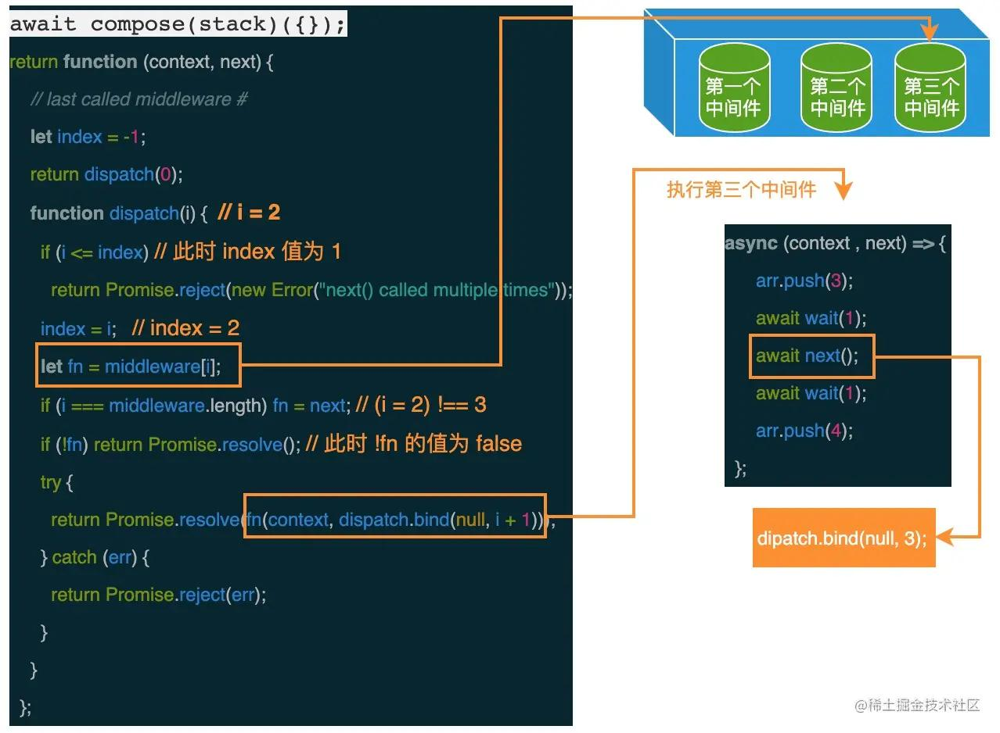
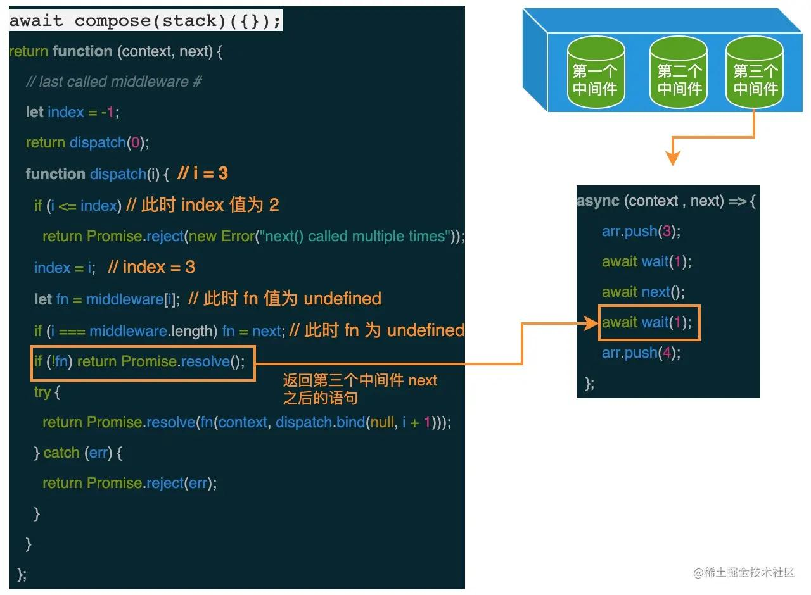

由上图可知，当 middleware 数组中的中间件都开始执行之后，如果调度时未显式地设置 next 参数的值，则会开始返回 next 函数之后的语句继续往下执行。当第三个中间件执行完成后，就会返回第二中间件 next 函数之后的语句继续往下执行，直到所有中间件中定义的语句都执行完成。

> 每个中间件是一个async (ctx, next) => {}, 执行后返回的是一个promise, 第二个参数 next的值为 dispatch.bind(null, i + 1) , 用于传递”中间件“的执行，一个个中间件向里执行，直到最后一个中间件执行完，resolve 掉，它前一个”中间件“接着执行 await next() 后的代码，然后 resolve 掉，在不断向前直到第一个”中间件“ resolve掉，最终使得最外层的promise resolve掉。


## 包管理工具

### 避免某些文件被tree-shaking
“副作用”通常指的是除了导出模块之外，还执行了其他操作（如修改全局变量、添加事件监听器等）的文件。当 Webpack 或其他构建工具进行 tree shaking（消除未使用的代码）时，它们会尝试静态分析代码来确定哪些模块是真正需要的，并排除那些未使用的模块。但是，如果某个模块具有副作用，即使它没有直接导出任何内容或内容没有被明确引用，也可能需要包含在整个构建中。

通过设置 sideEffects 选项，你可以为构建工具提供有关模块是否具有副作用的提示。特别是，当你将 sideEffects 设置为 false 时，你告诉构建工具你的包中的所有文件都没有副作用，除非在 package.json 中明确列出了有副作用的文件。

例如，在 CSS-in-JS 库中，如 styled-components 或 emotion，你可能有一些样式文件或入口点，这些文件直接修改了 DOM 或注册了全局样式，但并没有导出任何可以在 JavaScript 中使用的值。在这种情况下，将这些文件标记为具有副作用是很重要的，以确保它们不会被 tree shaking 掉。

但是，如果你的包中的所有文件都是纯函数式或声明式的，并且没有全局副作用，那么将 sideEffects 设置为 false 可以帮助构建工具更准确地消除未使用的代码，从而减小最终构建的大小。
```json
{  
  "name": "my-package",  
  "sideEffects": ["*.css", "*.scss", "side-effect.js"]  
}
```
在这个例子中，只有以 .css、.scss 结尾的文件和 side-effect.js 文件会被认为具有副作用。其他所有文件都将被视为没有副作用，并可能被 tree shaking 掉。

### npm缓存机制
npm（Node Package Manager）缓存机制在Node.js开发中扮演着重要的角色，其主要目的是提高开发效率和减少网络请求。

#### 优缺点
1. 优点：
	 + 提高开发效率：npm缓存机制可以缓存已经下载的包，当需要再次安装相同的包时，npm会先在缓存中查找是否存在该包。如果存在，npm会直接从缓存中取出使用，而不需要再次从网络上下载。这样可以大大缩短包的下载时间，提高开发效率。
	+ 减少网络传输：通过缓存已经下载的包，npm可以减少不必要的网络传输。在处理大型项目或网络条件较差的情况下，这一优点尤为明显。它可以避免频繁地从网络上下载大量的包数据，减轻网络带宽的压力。
	+ 便于管理：npm缓存机制可以统一管理项目依赖，方便开发者查找和更新依赖包。通过查看缓存中的包信息，开发者可以清晰地了解项目所使用的依赖包及其版本信息。同时，npm也提供了清理缓存的命令（如npm cache clean），方便开发者在需要时清理缓存。
2. 缺点：
	+ 占用磁盘空间：随着安装的包越来越多，npm缓存会占用大量的磁盘空间。这可能会导致磁盘空间不足的问题，尤其是在处理大型项目或频繁安装新包的情况下。
	+ 安全隐患：如果npm缓存被恶意篡改，可能会导致程序运行异常。因为npm缓存中存储的是已经下载的包数据，如果这些数据被恶意修改或替换，那么在安装和使用这些包时可能会出现不可预知的问题。此外，如果开发者在不清除缓存的情况下更新依赖包，也可能会导致版本冲突或依赖关系错误的问题。
	+ **可能导致不一致性**：在某些情况下，npm缓存可能导致依赖关系的不一致性。例如，当开发者在本地环境中使用缓存的包时，如果缓存的版本与远程仓库中的版本不同步，那么可能会导致在部署到生产环境时出现不一致的问题。此外，如果缓存中的数据损坏或丢失，也可能导致依赖关系无法正确解析。

### npm link的应用场景
npm link的应用场景主要包括以下几种情况：
1. 调试本地包：当库包在开发或迭代后，不适合直接发布到线上进行调试（因为过程繁琐且可能导致版本号膨胀）时，可以使用npm link将包放入到node的安装目录下的node_modules文件夹中。这样，就可以直接通过包名在本地进行调试，无需将包发布到线上。
2. 调试项目依赖包：如果需要在项目中调试正在引用的依赖包，但直接在node_modules下面调试不起作用时，可以使用npm link。例如，当某个npm包只有编译后的js文件而没有完整的源码时，无法直接修改。此时，可以使用npm link链接外部的同名包（可以在GitHub等平台上找到源码），以便进行修改和重新编译。
3. 引用本地模块：npm link也可以用于在本地开发目录中创建一个软链接，将其链接到全局安装的模块。这对于开发自己的npm模块或者在复杂项目中引用本地的模块非常有用。例如，如果有两个项目文件，一个是需要被调试的项目，另一个是封装的组件项目，可以使用npm link将组件项目设为全局，然后在调试项目中进行链接和调试。

总的来说，npm link的主要应用场景是方便在本地进行包的调试和引用，特别是在开发和迭代过程中。

先在包中配置
```bash
cd /path/to/your/package  
npm link
```
配置具体哪个项目需要链接
```bash
# <package-name>应该是你在package.json文件中定义的name字段的值。
cd /path/to/your/project  
npm link <package-name>
```

### yarn安装和依赖模块扁平化优势
当 npm 还处在 v3 时期时，一个叫作 Yarn 的包管理方案横空出世。2016 年，npm 还没有 package-lock.json 文件，安装速度很慢，稳定性也较差，而 Yarn 的理念很好地解决了以下问题。

1. 确定性：通过 yarn.lock 等机制，保证了确定性。即不管安装顺序如何，相同的依赖关系在任何机器和环境下，都可以以相同的方式被安装。（在 npm v5 之前，没有 package-lock.json 机制，只有默认并不会使用的npm-shrinkwrap.json。）
2. 采用模块扁平安装模式：将依赖包的不同版本，按照一定策略，归结为单个版本，以避免创建多个副本造成冗余（npm 目前也有相同的优化）。
3. 网络性能更好：Yarn 采用了请求排队的理念，类似并发连接池，能够更好地利用网络资源；同时引入了更好的安装失败时的重试机制。
4. 采用缓存机制，实现了离线模式（npm 目前也有类似实现）。


早期 npm（npm v2）的设计非常简单，在安装依赖时将依赖放到项目的 `node_modules` 文件中；同时如果某个直接依赖 A 还依赖其他模块 B，作为间接依赖，模块 B 将会被下载到 A 的 `node_modules` 文件夹中，依此递归执行，最终形成了一颗巨大的依赖模块树。

这样的 node_modules 结构，的确简单明了、符合预期，但对大型项目在某些方面却不友好，比如可能有很多重复的依赖包，而且会形成**“嵌套地狱”**。

那么如何理解“嵌套地狱”呢？

1. 项目依赖树的层级非常深，不利于调试和排查问题；
2. 依赖树的不同分支里，可能存在同样版本的相同依赖。比如直接依赖 A 和 B，但 A 和 B 都依赖相同版本的模块 C，那么 C 会重复出现在 A 和 B 依赖的 node_modules 中。


这时候，可以明显看到出现了较多重复的依赖模块 B v2.0。我们可以删除 node_modules，重新安装，利用 npm 的依赖分析能力，得到一个更清爽的结构。

实际上，更优雅的方式是使用 **npm dedupe** 命令


实际上，Yarn 在安装依赖时会自动执行 dedupe 命令。整个优化的安装过程，就是扁平化安装模式。

#### 解除项目和模块之间的链接
1. 解除项目和模块之间的链接
```bash
cd /path/to/your/project  
npm unlink <模块名>
```
2. 解除模块的全局链接:如果之前使用 npm link 在模块目录下创建了全局链接，你需要在模块目录下执行 npm unlink 来解除这个全局链接。
```bash
cd /path/to/your/module  
npm unlink
```

### 修改源码方案
1. fork修改

```json
"dependencies": {  
  "echarts": "git+https://git@github.com:your-username/echarts.git#your-branch-name"  
}
```

2. 如果你想在项目中修改xxxECharts如并给它增加功能或重定义某些属性，而不想影响到其他开发者或未来的升级
	+ 继承或扩展 ECharts 类
	+ 使用 ECharts 的 option 进行扩展
	+ 封装 ECharts 组件
	+  patch-package

```js
// 你可以创建一个新的类，继承自 ECharts，然后在这个新类中重写你想要修改的方法或添加新功能。
// 假设你已经通过 npm 或 yarn 安装了 ECharts  
import * as echarts from 'echarts';  
  
// 继承 ECharts 类  
class CustomECharts extends echarts.ECharts {  
    // 重写或添加方法  
    setOption(option, notMerge, lazyUpdate) {  
        // 在这里你可以修改 option 或者添加一些自定义逻辑  
        // 例如，你可以检查 option 并自动添加一些默认值  
  
        // 调用父类的 setOption 方法  
        super.setOption(option, notMerge, lazyUpdate);  
  
        // 可以在这里添加一些额外的逻辑  
    }  
  
    // 也可以添加新的方法  
    customMethod() {  
        // ...  
    }  
}  
  
// 使用你的 CustomECharts 类代替原生的 ECharts  
// 注意：你可能需要稍微修改 ECharts 的初始化逻辑来适配你的 CustomECharts 类  
let myChart = new CustomECharts(document.getElementById('main'));  
myChart.setOption({  
    // ... 你的图表配置  
});  
myChart.customMethod(); // 调用你添加的方法
```

```js
// ECharts 可能提供了一些扩展机制，比如注册自定义组件、自定义系列类型等。
// 你可以利用这些机制来扩展 ECharts 的功能，而不需要直接修改源码。
echarts.registerSeriesType('customSeries', {  
    // ... 实现自定义系列的逻辑  
    // 这里你可以定义如何渲染数据、如何处理交互等  
});  
  
// 在配置中使用自定义系列  
let myChart = echarts.init(document.getElementById('main'));  
myChart.setOption({  
    series: [{  
        type: 'customSeries',  
        // ... 自定义系列的配置  
    }]  
});
```
patch-package
```bash
npm install patch-package --save-dev  
# 或者  
yarn add patch-package --dev
```
安装完 patch-package 后，你可以直接修改 node_modules 中的 npm 包。假设你要修改一个名为 some-package 的包，你可以直接编辑其源码。

当你对 some-package 的源码做了修改并验证了效果后，可以使用 npx 调用 patch-package 来创建一个补丁文件：
```
npx patch-package some-package
```
这将会在项目根目录下创建一个 patches 目录，并在其中生成一个以 some-package 命名的补丁文件，通常这个文件会以 .patch 为后缀。

为了让其他开发者或自动化构建系统能够应用这个补丁，你需要在 package.json 的 scripts 部分添加一个 postinstall 脚本：
```json
"scripts": {  
  "postinstall": "patch-package"  
}
```


## http

### `从输入URL到渲染页面的整个过程`
1. DNS解析：域名=>IP地址
2. 建立TCP连接
3. 浏览器根据IP地址向服务器发起http请求
4. 服务器处理http请求，并将对应资源返回给浏览器
5. 根据HTML代码生成DOM Tree，根据CSS代码生成CSSOM（css对象模型）
6. 将DOM Tree和 CSSOM整合形成Render Tree
7. 根据Render Tree渲染页面
8. 遇到script标签停止渲染，加载并执行js，完成后再继续执行
9. 直至整个Render 渲染完成

### `http状态码`

状态码 |	状态码英文名称|	中文描述
-|-|-
100	|Continue|	继续。客户端应继续其请求
200	|OK	|请求成功。一般用于GET与POST请求
204	|No Content	|无内容。服务器成功处理，但未返回内容。在未更新网页的情况下，可确保浏览器继续显示当前文档
__304__	|Not Modified	| __未修改__ 。所请求的资源未修改，服务器返回此状态码时，不会返回任何资源。客户端通常会缓存访问过的资源，通过提供一个头信息指出客户端希望只返回在指定日期之后修改的资源
__400__|	__Bad Request__	| __客户端请求的语法错误，服务器无法理解__
__401__	| __Unauthorized__	|请求要求用户的身份认证
403	| __Forbidden__	|服务器理解请求客户端的请求，但是拒绝执行此请求
404	|Not Found	|服务器无法根据客户端的请求找到资源（网页）。通过此代码，网站设计人员可设置"您所请求的资源无法找到"的个性页面
405|	Method Not Allowed	|客户端请求中的方法被禁止，可能是请求方法错误
412|-|先决条件错误
__413__	|Request Entity Too Large	|由于请求的实体过大，服务器无法处理，因此拒绝请求。为防止客户端的连续请求，服务器可能会关闭连接。如果只是服务器暂时无法处理，则会包含一个Retry-After的响应信息【后端可配置放大实体】
415	|Unsupported Media Type	|服务器无法处理请求附带的媒体格式
500	|Internal Server Error	|服务器内部错误，无法完成请求
501	|Not Implemented	|服务器不支持请求的功能，无法完成请求
502|	Bad Gateway|	作为网关或者代理工作的服务器尝试执行请求时，从远程服务器接收到了一个无效的响应
504|	Gateway Time-out|	充当网关或代理的服务器，未及时从远端服务器获取请求

### UDP TCP
UDP（`User Datagram Protocol，用户数据报协议`）和TCP（`Transmission Control Protocol，传输控制协议`）是两种在计算机网络中广泛使用的传输层协议，它们各自具有不同的特点和适用场景。

+ UDP 协议是面向无连接的，也就是说不需要在正式传递数据之前先连接起双方。特点：不可靠性但高效，如航空信息应用、直播和视频会议等
+ TCP 一种面向连接的、可靠的、基于字节流的传输层通信协议，为了保证可靠性，速度较慢。TCP适用于那些需要确保数据完整性和顺序性的场景，如文件传输和电子邮件等。

### http1.1 和 http2

从传输方式和效率上看，HTTP/1.1采用报文形式传输，而HTTP/2则采用**二进制格式传输数据**。这种二进制传输方式使得HTTP/2具有更高的解析效率和更少的传输开销。此外，**HTTP/1.1如果想并发多个请求，必须使用多个TCP链接**，这会导致一定的延时和内存消耗。而在HTTP/2中，由于采用了**二进制分帧技术**，同域名下所有通信都在单个连接上完成，单个连接可以承载任意数量的双向数据流。这使得HTTP/2能够**并行交错**地发送多个请求和响应，提高了网络吞吐量和效率。

其次，在协议细节上，HTTP/2使用了HPACK算法对HTTP**头部进行压缩**，减少了头部传输的数据量，从而进一步减少了网络延迟。同时，HTTP/2还支持**服务器推送**，允许服务器在客户端请求之前推送资源，提高了性能。

最后，HTTP/2与HTTP/1.1的兼容性也是两者之间的一个重要区别。HTTP/2可以与HTTP/1.1共存，服务器可以同时支持HTTP/1.1和HTTP/2。如果客户端不支持HTTP/2，服务器可以回退到HTTP/1.1。

总的来说，HTTP/2在多个方面对HTTP/1.1进行了改进和优化，提供了更高的效率、更低的延迟和更好的兼容性。这使得HTTP/2成为现代Web应用中更受欢迎的选择。


### `浏览器缓存`
浏览器缓存（Browser Caching）是为了节约网络资源、加速浏览而设计的一种机制。


#### 强缓存
可以造成强制缓存的字段是 `Cache-control`（推荐） 和 `Expires`(不推荐)。
```js
const express = require('express');  
const app = express();  
const path = require('path');  
const fs = require('fs');  
  
// 设置静态文件目录  
app.use(express.static('public'));  
  
// 为特定路由设置强缓存  
app.get('/cached-resource', (req, res) => {  
  const filePath = path.join(__dirname, 'public', 'cached-resource.txt');  
  const stats = fs.statSync(filePath);  
  const lastModified = stats.mtime.toUTCString(); // 获取文件最后修改时间  
  const maxAge = 60 * 60 * 24 * 7; // 设置缓存有效期为7天  
  
  // 设置强缓存响应头  
  res.setHeader('Cache-Control', `public, max-age=${maxAge}`);  
  res.setHeader('Last-Modified', lastModified);  
  res.sendFile(filePath);  
});  
  
app.listen(3000, () => {  
  console.log('Server is running on port 3000');  
});
```

#### 协商缓存
etag优先级大于lastModified，lastModified最多只能处理秒级的缓存。

+ if-modified-since lastModified 
+ if-none-match etag(更推荐)

```js
const fs = require('fs');  
const crypto = require('crypto');  
const path = require('path');  
const http = require('http');  
  
const server = http.createServer((req, res) => {  
  const filePath = path.join(__dirname, 'path/to/your/file');  
  const stats = fs.statSync(filePath);  
  const lastModified = stats.mtime.toUTCString(); // 获取文件的最后修改时间  
  const fileContent = fs.readFileSync(filePath);  
  const etag = crypto.createHash('md5').update(fileContent).digest('hex'); // 计算文件的ETag  
  
  // 检查If-None-Match请求头  
  if (req.headers['if-none-match'] && req.headers['if-none-match'] === etag) {  
    // 如果ETag匹配，返回304 Not Modified  
    res.writeHead(304, {  
      'ETag': etag,  
      'Last-Modified': lastModified  
    });  
    res.end();  
  } else if (req.headers['if-modified-since'] && req.headers['if-modified-since'] === lastModified) {  
    // 如果Last-Modified匹配，也返回304 Not Modified  
    res.writeHead(304, {  
      'ETag': etag,  
      'Last-Modified': lastModified  
    });  
    res.end();  
  } else {  
    // 如果都不匹配，发送新文件内容，并设置Last-Modified和ETag头  
    res.writeHead(200, {  
      'Content-Type': 'text/plain',  
      'ETag': etag,  
      'Last-Modified': lastModified  
    });  
    res.end(fileContent);  
  }  
});  
  
server.listen(3000);
```

### http头部字段
有 4 种类型的首部字段：通用首部字段、请求首部字段、响应首部字段和实体首部字段。

+ 通用首部字段

+ 请求首部字段


+ 响应首部字段

+ 实体首部字段


1. 请求头信息：
	+ Accept：浏览器告诉服务器所支持的数据类型
	+ Host：浏览器告诉服务器我想访问服务器哪台主机
	+ Referer：浏览器告诉服务器我从哪里来（防盗链）
	+ User-Agent：浏览器类型，版本信息
	+ Date：浏览器告诉服务器访问时间
	+ Connection:连接方式
	+ Cookie
	+ X-Request-With:请求方式
2. 响应头信息
	+ Location：告诉浏览器你要找谁
	+ Server:告诉浏览器服务类型
	+ Content-Type：告诉浏览器返回的数据类型
	+ Refresh:刷新时间

#### if-match的用法

+ If-None-Match 通常用于 GET 请求，以验证客户端缓存的资源是否仍然有效。如果有效，服务器返回 304 状态码，客户端继续使用缓存资源；否则，服务器返回新的资源内容和新的 ETag。
+ If-Match 通常用于 PUT、DELETE 或其他可能修改资源的请求，以确保客户端请求的资源版本与服务器上的版本一致。这有助于防止在并发修改时发生数据冲突。

If-Match 和其他与预条件相关的头部字段在以下场景中特别有用：

+ 防止丢失更新：当多个客户端尝试同时修改同一个资源时，使用 If-Match 可以确保一个客户端不会覆盖另一个客户端的更改。
+ 条件性请求：在某些情况下，客户端可能只想在特定条件下执行请求。例如，只有当资源自上次检索以来未被修改时，才获取该资源的新表示形式。

通过适当使用这些预条件头部字段和处理 412 Precondition Failed 状态码，客户端和服务器可以协同工作，以确保数据的一致性和完整性。

与强缓存和协商缓存不同（浏览器默认操作，前端不需要做操作），这里前端需要主动传递If-Match的值，这个值是某次交互后从后端的response中去获取的。
```js
const axios = require('axios');  
  
// 假设你有一个资源的 URL 和它的当前 ETag  
const resourceUrl = 'http://example.com/some-resource';  

// // 假设你从服务器的响应头中获取了 ETag  
// const etag = response.headers.get('ETag');  
  
// // 将 ETag 保存到 localStorage  
// localStorage.setItem('resource-etag', etag); 

const currentETag = '"current-etag-value"';  
  
// 准备 PUT 请求的数据  
const updateData = {  
  updatedField: 'newValue'  
};  
  
// 发送 PUT 请求，包含 If-Match 头部  
axios({  
  method: 'put',  
  url: resourceUrl,  
  data: updateData,  
  headers: {  
    'Content-Type': 'application/json',  
    'If-Match': currentETag // 设置 If-Match 头部字段  
  }  
})  
.then(response => {  
  // 请求成功，处理响应数据  
  console.log('Resource updated successfully', response.data);  
})  
.catch(error => {  
  if (error.response && error.response.status === 412) {  
    // 收到 412 Precondition Failed 状态码  
    console.error('Precondition Failed: The resource has been modified since last retrieved. Fetch the latest version and try again.');  
      
    // 在这里，你可以重新获取资源的当前状态，并重新尝试更新  
    // 例如，发送一个 GET 请求来获取新的 ETag 和资源状态  
    // 然后根据新的信息重新构造并发送 PUT 请求  
  } else {  
    // 处理其他类型的错误  
    console.error('An error occurred:', error);  
  }  
});
```

### https加密方式和证书
https采用的是：结合`对称加密+非对称加密`这两种方式，可以用非对称加密的方式来传输对称加密过程中的密钥，之后可以采取对称加密的方式来传输数据了。

证书为了避免中间人攻击。


#### 加密算法有哪几种
1. 对称加密算法也叫共享密钥加密算法、单密钥加密算法。采用单密钥的加密方法，同一个密钥可以同时用作信息的加密和解密，即解密算法为加密算法的逆算法。因此在知道了加密算法后也就知道了解密算法。对称加密算法有DES、3DES、AES等。
2. 非对称加密算法又叫公开密钥算法。采用的是公钥和私钥相结合的加密方法。公钥和私钥是两个完全不同的密钥，一个用于加密，一个用于解密。同时这两个密钥在数学上是关联的。即解密算法不是加密算法的逆算法，因此在知道了加密算法后也无法知道解密算法，保证了安全性。有RSA、ECC等。
3. 数字摘要算法又称哈希算法、散列算法，是一种单向算法，它通过对数据内容进行散列得到一个固定长度的密文信息（信息是任意长度，而摘要是定长）。即用户可以通过哈希算法对目标信息生成一段特定长度的唯一的Hash值，却不能通过这个Hash值重新获得目标信息。该算法不可逆。哈希算法有MD5、SHA-1、SHA-256等。

### get post区别
1. get一般获取数据 post提交
2. get放在url，安全性较差，post放在body
3. get缓存，post一般不会
4. get请求会在浏览记录中，post不会
5. post请求支持的content-type很多


## 性能优化


### 为什么css在页面head，js在body尾部
CSS在加载过程中，不影响HTML的解析。但影响HTML渲染。

假如将css放在body的尾部，会产生一种情况。解析html生成DOM树，而后没有css。所以直接生成渲染树，然后生成布局树渲染网页。直到解析到css时，生成CSSOM。CSSOM与DOM树合并生成渲染树，然后再一次生成布局树渲染网页。

这样会渲染树多生成了一次，并且页面也多渲染了一次。造成性能损耗。

JS在加载时，HTML会暂停解析。

如果JS在页面的首部，那么会造成一种情况。长时间加载JS导致HTML无法解析，页面长时间无法响应。所以JS放在body尾部。

或者给JS添加defer/async

defer和async都是异步加载JS的方法：

不同：defer脚本加载完后立即执行。
+ async脚本是html完全解析生成DOM树后立即执行。
+ 如果多个JS脚本添加defer 执行顺序是无序的。而async是按加载顺序执行的。

### 浅谈前端性能优化
优化原则：多使用内存，缓存，减少cpu计算量，减少网络加载耗时【空间换时间】
1. 减少资源体积：代码压缩
2. 减少访问次数：代码合并，SSR服务端渲染（网页和数据一起渲染），缓存【如webpack打包文件对应的名称和hash值没变，会走304】
3. 使用更快的网络：CDN
4. css放在头部，js放在底部
5. 尽早的执行js，用DOMContnetLoaded触发
6. 懒加载
7. 对DOM查询进行缓存
8. 利用fragment文档碎片一次插入多条
9. 节流（拖拽） 防抖（输入框）
10. 根据项目需要，按需加载
11. 动画帧代替定时器动画或者结合动画帧优化定时器动画（使用动画帧切屏浏览器会帮助自动停止动画渲染）

### 长列表虚拟列表

1. 方案1：借助scrollTop + slice + 设置好高度 + startIndex + endIndex 

```html
<template>
  <div>
    <input type="text" v-model.number="dataLength">条
    <div class="virtual-scroller" @scroll="onScroll" :style="{ height: 600 + 'px' }">
      <div class="phantom" :style="{ height: this.dataLength * itemHeight + 'px' }">
        <ul :style="{ 'margin-top': `${scrollTop}px` }">
          <li v-for="item in visibleList" :key="item.brandId"
            :style="{ height: `${itemHeight}px`, 'line-height': `${itemHeight}px` }">
            <div>
              <div>{{ item.name }}</div>
            </div>
          </li>
        </ul>
      </div>
    </div>
  </div>
</template>

<script>
export default {
  name: "vue-virtual-scroller",
  data() {
    return {
      itemHeight: 60,
      dataLength: 500000, // 总数量
      startIndex: 0,
      endIndex: 10,
      scrollTop: 0
    }
  },
  computed: {
    dataList() {
      const newDataList = [...Array(this.dataLength || 0).keys()].map((v, i) => ({
        brandId: i + 1,
        name: `第${i + 1}项`,
        height: this.itemHeight
      }));
      return newDataList
    },
    visibleList() {
      console.log(this.startIndex)
      return this.dataList.slice(this.startIndex, this.endIndex)
    }
  },
  methods: {
    onScroll(e) {
      const scrollTop = e.target.scrollTop
      this.scrollTop = scrollTop
      console.log('scrollTop', scrollTop)
      this.startIndex = Math.floor(scrollTop / this.itemHeight)
      this.endIndex = this.startIndex + 10
    }
  }
}
</script>

<style scoped>
.virtual-scroller {
  border: solid 1px #eee;
  margin-top: 10px;
  height: 600px;
  overflow: auto
}

.phantom {
  overflow: hidden
}

ul {
  background: #ccc;
  list-style: none;
  padding: 0;
  margin: 0;
}

li {
  outline: solid 1px #fff;
}
</style>
```

2.  IntersectionObserver API 交叉视口器

### 重排重绘
**重排一定重绘，重绘不一定重排**

使用transform: translate来移动一个元素时，这个移动是在渲染的后期阶段进行的，具体是在`CSS复合层`（也称为图形层或合成层）上。在这个层上，元素的位置被修改，但这个过程并不会触发文档流的重新计算，也就是不会触发重排（reflow）。

以下是为什么transform: translate不会影响重排的一些关键点：

文档流保持不变：transform: translate只是改变了元素在屏幕上的`最终绘制位置`，而没有改变元素在`文档流中的位置`。文档流是由HTML元素的结构和CSS盒模型属性（如position, display, float, margin, border, padding等）决定的。由于transform属性不改变这些属性，因此文档流保持不变。

使用GPU加速：当元素被赋予transform或某些其他属性（如opacity低于1、filter、will-change等）时，浏览器可能会将其提升到一个独立的复合层上。这个层独立于常规的文档流渲染过程，并由GPU进行加速。由于GPU加速的存在，transform: translate的移动操作可以非常快速且高效地完成，而不需要重新计算整个文档流。

性能优化：通过将需要动画或频繁更新的元素提升到`复合层上`，浏览器可以避免对这些元素进行昂贵的重排和重绘操作。这可以`显著提高页面的滚动、动画和交互性能`。


## 数据结构

+ 栈：先进后出，js中没有栈这个数据结构，不过Array可以实现栈的所有功能。
+ 队列：先进先出，js中没有队列这个数据结构，不过Array可以实现栈的所有功能。


+ 链表：多个数据的集合的列表，js没链表结构，可以利用object实现


```js
let a ={val:'a'}
let b ={val:'b'}
let c ={val:'c'}
let d ={val:'d'}

a.next = b 
b.next = c
c.next = d
// 遍历列表
let p = a
while(p){
	console.log(p)
	p=p.next
}
// 添加元素
let e ={val:'e'}
b.next = e
e.next = c
console.log(a)

// 删除元素
c.next = null
console.log(a)
```

+ 集合：一种无需且唯一的数据结构，Set就是集合。常用于去重/交集/元素是否存在
+ 字典：是一种存储唯一值的数据结构，但是它以`键值对`的形式来存储，ES6中的Map就是字典
+ 图：**网络结构的抽象模型，是一组有 **边** 连接的 **节点**，可用Object和Array来实现


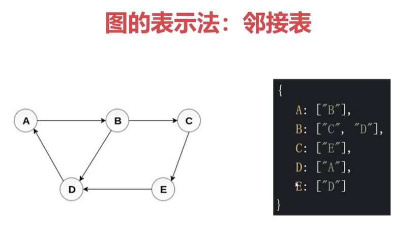


+ 树：一种分层的数据抽象模型，如DOM树，级联菜单，树型控件，JS中没有树的结构，不过可以用Object和Array来实现

### `树的遍历`
1. 深度优先遍历
2. 广度优先遍历


```js
let  tree= {
	name:"a",
	children:[
		{
			name:"b",
			children:[
				{
					name:"d",
					children:[
						{
							name:'h'
						}
					]
				},
				{
					name:"e"
				}
			]
		},
		{
			name:"c",
			children:[
				{
					name:"f"
				},
				{
					name:"g"
				}
			]
		}
	]
}

//深度
function dfs(tree){
	const root =tree.name
	console.log(root)
	tree?.children?.forEach(dfs)
}
// dfs(tree)

// 广度 需要一个队列
function bfs(tree){
	const q = [tree]
	while(q.length){
		const n = q.shift()
		console.warn(n.name)
		n?.children?.forEach((el)=>{
			q.push(el)
		})
	}
}

bfs(tree)
```

### 二叉树先中后序遍历


```js
const bs = {
	val:1,
	left:{
		val:2,
		left:{
			val:4,
			left:null,
			right:null
		},
		right:{
			val:5,
			left:null,
			right:null
		}
	},
	right:{
		val:3,
		left:{
			val:6,
			left:null,
			right:null
		},
		right:{
			val:7,
			left:null,
			right:null
		}
	}
}
function left(bs){
	console.log(bs?.val)
	if(bs.left)left(bs.left)
	if(bs.right)left(bs.right)
}
left(bs)
// 1 2 4 5 3 6 7
```
```
   1
 2   3
4 5 6 7
```
```js
// 中序遍历
function inorder(root){
	if(!root) return
	inorder(root.left)
	console.log(root.val)
	inorder(root.right)
}
inorder(bs)// 4 2 5 1 6 3 7
```
```js
function postorder(root){
	if(!root) return
	postorder(root.left)
	postorder(root.right)
	console.log(root.val)
}
postorder(bs)// 4 5 2 6 7 3 1
```

#### 非递归实现先中后序遍历
先序遍历
```js
function preorder(root){
	if(!root) return 
	const stack = [root]
	while(stack.length){
		const data= stack.pop()
		console.log(data.val)
		data.right && stack.push(data.right)
		data.left && stack.push(data.left)
	}
}
preorder(bs)
```
```
   1
 2   3
4 5 6 7
```
中序遍历
```js
function inorder(root){
	if(!root) return
	const stack = []
	let p = root
	while(stack.length || p){
		while(p){ 
			stack.push(p)
			p = p.left
		}
		const n = stack.pop()
		console.log(n.val)
		p =n.right
	}
}
inorder(bs) //4 2 5 1 6 3 7
```
后序遍历
```js
function postorder(root){
	if(!root) return
	const stack = [root]
	const nextStack = []
	while(stack.length){
		const data= stack.pop()
		nextStack.push(data)
		data.left && stack.push(data.left)
		data.right && stack.push(data.right)
	}
	while(nextStack.length){
		const n =nextStack.pop()
		console.log(n.val)
	}
}
postorder(bs)// 4 5 2 6 7 3 1
```

### 把一个数组改成一个单向链表
```js
export function createLinkList(arr: number[]): ILinkListNode {
    const length = arr.length
    if (length === 0) throw new Error('arr is empty')

    let curNode: ILinkListNode = {
        value: arr[length - 1]
    }
    if (length === 1) return curNode

    for (let i = length - 2; i >= 0; i--) {
        curNode = {
            value: arr[i],
            next: curNode
        }
    }
    return curNode
}
```

### 堆和二叉树的关系
堆是一个完全二叉树，堆在逻辑结构上是一颗二叉树，在物理结构上是个数组


堆的使用场景：堆的数据，都是在栈中引用的，不需想BST要从root遍历，堆恰巧是数组形式，根据栈的地址，可用O(1)找到目标。

### 两个数组选找交集
```js
/**
 * @param {number[]} nums1
 * @param {number[]} nums2
 * @return {number[]}
 */

// 利用集合实现
var intersection = function(nums1, nums2) {
    return [... new Set(nums1.filter(item => nums2.includes(item)))]
};

// 利用字典实现
var intersection = function(nums1, nums2) {
  const map1= new Map()
    const arr = []
    nums1.forEach(el=>{
        map1.set(el,el)
    })
    nums2.forEach((el)=>{
        if(map1.has(el)){
            arr.push(el)
            map1.delete(el)
        }
    })
    return arr 
};
```

### 两数之和
给定一个整数数组 nums 和一个整数目标值 target，请你在该数组中找出 和为目标值 target  的那 两个 整数，并返回它们的数组下标。

你可以假设每种输入只会对应一个答案。但是，数组中同一个元素在答案里不能重复出现。
```
输入：nums = [2,7,11,15], target = 9
输出：[0,1]
解释：因为 nums[0] + nums[1] == 9 ，返回 [0, 1] 。
```
```js
/**
 * @param {number[]} nums
 * @param {number} target
 * @return {number[]}
 */
var twoSum = function(nums, target) {
    let map =new Map()
    map.set(nums[0],0)
    let len =nums.length
    for(let i=1;i<len;i++){
        const tem = target - nums[i]
        if(map.has(tem)){
            return [map.get(tem),i]
        }else{
            map.set(nums[i],i)
        }
    }
};
```

### 获取不重复最长子串长度

```js
 let lengthOfLongestSubstring = function (s) {
		let minIndex = 0
		let count = 0
		for (let i = 0; i < s.length; i++) {
			//indexOf方法返回的是元素第一次出现的索引
			if (s.indexOf(s[i], minIndex) < i) {
				// 如果遇到重复的字符，会进入判断
				minIndex = s.indexOf(s[i], minIndex) + 1
				// 令索引从下一位开始查找，判断接下来的字符串是否与之前一样
			}
			else {
				// 获得最长字符串的长度
				// 比如'ababc' , minIndex = 2 , i = 4 , count = 2
				count = Math.max(count , i - minIndex + 1)
			}
		}

		return count
	}
console.log(lengthOfLongestSubstring('ababc')) 
```

双指针滑动窗口
```js
function lengthOfLongestSubstring(s){
    let l=0;//左指针
    let res=0;
    let map=new Map();// 存储信息
    for(let r=0;r<s.length;r++){//r右指针
        if(map.has(s[r])&&map.get(s[r])>=l){//存在映射且在窗口范围内
            l=map.get(s[r])+1;
        }
        //console.log(s.slice(l,r+1))
        res=Math.max(res,r-l+1);
        map.set(s[r],r);
        //console.log("map",map)
    }
    return res;
}

console.log(lengthOfLongestSubstring("abbcdea"))
```

### 最小覆盖子串(滑动窗口解法)
```js
/**
 * @param {string} s
 * @param {string} t
 * @return {string}
 */
var minWindow = function (s, t) {
  let l = 0;
  let r = 0;
  let res = "";
  const m = new Map();
  for (let i = 0; i < t.length; i++) {
    const c = t[i];
    // 放入字典表
    m.set(c, m.has(c) ? m.get(c) + 1 : 1);
  }
  let needType = m.size;
  while (r < s.length) {
    const c = s[r];
    if (m.has(c)) {
      m.set(c, m.get(c) - 1);
      if (m.get(c) === 0) needType -= 1;
    }
    while (needType === 0) {
      const c2 = s[l];
      let newRes = s.slice(l, r + 1);
      if (!res || newRes.length < res.length) res = newRes;
      if (m.has(c2)) {
        m.set(c2, m.get(c2) + 1);
        if (m.get(c2) === 1) needType += 1;
      }
      l++;
    }
    r++;
  }
  return res;
};
```
  


## 算法
算法（Algorithm）是指解题方案的准确而完整的描述，是一系列解决问题的清晰指令，算法代表着用系统的方法描述解决问题的策略机制

### 复杂度
程序执行时需要的计算量和内存空间（和代码是否简洁无关），复杂度是个数量级，不是具体的数字
+ 时间复杂度：程序执行是所需要的计算量（CPU）
+ 空间复杂度：程序执行时需要的内存空间

前端重时间轻空间


+ O(1):一次结束 如obj.key
+ O(n):for循环
+ O(n^2):for循环嵌套
+ O(logn):数量级的对数，如二分法
+ O(nlogn):for循环嵌套二分法


### 递归
递归（Recursion）是计算机科学中的一个重要概念，它指的是一个函数或过程直接或间接地调用自身来解决问题。递归算法通过将问题分解为更小的子问题，并递归地解决这些子问题，最终将子问题的解组合起来形成原问题的解。

#### 递归和尾递归
尾递归：在尾部调用的是函数自身，可通过优化，使得计算仅占用常量栈空间
```js
// 复杂度：O(n) 在递归调用的过程当中系统为每一层的返回点，局部量等开辟栈来存储
// 递归次数多了容易栈溢出
function factorial(n) {
 if (n === 1) return 1;
 return n * factorial(n - 1);
}
factorial(5) // 120
```
```js
// 复杂度：O(1)
function factorial(n, total) {
 if (n === 1) return total;
 return factorial(n - 1, n * total);
}
factorial(5, 1) // 120
```

### 二分查找
二分查找算法，也称折半搜索算法，是一种在有序数组中查找某一特定元素的搜索算法


```js
function BinarySearch(arr, target) {
    if (arr.length <= 1) return -1
    // 低位下标
    let lowIndex = 0
    // 高位下标
    let highIndex = arr.length - 1

    while (lowIndex <= highIndex) {
        // 中间下标
        const midIndex = Math.floor((lowIndex + highIndex) / 2)
        if (target < arr[midIndex]) {
            highIndex = midIndex - 1
        } else if (target > arr[midIndex]) {
            lowIndex = midIndex + 1
        } else {
            // target === arr[midIndex]
            return midIndex
        }
    }
    return -1
}
```

二分查找法的O(logn)让它成为十分高效的算法。不过它的缺陷却也是比较明显，就在它的限定之上：

+ 有序：我们很难保证我们的数组都是有序的
+ 数组：数组读取效率是O(1)，可是它的插入和删除某个元素的效率却是O(n)，并且数组的存储是需要连续的内存空间，不适合大数据的情况

关于二分查找的应用场景，主要如下：
+ 不适合数据量太小的数列；数列太小，直接顺序遍历说不定更快，也更简单
+ 每次元素与元素的比较是比较耗时的，这个比较操作耗时占整个遍历算法时间的大部分，那么使用二分查找就能有效减少元素比较的次数
+ 不适合数据量太大的数列，二分查找作用的数据结构是顺序表，也就是数组，数组是需要连续的内存空间的，系统并不一定有这么大的连续内存空间可以使用


### 将一个数组旋转k步
输入一个数组[1,2,3,4,5,6,7] k=3,即旋转3步 输出[5,6,7,1,2,3,4]

思路1：将数组尾部的元素 pop，然后 unshift 到头部

思路2：将数组拆分成两段，然后通过 concat 拼接在一起

思路1，时间复杂度最坏的情况 O(n^2)，空间复杂度O(1)【unshift把最后一位提到第一位的话，会造成一次for循环的代价】

思路2，时间复杂度为 O(1)，空间复杂度O(n)
```js
/**
 * 旋转数组 k 步 - 使用 pop 和 unshift
 * @param arr arr
 * @param k k
 * @returns arr
 */
export function rotate1(arr: number[], k: number): number[] {
    const length = arr.length
    if (!k || length === 0) return arr
    const step = Math.abs(k % length) // abs 取绝对值

    // O(n^2)
    for (let i = 0; i < step; i++) {
        const n = arr.pop()
        if (n != null) {
            arr.unshift(n) 
// 数组是一个有序结构，unshift 操作非常慢！！！ O(n)
        }
    }
    return arr
}
```
```js
/**
 * 旋转数组 k 步 - 使用 concat
 * @param arr arr
 * @param k k
*/
 export function rotate2(arr: number[], k: number): number[] {
    const length = arr.length
    if (!k || length === 0) return arr
    const step = Math.abs(k % length) // abs 取绝对值

    // O(1)
    const part1 = arr.slice(-step) // O(1)
    const part2 = arr.slice(0, length - step)
    const part3 = part1.concat(part2)
    return part3
}
```

### 判断字符串括号匹配
一个字符串s可能包括{}() [] 三种括号判断s是否是括号匹配的如(a{b}c)匹配， 而{a(b 或 {a(b}c}就不匹配
思路：遇到左括号就压栈 ，压栈的意思就是把括号push到数组的操作，这就叫压栈或者进栈；遇到右括号就判断栈顶，匹配则出栈；最后判断length是否为0。

**栈：先进后出**


时间复杂度O（n）,空间复杂度O（n）
```js
function matchBracket (str: string): boolean {
  const len = str.length
  if (len === 0) return true;

  const leftBracket = '({['
  const rightBracket = ')}]'
  const stack = []
for ( let i = 0; i < len; i++) {
const s = str[i]
// includes遍历本来也是O(n),但是它遍历的不是该字符串而且是个很短的固定值所以忽略不计
    if (leftBracket.includes(s)) {
      // 左括号压栈 
	   // 空间复杂度O(n),虽然长度不如字符串
      stack.push(s)
    } else if (rightBracket.includes(s)) {
      // 获取左括号的栈顶元素
      const top = stack[stack.length -1]
      if (
        (top === '(' && s === ')') ||
        (top === '{' && s === '}') || 
        (top === '[' && s === ']')
      ) {
        // 右括号出栈
        stack.pop()
      } else {
        // 不成对匹配，匹配失败
        return false;
      }
    }
  }
  return stack.length === 0
}
```
```js
// 利用字典去实现
const map = new Map()
map.set("(",")")
map.set("[","]")
map.set("{","}")

if(map.has(s))...

if(map.get(top) === s)...
```

### 最近的请求次数
写一个 RecentCounter 类来计算特定时间范围内最近的请求。

```
输入：
["RecentCounter", "ping", "ping", "ping", "ping"]
[[], [1], [100], [3001], [3002]]
输出：
[null, 1, 2, 3, 3]
```

队列的应用
```js
var RecentCounter = function() {
    this.q =[]
};

/** 
 * @param {number} t
 * @return {number}
 */
RecentCounter.prototype.ping = function(t) {
    this.q.push(t)
    while(this.q[0]<t-3000){
        this.q.shift()
    }
    return this.q.length
}
```

### 链表删除某一项（非最后一项）
```js
/**
 * Definition for singly-linked list.
 * function ListNode(val) {
 *     this.val = val;
 *     this.next = null;
 * }
 */
/**
 * @param {ListNode} node
 * @return {void} Do not return anything, modify node in-place instead.
 */
var deleteNode = function(node) {
    node.val =node.next.val
    node.next =node.next.next
};
```

### 反转链表


递归实现
```js
function ListNode(val, next) {
        this.val = (val===undefined ? 0 : val)
        this.next = (next===undefined ? null : next)
     }
/**
 * @param {ListNode} head
 * @return {ListNode}
 */
var reverseList = function(head){
    // 只存在一个头节点返回本身
    if(head == null || head.next == null){
        return head;
    }
    // 进行反转
    // 递归实现
    var res = reverseList(head.next);
    head.next.next = head;
    head.next = null;
    return res;
}
```
迭代实现
```js
var reverseList = function(head) {
    // 使用迭代实现
    let prev = null;
    let curr = head;
    while(curr){
    const next = curr.next;
    curr.next = prev;
    prev = curr;
    curr = next;
    }
    return prev
};
```


next：调整头节点的下一节点之前，先记录其先前的下一节点（next = head->next），以防止链表断开后找不到其之前的下一节点


头节点断开与其下一节点的连接（head->next = pre），并反转（指向 NULL）


不断遍历，直到头节点指向链表的尾节点的下一节点（空节点）pre = head


head 右移，head = next


next 指向当前head的下一节点


head 指向 pre 指向的节点，实现 1->2 之间反转


以此类推......

### 链表相加案例
给你两个 非空 的链表，表示两个非负的整数。它们每位数字都是按照 逆序 的方式存储的，并且每个节点只能存储 一位 数字。

请你将两个数相加，并以相同形式返回一个表示和的链表。

你可以假设除了数字 0 之外，这两个数都不会以 0 开头。
```
输入：l1 = [2,4,3], l2 = [5,6,4]
输出：[7,0,8]
解释：342 + 465 = 807.
```


```js
	/**
	 * Definition for singly-linked list.
	 * function ListNode(val, next) {
	 *     this.val = (val===undefined ? 0 : val)
	 *     this.next = (next===undefined ? null : next)
	 * }
	 */
	/**
	 * @param {ListNode} l1
	 * @param {ListNode} l2
	 * @return {ListNode}
	 */
	
	function ListNode(val, next) {
	    this.val = (val===undefined ? 0 : val)
	     this.next = (next===undefined ? null : next)
	}
	
	let a1 ={val:2}
	let a2 ={val:4}
	let a3 ={val:3}
	a1.next=a2
	a2.next=a3
	
	let b1 ={val:5}
	let b2 ={val:6}
	let b3 ={val:4}
	b1.next=b2
	b2.next=b3
	
	let l1 =a1 
	let l2 =b1
	
	var addTwoNumbers = function(l1, l2) {
	    let l3 = new ListNode(0)
	    let p1 = l1
	    let p2 = l2
	    let p3 = l3
	    let curry = 0 
	    while(p1 || p2){
	        let v1 = p1?.val ?? 0 
	        let v2 = p2?.val ?? 0
	        let val = v1+v2+curry
	        curry = Math.floor(val/10)
	        p3.next = new ListNode(val%10)
	        if(p1) p1 = p1.next
	        if(p2) p2 = p2.next
	        p3 =p3.next
	    }
	    if(curry){
	       p3.next = new ListNode(curry) 
	    }
		console.warn(l3)
	    return l3.next
	};
	addTwoNumbers(l1,l2)
```

### 删除排序链表中的重复元素
```js
/**
 * Definition for singly-linked list.
 * function ListNode(val, next) {
 *     this.val = (val===undefined ? 0 : val)
 *     this.next = (next===undefined ? null : next)
 * }
 */
/**
 * @param {ListNode} head
 * @return {ListNode}
 */
var deleteDuplicates = function(head) {
    let p = head
    while (p && p.next) {
    	// 只有当前节点的值和下个节点的值不相同，才移动指针
        if(p.val === p.next.val){
            p.next = p.next.next
        }else{
            p = p.next
        }       
    }
    return head
};
```

### `环形链表判断`


> 普通哈希表算法：存储每个数据，直到next是null，如果对比没有重复，即为不环，有的话就是环形链表

> Floyd的循环检测算法（也被称为“龟兔赛跑”算法）是一种用于检测链表中是否存在环的算法。该算法使用了两个指针，一个快指针（通常称为“兔子”）和一个慢指针（通常称为“乌龟”），它们以不同的速度遍历链表。


1. slow 指针每次移动一个节点。
2. fast 指针每次移动两个节点。
3. 检查 fast 和 fast.next 是否为 null（或在某些语言中为 None），如果是，则链表中不存在环，算法结束。
4. 检查 slow 和 fast 是否相等，如果相等，则链表中存在环，算法结束。

```js
function ListNode(val) {
  this.val = val;
  this.next = null;
}
function hasCycle(head) {
  if (head === null || head.next === null) {
    return false;
  }
  let slow = head;
  let fast = head.next;
  while (slow !== fast) {
    if (fast === null || fast.next === null) {
      return false;
    }
    slow = slow.next;
    fast = fast.next.next;
  }
  return true;
}
```

### 二叉树的最大深度
给定一个二叉树 root ，返回其最大深度。

二叉树的 最大深度 是指从根节点到最远叶子节点的最长路径上的节点数。


深度优先
```js
/**
 * Definition for a binary tree node.
 * function TreeNode(val, left, right) {
 *     this.val = (val===undefined ? 0 : val)
 *     this.left = (left===undefined ? null : left)
 *     this.right = (right===undefined ? null : right)
 * }
 */
/**
 * @param {TreeNode} root
 * @return {number}
 */
var maxDepth = function(root) {
   let res =0 
   const dfs = (n,l) =>{
    if(!n) return 
	// 检查当前节点 n 是否没有左子节点（!n.left）且没有右子节点（!n.right）。
	// 换句话说，它检查当前节点 n 是否是一个叶子节点（即没有子节点的节点）。
    if(!n.left && !n.right){
        res = Math.max(res , l)
    }
    dfs(n.left,l+1)
    dfs(n.right,l+1)
   }
   dfs(root,1)
   return res
};
```

### 二叉树的最小深度
广度优先
```js
/**
 * Definition for a binary tree node.
 * function TreeNode(val, left, right) {
 *     this.val = (val===undefined ? 0 : val)
 *     this.left = (left===undefined ? null : left)
 *     this.right = (right===undefined ? null : right)
 * }
 */
/**
 * @param {TreeNode} root
 * @return {number}
 */
var minDepth = function(root) {
   if(!root) return 0 
   const q =[[root,1]]
   while(q.length){
    const [n,l] = q.shift()
    if(!n.left && !n.right){
        return l
    }
    if(n.left) q.push([n.left,l+1])
    if(n.right) q.push([n.right,l+1])
   }
};
```

### 二叉树层序遍历
给你二叉树的根节点 root ，返回其节点值的 层序遍历 。 （即逐层地，从左到右访问所有节点）。


输入：root = [3,9,20,null,null,15,7]

输出：[[3],[9,20],[15,7]]
 


### 二叉树的中序遍历


```
输入：root = [1,null,2,3]
输出：[1,3,2]
```

```js
/**
 * Definition for a binary tree node.
 * function TreeNode(val, left, right) {
 *     this.val = (val===undefined ? 0 : val)
 *     this.left = (left===undefined ? null : left)
 *     this.right = (right===undefined ? null : right)
 * }
 */
/**
 * @param {TreeNode} root
 * @return {number[]}
 */
var inorderTraversal = function(root) {
    const arr = []
    const fun = function(tree){
        if(!tree) return []
        if(tree.left) fun(tree.left)
        arr.push(tree.val)
        if(tree.right) fun(tree.right)
    }
    fun(root)
    return arr
};
```


### 路径之和


## write

### 封装一个通用的事件监听函数
+ 事件代理原理：**事件冒泡**
+ **Element.matches()**：如果元素被指定的选择器字符串选择，Element.matches() 方法返回 true; 否则返回 false。(API可能存在兼容问题)

```js
function bindEvent(elem, type, selector, fn) {
    if (fn == null) {
        fn = selector
        selector = null
    }
    elem.addEventListener(type, event => {
        const target = event.target        
        if (selector) {
            // 代理绑定
            if (target.matches(selector)) {
                fn.call(target, event)
            }
        } else {
            // 普通绑定
            fn.call(target, event)
        }
    })
}

// 普通绑定
const btn1 = document.getElementById('btn1')
bindEvent(btn1, 'click', function (event) {
    // console.log(event.target) // 获取触发的元素
    event.preventDefault() // 阻止默认行为
    alert(this.innerHTML)
})

// 代理绑定
const div3 = document.getElementById('div3')
bindEvent(div3, 'click', 'a', function (event) {
    event.preventDefault()
    alert(this.innerHTML)
})
```

### 封装一个ajax函数
```js
function ajax(url) {
    const p = new Promise((resolve, reject) => {
        const xhr = new XMLHttpRequest()
        xhr.open('GET', url, true)
        xhr.onreadystatechange = function () {
            if (xhr.readyState === 4) {
                if (xhr.status === 200) {
                    resolve(
                        JSON.parse(xhr.responseText)
                    )
                } else if (xhr.status === 404 || xhr.status === 500) {
                    reject(new Error('404 not found'))
                }
            }
        }
        xhr.send(null)
    })
    return p
}

const url = '/data/test.json'
ajax(url)
.then(res => console.log(res))
.catch(err => console.error(err))
```

### 手写instanceOf
原理：查找原型链
```js
function myInstanceOf(current, fun) {  
	// 检查 current 是否为 null 或 undefined  
	if (current === null || current === undefined) {  
		return false;  
	}  
	  
	// 检查 fun 是否是函数并且拥有 prototype 属性  
	if (typeof fun !== 'function' || fun.prototype === undefined) {  
		return false;  
	}  
	  
	// 遍历原型链  
	while (true) {  
		// 如果找到匹配的原型，则返回 true  
		if (Object.getPrototypeOf(current) === fun.prototype) {  
			return true;  
		}  
		  
		// 如果到达原型链的顶端（null），则返回 false  
		current = Object.getPrototypeOf(current);  
		if (current === null) {  
			return false;  
		}  
	}  
}
console.warn(myInstanceOf([],Array))//true
console.warn(myInstanceOf([],Object))//true
console.warn(myInstanceOf([],null))//false
console.warn(myInstanceOf('',String))//true 可考虑再增加current是否是对象的判断

console.warn('' instanceof String)//false
```

### 手写new操作符
原理：绑定原型链 + 显式绑定this + 返回判断
```js
function mynew(func, ...args) {
 const obj = {}
 obj.__proto__ = func.prototype
 let result = func.apply(obj, args)
 return result instanceof Object ? result : obj
}
function Person(name, age) {
 this.name = name;
 this.age = age;
}
Person.prototype.say = function () {
 console.log(this.name)
}
let p = mynew(Person, "huihui", 123)
console.log(p) // Person {name: "huihui", age: 123}
p.say() // huihui
```

### 手写call apply bind
原理：借，对目标对象添加上函数方法，再删除
```js
Function.prototype.myCall = function(context) {
		  console.log(this) //fn a()
		  if (typeof this !== 'function') {
			throw new TypeError('Error')
		  }
		  context = context || window
		  console.log(context)//obj
		  context.fn = this
		  console.log(typeof context.fn)//function
		  
		  const args = [...arguments].slice(1)
		  console.log(args)
		  //通过隐式绑定的方式调用函数
		  const result = context.fn(...args)
		   //删除添加的属性
		  delete context.fn
		   //返回函数调用的返回值
		  return result
}

let obj ={
	name:333
}

function a(){
	console.log(this.name)
}
a.myCall(obj)

```

注意bind的用法，bind可以`分批添加参数`，所以需要拼接，而且bind返回的是函数，考虑`兼容new`的情形。
```js
Function.prototype.myBind = function(context, ...args) {  
	  const originalFunction = this;  
	  
	  // 返回一个新函数  
	  return function F(...boundArgs) {  
	    // 如果通过 new 调用，则忽略 context，使用新创建的实例  
	    if (this instanceof F) {  
	      // 相当于执行 new originalFunction(...args, ...boundArgs)  
	      return new originalFunction(...args, ...boundArgs);  
	    }  
	  
	    // 否则，使用提供的 context 和合并的参数调用原函数  
	    return originalFunction.apply(context, args.concat(boundArgs));  
	  };  
	};  
	  
	// 使用示例  
	function MyConstructor(a, b) {  
	  this.a = a;  
	  this.b = b;  
	}  
	  
	MyConstructor.prototype.getValue = function() {  
	  return this.a + this.b;  
	};  
	  
	const boundConstructor = MyConstructor.myBind(null, 1);  
	  
	// 使用 new 调用 boundConstructor  
	const instance = new boundConstructor(2);  
	console.log(instance.getValue()); // 输出 3  
	  
	// 普通函数调用  
	const result = boundConstructor(3);  
	console.log(result); // 输出 MyConstructor 的返回值，如果没有显式返回，则为 undefined
```

### 手写防抖节流
原理：借助`闭包`或者全局变量对时间的把握
```html
<html>
<style>
	#test{
		width:400px;
		height:400px;
		border:1px solid red
	}
</style>
<body class="m-2">
	<div id="test">1111</div>
	<div id="test">1111</div>
	<div id="test">1111</div>
	<div id="test">1111</div>
	<div id="test">1111</div>
	<div id="test">1111</div>
	<div id="test">1111</div>
	<div id="test">1111</div>
  <script>
		function throttle(fn, delay) {
		  // last为上一次触发回调的时间, timer是定时器
		  let last = 0, timer = null
		  return function () { 
		    // 保留调用时的this上下文
		    let context = this
		    // 保留调用时传入的参数
		    let args = arguments
		    // 记录本次触发回调的时间
		    let now = +new Date()
		
		    // 判断上次触发的时间和本次触发的时间差是否小于时间间隔的阈值
		    if (now - last < delay) {
		    // 如果时间间隔小于我们设定的时间间隔阈值，则为本次触发操作设立一个新的定时器
		       clearTimeout(timer)
		       timer = setTimeout(function () {
		          last = now
		          fn.apply(context, args)
		        }, delay)
		    } else {
		        // 如果时间间隔超出了我们设定的时间间隔阈值，那就不等了，无论如何要反馈给用户一次响应
		        last = now
		        fn.apply(context, args)
		    }
		  }
		}
		// 用新的throttle包装scroll的回调
		const better_scroll = throttle(() => console.log('触发了滚动事件'), 1000)
		
		document.addEventListener('scroll', better_scroll)
  </script>
</body>

</html>
```

### `手写深拷贝`
原理：遍历属性，遇到对象数组`递归`
```js
//定义检测数据类型的功能函数
function checkedType(target) {
  return Object.prototype.toString.call(target).slice(8, -1)
}
//实现深度克隆---对象/数组
function clone(target) {
  //判断拷贝的数据类型
  //初始化变量result 成为最终克隆的数据
  let result,
    targetType = checkedType(target)
  if (targetType === 'Object') {
    result = {}
  } else if (targetType === 'Array') {
    result = []
  } else {
    return target
  }
  //遍历目标数据
  for (let i in target) {
    //获取遍历数据结构的每一项值。
    let value = target[i]
    //判断目标结构里的每一值是否存在对象/数组
    if (checkedType(value) === 'Object' || checkedType(value) === 'Array') {
      //对象/数组里嵌套了对象/数组
      //继续遍历获取到value值
      result[i] = clone(value)
    } else {
      //获取到value值是基本的数据类型或者是函数。
      result[i] = value
    }
  }
  return result
}
```


### 手写Object.create
```js
function object(o) {
　　function F() {}
　　F.prototype = o;
　　return new F();
}
```

### 手写简单axios
```js
class Axios {
    constructor() {

    }

    request(config) {
        return new Promise(resolve => {
            const {url = '', method = 'get', data = {}} = config;
            // 发送ajax请求
            const xhr = new XMLHttpRequest();
            xhr.open(method, url, true);
            xhr.onload = function() {
                console.log(xhr.responseText)
                resolve(xhr.responseText);
            }
            xhr.send(data);
        })
    }
}
```
```js
// 最终导出axios的方法，即实例的request方法
function CreateAxiosFn() {
    let axios = new Axios();
    let req = axios.request.bind(axios);
    return req;
}

// 得到最后的全局变量axios
let axios = CreateAxiosFn();
```

### 手写router

```js
// 定义 Router   hash路由
class Router {  
    constructor () {  
        this.routes = {}; // 存放路由path及callback  
        this.currentUrl = '';  
          
        // 监听路由change调用相对应的路由回调  
        window.addEventListener('load', this.refresh, false);  
        window.addEventListener('hashchange', this.refresh, false);  
    }  
      
    route(path, callback){  
        this.routes[path] = callback;  
    }  
      
    push(path) {  
        this.routes[path] && this.routes[path]()  
    }  
}  
  
// 使用 router  
window.miniRouter = new Router();  
miniRouter.route('/', () => console.log('page1'))  
miniRouter.route('/page2', () => console.log('page2'))  
  
miniRouter.push('/') // page1  
miniRouter.push('/page2') // page2  
```

+ history.pushState 浏览器历史纪录添加记录
+ history.replaceState修改浏览器历史纪录中当前纪录
+ history.popState 当 history 发生变化时触发

```js
// 定义 Router  
class Router {  
    constructor () {  
        this.routes = {};  
        this.listerPopState()  
    }  
      
    init(path) {  
        history.replaceState({path: path}, null, path);  
        this.routes[path] && this.routes[path]();  
    }  
      
    route(path, callback){  
        this.routes[path] = callback;  
    }  
      
    push(path) {  
        history.pushState({path: path}, null, path);  
        this.routes[path] && this.routes[path]();  
    }  
      
    listerPopState () {  
        window.addEventListener('popstate' , e => {  
            const path = e.state && e.state.path;  
            this.routers[path] && this.routers[path]()  
        })  
    }  
}  
  
// 使用 Router  
  
window.miniRouter = new Router();  
miniRouter.route('/', ()=> console.log('page1'))  
miniRouter.route('/page2', ()=> console.log('page2'))  
  
// 跳转  
miniRouter.push('/page2')  // page2  
```

### 统一封装axios的思量
请求库的功能设计和抽象粒度尤为重要,需要考虑以下功能点：
1. 自定义 headers 添加
2. 统一断网/弱网处理
3. 接口缓存处理
4. 接口统一错误提示
5. 接口统一数据处理
6. 统一数据层结合
7. 统一请求埋点


合理的设计是，底层部分保留对全局封装的影响范围，而项目层保留对页面层的影响能力，页面层保留对组件层的影响能力。

比如，在项目层提供一个基础请求库封装，在这一层可以提供默认发送 cookie 等（一定需要存在）的行为，同时通过配置 options.fetch 保留覆盖 globalThis.fetch 的能力，这样可以在 Node 等环境中，通过注入一个 node-fetch npm 库的方式，支持 SSR 能力。

这里需要注意的是，一定要避免设计一个特别大的 Fetch 方法，通过拓展 options 把所有事情都做了，用 options 驱动一切行为，这比较容易让 Fetch 代码和逻辑变得复杂、难以理解，而且不利于 tree-shaking 和 code-spliting。

1. 拦截器思想

拦截器思想是 axios 带来的最具启发性的思想之一。它赋予了分层开发时借助拦截行为，注入自定义能力的功能。简单来说，axios 的拦截器主要由：`任务注册 → 任务编排 → 任务调度（执行）`三步组成。

```js
// 任务注册，在请求发出前，可以使用axios.interceptors.request.use方法注入拦截逻辑
axios.interceptors.request.use(function (config) {
    // 请求发送前做一些事情，比如添加 headers
    return config;
  }, function (error) {
    // 请求出现错误时，处理逻辑
    return Promise.reject(error);
  });
```
```js
// 请求返回后，用axios.interceptors.response.use方法注入拦截逻辑
axios.interceptors.response.use(function (response) {
    // 响应返回 2xx 时，做一些操作，比如响应状态码为 401 时，自动跳转到登录页
    return response;
  }, function (error) {
    // 响应返回 2xx 外响应码时，错误处理逻辑
    return Promise.reject(error);
  });
```
```js
// lib/core/Axios.js
Axios.prototype.request = function request(config) {
  config = mergeConfig(this.defaults, config);
  // ...
  var chain = [dispatchRequest, undefined];
  var promise = Promise.resolve(config);
  // 任务编排
  this.interceptors.request.forEach(function unshiftRequestInterceptors(interceptor) {
    chain.unshift(interceptor.fulfilled, interceptor.rejected);
  });
  this.interceptors.response.forEach(function pushResponseInterceptors(interceptor) {
    chain.push(interceptor.fulfilled, interceptor.rejected);
  });
  // 任务调度
  while (chain.length) {
    promise = promise.then(chain.shift(), chain.shift());
  }
  return promise;
};
```
通过chain数组来编排调度任务，dispatchRequest方法实际执行请求的发送，编排过程实现：在实际发送请求的方法dispatchRequest前插入请求拦截器，在dispatchRequest方法后，插入响应拦截器。

任务调度其实就是通过一个 While 循环，通过一个 Promise 实例，遍历迭代chain数组方法，并基于 Promise 回调特性，将各个拦截器串联执行起来。


2. 适配器思想
在浏览器中我们可以选用 XMLHttpRequest 或 Fetch 方法发送请求，但是在 Node.js 中，需要通过 HTTP 模块发送请求。
```js
function getDefaultAdapter() {
  var adapter;
  if (typeof XMLHttpRequest !== 'undefined') {
    // 浏览器端使用 XMLHttpRequest 方法
    adapter = require('./adapters/xhr');
  } else if (typeof process !== 'undefined' && 
    Object.prototype.toString.call(process) === '[object process]') {
    // Node.js 端，使用 HTTP 模块
    adapter = require('./adapters/http');
  }
  return adapter;
}
```


## webpack
webpack是一个`打包模块化js工具`，在webpack里一切文件皆模块，通过loader转换文件，通过plugin注入钩子，最后输出由多个模块组合成的文件，webpack专注构建模块化项目。


基本配置
```js
const path = require('path');  
  
module.exports = {  
  entry: {  
    // 为每个页面指定一个唯一的名称作为键，并设置其对应的入口文件路径  
    page1: './src/pages/page1/index.js',  
    page2: './src/pages/page2/index.js',  
    // 可以继续添加更多页面的入口  
    // ...  
  },  
  output: {  
    // 使用 [name] 占位符来确保输出文件的名字与 entry 中的键相对应  
    filename: '[name]/bundle.js', // 输出到各自页面的文件夹下，例如：page1/bundle.js  
    path: path.resolve(__dirname, 'dist'), // 打包后的文件存放的目录  
    // 如果需要为每个页面生成 HTML 文件，还需要配置 HtmlWebpackPlugin  
  },  
  // 插件配置（如果需要的话）  
  plugins: [  
    // 为每个页面配置 HtmlWebpackPlugin，以生成对应的 HTML 文件  
    new HtmlWebpackPlugin({  
      filename: 'page1/index.html', // 生成的 HTML 文件名  
      template: './src/pages/page1/index.html', // HTML 模板文件路径  
      chunks: ['page1'], // 该 HTML 应该包含的 chunks，与 entry 的键相对应  
    }),  
    new HtmlWebpackPlugin({  
      filename: 'page2/index.html',  
      template: './src/pages/page2/index.html',  
      chunks: ['page2'],  
    }),  
    // ... 为其他页面继续添加 HtmlWebpackPlugin 配置  
  ],  
  // ... 其他配置  
};
```
### Webpack的配置
Webpack的配置主要包括以下几个部分：

1. entry指定Webpack打包的入口文件，可以是单个或多个JavaScript文件。这个配置决定了Webpack从哪个模块开始生成依赖关系图。1234
2. output设置Webpack打包后输出的目录和文件名称，包括path、filename和publicPath等。235
3. module配置了不同的loaders来处理不同的模块，例如，对于CSS文件，可以使用css-loader和style-loader。2345
4. resolve设置Webpack如何解析模块依赖，包括别名、扩展名等。
5. plugins使用不同的插件可以增强Webpack的功能，例如，使用html-webpack-plugin可以将打包后的js文件自动引用到HTML文件中。
6. devServer提供了一个简单的web服务器和实时重载功能，可以通过devServer.contentBase、devServer.port、devServer.proxy等进行配置。
7. optimization可以使用optimization.splitChunks和optimization.runtimeChunk配置代码拆分和运行时代码提取等优化策略。
8. externals用于配置排除打包的模块，例如，可以将jQuery作为外置扩展，避免将其打包到应用程序中
9. devtool配置source-map类型。
10. contextwebpack使用的根目录，string类型必须是绝对路径。
11. target指定Webpack编译的目标环境。
12. performance输出文件的性能检查配置。
13. noParse不用解析和处理的模块。
14. stats控制台输出日志控制。

### webpack五个核心概念
1. Entry
2. Output
3. Loader:可以用于对模块的源代码进行转换(主要职责：转成webpack可识别的文件)
4. Plugins:插件，可在打包优化、资源管理、环境变量注入
5. Mode

### 谈谈webpack升级变化

1. 从v3到v4
	+ 提出零配置概念 - 简化配置
	+ 区分开发和编译态
		- mode
		- 提升了开发编译效率，让生成环境更加专注编译产品
	+ 配置差异
		- 分chunk=> commonTrunkPlugin => optimization.splitChunks
2. v4=>v5
	+ 持久化缓存=> cache => 直接利用缓存结果反向跳过构建部分
	+ 资源模块的优化 => asset/resource(file-loader url-lodaer raw-loader被内置取代)
	+ 打包优化

```js
splitChunks:{
	chunks:'all',
	minSize:{
		javascript:30000
	}
}
```

### 如何区分 Webpack 中的 hash/chunkhash/contenthash
hash 反映了项目的`构建版本`，因此同一次构建过程中生成的 hash 都是一样的。换句话说，如果项目里某个模块发生更改，触发项目的重新构建，那么文件的 hash 值将会相应地改变。[这个哈希值基于整个 webpack 编译的结果。也就是说，即使你的项目中的一个文件改变了，所有文件的 hash 值都会改变。这通常不推荐用于长期缓存，因为它会导致所有文件都被重新下载。]

如果使用 hash 策略，存在一个问题：**即使某个模块的内容压根没有改变，但是重新构建后会产生一个新的 hash 值，使得缓存命中率较低。**

针对以上问题，chunkhash 和 contenthash 就不一样了，`chunkhash 会根据入口文件（Entry）进行依赖解析。`

`contenthash 则会根据文件具体内容，生成 hash 值。`

假设应用项目中做到了把公共库和业务项目入口文件区分开单独进行打包，采用 chunkhash 策略，如果改动了业务项目入口文件，就不会引起公共库的 hash 值改变。对应以下示例：
```js
entry:{
    main: path.join(__dirname,'./main.js'),
    vendor: ['react']
},
output:{
    path:path.join(__dirname,'./build'),
    publicPath: '/build/',
    filname: 'bundle.[chunkhash].js'
}
```
再看一个例子，在 index.js 中出现了对 index.css 的引用：
```js
require('./index.css')
```
此时因为 index.js 和 index.css 具有依赖关系，所以共用相同的 chunkhash 值。如果 index.js 内容发生变化，index.css 即使没有改动，在使用 chunkhash 策略时，被单独拆分的 index.css 的 hash 值也发生了变化。如果想让 index.css 完全根据文件内容来确定 hash 值，就可以使用 contenthash 策略了。

### 说出几个常见的loader和plugin

1. 几个常见的webpack-loader
	+ file-loader：把文件识别后打包（w4）
	+ url-loader：和 file-loader 类似，但能在文件很小的情况下以 base64 的方式把文件内容注入到代码中去（w4）
	+ image-loader：加载并且压缩图片文件
	+ css-loader：加载 CSS，支持模块化、压缩、文件导入等特性，负责将 Css 文件编译成 Webpack 能识别的模块
	+ style-loader：把 CSS 代码注入到 打包的JavaScript 中，通过 DOM 操作去加载 CSS；会动态创建一个 Style 标签，里面放置 Webpack 中 Css 模块内容
	+ less-loader：负责将 Less 文件编译成 Css 文件
	+ asset：Webpack5 已经将url-loader/file-loader 功能内置到 Webpack 里了，称为asset module type(资源模块类型)
2. 几个常见的webpack-plugin
	+ define-plugin：内置定义环境变量
	+ html-webpack-plugin： 为html文件中引入的外部资源，可以生成创建html入口文件
	+ mini-css-extract-plugin：分离css文件
	+ optimize-css-assets-webpack-plugin：处理css文件，W5中更推荐css-minimizer-webpack-plugin
	+ css-minimizer-webpack-plugin: css压缩
	+ clean-webpack-plugin：删除打包文件（w4）【ouput中配置选项clean:true:webpack5中可以不需要再手动安装clean-webpack-plugin，配置clean后，会在打包时自动删除output下的path对应的文件夹内容】
	+ webpack.HotModuleReplacementPlugin (webpack内置热更新组件，新版webpack-dev-server根据devserver中hot值为true会自动调用)
	+ terser-webpack-plugin： w5内置，w4需要安装，处理多进程打包，可以配置在plugins中，也可以在optimization中配置(如果配置了css压缩，这个就算不需要配置多进程打包也最好要配置)

### `loader和plugin`
+ loader：模块转换器，用于特定的模块类型进行转换，原内容按照需要转成想要的内容
+ plugin：可以用于执行更加广泛的任务，比如打包优化、资源管理、环境变量注入等，在webpack构建流程中的特定时机注入扩展逻辑，来改变构建结果，是用来自定义webpack打包过程的方式，一个插件是含有apply方法的一个对象，通过这个方法可以参与到整个webpack打包的各个流程(生命周期)。


1. 功能不同：
	+ Loader本质是一个函数，它是一个转换器。webpack只能解析原生js文件，对于其他类型文件就需要loade进行转换。
	+ Plugin它是一个插件，用于增强webpack功能。webpack在运行的生命周期中会广播出许多事件，Plugin 可以监听这些事件，在合适的时机通过 webpack 提供的 API 改变输出结果 。
2. 用法不同：
	+ Loader的配置是在module.rules下进行。类型为数组，每项都是个 Object ，描述了对于什么类型的文件（ test ），使用什么加载( loader )和使用的参数（ options ） 。
	+ Plugin的配置在plugins下。类型为数组，每一项是一个 Plugin 的实例，参数都通过构造函数传入。

### postcss-loader cssloader sass-loader style-loader执行顺序
```js
// webpack.config.js  
module.exports = {  
  // ...  
  module: {  
    rules: [  
      {  
        test: /\.scss$/,  
        use: [  
          'style-loader', // 将 JS 字符串生成为 style 节点  
          'css-loader',   // 将 CSS 转化成 CommonJS 模块  
          'postcss-loader', // 使用 PostCSS 转换 CSS  
          'sass-loader'   // 将 Sass 编译成 CSS  
        ]  
      }  
    ]  
  }  
};
```

### webpack的构建流程
Webpack的构建流程主要包括以下几个步骤：

+ 初始化参数。解析Webpack配置参数，合并Shell传入和webpack.config.js文件配置的参数，形成最终的配 置结果。
+ 开始编译。使用上一次得到的参数初始化compiler对象，注册所有配置的插件，插件监听Webpack构建生命周期的事件节点，做出相应的反应，执行对象的run方法开始执行编译。
+ 确定入口。从配置的entry入口，开始解析文件构建AST语法树，找出依赖，递归下去。
+ 编译模块。递归中根据文件类型和loader配置，调用所有配置的loader对文件进行转换，再找出该模块依赖的模块，再递归本步骤直到所有入口依赖的文件都经过了本步骤的处理。
+ 完成模块编译。在经过第四步使用Loader翻译完所有模块后，得到了每个模块被翻译后的最终内容以及它们之间的依赖关系。
+ 输出资源。根据入口和模块之间的依赖关系，组装成一个个包含多个模块的Chunk，再把每个Chunk转换成单独的文件加入到输出列表，这步是可以修改输出内容的最后机会。
+ 输出完成。在确定好输出内容后，根据配置确定输出的路径和文件名，把文件内容写入到文件系统。

这个流程是一个串行的过程，Webpack的运行流程是一个串行的过程，它的工作流程就是将各个插件串联起来。在运行过程中会广播事件，插件只需要监听它所关心的事件，就能加入到这条Webpack机制中，去改变Webpack的运作，使得整个系统扩展性良好。

### bundle，chunk，module是什么
+ bundle：是由webpack打包出来的文件。
+ chunk：代码块，一个chunk由多个模块组合而成，用于代码的合并和分割。
+ module：是开发中的单个模块，在webpack的世界，一切皆模块，一个模块对应一个文件，webpack会从配置的entry中递归开始找出所有依赖的模块。

简单的说：直接写出来的是 module，webpack 处理时是 chunk，最后生成浏览器可以直接运行的 bundle。


在webpack的打包配置entry中有两个入口：index和utils。分别对应index.js和utils.js。其中indexjs文件引用了common.js和index.css。那么打包的时候三个文件看成一个chunk，utilsjs文件作为一个chunk。

但是webpack配置用MiniCssExtractPlugin插件抽离出css文件，所以产生了.css和.js两个bundle文件。

### webpack调用和webpack-cli
webpack-cli:webpack-cli 是用来处理命令行参数，并通过参数构建 compiler 对象，然后才是对代码进行打包的过程。

1. 命令行调用：在cmd控制台中，如果直接使用webpack命令，其实不管项目中有没有安装局部的webpack，都不会被调用，会直接使用全局的webpack；如果要使用项目的webpack，需要加前缀npx webpack。

```bash
 npx webpack --entry ./src/main.js --output-path ./build
```
2. package.json中

```json
 "scripts": {
      "start": "webpack serve",//发现有serve，会自动寻找webpack-dev-serve
      "build": "webpack"// 不需要加npx，它会先找当前目录的webpack
}
```
如果需要传入process.env.NODE_ENV，windows系统需要这样配置安装cross-env
```json
"scripts": {
      "start": "cross-env NODE_ENV=development webpack serve",
      "build": "cross-env NODE_ENV=production webpack"
    },
```

### webpack loader
loader 本身仅仅只是一个函数，接收模块代码的内容，然后返回代码内容转化后的结果。
#### loader写法
loader可以单独写在rules里，也可以用use包裹，如果是使用到多个loader，use应该为数组的形式
```js
{
  test: /\.js$/,
  loader: "loader1",//单个loader
}


{
  test:/\.jpg$/,
  use:{
    loader:'file-loader'//可以用use包裹loader
  }
}

{
    test: /\.css$/,
    // 多个loader可以写成数组，如果有配置项，对应的loader可写成对象形式
    use: [
      'style-loader',
      {
        loader: 'css-loader',
        options: {
          modules:true,//开启css模块化打包
          importLoaders: 2, 
        },
      },
      'postcss-loader',
      'sass-loader'
    ]
}
```

#### loader的执行顺序
执行顺序:4 类 loader 的执行优级为：pre > normal > inline > post 。

相同优先级的 loader 执行顺序为：从右到左，从下到上。

```js
// 此时loader执行顺序：loader1 - loader2 - loader3
module: {
  rules: [
    {
      enforce: "pre",
      test: /\.js$/,
      loader: "loader1",
    },
    {
      // 没有enforce就是normal
      test: /\.js$/,
      loader: "loader2",
    },
    {
      enforce: "post",
      test: /\.js$/,
      loader: "loader3",
    },
  ],
},
```

#### 手写一个loader
有同步loader和异步loader，这里举个简单的同步loader

```js
const loaderUtils = require('loader-utils');
module.exports = function(source) {
	return source.replace('lee', 'world');
}
```

#### 合并loader

```js
// 获取处理样式的Loaders
const getStyleLoaders = (preProcessor) => {
  return [
    MiniCssExtractPlugin.loader,
    "css-loader",
    {
      loader: "postcss-loader",
      options: {
        postcssOptions: {
          plugins: [
            "postcss-preset-env", // 能解决大多数样式兼容性问题
          ],
        },
      },
    },
    preProcessor,
  ].filter(Boolean);
};

module.exports = {
  module: {
    rules: [
      {
        // 用来匹配 .css 结尾的文件
        test: /\.css$/,
        // use 数组里面 Loader 执行顺序是从右到左
        use: getStyleLoaders(),
      },
      {
        test: /\.less$/,
        use: getStyleLoaders("less-loader"),
      },
      {
        test: /\.s[ac]ss$/,
        use: getStyleLoaders("sass-loader"),
      },
      {
        test: /\.styl$/,
        use: getStyleLoaders("stylus-loader"),
      },
    ],
  },

};
```

#### webpack中的 asset module type
在webpack5中，可以直接使用资源模块类型（asset module type），可替代raw-loader 、url-loader、file-loader

+ asset/resource 发送一个单独的文件并导出 URL。相当于file-loader
+ asset/inline 导出一个资源的 data URI。之前通过使用 url-loader 实现；
+ asset/source 导出资源的源代码。之前通过使用 raw-loader 实现；
+ asset 在导出一个 data URI 和发送一个单独的文件之间自动选择。相当于url-loader, 将文件转化成 Webpack 能识别的资源，同时小于某个大小的资源会处理成 data URI 形式

```js
const path = require("path");

module.exports = {
  entry: "./src/main.js",
  output: {
    path: path.resolve(__dirname, "dist"),
    filename: "static/js/main.js", // 将 js 文件输出到 static/js 目录中
    clean: true, // 自动将上次打包目录资源清空
  },
  module: {
    rules: [
      {
        test: /\.s[ac]ss$/,
        use: ["style-loader", "css-loader", "sass-loader"],
      },
      {
        test: /\.(png|jpe?g|gif|webp)$/,
        type: "asset",
        parser: {
          dataUrlCondition: {
            maxSize: 10 * 1024, // 小于10kb的图片会被base64处理
          },
        },
        generator: {
          // 将图片文件输出到 static/imgs 目录中
          // 将图片文件命名 [hash:8][ext][query]
          // [hash:8]: hash值取8位
          // [ext]: 使用之前的文件扩展名
          // [query]: 添加之前的query参数
          filename: "static/imgs/[hash:8][ext][query]",
        },
      },
      {
        test: /\.(ttf|woff2?|map4|map3|avi)$/,
        type: "asset/resource",
        generator: {
          filename: "static/media/[hash:8][ext][query]",
        },
      },
    ],
  },
  mode: "development",
};
```

### webpack对css处理 
+ style-loader:添加style标签，把css添加到页面中
+ css-loader：解析css
+ postcss-loader：解决css兼容代码
+ sass-loader：预编译语言处理loader
+ MiniCssExtractPlugin
```js
//webpack.config.js
const path = require('path') 
module.exports={
	mode:'production',
	entry:'./index.js',
	module:{
		{
			test:/\.scss$/,
			use: [
				{loader:'style-loader'},
				{loader:'css-loader',
				options:{
					 modules:true,
					importLoaders:1	   
					}
				},
				{loader:'postcss-loader'}
				{loader:'sass-loader'},
			  ]
		}
		]
	},
	output:{
		filename:'bundle.js',
		path:path.resolve(__dirname,'zip')
	}
}
```

对于兼容css可以创建一个postcss.config.js去配置
```js
module.exports = {  
  plugins: [  
    require('postcss-preset-env')({  
      // 可以在这里配置选项，例如stage、browsers、features等  
      // 默认情况下，它会使用package.json中的browserslist配置或默认的browserslist配置  
    }),  
  ],  
};
```
也可以在webpack中的loader之中配置
```js
 {  
   loader: 'postcss-loader',  
	options: {  
	  postcssOptions: {  
		plugins: [  
		  require('postcss-preset-env')({  
			// 配置选项  
		  }),  
		],  
	  },  
	},  
  }
```
package.json中配置的browserlist，可以使对象，也可以是数组形式
```json
"browserslist": {
      "production": [
        "defaults",
        "last 3 versions"
      ],
      "development": [
        "last 1 chrome version",
        "last 1 firefox version",
        "last 1 safari version"
      ]
    }
```

#### 抽离单独css文件

```js
module.exports = {
  module: {
    rules: [
      {
        test: /\.styl$/,
        use: [
          MiniCssExtractPlugin.loader,// 需要引入插件
          {
			 loader: 'css-loader',
			 options: {
			  modules:true,//开启css模块化打包，避免全局污染
			   importLoaders: 2, 
			  // 0 => no loaders (default);
			  //1 => postcss-loader; 
			 // 2 => postcss-loader, sass-loader
			 },
		   },
          {
            loader: "postcss-loader",
            options: {
              postcssOptions: {
                plugins: [
                  "postcss-preset-env", // 能解决大多数样式兼容性问题
                ],
              },
            },
          },
          "stylus-loader",
        ],
      },
    ],
  },
};
```

#### importLoaders 配置
当遇到 @import 语法，CSS modules and ICSS imports 时，默认会用 css-loader 处理，在 css-loader 前执行的 loader 就不会再回头执行了，如果配置了 importLoaders number类型，例如配置了 n，就会用 css-loader 前的 n 个 loader 去处理，然后再用 css-loader 处理。

```js
{  
	test: /\.css$/,  
	use: [  
	  'style-loader',  
	  {
		loader:'css-loader',
		options:{
		  importLoaders: 1, 
		}
	  },
	  'postcss-loader'
	],  
  },  
```
如果不配置importLoaders，那么默认为0，则next.css没有被postcsss-loader处理，会有兼容性问题
```css
@import url('./next.css');
.k1{
    color:red
}

.k2{
    color:green
}
```

#### webpack单独分离css
Css 文件目前被打包到 js 文件中，当 js 文件加载时，会创建一个 style 标签来生成样式，这样对于网站来说，会出现闪屏现象，用户体验不好,应该是单独的 Css 文件，通过 link 标签加载性能才好


使用MiniCssExtractPlugin，在插件和loader中配置
```js
npm i mini-css-extract-plugin -D
```
```js
const MiniCssExtractPlugin = require('mini-css-extract-plugin');  

module.exports = {  
  // ... 其他的 webpack 配置 ...  

  plugins: [  
    // ... 其他的插件 ...  
    new MiniCssExtractPlugin({  
      // 选项（可选）  
      // 例如: filename: '[name].css',  
      // chunkFilename: '[id].css',  
	  // 定义输出文件名和目录
	  filename: "static/css/main.css",
    }),  
  ],  

  module: {  
    rules: [  
      // ... 其他的 loader 规则 ...  

      // 对于 CSS 文件，使用 style-loader（开发环境）或 mini-css-extract-plugin.loader（生产环境）  
      {  
        test: /\.css$/,  
        use: [  
          process.env.NODE_ENV !== 'production'  
            ? 'style-loader' // 开发环境下内联样式  
            : MiniCssExtractPlugin.loader, // 生产环境下提取到单独文件  
          'css-loader', // 将 CSS 转化成 CommonJS 模块  
          // 你可以在这里添加其他预处理器，比如 'postcss-loader', 'sass-loader', 'less-loader' 等  
        ],  
      },  

      // ... 其他的 loader 规则 ...  
    ],  
  },  

  // ... 其他的 webpack 配置 ...  
};
```


> 考虑分包策略，如果存在css引入在某个js中，但是该js总是不断变化，而css内容不变，那么可以配置contenthash

```js
 new MiniCssExtractPlugin({  
    filename: '[name].[contenthash].css',  
    chunkFilename: '[id].[contenthash].css',  
  }), 
```


### babel-loader
Babel：JavaScript 编译器。

主要用于将 ES6 语法编写的代码转换为向后兼容的 JavaScript 语法，以便能够运行在当前和旧版本的浏览器或其他环境中。

它的工作原理主要基于**抽象语法树（AST）的转换**。具体来说，Babel首先将源代码解析为AST，然后通过一系列的插件对这个AST进行转换，最后再将转换后的AST生成新的代码。

```bash
# 安装babel babel-loader 和babel预设
npm i babel-loader @babel/core @babel/preset-env -D
```

```js
const path = require("path");

module.exports = {
  module: {
      {
        test: /\.js$/,
        exclude: /node_modules/, // 排除node_modules代码不编译
        loader: "babel-loader",
      },
    ],
  },
};
```
```js
module.exports = {
  presets: ["@babel/preset-env"],
};

```

#### babel不能处理的es语法
core-js可以处理babel不能处理的更高版本的es语法
```js
{
	test: /\.js$/,
	exclude: /node_modules/, // 排除node_modules代码不编译
	loader: "babel-loader",
  }
```

```js
在webpack项目中创建babel.config.js
module.exports = {
    // 智能预设：能够编译ES6语法
    presets: [
      [
        "@babel/preset-env",
        // 按需加载core-js的polyfill
        {  
            useBuiltIns: "usage", 
            corejs: { version: "3", proposals: true },
            targets:{
                browsers: [  
                    "ie >= 8",  
                    "> 0.1%"
                  ]  
            }
          
        },
         
      ],
    ],
};
```


#### 单独使用
不在webpack中使用，安装@babel/core，@babel/preset-env，core-js

```js
import babel from "@babel/core"
import fs from 'node:fs'
import presetEnv from "@babel/preset-env"

const code = fs.readFileSync('./demo.js', 'utf-8') // 不加utf-8是字符串
// console.log(code)

// 同步转换 第二个参数是一个预设
babel.transformAsync(code, {
  presets: [[
    presetEnv,
    {
      useBuiltIns: 'usage', // 新特性会按需引入 垫片
      corejs: 3
    }
  ]]
}).then((res) => {
  console.log(res.code) // es6 => es5
})
```
需要处理的demojs
```js
//demo.js
const x = [1, 2, 3]
const y = x.filter(item => item > 1)


const promise = new Promise()
```

package.json中type修改成module
```json
{
  "devDependencies": {
    "@babel/core": "^7.24.5",
    "@babel/preset-env": "^7.24.5",
    "core-js": "^3.37.0"
  },
  "type": "module"
}
```

打印出的结果
```js
"use strict";

require("core-js/modules/es.array.filter.js");
require("core-js/modules/es.object.to-string.js");
require("core-js/modules/es.promise.js");
var x = [1, 2, 3];
var y = x.filter(function (item) {
  return item > 1;
});
var promise = new Promise();
```


### webpack 实现生产和测试环境
process.env 是一个包含用户环境信息的对象，它提供了访问系统环境变量的接口。在 Node.js 中，process 是一个全局对象，

1. 使用不同的配置文件

```json
"scripts": {  
  "dev": "webpack --config webpack.dev.js",  
  "build": "webpack --config webpack.prod.js"  
}
```

2. 使用环境变量:可以通过 **process.env** 访问环境变量。你可以在构建之前设置这些环境变量，然后在配置文件中根据这些变量来决定使用哪些配置

```bash
# 在命令行中设置环境变量  （windows不支持这个写法)
export NODE_ENV=development  
npm run dev
```
然后在 webpack.config.js 中：
```js
const isDev = process.env.NODE_ENV === 'development';  
const isProd = process.env.NODE_ENV === 'production';  
  
module.exports = {  
  mode: isProd ? 'production' : 'development',  
  // 其他配置...  
};
```

3. 使用 webpack-merge
4. 在 webpack.config.js 中判断环境

```js
module.exports = (env, options) => {  
  const isProduction = options.mode === 'production';  
    
  return {  
    mode: isProduction ? 'production' : 'development',  
    // 根据环境设置不同的配置...  
  };  
};
```
```json
"scripts": {  
  "dev": "webpack --mode development",  
  "build": "webpack --mode production"  
}
```

5. 在vue脚手架中，.env文件用于存储项目的环境配置信息。这个文件是全局默认配置文件，无论什么环境都会加载并合并。
如果你在.env文件中定义了一个名为VUE_APP_TITLE的属性，那么你可以在项目的其他文件中通过process.env.VUE_APP_TITLE来访问这个属性的值。

除了全局的.env文件，Vue CLI还支持创建其他类型的.env文件以定义特定环境的配置。例如：
+ .env.development 是开发环境下的配置文件，仅在开发环境加载。
+ .env.production 是生产环境下的配置文件（也就是正式环境），仅在生产环境加载。

### webpack plugins

plugins是需要引入的
```js
...
plugins:{
	new HtmlWebpackPlugin({
	  template: "./public/index.html",
	  title: "新的标题" //需要index中使用了ejs等模板才生效
	}),
	new DefinePlugin({
		  BASE_URL: "'./img'"
		}),
	new CleanWebpackPlugin(),
	new CopyWebpackPlugin({
		  patterns: [
			{
			  from: "public",
			  to: "./src",// 放在src目录下
			  globOptions: {
				ignore: [
				  "**/index.html"//忽略掉index.html
				]
			  }
			}
		  ]
	}),
	new CssMinimizerPlugin()
}
```

+ CleanWebpackPlugin：W5版本之后不需要配置具体的文件夹，但是他会从output里读取，所以output的配置不能省略
+ CopyWebpackPlugin: 某些文件，直接复制到打包后的文件中
+ CssMinimizerPlugin:压缩css

+ 在webpack5中，可以不安装clearnwebpackplugin，内置的outpue配置clean为true即可清除

```js
 output: {  
    path: path.resolve(__dirname, 'min'),  
    filename: 'bundle.js', 
    clean:true 
  },  
```
+ purgecss-webpack-plugin:移除未被使用的css，比较复杂

### 模块热替换HMR
在程序运行中，替换、添加或删除模块，而无需重新加载整个页面。

原理：webpack-dev-server会创建两个服务：提供静态资源的服务（express）和Socket服务（net.Socket）；


### wbepack动态加载实现


### split-chunks-plugin的使用
它用于将公共的依赖模块提取到已有的入口 chunk 中，或者提取到新生成的 chunk。
```js
module.exports = {  
  // ... 其他配置 ...  
  optimization: {  
    splitChunks: {  
      chunks: 'all', // 可以是 'all'（所有chunks），'async'（按需加载的chunks），'initial'（初始chunks）  
      minSize: 30000, // 最小拆分大小（以字节为单位），只有大于此值的模块才会被拆分  
      maxSize: 0, // 最大拆分大小（以字节为单位），大于此值的模块会被再次拆分  
      minChunks: 1, // 最小在多少个 chunk 中共享，才会被拆分出来形成公共 chunk  
      maxAsyncRequests: 30, // 按需加载时并行请求的最大数量  
      maxInitialRequests: 30, // 入口点并行请求的最大数量  
      automaticNameDelimiter: '~', // 当拆分公共模块时，用于生成文件名的分隔符  
      enforceSizeThreshold: 50000, // 强制拆分大于此阈值的模块，即使它们只在一个chunk中出现  
      cacheGroups: { // 缓存组，你可以根据需要将模块拆分到不同的缓存组中  
        vendors: {  
          test: /[\\/]node_modules[\\/]/, // 正则表达式，用于匹配模块源路径  
          priority: -10, // 优先级（可选）  
          // ... 其他配置 ...  
        },  
        default: {  
          minChunks: 2, // 至少被 2 个 chunk 共享 ,它才会被拆分到一个新的 chunk 中。 
          priority: -20, // 优先级低于 vendors  
          reuseExistingChunk: true, // 如果当前 chunk 包含已从主 bundle 中拆分出的模块，则不会再次拆分该模块  
        },  
      },  
    },  
  },  
  // ... 其他配置 ...  
};
```

另外，webpack 会在满足一定条件时自动拆分代码块，例如：

1. 会被共享的代码块。
2. 来自 node_modules 文件夹中的代码块。
3. 体积大于指定大小（默认为 30KB，在压缩前）的代码块。
4. 按需加载代码块时的并行请求数量不超过指定数量（默认为 5）。
5. 加载初始页面时的并行请求数量不超过指定数量（默认为 3）。

配置 SplitChunksPlugin 的 minChunks 字段为不同的值（如3或4），而不是直接设置为大于2就单独提取出来打包，是基于特定的优化考虑和项目需求。

1. 代码复用和打包效率：当 minChunks 设置得更高时，意味着模块需要被更多的 chunks 共享，才会被提取到一个单独的 chunk 中。这可以确保提取出的公共 chunk 是真正被多个地方复用的，从而提高代码复用率。如果 minChunks 设置得太低（如2），可能会导致生成过多的公共 chunk，而这些 chunk 可能只被少数几个 chunks 共享，这样做可能并不会带来显著的代码复用优势，反而会增加打包的复杂性和最终构建文件的大小。
2. 缓存效率：通过提高 minChunks 的值，可以确保提取出的公共 chunk 是真正被多个页面或组件共享的。这样，这些公共 chunk 就有更高的概率被缓存起来，并在后续的页面加载中被重用，从而提高缓存效率。
3. 项目需求：不同的项目有不同的需求和优化目标。有些项目可能更注重代码复用和打包效率，而有些项目可能更注重缓存效率和加载速度。因此，minChunks 的值应该根据项目需求进行灵活配置。
4. 测试和性能分析：最终确定 minChunks 的值应该基于实际的测试和性能分析。你可以尝试不同的值，并观察对打包结果、代码复用率、缓存效率和加载速度的影响，从而找到最适合你项目的配置。

### splitChunksPlugin和dllPlugin能一起使用吗
splitChunksPlugin和dllPlugin***不建议一起使用***，因为这两者之间存在冲突。

1. 功能差异：
	+ splitChunksPlugin：这是webpack 4中用于代码分割的插件，它可以将公共库或模块分离到单独的bundle中，从而实现缓存复用和减少主bundle的体积。这个插件提供了丰富的配置选项，如chunks、minSize、minChunks、maxAsyncRequests、maxInitialRequests、name和cacheGroups等，用于定制代码分割的行为。
	+ dllPlugin：这是webpack的一个插件，用于将特定的库或模块打包到一个单独的动态链接库（DLL）中。这样做可以使得这些库或模块在多个项目中复用，而不需要在每个项目中都重新打包它们。通过减少重复打包，可以提高构建速度。
2. 冲突原因：
	+ 两者都涉及到代码的分割和复用，但实现方式和目的有所不同。splitChunksPlugin是基于webpack的构建过程进行代码分割的，而dllPlugin则是通过创建单独的DLL文件来实现库的复用。如果同时使用这两个插件，可能会导致配置上的混乱和冲突，影响构建过程和结果。
3. 推荐做法：
	+ 在webpack 4及以后的版本中，官方推荐使用splitChunksPlugin进行代码分割和复用。该插件提供了更强大和灵活的配置选项，可以满足大多数项目的需求。
	+ 如果需要复用特定的库或模块，可以考虑使用externals配置项将这些库或模块标记为外部依赖，然后在HTML文件中通过`<script>`标签引入这些库或模块的预构建版本。这样做可以实现与dllPlugin类似的效果，但更加简单和直接。

1. splitchunksplugin单独提取vue/jquery等

```js
module.exports = {  
  //...  
  optimization: {  
    splitChunks: {  
      chunks: 'all',  
      // 定义默认的缓存组  
      cacheGroups: {  
        // 默认的vendor组  
        vendors: {  
          test: /[\\/]node_modules[\\/]/,  
          priority: -10,  
          reuseExistingChunk: true,  
        },  
        // 排除Vue和jQuery的自定义组  
        excludeVueJQuery: {  
          test: /[\\/]node_modules[\\/](vue|jquery)[\\/]/,  
          priority: -20, // 更高的优先级确保它先于vendors组处理  
          reuseExistingChunk: true,  
          enforce: true, // 强制将匹配的模块打包到已存在的chunk中，或者创建一个新的chunk  
          // 重要的：设置minSize, minChunks等属性为0，以确保它们不会被分割  
          minSize: 0,  
          minChunks: 1,  
          // 可以添加其他配置来确保这些库不会被进一步处理  
        },  
      },  
    },  
  },  
  //...  
};
```
2. 利用externals配置外部引用CDN方式

```js
// 这个库已经通过 <script> 标签嵌入到 HTML 中了
// webpack.config.js  
module.exports = {  
  // ...  
  externals: {  
    jquery: 'jQuery' // 在全局作用域中访问 jQuery  
  },  
  // ...  
};
```

### 打包的js有个别需要defer延迟加载，有的需要直接加载，怎么设置
1. 使用自定义模板

```js
<!DOCTYPE html>  
<html lang="en">  
<head>  
  <!-- ... 其他头部信息 ... -->  
</head>  
<body>  
  <!-- ... 其他内容 ... -->  
  
  <!-- 直接加载的脚本（例如通过 plugins 注入） -->  
  <!-- 这里会由 html-webpack-plugin 自动插入 -->  
  <% for (var chunk in htmlWebpackPlugin.files.chunks) { %>  
    <% if (chunk !== 'deferred-chunk-name') { %>  
      <script src="<%= htmlWebpackPlugin.files.chunks[chunk].entry %>"></script>  
    <% } %>  
  <% } %>  
  
  <!-- 延迟加载的脚本 -->  
  <script defer src="<%= htmlWebpackPlugin.files.chunks['deferred-chunk-name'].entry %>"></script>  
  
  <!-- ... 其他内容 ... -->  
</body>  
</html>
```
> deferred-chunk-name 是你需要延迟加载的 chunk 的名称，你需要根据实际情况替换它。

在 Webpack 中，deferred-chunk-name 实际上指的是由 Webpack 生成的 chunk 名称。这个名称通常是基于你的入口点（entry points）或者动态导入（dynamic imports）来自动生成的，但你也可以通过配置来指定它们。

如果想要为特定的 chunk 添加 defer 属性，并且你知道这个 chunk 的名称，你可以在自定义的 HTML 模板中直接引用它。但是，如果你不知道 chunk 的确切名称（特别是当它们是动态生成的时候），你可能需要做一些额外的工作来跟踪它们。

当你在代码中使用动态导入时，你可以使用特殊的注释来指定 chunk 的名称：
```js
import(/* webpackChunkName: "deferred-chunk-name" */ './path-to-module');
```
这样，Webpack 就会为这个模块生成的 chunk 命名为 deferred-chunk-name。然后你可以在自定义的 HTML 模板中引用它。

2. 使用 inject 选项
html-webpack-plugin 的 inject 选项允许你控制脚本的注入位置。然而，它并不直接支持为特定的脚本添加 defer 属性。但你可以结合使用 inject: false 和自定义模板来达到类似的效果。

在 webpack.config.js 中配置 html-webpack-plugin 时，将 inject 设置为 false，然后手动在模板中添加脚本标签。
```js
new HtmlWebpackPlugin({  
  // ... 其他配置 ...  
  inject: false, // 不自动注入脚本  
  // ... 其他配置 ...  
})
```

### webapck tree-shaking
Webpack的Tree Shaking是一个利用ES6模块静态结构特性来去除生产环境下不必要代码的优化过程。其工作原理在于：

1. 当Webpack分析代码时，它会标记出所有的import语句和export语句。
2. 然后，当Webpack确定某个模块没有被导入时，它会在生成的bundle中排除这个模块的代码。
3. 同时，Webpack还会进行递归的标记清理，以确保所有未使用的依赖项都不会出现在最终的bundle中。

### vite为什么比webpack快
(一）、开发模式的差异

在开发环境中，Webpack 是先打包再启动开发服务器，而 Vite 则是直接启动，然后再按需编译依赖文件。（大家可以启动项目后检查源码 Sources 那里看到）

这意味着，当使用 Webpack 时，**所有的模块都需要在开发前进行打包，这会增加启动时间和构建时间。**

而 Vite 则采用了不同的策略，**它会在请求模块时再进行实时编译**，这种按需动态编译的模式极大地缩短了编译时间，特别是在大型项目中，文件数量众多，Vite 的优势更为明显。

Webpack启动


Vite启动


（二）、对ES Modules的支持

现代浏览器本身就支持 ES Modules，会主动发起请求去获取所需文件。Vite充分利用了这一点，将开发环境下的模块文件直接作为浏览器要执行的文件，而不是像 Webpack 那样先打包，再交给浏览器执行。这种方式减少了中间环节，提高了效率。

(三)、底层语言的差异

Webpack 是基于 Node.js 构建的，而 Vite 则是基于 esbuild 进行预构建依赖。

(四)、热更新的处理

在 Webpack 中，当一个模块或其依赖的模块内容改变时，`需要重新编译这些模块`。

而在 Vite 中，当某个模块内容改变时，`只需要让浏览器重新请求该模块即可`，这大大减少了热更新的时间。

## Vite
它主要由两部分组成：

一个基于浏览器原生 ES imports 的开发服务器，利用浏览器去解析 imports，在服务器端按需编译返回，完全跳过了打包这个概念，服务器随起随用。，如速度快到惊人的 模块热更新（HMR）。

一套构建指令，它使用 Rollup 打包你的代码，并且它是预配置的，可输出用于生产环境的高度优化过的静态资源。

甚至可以说得更直白一些：Vite 在开发环境下并没有打包和构建过程。

开发者在代码中写到的 ESM 导入语法会直接发送给服务器，而服务器也直接将 ESM 模块内容运行处理后，下发给浏览器。接着，现代浏览器通过解析 script module，对每一个 import 到的模块进行 HTTP 请求，服务器继续对这些 HTTP 请求进行处理并响应。


### 构建工具
构建工具让大家不用关心代码如何运行，只需要提供对应的配置，有了这个集成配置文件，他可以在下次需要更新时自动调用对应的命令完成对应的操作。

它能做哪些：
1. 模块化开发，虽然浏览器支持esmodule，但是引入/node_modules/中的文件就会无法识别(识别的话浏览器请求资源可能陷入非常之多的情况，第三方模块也会引入其他模块等)。打包工具可以处理且还可以适配其他模块化(require commonjs)
2. 处理代码兼容：babel core-js less sass postcss
3. 提高性能：代码压缩，代码分割
4. 优化体验
	- HMR
	- 跨域

### `vite为什么比webpack快`
webpack考虑了服务端兼容性问题，支持esModule和commonjs等规范，在启动编译时，还需要额外操作将多种模块化规范统一。

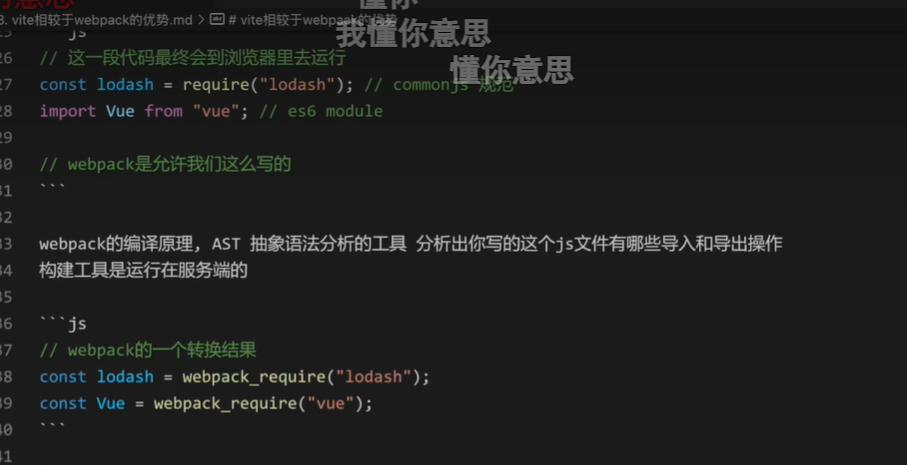


webpack会将所有依赖读取整理一遍再形成bundle，而vite是基于esModuel设计，可按需加载，速度更快


Vite 比 Webpack 快的原因主要有以下几点：

1. 利用原生 `ES Modules`：Vite 利用了现代浏览器对原生 ES Modules 的支持，`允许浏览器直接加载和执行 JavaScript 模块`，无需经过 Webpack 的打包过程。这大大减少了构建时间和服务器启动时间。vite是按需加载，webpack是打包后再启动服务，即使模块没用上，其实也编译了，只不过放在一个单独的script标签里，没有被页面引用。
2. 快速的冷启动：Vite 采用了基于浏览器原生支持的 HTTP/2 协议，可以实现快速的`冷启动`时间，避免了 Webpack 繁重的打包过程。
3. 按需编译：Vite 通过静态分析技术，`只编译当前所需的代码片段`，而不是整个应用。这减少了不必要的编译时间，并且可以更好地利用缓存。
4. `更快的热重载`：在开发过程中，Vite 使用了原生 ES 模块，只重新编译被修改的文件，而不需要重新构建整个项目。这样可以实现更快速度的热重载，提高开发效率。
5. `轻量级`：Vite 在构建时只负责将源代码转换为浏览器可执行代码，而将其他功能如`压缩、合并`等工作交给生产环境打包工具处理。因此，它相对于 Webpack 来说更加轻量级。
6. 简单的配置：Vite 的配置相对更简单，因为它无需进行大量的配置，只需指定一些基本的选项就可以开始开发。而 Webpack 的配置更加复杂，需要针对具体项目进行不同的配置，且需要理解各种插件、Loader 等概念。

总的来说，Vite 通过利用现代浏览器的原生功能和优化构建过程，实现了比 Webpack 更快的开发体验。


### vite预构建
1. 不同的第三方包会有不同的导出格式，vite会通过esbuild处理转换
2. 对路径的处理可以直接使用.vite/deps,方便路径重写
3. 网络多包传输的性能问题（也是原生esmodule规范不敢支持node_modules的原因之一）,有了依赖预构建以后无论有多少额外的export和import，vite都尽可能讲它们集成最后只生成一个或者几个模块

```js
// a
export default function a(){}
```
```js
// main.js
export {default as a} from './a.js'
//实际先import后导出
```
```js
// vite发现main.js中用到了a，直接处理成function a，减少了import数量
function a(){}
```


### vite环境变量设置
Vite 使用了 dotenv 这个第三方的库来处理环境变量。

具体来说，dotenv 会自动读取 .env 这个文件，并解析这个文件中对应的环境变量，但 Vite 考虑到和其他配置的冲突问题，它不会直接将这些环境变量注入到 process 对象下。vite提供了loadEnv来手动确认env文件。

```js
loadEnv(mode, root, prefix)
```
```js
// process.cwd()：用于返回 Node.js 进程当前工作目录的路径
const env = loadEnv(mode,process.cwd(),'SBXG_')
```

**如果设置了前缀，那么符合的前缀会被添加loadEnv返回值中，不符合的被过滤掉**

.env文件
```bash
SBXG_API_URL=https://api.example.com  
SBXG_APP_TITLE=My Superb App  
SBXG1_DEBUG=true #会被过滤掉
```

```bash
yarn dev --mode devexxx
```

loadEnv会做以下几件事：
1. 直接找到.env文件，并解析其中环境变量，将他们放进一个对象中
2. 会将传进来的mode变量的值进行拼接，如```.env.[devexxx]```，并根据提供的目录去寻找对应的配置文件进行解析，放进一个对象中
3. 合并操作

```js
const baseEnvConfig = 读取.env的配置
const modeEnvConfig = 读取env相关配置
const lastEnvConfig = {...baseEnvConfig ,... modeEnvConfig }
```

#### vite客户端配置环境变量
使用import.meta.env去获取

为了安全，除了基本变量外，默认打印的是`VITE_`为前缀的变量，如果要修改，借助配置文件中envPrefix去设置
```js
{
	SBXG_API_URL: 'https://api.example.com', 
	SBXG_APP_TITLE: 'My Superb App', 
	BASE_URL: '/', 
	MODE: 'development',
	DEV: true,
	…
}
```

```js
import {defineConfig} from 'vite'

export default defineConfig({
    optimizeDeps:{
        
    },
    envPrefix:'SBXG_'//下划线非必须
})
```

### vite怎么读取App.vue文件


### vite对css支持


### vite中处理css


```js
// /**
//  * @type {import('vite').UserConfig}
//  */
// const config = {
//     optimizeDeps:{
//         exclude:['lodash-es']
//     }
//   }
  
// export default config


import {defineConfig} from 'vite'

export default defineConfig({
    optimizeDeps:{
        
    },
    css:{
        modules:{
            localsConvention:"camelCase",//这是给导出的key名字定义的规则
            scopeBehaviour:"local",//如果设置成全局则都不按模块化解析
            generateScopedName:'[name]_[local]',// 生成的类名，可在这里配置
            // generateScopedName:(name,filename,css)=>{
            //     console.warn(`name`,name)
            //     console.warn(`filename`,filename)
            //     console.warn(`css`,css)
            //     return `sbxg_${name}`
            //     return 'sbxg_'
            // },
            hashPrefix:"hhhhh",
            globalModulePaths:['./c3.module.css']//排除c3模块，不按照模块化解析，仍按普通css解析
        }
    }
})
```
`localsConvention`可以更好的规定引入css后模块化的写法，而`globalModulePaths`则可避免不必要处理的css仍按原来解析方式，比如里面引入@import url('antd')等，不要影响第三方css

```css
.cc-key{
    color:red
}
```
```js
import styles from './c2.module.css'
console.log(styles)
let div = document.createElement('div')
div.className = styles.ccKey//如果配置了转成驼峰写法，就可以这样用了
```

这里可以根据不同的localsConvention得到不同的结果，就是上文的styles会打印出的东西


#### vite对css预编译和兼容处理


```js
......
export default defineConfig({
    css:{
        preprocessorOptions:{
            less:{
                math:"always", //对一些计算属性的处理
                globalVars:{
                    mainColor:"red"//设置全局变量，可以不需要每个文件总是引入
                }
            }
        }
    }
})
```

可以获取**全局变量**里的值
```css
.k1{
    .k2{
        margin: 100px / 2;
        padding:(100px/2);
        color:@mainColor
    }
}
```


```js
import {defineConfig} from 'vite'
import postcssPresetEnv from 'postcss-preset-env'

export default defineConfig({
    css:{
        postcss:{
            plugins:[postcssPresetEnv] //兼容 添加前缀都功能
        }
    }
})
```

### vite对静态资源处理
vite会帮助获取图片的路径，对json文件也会直接转成对象而不需要手动反序列化
```js
import styleImg from './src/assets/demo.png' //返回路径
// import styleImg from './src/assets/demo.png?raw' //返回buffer

import myJson,{age} from './src/json/demo.json' // json已经转成对象，还可以解构，方便tree-shaking

console.log(styleImg)
console.log(myJson)
console.log(typeof myJson)
console.log(age)
```


#### svg怎么悬浮变色
```html
<!DOCTYPE svg PUBLIC "-//W3C//DTD SVG 1.1//EN"   
"http://www.w3.org/Graphics/SVG/1.1/DTD/svg11.dtd">  
<svg width="100" height="100" viewBox="0 0 100 100" xmlns="http://www.w3.org/2000/svg">  
    <polygon points="50,0 100,50 50,100 0,50" fill="blue" stroke="black" stroke-width="2"/>  
</svg>
```
```js
import styleSvg from '@assets/deno.svg?raw'
document.body.innerHTML = styleSvg
let svg = document.getElementsByTagName('svg')[0]
svg.onmouseenter = function(e){
    this.style.fill ='red' //这种写法不生效，只是举例
}
console.log(styleSvg)// 就是svg里的代码
```

### vite alias的原理实现

基于字符串替换，包括buffer转字符串等操作


### vite生产配置

hash的作用当文件有变动后会修改，这样防止浏览器缓存策略造成文件变化后仍加载之前的版本文件。
```js
import {defineConfig} from 'vite'
export default defineConfig({
    build:{// 构建生产包时的一些配置策略
        rollupOptions:{// 配置rollup的一些基本构建策略
            output:{// 控制输出
                // 在rollup里，hash代表文件名和文件内容组合计算结果
                // 输出的是静态资源，所以打包出来的js不收约束
                assetFileNames:"[hash].[name].[ext]"
            }
        },
        // 配置静态资源是否行内的大小，默认小于4kb转base64
        assetsInlineLimit:4096,
        outDir:"myDist",//打包文件夹，默认dist
        assetsDir:"pubilc",//静态资源目录，默认assets
		emptyOutDir:true// 清空上一次打包的文件，默认true
    }
})
```


### vite插件
在vite的不同的生命周期去完成的不同的任务的工具 


#### vite-aliases
根据插件自动把src目录下的内容添加别名

```js
import { ViteAliases } from 'vite-aliases'
export default defineConfig({
	 plugins:[
		ViteAliases({
			prefix:"@"//注意配置，新版本默认改为了~
		})
	]
})
```


#### vite-plugin-html
用来往html注入动态内容，使用ejs模板实现

```html
<!DOCTYPE html>
<html lang="en">
<head>
    <title><%= title %></title>
</head>
<body>
    <script type="module" src="./main.js"></script>
</body>
</html>
```
```js
import {defineConfig} from 'vite'
import { ViteAliases } from 'vite-aliases'
import { createHtmlPlugin } from 'vite-plugin-html'
export default defineConfig({
    plugins:[
        ViteAliases({
            prefix:"@"//注意配置，新版本默认改为了~
        }),
        createHtmlPlugin({
            // template: './index.html',
            inject:{
                data:{
                    title:"china12121"
                }
            }
        })
    ]
})
```

#### vite-plugin-checker
对代码出现可能的问题进行在控制台提示
```js
import checker from 'vite-plugin-checker'
export default defineConfig({
    plugins:[
        checker({
            typescript: true
        })
    ]
})
```
ts.config.json
```json
{
    "compilerOptions": {
        "baseUrl": ".",
        "paths": {
            "@assets/*": [
                "src/assets/*"
            ],
            "@json/*": [
                "src/json/*"
            ],
            "@/*": [
                "src/*"
            ]
        },
        "skipLibCheck": true,// 忽略第三方插件的报错问题
        "module": "ESNext"//根据需求配置
    }
}
```

#### 手写一个基础的vite插件
根据需要扩展或者修改部分配置，同时设计从成函数形式，方便配置和传参。插件可以通过判断去实现生产和测试等环境不同的配置。

```js

export default (options)=>{
    return {
        config(config,obj){
            // config:vite的配置
            // obj:
            // {
            //     mode: 'development',
            //     command: 'serve',
            //     isSsrBuild: false,
            //     isPreview: false
            //   }
            console.log(config,obj)
            // 返回需要修改的部分config配置，后续会进行merge
            return {
                // resolve:{
                //     alias:{
                //         ...
                //     }
                // }
            }
        },
		// 老版本的变异需要改变这个钩子触发时机，否则会报错
        // transformIndexHtml:{
        //     enforce:"pre",
        //     transform:(html,ctx)=>{
        //         console.log("html",html)
        //         return html.replace(/<%= title %>/g,options.inject.data.title)
        //     }
        // },
		// 新版本不需要做额外的处理
        transformIndexHtml(html,ctx){
            console.log("html",html)
            return html.replace(/<%= title %>/g,options.inject.data.title)
        }
    }
}
```

对服务做某些定制的操作


### vite构建的性能优化
1. 分包 在build中的output可配置
2. 动态加载 import
3. gzip压缩 后端运维需配合
4. cdn加速


```js
// rollup
rollupOptions: {  
  output: {  
    manualChunks(id) {  
      if (id.includes('node_modules')) {  
        // 对于来自 node_modules 的模块，按模块名称的第一个部分进行分组  
        return id.toString().split('node_modules/')[1].split('/')[0].toString();  
      }  
      // 其他模块可以根据需要自定义分组逻辑  
      return 'default';  
    }  
  }  
}
```


### vite跨域


### vite HMR
当浏览器请求 HTML 页面时，服务端通过 serverPluginHtml 插件向 HTML 内容注入一段脚本。如下图所示，我们可以看到， index.html 中就有一段引入 /vite/client 代码，进行 WebSocket 的注册和监听。


## 代码维护和兼容

### core-js和core-js-pure
core-js和core-js-pure的主要区别在于它们对全局变量的处理方式。

core-js是一个JavaScript标准库的polyfill（垫片/补丁），主要用于提供ECMAScript标准中缺失的功能和特性的垫片，以实现跨浏览器的兼容性。它包含了ECMAScript 2020在内的多项特性的polyfills，以及ECMAScript在proposals阶段的特性、WHATWG/W3C新特性等，因此它是一个现代化前端项目的“标准套件”。

而core-js-pure是core-js的一个子包，它与core-js的主要区别在于core-js-pure不会修改任何全局变量，而core-js会。这意味着，如果你使用core-js，你可能会影响到全局作用域，从而可能导致与其他库的冲突。而core-js-pure则完全避免了这个问题，它只会在你明确导入它的时候提供功能，而不会影响到全局作用域。

因此，在选择使用core-js还是core-js-pure时，你需要根据你的项目需求和你对全局作用域的控制需求来做出决定。

然后，在你的JavaScript文件中，可以这样使用 core-js-pure：
```js
// 导入Promise的polyfill  
import 'core-js-pure/features/promise';  
  
// 现在你可以使用Promise了，无论环境是否原生支持  
new Promise((resolve, reject) => {  
  setTimeout(() => {  
    resolve('Hello, Promise!');  
  }, 1000);  
})  
.then(result => {  
  console.log(result); // 输出 'Hello, Promise!'  
})  
.catch(error => {  
  console.error('Error:', error);  
});
```

### Babel
Babel is a JavaScript compiler.一个 JavaScript 的“编译器”。

它需要完成以下内容：
1. 语法转换，一般是高级语言特性的降级；
2. Polyfill（垫片/补丁）特性的实现和接入；
3. 源码转换，比如 JSX 等。

Babel 的设计，在**工程化**的角度上，需要秉承以下理念：
1. 可插拔（Pluggable），比如 Babel 需要有一套灵活的插件机制，召集第三方开发者力量，同时还需要方便接入各种工具；
2. 可调式（Debuggable），比如 Babel 在编译过程中，要提供一套 Source Map，来帮助使用者在编译结果和编译前源码之间建立映射关系，方便调试；
3. 基于协定（Compact），Compact 可以简单翻译为基于协定，主要是指实现灵活的配置方式，比如你熟悉的 Babelloose 模式，Babel 提供 loose 选项，帮助开发者在“尽量还原规范”和“更小的编译产出体积”之间，**找到平衡。**


@babel/core 是 Babel 实现转换的核心，它可以根据配置，进行源码的编译转换：

```js
var babel = require("@babel/core");

babel.transform(code, options, function(err, result) {
	result; // => { code, map, ast }
});
```
@babel/cli 是 Babel 提供的命令行，它可以在终端中通过命令行方式运行，编译文件或目录。@babel/cli 负责获取配置内容，并最终依赖了 @babel/core 完成编译。

@babel/standalone这个包非常有趣，它可以在非 Node.js 环境（比如浏览器环境）自动编译含有 text/babel 或 text/jsx 的 type 值的 script 标签.@babel/standalone 可以在浏览器中直接执行，因此这个包对于浏览器环境动态插入高级语言特性的脚本、在线自动解析编译非常有意义。

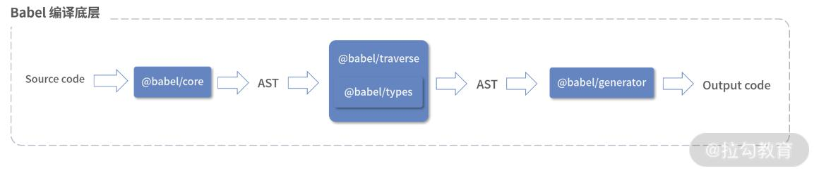


#### 自己的bable-preset
当编写 Babel 预设时，你通常会先编写一些 Babel 插件，然后将这些插件组合成一个预设。但是，为了给你一个基础的代码配置例子，我将展示如何创建一个简单的 Babel 预设配置，该配置只是引用了现有的插件。

首先，你需要一个目录来存放你的 Babel 预设。在这个目录中，你可以创建一个 package.json 文件来定义你的预设，以及一个 index.js 文件来导出你的预设配置。

```js
{  
  "name": "my-babel-preset",  
  "version": "1.0.0",  
  "description": "My custom Babel preset",  
  "main": "index.js",  
  "dependencies": {  
    "@babel/plugin-transform-runtime": "^7.x.x",  
    "@babel/plugin-proposal-class-properties": "^7.x.x"  
    // 这里可以添加其他你需要的插件  
  },  
  "peerDependencies": {  
    "@babel/core": "^7.x.x"  
  }  
}
```

```js
module.exports = function (api, options = {}) {  
  api.assertVersion(7);  
  
  // 这里可以添加一些处理 options 或 api 的逻辑  
  // 例如，你可以根据 options 来动态地添加或删除插件  
  
  const plugins = [  
    // 引用现有的 Babel 插件  
    ["@babel/plugin-transform-runtime", {  
      // 这里可以配置插件的选项  
      corejs: 3,  
      helpers: true,  
      regenerator: true,  
      useESModules: false,  
    }],  
    ["@babel/plugin-proposal-class-properties", {  
      // 这里可以配置插件的选项  
      loose: true, // 默认为 false  
    }],  
    // 可以添加更多插件...  
  ];  
  
  return {  
    plugins,  
    // 如果你还需要添加解析器（parser）或生成器（generator）选项，可以在这里添加  
  };  
};
```
这个简单的 Babel 预设配置引用了两个现有的 Babel 插件：@babel/plugin-transform-runtime 和 @babel/plugin-proposal-class-properties。这些插件被添加到 plugins 数组中，并作为预设的输出返回。

你可以通过 npm 或 yarn 来安装这个预设，并在你的 Babel 配置文件中使用它，就像使用其他任何 Babel 预设一样。例如，在你的 .babelrc 或 babel.config.js 文件中：

```json
{  
  "presets": ["my-babel-preset"] // 如果没有发布在本地，记得填入对应的路径 
}
```

#### 按需加载问题
1. 基于包自身已实现，按需引入即可
2. 使用babel-plugin-import去配置

```js
import {Button as Btn,Input,TimePicker,ConfigProvider,Haaaa} from 'antd'
```
这样的代码就可以被编译为：
```js
import _ConfigProvider from "antd/lib/config-provider";
import _Button from "antd/lib/button";
import _Input from "antd/lib/input";
import _TimePicker from "antd/lib/time-picker";
```
Babel 插件核心依赖于对 AST 的解析和操作。它本质上就是一个函数，在 Babel 对 AST 语法树进行转换的过程中介入，通过相应的操作，最终让生成的结果发生改变。

```js
 import {Button as Btn, Input} from 'antd'
```
这样的代码，经过 Babel AST 分析后，得到结构：
```js
{
    "type": "ImportDeclaration",
    "specifiers": [
        {
            "type": "ImportSpecifier",
            "imported": {
                "type": "Identifier",
                "loc": {
                    "identifierName": "Button"
                },
                "name": "Button"
            },
            "importKind": null,
            "local": {
                "type": "Identifier",
                "loc": {
                    "identifierName": "Btn"
                },
                "name": "Btn"
            }
        },
        {
            "type": "ImportSpecifier",
            "imported": {
                "type": "Identifier",
                "loc": {
                    "identifierName": "Input"
                },
                "name": "Input"
            },
            "importKind": null,
            "local": {
                "type": "Identifier",
                "start": 23,
                "end": 28,
                "loc": {
                    "identifierName": "Input"
                },
                "name": "Input"
            }
        }
    ],
    "importKind": "value",
    "source": {
        "type": "StringLiteral",
        "value": "antd"
    }
}
```
再经过其他步骤便可实现按需加载打包。

项目中使用
```bash
npm install babel-plugin-import --save-dev  
```
```js
// babel.config.js
module.exports = {  
  plugins: [  
    [  
      "import",  
      {  
        libraryName: "antd", // 要按需加载的库的名称  
        libraryDirectory: "es", // 通常设置为 'es' 或 'lib'，取决于库的结构  
        style: true, // 是否自动引入样式文件，默认为 true  
        // 你还可以设置其他的选项，如 camel2DashComponentName: false（默认是 true）  
      },  
      "antd" // 如果你需要为特定的库配置不同的规则，可以添加额外的数组项  
    ],  
    // 其他插件...  
  ],  
};
```
项目中使用
```js
import { Button } from 'antd';  
  
function MyComponent() {  
  return <Button type="primary">Click me!</Button>;  
}  
export default MyComponent;
```

### Tree shaking
事实上，Tree Shaking 是在编译时进行无用代码消除的，因此它需要在编译时确定依赖关系，进而确定哪些代码可以被“摇掉”，而 ESM 具备以下特点：
+ import 模块名只能是字符串常量
+ import 一般只能在模块的最顶层出现
+ import binding 是 immutable 的

这些特点使得 ESM 具有静态分析能力。**而CommonJS 定义的模块化规范，只有在执行代码后，才能动态确定依赖模块**，因此不具备 Tree Shaking 的先天条件。

#### 副作用模块和Tree shaking
```js
// 如果 memoize 被挂载到 window 对象上，它实际上已经成为了全局作用域的一部分  
// 这意味着打包工具不能通过静态分析来准确地判断 memoize 函数的使用情况  
// 因为它可能是通过全局变量在任何地方、任何时间被调用的  
export function add(a, b) {
	return a + b
}
export const memoizedAdd = window.memoize(add)
// 在这里，由于 add 函数被直接用于计算 memoizedAdd 的值  
// 并且 memoizedAdd 被导出，所以 add 函数肯定会被包含在最终的打包文件中  
// 无论 memoizedAdd 是否在其它地方被使用
```
该模块被 import 时，window.memoize方法会被执行，那么对于工程化工具（比如 Webpack）来说，分析思路是这样的：

创建一个纯函数add，如果没有其他模块引用add函数，那么add函数可以被 Tree Shaking 掉；

接着调用window.memoize方法，并传入add函数作为其参数；

工程化工具（比如 Webpack）并不知道window.memoize方法会做什么事情，也许window.memoize方法会调用add函数，并触发某些副作用（比如维护一个全局的 Cache Map）；

工程化工具（比如 Webpack）为了安全起见，即便没有其他模块依赖的add函数，那么也要将add函数打包到最后的 bundle 中。

因此，具有副作用的模块难以被 Tree Shaking 优化，即便开发者知道window.memoize方法是无副作用的。

为了解决“具有副作用的模块难以被 Tree Shaking 优化”这个问题，Webpack 给出了自己的方案，我们可以利用 package.json 的sideEffects属性来告诉工程化工具哪些模块具有副作用，哪些剩余模块没有副作用，可以被 Tree Shaking 优化：

```json
//表示全部代码均无副作用，告知 webpack，它可以安全地删除未用到的 export 导出。
{
  "name": "your-project",
  "sideEffects": false
}
```

```json
{
  "name": "your-project",
  "sideEffects": [
    "./src/some-side-effectful-file.js"，
    "*.css"
  ]
}
```
通过数组表示，./src/some-side-effectful-file.js和所有.css文件模块都有副作用。对于 Webpack 工具，开发者可以在module.rule配置中声明副作用模块。

事实上，仅对上面add函数，即便不通过声明 sideEffects，Webpack 也足够智能，能够分析出可 Tree Shaking 掉的部分，不过这需要对上述代码进行重构：
```js
import { memoize } from './util'
export function add(a, b) {
	return a + b
}
export const memoizedAdd = memoize(add)
// 在这里，如果 memoizedAdd 被使用，add 函数和 memoize 函数都会被包含在最终的打包文件中  
// 但如果 memoizedAdd 没有被使用，由于 add 没有被直接导出或引用，它可能会被树摇掉
```
此时 Webpack 的分析逻辑：

memoize函数是一个 ESM 模块，我们去util.js中检查一下memoize函数内容；

在util.js中，发现memoize函数是一个纯函数，因此如果add函数没有被其他模块依赖，可以被安全 Tree Shaking 掉。

#### Tree shaking 友好模式
以 Webpack 为例，Webpack 将会`趋向保留整个默认导出对象/class`（Webpack 和 Rollup 只处理函数和顶层的 import/export 变量，不能把没用到的类或对象内部的方法消除掉）。

因此：
1. 导出一个包含多项属性和方法的对象
2. 导出一个包含多项属性和方法的 class
3. 使用export default导出

都不利于 Tree Shaking。即便现代化工程工具或 Webpack 支持对于对象或 class 的方法属性剪裁（比如 `webpack-deep-scope-plugin` 这个插件的设计，或 Webpack 和 Rollup 新版本的跟进），这些都产生了不必要的成本，增加了编译时负担。

```js
export default {
	add(a, b) {
		return a + b
	}
	subtract(a, b) {
		return a - b
	}
}
```
```js
export class Number {
	constructor(num) {
		this.num = num
	}
	add(otherNum) {
		return this.num + otherNum
	}
	subtract(otherNum) {
		return this.num - otherNum
	}
}
```
更加推荐的原则是：**原子化和颗粒化导出**。如下代码，就是一个更好的实践：
```js
export function add(a, b) {
	return a + b
}
export function subtract(a, b) {
	return a - b
}
```
这种方式可以让 Webpack 更好地在编译时掌控和分析 Tree Shaking 信息，取得一个更优的 bundle size。

#### babel和tree shaking
Babel 已经成为现代化工程和基建方案的必备工具，但是考虑到 Tree Shaking，需要开发者注意：**如果使用 Babel 对代码进行编译，Babel 默认会将 ESM 编译为 CommonJS 模块规范。**而Tree Shaking 必须依托于 ESM。

为此，需要配置 Babel 对于模块化的编译降级，具体配置项在 babel-preset-env#modules 中可以找到。

但既然是“前端工程生态”，那问题就没这么好解决。事实上，如果我们不使用 Babel 将代码编译为 CommonJS 规范的代码，某些工程链上的工具可能就要罢工了。比如 Jest，Jest 是基于 Node.js 开发的，运行在 Node.js 环境。因此使用 Jest 进行测试时，也就需要模块符合 CommonJS 规范，那么如何处理这种“模块死锁”呢？

思路之一是根据不同的环境，采用不同的 Babel 配置。在 production 编译环境中，我们配置：
```js
production: {
   presets: [
    [
     '@babel/preset-env',
     {
      modules: false
     }
    ]
   ]
  },
}
```
在测试环境中：
```js
test: {
   presets: [
    [
     '@babel/preset-env',
     {
      modules: 'commonjs
     }
    ]
   ]
  },
}
```
但是在测试环境中，编译了业务代码为 CommonJS 规范并没有大功告成，我们还需要处理第三方模块代码。一些第三方模块代码为了方便进行 Tree Shaking，暴露出符合 ESM 模块的代码，对于这些模块，比如 Library1、Library2，我们还需要进行处理，这时候需要配置 Jest：
```js
const path = require('path')
const librariesToRecompile = [
 'Library1',
 'Library2'
].join('|')
const config = {
 transformIgnorePatterns: [
  `[\\/]node_modules[\\/](?!(${librariesToRecompile})).*$`
 ],
 transform: {
  '^.+\.jsx?$': path.resolve(__dirname, 'transformer.js')
 }
}
```
transformIgnorePatterns是 Jest 的一个配置项，默认值为node_modules，它表示：node_modules中的第三方模块代码，都不需要经过babel-jest编译。因此，我们自定义 transformIgnorePatterns的值为一个包含了 Library1、Library2 的正则表达式即可。

> @babel/preset-env 默认不会改变你的模块系统，除非你在其配置中指定了 modules 选项。

#### Webpack 和 Tree Shaking
Webpack4.0 以上版本在 mode 为 production 时，会自动开启 Tree Shaking 能力。默认 production mode 的配置如下：
```js
const config = {
 mode: 'production',
 optimization: {
  usedExports: true,
  minimizer: [
   new TerserPlugin({...}) // 支持删除死代码的压缩器
  ]
 }
}
```
其实，Webpack 真正执行模块去除，是依赖了 TerserPlugin、UglifyJS 等压缩插件。Webpack 负责对模块进行分析和标记，而这些压缩插件负责根据标记结果，进行代码删除。Webpack 在分析时，有三类相关的标记：

1. harmony export，被使用过的 export 会被标记为 harmony export；
2. unused harmony export，没被使用过的 export 标记为 unused harmony export；
3. harmony import，所有 import 标记为 harmony import。

#### 如何设计一个兼顾 Tree Shaking 和易用性的公共库
如果我们以 ESM 的方式对外暴露代码，那么就很难直接兼容 CommonJS 规范，也就是说在 Node.js 环境中，使用者如果直接以 require 方式引用的话，就会得到报错。如果以 CommonJS 规范对外暴露代码，又不利于 Tree Shaking。

因此，如果想要一个 npm 包既能向外提供 ESM 规范的代码，又能向外提供 CommonJS 规范的代码，我们就只能通过“协约”来定义清楚。实际上，npmpackage.json以及社区工程化规范，解决了这个问题：
```json
{
  "name": "Library",
  "main": "dist/index.cjs.js",
  "module": "dist/index.esm.js",
}
```
其实，标准 package.json 语法中，只有一个入口main。作为公共库设计者，我们通过main来暴露 CommonJS 规范打包的代码dist/index.cjs.js；在 Webpack 等构建工具中，又支持了module——这个新的入口字段。因此，module并非 package.json 的标准字段，而是打包工具专用的字段，用来指定符合 ESM 标准的入口文件。

这样一来，当require('Library')时，Webpack 会找到：dist/index.cjs.js；当import Library from 'Library'时，Webpack 会找到：dist/index.esm.js。

这里我们不妨举一个著名的公共库例子，那就是 Lodash。Lodash 其实并不支持 Tree Shaking，其package.json：
```json
{
  "name": "lodash",
  "version": "5.0.0",
  "license": "MIT",
  "private": true,
  "main": "lodash.js",
  "engines": {
    "node": ">=4.0.0"
  },
  //...
}
```
只有一个main入口，且lodash.js是 UMD 形式的代码，不利于做到 Tree Shaking。为了支持 Tree shakibng，lodash 打包出来专门的 lodash-es，其package.json：
```js
{
  "main": "lodash.js",
  "module": "lodash.js",
  "name": "lodash-es",
  "sideEffects": false,
  //...
}
```
由上述代码可知，lodash-esmain、module、sideEffects三字段齐全，通过 ESM 导出，天然支持了 Tree Shaking。

#### CSS 和 Tree Shaking
以上内容都是针对 JavaScript 代码的 Tree Shaking，作为前端工程师，我们当然也要考虑对 CSS 文件做 Tree Shaking。

实现思路也很简单，CSS 的 Tree Shaking 要在样式表中，找出没有被应用到选择器样式，进行删除。那么我们只需要：
1. 遍历所有 CSS 文件的选择器；
2. 根据所有 CSS 文件的选择器，在 JavaScript 代码中进行选择器匹配；
3. 如果没有匹配到，则删除对应选择器的样式代码。

如何遍历所有 CSS 文件的选择器呢？Babel 依靠 AST 技术，完成了对 JavaScript 代码的遍历分析，而在样式世界中，PostCSS 就起到了 Babel 的作用。PostCSS 提供了一个解析器，它能够将 CSS 解析成 AST 抽象语法树，我们可以通过 PostCSS 插件对 CSS 对应的 AST 进行操作，达到 Tree Shaking 的目的。

purgecss-webpack-plugin


### AST
Abstract Syntax Tree 的缩写，表示抽象语法树

AST 的应用场景经常出现在源代码的编译过程中：一般语法分析器创建出 AST，然后 AST 在语义分析阶段添加一些信息，甚至修改 AST 内容，最终产出编译后代码。


Program 包含了多段 Statement，Statement 又由多个 Expression 或者 Statement 组成。这三种大元素，就构成了遵循 ESTree 规范的 AST。最终的 AST 产出，也是这三种元素的数据结构拼合。

#### acorn 解析
acorn 是一个完全使用 JavaScript 实现的、小型且快速的 JavaScript 解析器。
```js
let acorn = require('acorn')
let code = 1 + 2
console.log(acorn.parse(code))
```


源代码经过词法分析，即分词得到 Token 序列，对 Token 序列进行语法分析，得到最终 AST 结果。但 acorn 稍有不同的是：acorn 将词法分析和语法分析交替进行，只需要扫描一遍代码即可得到最终 AST 结果。

#### 基于acorn实现简单的tree-shaking

```js
function add(a, b) {
    return a + b
}
function multiple(a, b) {
    return a * b
}
var firstOp = 9
var secondOp = 10
add(firstOp, secondOp)
```


```js
class JSEmitter {
    // 访问变量声明，以下都是工具方法
    visitVariableDeclaration(node) {
        let str = ''
        str += node.kind + ' '
        str += this.visitNodes(node.declarations)
        return str + '\n'
    }
    visitVariableDeclarator(node, kind) {
        let str = ''
        str += kind ? kind + ' ' : str
        str += this.visitNode(node.id)
        str += '='
        str += this.visitNode(node.init)
        return str + ';' + '\n'
    }
    visitIdentifier(node) {
        return node.name
    }
    visitLiteral(node) {
        return node.raw
    }
    visitBinaryExpression(node) {
        let str = ''
        str += this.visitNode(node.left)
        str += node.operator
        str += this.visitNode(node.right)
        return str + '\n'
    }
    visitFunctionDeclaration(node) {
        let str = 'function '
        str += this.visitNode(node.id)
        str += '('
        for (let param = 0; param < node.params.length; param++) {
            str += this.visitNode(node.params[param])
            str += ((node.params[param] == undefined) ? '' : ',')
        }
        str = str.slice(0, str.length - 1)
        str += '){'
        str += this.visitNode(node.body)
        str += '}'
        return str + '\n'
    }
    visitBlockStatement(node) {
        let str = ''
        str += this.visitNodes(node.body)
        return str
    }
    visitCallExpression(node) {
        let str = ''
        const callee = this.visitIdentifier(node.callee)
        str += callee + '('
        for (const arg of node.arguments) {
            str += this.visitNode(arg) + ','
        }
        str = str.slice(0, str.length - 1)
        str += ');'
        return str + '\n'
    }
    visitReturnStatement(node) {
        let str = 'return ';
        str += this.visitNode(node.argument)
        return str + '\n'
    }
    visitExpressionStatement(node) {
        return this.visitNode(node.expression)
    }
    visitNodes(nodes) {
        let str = ''
        for (const node of nodes) {
            str += this.visitNode(node)
        }
        return str
    }
    // 根据类型，执行相关处理函数
    visitNode(node) {
        let str = ''
        switch (node.type) {
            case 'VariableDeclaration':
                str += this.visitVariableDeclaration(node)
                break;
            case 'VariableDeclarator':
                str += this.visitVariableDeclarator(node)
                break;
            case 'Literal':
                str += this.visitLiteral(node)
                break;
            case 'Identifier':
                str += this.visitIdentifier(node)
                break;
            case 'BinaryExpression':
                str += this.visitBinaryExpression(node)
                break;
            case 'FunctionDeclaration':
                str += this.visitFunctionDeclaration(node)
                break;
            case 'BlockStatement':
                str += this.visitBlockStatement(node)
                break;
            case "CallExpression":
                str += this.visitCallExpression(node)
                break;
            case "ReturnStatement":
                str += this.visitReturnStatement(node)
                break;
            case "ExpressionStatement":
                str += this.visitExpressionStatement(node)
                break;
        }
        return str
    }
    // 入口
    run(body) {
        let str = ''
        str += this.visitNodes(body)
        return str
    }
}
module.exports = JSEmitter
```
```js
//  treeShaking.js
const acorn = require("acorn")
const l = console.log
const JSEmitter = require('./js-emitter')
const fs = require('fs')
// 获取命令行参数
const args = process.argv[2]
const buffer = fs.readFileSync(args).toString()
const body = acorn.parse(buffer).body
const jsEmitter = new JSEmitter()
let decls = new Map()
let calledDecls = []
let code = []
// 遍历处理
body.forEach(function(node) {
    if (node.type == "FunctionDeclaration") {
        const code = jsEmitter.run([node])
        decls.set(jsEmitter.visitNode(node.id), code)
        return;
    }
    if (node.type == "ExpressionStatement") {
        if (node.expression.type == "CallExpression") {
            const callNode = node.expression
            calledDecls.push(jsEmitter.visitIdentifier(callNode.callee))
            const args = callNode.arguments
            for (const arg of args) {
                if (arg.type == "Identifier") {
                    calledDecls.push(jsEmitter.visitNode(arg))
                }
            }
        }
    }
    if (node.type == "VariableDeclaration") {
        const kind = node.kind
        for (const decl of node.declarations) {
            decls.set(jsEmitter.visitNode(decl.id), jsEmitter.visitVariableDeclarator(decl, kind))
        }
        return
    }
    if (node.type == "Identifier") {
        calledDecls.push(node.name)
    }
    code.push(jsEmitter.run([node]))
});
// 生成 code
code = calledDecls.map(c => {
    return decls.get(c)
}).concat([code]).join('')
fs.writeFileSync('test.shaked.js', code)
```

```bash
node treeShaking test.js
```

```js
// tree-shaking后的代码
function add(a,b){return a+b

}
var firstOp=9;
var secondOp=10;
add(firstOp,secondOp);
```

对于上面代码分析，首先我们通过process.argv获取到目标文件，对于目标文件通过fs.readFileSync()方法读出字符串形式的内容buffer，对于这个buffer变量，我们使用acorn.parse进行解析，并对产出内容进行遍历。

在遍历过程中，对于不同的节点类型，调用 JS Emitter 实例不同的处理方法。在整个过程中，我们维护了：

1. decls——Map 类型
2. calledDecls——数组类型
3. code——数组类型

三个关键变量。decls存储所有的函数或变量声明类型节点，calledDecls则存储了代码中真正使用到的数或变量声明，code存储了其他所有没有被节点类型匹配的 AST 部分。

下面我们来分析具体的遍历过程。

在遍历过程中，我们对所有函数和变量的声明，都维护到decls中。

接着，我们对所有的 CallExpression 和 IDentifier 进行检测。因为 CallExpression 代表了一次函数调用，因此在该 if 条件分支内，将相关函数节点调用情况推入到calledDecls数组中，同时我们对于该函数的参数变量也推入到calledDecls数组。因为 IDentifier 代表了一个变量的取值，我们也推入到calledDecls数组。

经过整个 AST 遍历，我们就可以只遍历calledDecls数组，并从decls变量中获取使用到的变量和函数声明，最终使用concat方法合并带入code变量中，使用join方法转化为字符串类型。


## 数据可视化

### echarts使用
使用步骤：

1. 引入echarts 插件文件到html页面中
2. 准备一个具备大小的DOM容器

```html
<div id="main" style="width: 600px;height:400px;"></div>
```

3.  初始化echarts实例对象

```js
var myChart = echarts.init(document.getElementById('main'));
```

4. 指定配置项和数据(option)

```js
var option = {
    xAxis: {
        type: 'category',
        data: ['Mon', 'Tue', 'Wed', 'Thu', 'Fri', 'Sat', 'Sun']
    },
    yAxis: {
        type: 'value'
    },
    series: [{
        data: [820, 932, 901, 934, 1290, 1330, 1320],
        type: 'line'
    }]
};
```

5. 将配置项设置给echarts实例对象

```js
myChart.setOption(option);
```

### echarts基本配置
> 需要了解的主要配置：`series` `xAxis` `yAxis` `grid` `tooltip` `title` `legend` `color` 

- series
  - 系列列表。每个系列通过 `type` 决定自己的图表类型
  - 大白话：图标数据，指定什么类型的图标，可以多个图表重叠。

- xAxis：直角坐标系 grid 中的 x 轴
  - boundaryGap: 坐标轴两边留白策略 true，这时候刻度只是作为分隔线，标签和数据点都会在两个刻度之间的带(band)中间。

- yAxis：直角坐标系 grid 中的 y 轴

- grid：直角坐标系内绘图网格。 

- title：标题组件

- tooltip：提示框组件

- legend：图例组件

- color：调色盘颜色列表

  数据堆叠，同个类目轴上系列配置相同的`stack`值后 后一个系列的值会在前一个系列的值上相加。

```js
option = {
    // color设置我们线条的颜色 注意后面是个数组
    color: ['pink', 'red', 'green', 'skyblue'],
    // 设置图表的标题
    title: {
        text: '折线图堆叠123'
    },
    // 图表的提示框组件 
    tooltip: {
        // 触发方式
        trigger: 'axis'
    },
    // 图例组件
    legend: {
       // series里面有了 name值则 legend里面的data可以删掉
    },
    // 网格配置  grid可以控制线形图 柱状图 图表大小
    grid: {
        left: '3%',
        right: '4%',
        bottom: '3%',
        // 是否显示刻度标签 如果是true 就显示 否则反之
        containLabel: true
    },
    // 工具箱组件  可以另存为图片等功能
    toolbox: {
        feature: {
            saveAsImage: {}
        }
    },
    // 设置x轴的相关配置
    xAxis: {
        type: 'category',
        // 是否让我们的线条和坐标轴有缝隙
        boundaryGap: false,
        data: ['星期一', '周二', '周三', '周四', '周五', '周六', '周日']
    },
     // 设置y轴的相关配置
    yAxis: {
        type: 'value'
    },
    // 系列图表配置 它决定着显示那种类型的图表
    series: [
        {
            name: '邮件营销',
            type: 'line',
            data: [120, 132, 101, 134, 90, 230, 210]
        },
        {
            name: '联盟广告',
            type: 'line',
            data: [220, 182, 191, 234, 290, 330, 310]
        },
        {
            name: '视频广告',
            type: 'line',
            data: [150, 232, 201, 154, 190, 330, 410]
        },
        {
            name: '直接访问',
            type: 'line',
            data: [320, 332, 301, 334, 390, 330, 320]
        }
    ]
};
```

## 其他构建工具

## koa express

## css预编译语言

## 微前端

## 单元测试

## 其他

### `项目难点，亮点阐述`
根据具体情况来说

### `函数好坏代码评审`
在前端代码评审中，评定一个函数写得好不好，通常需要考虑多个方面。以下是一些评估标准，你可以根据这些标准来评价一个函数的质量：

1. 函数命名：
	+ 函数名是否清晰、准确地描述了函数的功能？
	+ 命名是否符合团队的命名规范？
2. 参数列表：
	+ 函数的参数是否都有明确的含义？
	+ 参数的数量是否适中，既不过多也不过少？
	+ 是否使用了适当的参数类型注解或文档说明？
3. 函数长度：
	+ 函数是否过长？一般来说，函数应该尽可能短小精悍，只做一件事情。
	+ 如果函数过长，是否考虑将其拆分成更小的函数？
4. 可读性：
	+ 函数内部的代码是否易于阅读和理解？
	+ 是否有足够的注释来解释复杂的逻辑或不易理解的代码段？
	+ 变量和函数的命名是否一致且有意义？
5. 复用性：
	+ 函数是否具有通用性，可以在多个地方复用？
	+ 是否避免了硬编码，使得函数更加灵活？
6. 性能：
	+ 函数中是否存在不必要的计算或重复计算？
	+ 是否有可能导致性能瓶颈的代码段，如嵌套循环、不必要的DOM操作等？
7. 错误处理：
	+ 函数是否对可能的错误情况进行了处理？
	+ 是否有适当的错误日志记录或异常抛出？
8. 测试：
	+ 函数是否有相应的单元测试来验证其功能？
	+ 测试是否覆盖了函数的所有重要分支和边界情况？
9. 可扩展性：
	+ 函数的设计是否考虑了未来的扩展性？
	+ 是否容易添加新的功能或修改现有功能？
10. 安全性：
	+ 函数中是否存在潜在的安全风险，如XSS攻击、SQL注入等？
	+ 是否对用户输入进行了适当的验证和清理？

根据以上标准，你可以对函数进行全面的评估。需要注意的是，这些标准并不是孤立的，而是需要综合考虑。一个优秀的函数应该在多个方面都表现出色。同时，也要根据实际情况和项目的具体需求来灵活应用这些标准。