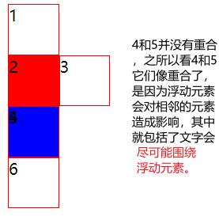
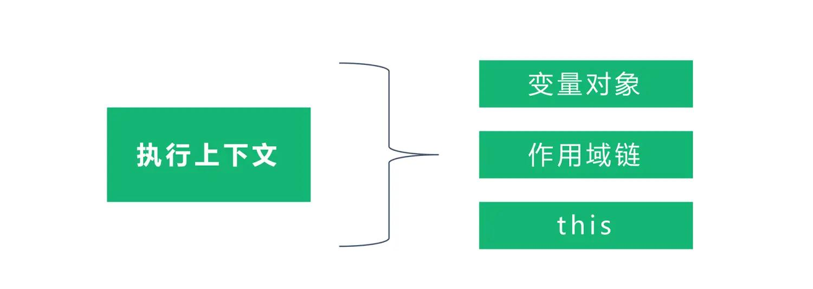

# 前端整理合集
- [前端整理合集](#前端整理合集)
  - [html](#html)
    - [如何理解html语义化](#如何理解html语义化)
    - [p标签里面不能嵌套ul、div等块级元素原因](#p标签里面不能嵌套uldiv等块级元素原因)
  - [css](#css)
    - [offsetWidth](#offsetwidth)
    - [margin负值](#margin负值)
    - [BFC](#bfc)
      - [margin重叠](#margin重叠)
    - [三栏布局](#三栏布局)
    - [粘连布局](#粘连布局)
    - [清除浮动](#清除浮动)
    - [盒模型](#盒模型)
    - [响应式设计](#响应式设计)
    - [元素水平垂直居中](#元素水平垂直居中)
    - [line-height继承](#line-height继承)
    - [rem em vw vh dpr](#rem-em-vw-vh-dpr)
      - [移动端1px实现](#移动端1px实现)
      - [移动端2X3X图](#移动端2x3x图)
    - [css预处理语言](#css预处理语言)
    - [flex布局](#flex布局)
    - [元素竖向的百分比设定是相对于容器的高度吗？](#元素竖向的百分比设定是相对于容器的高度吗)
    - [css选择器](#css选择器)
      - [css选择器读取顺序](#css选择器读取顺序)
      - [可继承](#可继承)
    - [css元素隐藏](#css元素隐藏)
    - [css画三角形](#css画三角形)
    - [css视差滚动实现方案](#css视差滚动实现方案)
    - [3D立体感绕x轴旋转](#3d立体感绕x轴旋转)
      - [transform-style立体交叉遮盖](#transform-style立体交叉遮盖)
    - [css性能优化](#css性能优化)
  - [js](#js)
    - [window.getComputedStyle(element) 获取伪类中的内容](#windowgetcomputedstyleelement-获取伪类中的内容)
    - [js中哪些会被判断为false](#js中哪些会被判断为false)
    - [js 类型转换机制](#js-类型转换机制)
    - [let const var](#let-const-var)
    - [作用域的理解](#作用域的理解)
      - [词法作用域案例](#词法作用域案例)
      - [作用域链](#作用域链)
    - [执行上下文和执行栈](#执行上下文和执行栈)
      - [执行上下文的生命周期](#执行上下文的生命周期)
    - [闭包](#闭包)
      - [不要滥用闭包](#不要滥用闭包)
      - [防抖和节流](#防抖和节流)
      - [闭包为什么会延长变量的生命周期](#闭包为什么会延长变量的生命周期)
    - [内存泄漏](#内存泄漏)
      - [垃圾回收机制](#垃圾回收机制)
      - [可能的内存泄漏场景](#可能的内存泄漏场景)
    - [Promise](#promise)
    - [== 和 ===](#-和-)
      - [==的注意之处](#的注意之处)
      - [\[\]==!\[\] {}==!{}的结果](#-的结果)
    - [Object.is() 与比较操作符 “===”、“==” 的区别？](#objectis-与比较操作符--的区别)
    - [深拷贝和浅拷贝](#深拷贝和浅拷贝)
    - [数据类型](#数据类型)
      - [undefined和null的区别](#undefined和null的区别)
      - [判断数据类型的方法](#判断数据类型的方法)
    - [数据结构](#数据结构)
      - [数组和链表的应用场景](#数组和链表的应用场景)
    - [字符串常用的方法](#字符串常用的方法)
      - [match matchAll](#match-matchall)
      - [substring slice字符串处理区别](#substring-slice字符串处理区别)
    - [数组常用的方法](#数组常用的方法)
      - [影响到原数组的方法](#影响到原数组的方法)
    - [函数缓存](#函数缓存)
    - [event loop](#event-loop)
      - [event loop 宏任务 微任务 和dom渲染的关联](#event-loop-宏任务-微任务-和dom渲染的关联)
    - [Class和实例的关系以及原型链](#class和实例的关系以及原型链)
      - [函数的特殊性](#函数的特殊性)
    - [js如何实现继承](#js如何实现继承)
      - [继承的方案](#继承的方案)
    - [async await](#async-await)
      - [async await异步本质](#async-await异步本质)
    - [对象的一些方法](#对象的一些方法)
    - [this指向](#this指向)
      - [this隐式绑定丢失](#this隐式绑定丢失)
      - [call appy bind的用法和区别](#call-appy-bind的用法和区别)
    - [new操作做了什么](#new操作做了什么)
    - [JS基本类型的装箱与拆箱](#js基本类型的装箱与拆箱)
    - [new String 和String区别](#new-string-和string区别)
    - [事件 事件流](#事件-事件流)
      - [事件模型](#事件模型)
        - [event.eventPhase](#eventeventphase)
      - [IE事件模型](#ie事件模型)
      - [事件代理](#事件代理)
    - [监听一个div宽度变化](#监听一个div宽度变化)
    - [MutationObserver触发机制及应用场景](#mutationobserver触发机制及应用场景)
    - [Js单线程详解](#js单线程详解)
    - [本地存储和场景](#本地存储和场景)
      - [cookie的修改注意](#cookie的修改注意)
      - [localstorange本地过期时间](#localstorange本地过期时间)
  - [DOM](#dom)
    - [DOM操作节点的基本API](#dom操作节点的基本api)
      - [innerHTML outerHTML createTextNode innerText textContent异同](#innerhtml-outerhtml-createtextnode-innertext-textcontent异同)
  - [BOM](#bom)
    - [BOM的含义](#bom的含义)
      - [moveTo moveBy scrollTo scrollBy resizeTo resizeBy](#moveto-moveby-scrollto-scrollby-resizeto-resizeby)
      - [location](#location)
      - [history](#history)


## html

### 如何理解html语义化
1.	让人更容易读懂（增加代码可读性）
2.	去掉或丢失样式的时候能够让页面呈现出清晰结构
3.	让搜素引擎更容易理解（SEO优化）

### p标签里面不能嵌套ul、div等块级元素原因
不符合语义化规定，w3c规定，对于P元素，它指定了以下内容，这表明P元素只允许包含内联元素（包括p元素本身也不行）。
```
<!ELEMENT P - O (%inline;)* -- paragraph -->
```
简而言之，不可能在DOM中放置`<div>`元素，因为开放的`<div>`标签会自动closures`<p>`元素。
```js
<p>
    11
    <div href='www.baidu.com'>baidu1</div>
    22
</p>
```


## css

### offsetWidth
offsetWidth 属性是一个只读属性,返回一个元素的布局宽度.一个典型的（译者注：各浏览器的 offsetWidth `可能有所不同`）.offsetWidth = border + padding + scrollbar(竖直方向滚动条) + width.


```html
<!DOCTYPE html>
<html>
<head>
    <title>盒模型</title>
    <style type="text/css">
        #div1 {
            width: 100px;
			height:50px;
            padding: 10px;
            border: 1px solid #ccc;
            margin: 10px;
			overflow-y:auto ;
            /* box-sizing: border-box; */
        }
    </style>
</head>
<body>
    <div id="div1">
        this is div1
		this is div1
		this is div1
		this is div1
		this is div1
    </div>
    <script>
 		console.log(document.getElementById('div1').offsetWidth) // 122
		let div1 = document.getElementById('div1')
		// 使用 getComputedStyle 获取元素的计算后样式  
		var style = window.getComputedStyle(div1); 
		console.log(style.paddingLeft) // 10px
		console.log(style.paddingRight)// 10px
		console.log(style.width) //83.2px // 滚动条占据了一定的宽度
		console.log(style.marginLeft)//10px
		console.log(style.marginRight)//10px
    </script>
</body>
</html>
```
> offsetWidth 注意不同盒模型时结果，IE盒模型给的width已经包含了boder padding 故就是100


### margin负值
1.	margin-top和margin-left为负值时，元素向上或者向左移动
2.	margin-bottom为负值时，下方元素上移，自身不受影响
3.	margin-right为负值时，右侧元素左移，自身不受影响(margin-right负值也可以理解为自身在越来越小，当不占width又是float时可以浮动上去，三栏布局可应用到)

```html
<!DOCTYPE html>
<html>
<head>
    <title>margin 负值</title>
    <style type="text/css">
        body {
            margin: 20px;
        }

        .float-left {
            float: left;
        }
        .clearfix:after {
            content: '';
            display: table;
            clear: both;
        }

        .container {
            border: 1px solid #ccc;
            padding: 10px;
        }
        .container .item {
            width: 100px;
            height: 100px;
        }
        .container .border-blue {
            border: 1px solid blue;
            margin-right:-10px;
        }
        .container .border-red {
            border: 1px solid red;
        }
    </style>
</head>
<body>
    
    <p>用于测试 margin top bottom 的负数情况</p>
    <div class="container">
        <div class="item border-blue">
            this is item 1
        </div>
        <div class="item border-red">
            this is item 2
        </div>
    </div>

    <p>用于测试 margin left right 的负数情况</p>
    <div class="container clearfix">
        <div class="item border-blue float-left">
            this is item 3
        </div>
        <div class="item border-red float-left">
            this is item 4
        </div>
    </div>

</body>
</html>
```


k1和k2是两个div
1. 上下布局
   + k1 margin-top 负值，k1往上移动，k2跟随移动对应距离
   + k2 margin-top 负值，k1不动，k2往上移动，层级比k1高，可覆盖点击不到K1的事件
   + k1 margin-bottom 负值 k1不动 k2往上移动
   + k2 margin-bottom 负值 k2不动，k2后如果有相邻的元素比如k3存在，则会向上移动
2. 左右布局
   + k1 margin-left 负值 k1往左移动，k2跟随移动对应距离
   + k2 margin-left 负值 k1不动，k2 往左移动，层级比k1高
   + k1 margin-right 负值 k1不动 k2往左移动
   + k2 margin-right 负值 k2不动 k2后如果有相邻的元素比如k3存在，则会向左移动

实际应用：`圣杯布局+粘连布局`

### BFC
在页面中元素都有一个隐含的属性叫作`Block Formatting Context`，即块级格式化上下文，简称BFC。该属性能够设置打开或关闭，默认是关闭的。页面上的一个`隔离渲染区域`，**容器里面的子元素不会在布局上影响到外面的元素**

一旦开启元素的BFC后，元素将会具备如下特性：

+ 父元素的垂直`外边距`不会和子元素重叠
+ 开启BFC的元素`不会被浮动元素`所覆盖
+ 开启BFC的元素能够包含浮动的子元素


1. 普通文档流布局规则
	+ 浮动的元素是不会被父级计算高度
	+ 非浮动元素会占据浮动元素的位置
	+ margin会传递给父级[根据规范，一个盒子如果没有上补白和上边框，那么它的上边距应该和其文档流中的第一个孩子元素的上边距重叠。]
	+ 两个相邻元素上下margin会重叠
2. BFC布局规则
	+ 浮动的元素会被父级计算高度（父级触发了BFC）
	+ `非浮动元素不会占据浮动元素位置（非浮动元素触发了BFC）`
	+ margin不会传递给父级（父级触发了BFC）
	+ 两个相邻元素上下margin会重叠（给其中一个元素增加一个父级，然后让他的父级触发）【margin重叠三个条件:同属于一个BFC;相邻;块级元素】
3. 产生方式
	+ float 不为none
	+ overflow不为visible
	+ position不为relative和static
	+ display为table-cell table-caption `inline-block`之一
	+ 根元素HTML
4. BFC作用 :多栏布局,清除浮动,上下margin重叠

> 多栏布局指的是左侧float，然后给整体父级加上BFC模式，这样就可以避免右侧的内容占据左侧

```html
<!DOCTYPE html>
<html>
    <head>
        <meta charset="utf-8" />
        <meta name="viewport" content="width=device-width, initial-scale=1">
        <title></title>
        <style>
            *{margin:0;padding:0}
            .k1{
                width:100px;
                height:100px;
                border:1px solid #00D6B2;
                float:left;
                
            }
            .k2{
                width:200px;
                height:200px;
                background-color: bisque;
                /* overflow: hidden; */
                
            }
        </style>
    </head>
    <body>
        <div class="k1">
            
        </div>
        <div class="k2">
            abc def weq1 abcdef weq1
            abc def weq1 abcdef weq1
            abc def weq1 abcdef weq1
            abc def weq1 abcdef weq1
            abc def weq1 abcdef weq1
            abc def weq1 abcdef weq1
            abc def weq1 abcdef weq1
            abc def weq1 abcdef weq1
            abc def weq1 abcdef weq1
            abc def weq1 abcdef weq1
        </div> 
    
    </body>
</html>
```


放开k2中/* overflow: hidden; */


```html
<style>
  div {
    border: solid 1px red;
    width: 50px;
    height: 50px;
  }
  .float {
    float: left;
  }
</style>
<div>1</div>
<div class="float">2</div>
<div class="float">3</div>
<div style='background: red;'>4</div>
<div style='background: blue;'>5</div>
<div class="float">6</div>
```

如果给2设置上背景色且不透明，那么就看不到4的背景色red的样式了，相当于2脱离了文档流，浮动在4的上方了。




#### margin重叠
margin-top和margin-bottom重叠，空白p被忽略，所以最后相距`15px`
```html
<!DOCTYPE html>
<html>
<head>
    <style type="text/css">
        p {
            font-size: 16px;
            line-height: 1;
            margin-top: 10px;
            margin-bottom: 15px;
        }
    </style>
</head>

<body>
    <p>AAA</p>
    <p></p>
    <p></p>
    <p></p>
    <p>BBB</p>
</body>
</html>
```


### 三栏布局
+ flex grid
+ absolute + margin
+ 圣杯布局：center left right在同一层级全部浮动，父级设左右padding，左侧：left:-100% + right对应宽度，右边margin-right对应宽度 
+ 双飞翼布局：多一个div包裹，中间div用margin不是padding，左侧不需要再借助定位改变位置，右侧不需要通过margin-right直接使用margin-left即可

```html
<style>
*{
    margin:0;
    padding:0
}
#container {
  padding-left: 200px; 
  padding-right: 150px;
}
#container .column {
  float: left;
}

#center {
  width: 100%;
  background:greenyellow
}

#left {
  width: 200px; 
  margin-left: -100%;
  position: relative;
  right: 200px;
  background: skyblue;
}
#right {
  width: 150px; 
  margin-right: -150px; 
  background: mediumvioletred;
}

#footer {
  clear: both;
}

</style>
<div id="header">header</div>
<div id="container">
  <div id="center" class="column">1</div>
  <div id="left" class="column">2</div>
  <div id="right" class="column">3</div>
</div>
<div id="footer">footer</div>
```


div内容为2的位置因为浮动本应该在1之后，然后设置margin-left：-100%；相当于向左移动了整个#container位置，还需要在通过定位移动200px


div内容为3的位置，设置了margin-right负值，本来应该影响右侧内容，但是它的右侧没内容，假设有，右侧内容会慢慢左移，当margin-right负值等于div3的大小，就相当于完全遮盖住，**外界感觉div3相当于没了宽度，没了宽度的div3自然可以移动上去。**


双飞翼布局
```html
<!DOCTYPE html>
<html>
<head>
    <meta charset="UTF-8">
    <meta name="viewport" content="width=device-width, initial-scale=1.0">
    <meta http-equiv="X-UA-Compatible" content="ie=edge">
    <title>双飞翼布局</title>
    <style type="text/css">
        body {
            min-width: 550px;
        }
        .col {
            float: left;
        }

        #main {
            width: 100%;
            height: 200px;
            background-color: #ccc;
        }
        #main-wrap {
            margin: 0 190px 0 190px;
        }

        #left {
            width: 190px;
            height: 200px;
            background-color: #0000FF;
            margin-left: -100%;
        }
        #right {
            width: 190px;
            height: 200px;
            background-color: #FF0000;
            margin-left: -190px;
        }
    </style>
</head>
<body>
    <div id="main" class="col">
        <div id="main-wrap">
            this is main
        </div>
    </div>
    <div id="left" class="col">
        this is left
    </div>
    <div id="right" class="col">
        this is right
    </div>
</body>
</html>

```

### 粘连布局
1. 为内容区域添加最小的高度
	+ min-height
	+ padding-bottom top元素
	+ margin-top bottom元素(margin负值的应用)

```html
<!DOCTYPE html>
<html lang="en">
<head>
    <meta charset="UTF-8">
    <meta name="viewport" content="width=device-width, initial-scale=1.0">
    <title>Document</title>
    <style>
		*{
			margin: 0;
			padding: 0;         
		}
		html,body{
			height: 100%;
		}
		#main{
			min-height: 100%;  
			background-color: orange;
		}
		.main{
			padding-bottom: 100px;
		}
		#footer{
			height: 100px;
		    background: pink;
			margin-top: -100px;
		}
    </style>
</head>
<body>
    <div id="main">
        <div class="main">
            main<br>
            main<br>
            main<br>
            main<br>
            main<br>
            main<br>	
        </div>
    </div>
    <div id="footer">
        footer
    </div>
</body>
</html>
```

2. flex布局：footer的flex设为0，这样footer获得其固有的高度;content的flex设为1

### 清除浮动
1.	overflow:hidden
2.	父级设置固定高度
3.	clear:both;兼容性好，需要一个空div，语义化不好
4.	万能清除法

```css
.类名:after {
  content: "";
  clear: both;
  display: block;
  height: 0;
  overflow: hidden;
  visibility: hidden;
  zoom:1;
}
```

```html
<style type="text/css">
	.parent::after {  
	    content: ""; /* 必须设置内容，即使它是空的 */  
	    display: table; /* 创建一个匿名表格块级盒子 */  
	    clear: both; /* 清除浮动 */  
	}  
	.parent{
		border:3px slateblue solid 
	}
	.float-child {  
	    float: left; /* 或者使用 float: right; */  
	    width: 100px;  
	    height: 100px;  
	    background-color: lightblue;  
	    margin-right: 10px; /* 如果是左浮动的话 */  
	}
</style>
<div class="parent">  
    <div class="float-child">我是浮动元素我是浮动元素我是浮动元素我是浮动元素我是浮动元素我是浮动元素我是浮动元素</div>  
    <!-- 注意这里没有额外的清除标签 -->  
</div>
```


### 盒模型
盒模型指的是HTML元素在渲染时所占据的空间，包括元素的内容（content）、内边距（padding）、边框（border）和外边距（margin）。

```
box-sizing: content-box(标准盒模型)|border-box(IE盒模型)|inherit:
```


### 响应式设计
适配不同尺寸屏幕

+ 媒体查询 @media
+ 百分比
+ vw/vh
+ rem

### 元素水平垂直居中
+ position 定位四个方向值一致，margin:auto
+ position + transform
+ position + margin负值(需知道宽高)
+ grid
+ flex
+ table

```css
.father {  
	display: flex;  
	justify-content: center; /* 水平居中 */  
	align-items: center; /* 垂直居中 */  
}  
```
```css
	.father {
		display: table-cell;
		vertical-align: middle;
		text-align: center; 
	}
	.son {
		display: inline-block;
	}
```

```html
<html>
<head>
    <meta charset="UTF-8">
    <meta name="viewport" content="width=device-width, initial-scale=1.0">
    <meta http-equiv="X-UA-Compatible" content="ie=edge">
    <title>水平垂直居中方案</title>
    <style type="text/css">
        .container {
            border: 1px solid #ccc;
            margin: 10px;
            padding: 10px;
            height: 200px;
        }
        .item {
            background-color: #ccc;
        }
		 /*行内元素*/
        .container-1{
            text-align: center;
            line-height: 200px;
            height: 200px;
        }

        .container-2 {
            position: relative;
        }
		 /*需要知道宽高*/
        .container-2 .item {
            width: 300px;
            height: 100px;
            position: absolute;
            left: 50%;
            margin-left: -150px;
            top: 50%;
            margin-top: -50px;
        }

        .container-3 {
            position: relative;
        }
		/*不需要知道宽高，但是不兼容低版本浏览器*/
        .container-3 .item {
            width: 200px;
            height: 80px;
            position: absolute;
            left: 50%;
            top: 50%;
            transform: translate(-50%, -50%)
        }

        .container-4 {
            position: relative;
        }
		 /*比较优秀的处理方案*/
        .container-4 .item {
            width: 100px;
            height: 50px;
            position: absolute;
            top: 0;
            left: 0;
            bottom: 0;
            right: 0;
            margin: auto;
        }
 		.container-5 {
           position: relative;
          justify-content: center;
          align-items: center;
          display:flex;
          
        }
        .container-5 .item {
            width: 100px;
            height: 50px;
        }

    </style>
</head>
<body>
    <div class="container container-1">
        <span>一段文字</span>
    </div>

    <div class="container container-2">
        <div class="item">
            this is item
        </div>
    </div>

    <div class="container container-3">
        <div class="item">
            this is item
        </div>
    </div>

    <div class="container container-4">
        <div class="item">
            this is item
        </div>
</div>
<div class="container container-5">
        <div class="item">
            this is item
        </div>
    </div>

</body>
</html>

```

### line-height继承
1.	写具体数值，如30px，则继承父级该值
2.	写比例如1/2/3.5等,则继承该比例（**自己的**font-size*父级中的比例）
3.	写百分比,如200%,则继承计算出来的结果(**父级**的font-size*200%)

### rem em vw vh dpr
1.	rem: 相对大小，但相对的只是HTML根元素
2.	em:  继承父级元素的字体大小
3.	vw:window.innerWidth = 100vw
4.	vh:window.innerHeight = 100vh
5.	vmax:取vh/vw中大值
6.	vmin: 取vh/vw中小
7.	dpr（设备像素比）：是指`设备物理像素的个数`除以`设备独立像素`的大小。物理像素是手机屏幕上一个一个的发光的点，大小是固定的；独立像素也叫做逻辑像素，css设置的像素大小就是逻辑像素。

`window.devicePixelRatio`可获取，无缩放的情况下，1个css像素 === 一个设备独立像素


#### 移动端1px实现
+  border-image:需要图片
+  background-image：因为每个边框都是线性渐变颜色实现，因此无法实现圆角。
+  box-shadow:不好控制
+  媒体查询：兼容性
+  :after transform (其实无非是把1px缩放为0.5px，**0.5px并不是所有都支持**(iOS8以上支持)。)

```html
<!DOCTYPE html>  
<html lang="en">  
<head>  
<meta charset="UTF-8">  
<meta name="viewport" content="width=device-width, initial-scale=1.0">  
<title>1px Border with Transform and After</title>  
<style>  
  .border-1px {  
    position: relative;  
    background-color: white;  
  }  
  .border-1px::after {  
    content: "";  
    position: absolute;  
    left: 0;  
    top: 0;  
    width: 200%;  
    height: 200%;  
    border: 1px solid #000;  
    transform: scale(0.5);  
    transform-origin: 0 0;  
    box-sizing: border-box;  
    pointer-events: none; /* 防止影响点击事件 */  
  }  
</style>  
</head>  
<body>  
<div class="border-1px" style="width: 200px; height: 100px;">  
  使用transform和伪元素的1px边框  
</div>  
</body>  
</html>
```

+  viewport + rem

```html
<meta name="viewport" id="WebViewport" content="initial-scale=1, maximum-scale=1, minimum-scale=1, user-scalable=no">
```
```js
var viewport = document.querySelector("meta[name=viewport]")
if (window.devicePixelRatio == 1) {
    viewport.setAttribute('content', 'width=device-width, initial-scale=1, maximum-scale=1, minimum-scale=1, user-scalable=no')
} 
if (window.devicePixelRatio == 2) {
    viewport.setAttribute('content', 'width=device-width, initial-scale=0.5, maximum-scale=0.5, minimum-scale=0.5, user-scalable=no')
} 
if (window.devicePixelRatio == 3) {
    viewport.setAttribute('content', 'width=device-width, initial-scale=0.333333333, maximum-scale=0.333333333, minimum-scale=0.333333333, user-scalable=no')
} 
var docEl = document.documentElement;
var fontsize = 10 * (docEl.clientWidth / 320) + 'px';
docEl.style.fontSize = fontsize;
```
+ svg，postcss-write-svg(小插件，只适合画直线)

#### 移动端2X3X图
+ srcset

```html

```
+ 媒体查询 兼容性差，目前之余IOS8+才支持，在IOS7及其以下、安卓系统都是显示0px。

```css
.my-element {  
  /* 默认背景图像，用于1倍像素密度的设备 */  
  background-image: url('my-image@1x.png');  
}  
  /* 针对2倍像素密度的设备 */
@media (-webkit-min-device-pixel-ratio: 2), (min-resolution: 192dpi) { 
  .my-element {  
    background-image: url('my-image@2x.png');  
  }  
}  
  
	/* 针对3倍像素密度的设备 */  
@media (-webkit-min-device-pixel-ratio: 3), (min-resolution: 288dpi) {  
  .my-element {  
    background-image: url('my-image@3x.png');  
  }  
}
```

+ js处理

```js
function setAppropriateImageSrc() {  
  var image = document.getElementById('my-image');  
  var dpr = window.devicePixelRatio || 1;  
  var src;  
  
  if (dpr >= 3) {  
    src = 'my-image@3x.png';  
  } else if (dpr >= 2) {  
    src = 'my-image@2x.png';  
  } else {  
    src = 'my-image@1x.png';  
  }  
  
  image.src = src;  
}  
  
window.onload = setAppropriateImageSrc;  
// 如果需要监听窗口大小变化，可以添加以下事件监听器  
window.onresize = setAppropriateImageSrc;
```

### css预处理语言
扩充css语言，增加了变量，混合，函数，嵌套，代码模块化等功能，方便复用和开发

+ 嵌套 scss less stylus

```css
.a {
	&.b {
		color: red;
	}
}
```
+ 变量处理

```less
// less要求变量@开头
@red : #c00;
strong {
	color: @red;
}
```
```scss
/* sass变量$开头 */
$red: #c00;
strong {
	color: $red;
}
```
```css
/* stylus变量可以$也可以不加符号，不要用@ */
$mainColor = #0982c1  
$siteWidth = 1024px  
borderStyle = dotted  
  
body  
  color $mainColor  
  border 1px borderStyle $mainColor  
  max-width $siteWidth
```

+ 作用域概念:和js类似，但是最好不要去定义重复名称变量，除非真的需要

> sass测试也一样，有的人说显示unscoped 会是white，实际测试不是
```less
@color: black;
.scoped {
 @bg: blue;
 @color: white;
 color: @color;
 background-color:@bg;
}
.unscoped {
 color:@color;
}
```
```css
.scoped {
  color: #ffffff;
  background-color: #0000ff;
}
.unscoped {
  color: #000000;
}
```

+ 混入(mixins)是预处理器最精髓之一，抽离提取。

在less中，混合的用法是指将定义好的classA引入classB中，同时还可以传参和带有默认参数
```less
.alert {
 font-weight: 700;
}
// 函数一样
.highlight(@color: red) {
 font-size: 1.2em;
 color: @color;
}
.heads-up {
 .alert;
 .highlight(red);
}
```
```css
.alert {
  font-weight: 700;
}
.heads-up {
  font-weight: 700;
  font-size: 1.2em;
  color: #ff0000;
}

```

sass需要关键词@mixin和引入时@include
```scss
@mixin large-text {
 font: {
 family: Arial;
 size: 20px;
 weight: bold;
 }
 color: #ff0000;
}
.page-title {
 @include large-text;
 padding: 4px;
 margin-top: 10px;
}
```
```scss
// 定义一个带参数的mixin  
@mixin large-text($family, $size, $weight) {  
  font-family: $family;  
  font-size: $size;  
  font-weight: $weight;  
  color: #ff0000;  
}  
  
// 使用mixin，并传递参数  
.page-title {  
  @include large-text(Arial, 40px, bold);  
  padding: 4px;  
  margin-top: 10px;  
}
```
```css
.page-title {
  font-family: Arial;
  font-size: 40px;
  font-weight: bold;
  color: #ff0000;
  padding: 4px;
  margin-top: 10px; }
```
stylus可以不加关键字,参数和函数写法一致，用等号
```css
error(borderWidth= 2px) {
 border: borderWidth solid #F00;
 color: #F00;
}
.generic-error {
 padding: 20px;
 margin: 4px;
 error(); /* error mixins */
}
.login-error {
 left: 12px;
 position: absolute;
 top: 20px;
 error(5px); /* error mixins $borderWidth 5px */
}
```

+ 其他逻辑判断

```scss
@for $i from 1 through 3 {  
  .item-#{$i} { width: 100px * $i; }  
}
$type: monster;  
body {  
  @if $type == monster {  
    background: green;  
  } @else if $type == demon {  
    background: red;  
  } @else {  
    background: blue;  
  }  
}
```
```css
.item-1 {
  width: 100px; }
.item-2 {
  width: 200px; }
.item-3 {
  width: 300px; }
body {
  background: green; }
```
stylus语法
```css
for i in 1..3  
  .item-{i}  
    width: 100px * i
type = 'monster'  
body  
  if type == 'monster'  
    background: green  
  else if type == 'demon'  
    background: red  
  else  
    background: blue
```
```css
.item-1 {  
  width: 100px;  
}  
.item-2 {  
  width: 200px;  
}  
.item-3 {  
  width: 300px;  
}
body {  
  background: green;  
}
```


### flex布局
+ flex-direction: 设置主轴的方向
+ **justify-content**: `设置主轴上的子元素排列方式`
+ flex-wrap: 设置子元素是否换行
+ align-content: 设置侧轴的子元素的排列方式（多行）
+ **align-items**:`设置侧轴上的子元素排列方式（单行）`
+ align-self:`允许单个项目有与其他项目不一样的对齐方式`，可覆盖align-items属性。
+ flex-flow:复合属性，相当于同时设置了flex-direction 和 flex-wrap
+ order：定义项目的排列顺序。数值越小，排列越靠前，默认为0。

```css
.box {
 justify-content: flex-start | flex-end | center | space-between | space-around;
}
```
+ space-between：两端对齐，项目之间的间隔都相等。
+ space-around：每个项目两侧的间隔相等。所以，项目之间的间隔比项目与边框的间隔大一倍。


```css
.box { align-items: flex-start | flex-end | center | baseline | stretch; }
```


+ stretch（默认值）：如果项目未设置高度或设为auto，将占满整个容器的高度。

```css
.box {
  align-content: flex-start | flex-end | center | space-between | space-around | stretch;
}
```


+ align-content属性定义了多根轴线的对齐方式。如果项目只有一根轴线，该属性不起作用。

```css
.item {
  align-self: auto | flex-start | flex-end | center | baseline | stretch;
}
```


+ align-self属性允许单个项目有与其他项目不一样的对齐方式，可覆盖align-items属性。默认值为auto，表示继承父元素的align-items属性，如果没有父元素，则等同于stretch。


### 元素竖向的百分比设定是相对于容器的高度吗？
当按百分比设定一个元素的宽度时，它是相对于父容器的宽度计算的，但是，对于一些表示竖向距离的属性，例如 `padding-top , padding-bottom , margin-top , margin-bottom` 等，当按百分比设定它们时，依据的也是父容器的`宽度`，而不是高度。

### css选择器
id选择器 标签选择器 类选择器 后代选择器 子选择器(div>p) 相邻选择器(a+div) 群组选择器(div,p 选择所有div和p) 伪类选择器 伪元素选择器 属性选择器 层级选择器(p~ul 选择前面有p元素的所有ul)

#### css选择器读取顺序
CSS选择器的解析是从右向左解析的。若从左向右的匹配，发现不符合规则，需要进行回溯，会损失很多性能。

若从右向左匹配，先找到所有的最右节点，对于每一个节点，向上寻找其父节点直到找到根元素或满足条件的匹配规则，则结束这个分支的遍历。

两种匹配规则的性能差别很大，是因为从右向左的匹配在第一步就筛选掉了大量的不符合条件的最右节点（叶子节点），而从左向右的匹配规则的性能都浪费在了失败的查找上面。

#### 可继承
+ 可继承的属性：font-size, font-family, color
+ 不可继承的样式：border, padding, margin, width, height
+ 注意a标签不继承父级的`color`，h1-h6不继承font-size(是按照一定的em比例呈现的)

### css元素隐藏
+ display:none
+ visibility:didden
+ opacity:0
+ 宽高设为0
+ 定位出可视区
+ clip-path


### css画三角形
可以看到,设置不同颜色的各个边框，就会发现边框是梯形，极限情况下，width height为0，其他边框颜色留一个边框就可以得到三角形


### css视差滚动实现方案
+ perspective  transform: translateZ() scale();
+ background-attachment


translateZ 值调节元素在 Z 轴的位置（近大远小），同时配合 scale 值让元素的大小看起来和原来无异。那么就实现了滚动过程中，不同元素看起来的运动速度不同。

```css
.container {
  width: 100vw;
  height: 100vh;
  overflow-x: auto;
  overflow-y: hidden;
  perspective: 1px;
}
.img-1 {
  transform: translateZ(-1px) scale(2); //变慢两倍
}
.img-2 {
  transform: translateZ(-2px) scale(3); //变慢三倍
}
.text-1 {
  transform: translateZ(0.5px) scale(0.5); //变快两倍
}

```


### 3D立体感绕x轴旋转
```html
<!DOCTYPE html>
<html>
<head>
<meta charset="utf-8"> 
<title></title> 
<style>
#div1
{
	position: relative;
	height: 150px;
	width: 150px;
	margin: 50px;
	padding:10px;
	border: 1px solid black;
	perspective:150;
	-webkit-perspective:150; /* Safari and Chrome */
}

#div2
{
	padding:50px;
	position: absolute;
	border: 1px solid black;
	background-color: red;
	transform: rotateX(50deg);
	
}
</style>
</head>

<body>

<div id="div1">
  <div id="div2">HELLO</div>
</div>
 
</body>
</html>
```


#### transform-style立体交叉遮盖
transform-style 属性指定嵌套元素是怎样在三维空间中呈现。
```html
<!DOCTYPE html>
<html>
<head>
<meta charset="utf-8"> 
<title></title>
<style>
#div5
{
	position: relative;
	height: 200px;
	width: 200px;
	margin: 100px;
	padding:10px;
	border: 1px solid black;
}

#div6
{
	padding:50px;
	position: absolute;
	border: 1px solid black;
	background-color: red;
	transform: rotateY(60deg);
	transform-style: preserve-3d;
	-webkit-transform: rotateY(60deg); 
	-webkit-transform-style: preserve-3d;
}

#div7
{
	padding:40px;
	position: absolute;
	border: 1px solid black;
	background-color: yellow;
	transform: rotateY(-60deg);
	-webkit-transform: rotateY(-60deg); 

}

</style>
</head>

<body>

<div id="div5">
  <div id="div6">HELLO
  	<div id="div7">YELLOW</div>
  </div>
</div>

</body>
</html>
```


### css性能优化
1. 内联首屏`关键css`，可下载完html立刻渲染，不需要外链下载再渲染，但是不能缓存且代码不能过多(阻塞)
2. 异步加载css
```js
//方案1
const myCSS = document.createElement( "link" );
myCSS.rel = "stylesheet";
myCSS.href = "mystyles.css";
// header
document.head.insertBefore( myCSS, document.head.childNodes[ document.head.
childNodes.length - 1 ].nextSibling );
```
```html
<!-- 方案2： media设置noexist，再onload改为all，这样一开始不加载，等页面加载完毕后再去解析css -->
<link rel="stylesheet" href="mystyles.css" media="noexist" onload="this.med
ia='all'">
```
```html
<!-- 方案3：先rel配置可选，后加载完删除可选alternate -->
<link rel="alternate stylesheet" href="mystyles.css" onload="this.rel='styl
esheet'">
```
3. 资源压缩 webpack gulp
4. 选择器(从右往左执行，不要写太多层级div #x 直接写 #x更快)，尽量不用通配符和属性选择器
5. 减少昂贵属性使用 border-radius filter :nth-child box-shadow,重绘时会降低浏览器性能
6. 少使用@import

## js

### window.getComputedStyle(element) 获取伪类中的内容
1. 返回一个对象，可得到元素的所有 CSS 属性的值。私有的 CSS 属性值可以通过对象提供的 API 或通过简单地使用 CSS 属性名称进行索引来访问。

```js
let div1 = document.getElementById('div1')
// 使用 getComputedStyle 获取元素的计算后样式  
var style = window.getComputedStyle(div1); 
console.log(style.paddingLeft) // 10px
```

2. 与伪元素一起使用:getComputedStyle 可以从**伪元素拉取样式信息**

```css
 .k1::after {
    content: "rocks!";
  }
```

```js
let k1=document.getElementsByClassName("k1")[0]
console.log(window.getComputedStyle(k1, ':before').getPropertyValue("content")) //rocks!
//	console.log(window.getComputedStyle(k1, ':before').content)也可以这样写
```

### js中哪些会被判断为false
以下这些都会： 0 null undefined NaN ""
```js
if (0) {  
  console.log("This will not be logged because 0 is falsy.");  
}  
  
if (null) {  
  console.log("This will not be logged because null is falsy.");  
}  
  
if (undefined) {  
  console.log("This will not be logged because undefined is falsy.");  
}  
  
if (NaN) {  
  console.log("This will not be logged because NaN is falsy.");  
}  
  
if ("") {  
  console.log("This will not be logged because an empty string is falsy.");  
}
```

### js 类型转换机制
+ 显式转换： Number() parseInt() Boolean() String()...
+ 隐式转换: 根据运行的代码自动做了某些转换

```js
console.warn(Number('1a'))//NaN
console.warn(Number(true))//1
const obj ={
	toString:()=>{
		return 112
	}
}
console.log(Number(obj))// 112
console.log(parseInt('22a1'))//22
//console.log(Number(Symbol(1)))// Cannot convert a Symbol value to a number
console.log(Number(null))//0
console.log(Number([3,4]))//NaN
console.log(Number([3]))//3
const arr=[1,2,3]
arr.toString=function(){
	return 1111
}
console.log(Number(arr))//1111
```

```js
+new Date()// 转换成时间戳
null+1 //1
undefined+1//NaN
```

### let const var
+ let: 块级作用域 无变量提升 暂时性死域
+ const: 块级作用域 定义后不可更改
+ var: 全局作用域，可重复定义

### 作用域的理解
作用域（Scope）指的是变量和函数`可访问的区域或范围`。

+ 全局作用域 在顶层的var或者其他层级没加var的变量
+ 块级作用域 大括号中let const 声明
+ 函数作用域 function中

#### 词法作用域案例

词法作用域，也被称为`静态作用域`，是定义在词法阶段的作用域，即在写代码时就已经确定了变量和函数的作用范围。词法作用域关注的是函数在`何处声明`，而不是从何处调用。
```js
var a = 2;
function foo(){
 console.log(a)
}
function bar(){
 var a = 3;
 foo();
}
bar()

// 2
```


#### 作用域链
当尝试访问一个变量或函数时，JavaScript引擎会首先在当前的执行环境中进行查找。如果在当前环境中找到了对应的标识符，那么就直接使用它；如果没有找到，则会沿着作用域链向上一级作用域进行查找，这个过程会一直持续到找到对应的标识符或到达全局作用域为止。

### 执行上下文和执行栈
执行上下文是JavaScript引擎在执行代码时的内部概念，执行上下文提供了`代码执行的环境`，而作用域则决定了在这个环境中`哪些变量和函数是可访问的`。每一个执行上下文都是与特定的`变量对象`（Variable Object）相关联的。变量对象是一个`包含`了执行上下文中所有变量和函数声明的对象。当JavaScript代码执行时，它会创建一个或多个执行上下文，这些上下文按照特定的顺序（称为执行栈）进行管理。

JavaScript中有三种类型的执行上下文：

1. 全局执行上下文：当脚本开始执行时创建的全局作用域。
2. 函数执行上下文：每次调用函数时都会创建一个新的函数执行上下文。
3. Eval函数执行上下文：由eval()函数创建的上下文，但eval()在现代JavaScript开发中很少使用，因此通常可以忽略。

执行栈是一种后进先出（`LIFO`）的数据结构，用于`管理`JavaScript程序的执行上下文。当脚本开始执行时，JavaScript引擎会创建一个全局执行上下文并将其推入执行栈。然后，每当调用一个函数时，都会为该函数创建一个新的执行上下文并将其推入执行栈。当函数执行完毕后，其对应的执行上下文会从执行栈中弹出，控制权返回给之前的执行上下文。

这种机制确保了JavaScript代码按照正确的顺序执行。例如，在嵌套函数调用中，内层函数的执行上下文会先被推入执行栈，并在其执行完毕后弹出，然后控制权返回给`外层函数`。



#### 执行上下文的生命周期
创建阶段（Creation phase）、执行阶段（Execution phase）和回收阶段（Cleanup phase）。

+ 创建阶段：当函数被调用，但尚未执行任何其内部代码之前，会进入创建阶段。在这个阶段，JavaScript引擎会进行以下操作：
	- 创建变量对象（Variable Object）：该对象用于存储变量和函数声明。对于全局上下文，变量对象是全局对象（如window对象）。对于函数上下文，变量对象会初始化为函数的参数对象（arguments），然后提升函数声明和变量声明。
	- 确定this的指向
	- 创建作用域链
+ 执行阶段：在此阶段，变量会被赋值，函数会被调用，代码的逻辑会按照顺序执行。
+ 回收阶段：在这个阶段，JavaScript引擎会进行垃圾回收，释放不再需要的内存和对象，清理执行上下文，并将其从执行栈中弹出。


### 闭包
函数嵌套函数，闭包就是将函数内部和函数外部连接起来的一座桥梁。


场景：[权限收敛] [设置鼠标样式] [抖动和节流] [延长变量的生命周期] [函数柯里化] [缓存][私有仓库]
```js
// 闭包隐藏数据，只提供 API
	function createCache() {
	    const data = {} // 闭包中的数据，被隐藏，不被外界访问
	    return {
	        set: function (key, val) {
	            data[key] = val
	        },
	        get (key) {
	            return data[key]
	        }
	    }
	}
	
	const c = createCache()
	c.set('a', 100)
	c.set('a', 160)
	console.log( c.get('a') )
```
```js
const updateCursor = (function () {
  // 如果这个换成全局变量，其实也可以，找的时候都可能有些麻烦。
  let selectTableCol = false
  return function (updateLeftStaple: boolean) {
   // xxx处理
   // selectTableCol= xxxx
  }
})()
```

#### 不要滥用闭包
1. 构造函数的方法尽可能定义在函数原型上
```js
// 定义在内部每次都要占内存且消耗时间，这种闭包不是需要的
function MyObject(name, message) {
 this.name = name.toString();
 this.message = message.toString();
 this.getName = function() {
 return this.name;
 };
 this.getMessage = function() {
 return this.message;
 };
}
```
2. 避免循环引用的问题
```js
function func() {
	var test = document.getElementById('test');
	test.onclick = function () {
		console.log('hello world');
	}
	test = null;//没有这一步，则会形成不必要的闭包
	//再给test赋值onclick的时候点击事件已经存在dom上了，test只是一个暂存dom元素的变量
	//这仅仅断开了局部变量 test 和 DOM 元素之间的引用，但并没有改变 DOM 元素本身或它的任何属性，包括 onclick 事件处理器。，如果是要解绑点击事件，需要把dom上的onclick设置为null
	// document.getElementById('test').onclick = null;
}
```
```js
function func() {
    var test = document.getElementById('test');
	// 使click的handler无法再满足闭包条件
    test.onclick = funcTest;
}
function funcTest(){
    console.log('hello world');
}
```
> 当闭包不需要时，需要手动置为null，释放内存

#### 防抖和节流
防抖（debounce）和节流（throttle）是两种常用的浏览器事件处理方法，它们的主要目的都是为了减少事件触发频率，优化性能。

+ 防抖：在一定时间内，事件处理函数只执行一次，如果在这个时间段内又触发了这个事件，则重新计算执行时间。【搜索框自动补全、表单验证、按钮点击等】
+ 节流：在一段时间内，无论事件触发多少次，都只执行一次事件处理函数。【页面滚动、鼠标移动、懒加载】

#### 闭包为什么会延长变量的生命周期

```js
var message = 'hello'
function foo(){
  var name = 'foo';
  var age = 18;

  function bar(){
    console.log(name);
    console.log(age);
  }

  return bar
}

var fn = foo();
fn()
```

1. 在执行所有代码之前，引擎会在内存里创建GO对象或者VE（ox100），它里面有String对象，window对象等内置对象。是被提前创建好的。然后现在去执行代码，GO对象是不会被销毁的。
2. 创建执行上下文栈，然后执行全局代码，创建全局执行上下文VO，这个VO指向GO。
3. 然后，这个时候解析全局代码，往全局GO里面加东西了，原来的全局里面有Date,window,String等等，现在又加入message（undefined）foo(oxa00)，test(oxboo)等变量。解析foo是函数，就**创建一个函数对象 foo（oxa00）**，里面有函数的父级作用域，也就是全局的GO对象（ox100）,还有函数执行体（函数代码）。
4. 接下来执行执行代码，先给message赋值，变成了hello，然后执行函数foo。
5. 创建foo函数的函数执行上下文。往里面创建VO对象，VO指向AO对象。 创建一个foo函数的AO对象（ox200）。默认里面没有对象，然后**解析函数**，里面放入name:undefined,age:undefined


6. 然后执行一行一行执行foo里面的代码，同时把AO里面的name赋值'foo'，age赋值18；


7.	foo函数执行完之后，栈里面的foo函数执行上下文就会被销毁，一旦销毁，对foo的AO对象的引用将会没有，然后ox2oo就会被销毁。
8. 存在闭包的情况，然后foo的执行上下文被销毁，但是bar不会被销毁，因为fn指着它。 然后bar对象不会被销毁，它上面的 foo的ao对象也不会被销毁的。因为bar里面有parentScope这个东西，它指向foo的AO对象。
9. 把fn=null;虽然这时候bar和foo的AO循环引用，但是根据标记清除法，只要从根对象GO开始能找到的对象就不会被销毁。但是bar和foo的AO从根对象指不向他们，他们就会被销毁。


### 内存泄漏
内存泄漏（Memory Leak）是指在程序运行过程中，动态分配的内存没有得到及时的释放，从而导致系统内存的浪费，甚至可能导致程序运行缓慢、崩溃或系统资源耗尽。

#### 垃圾回收机制
原理：垃圾收集器会定期找出不再继续使用的变量，然后释放其内存

+ 标记清除算法：

标记清除算法是JavaScript中最常用的垃圾回收机制。它的工作原理大致可以分为两个阶段：`标记阶段和清除阶段。`

在标记阶段，垃圾收集器从根对象（通常是全局对象）开始，递归地访问对象的属性，并将所有访问到的对象都标记为“活动”或“可达”。这样，所有从根对象直接或间接可达的对象都会被标记。

在清除阶段，垃圾收集器会遍历堆中的所有对象，找出那些没有被标记为活动的对象。这些对象就是不再被引用的“垃圾”，垃圾收集器会释放它们的内存。

标记清除算法的优点是它能够准确地识别出不再被使用的对象，并释放它们的内存。然而，它也有一定的开销，因为需要定期进行标记和清除操作。

```js
var m = 0,n = 19 // m,n,add()标记进入环境
add(m, n) // a, b, c标记进入环境
console.log(n) // a,b,c标记离开环境，准备回收
function add(a, b) {
 a++
 var c = a + b
 return c
}
```

+ 引用计数算法：引擎有一个“引用表”，保存所有资源的引用次数

引用计数算法是另一种垃圾回收策略，它的工作原理是给每个对象维护一个引用计数器，记录当前有多少引用指向该对象。当一个新的引用指向某个对象时，该对象的引用计数会增加；当引用被释放或重新赋值时，引用计数会减少。当引用计数为0时，表示该对象已经没有任何引用指向它，可以被垃圾收集器回收。

引用计数算法的优点是`实时性好`，可以及时回收不再使用的对象。然而，它也存在一些问题，特别是`循环引用`的情况。如果两个或多个对象相互引用，即使它们都不再被外部引用，它们的引用计数也不会变为0，从而导致内存泄漏。

在现代的JavaScript引擎中，主要使用的是基于`标记清除`的垃圾回收机制，因为它能够更准确地识别出不再被使用的对象。然而，引用计数算法在某些情况下仍然可能被使用，或者作为标记清除算法的`辅助手段`。

```js
const arr = [1, 2, 3, 4];
console.log('hello world');
// 数组[1, 2, 3, 4]会占用内存，因为arr引用次数为1，尽管后面没用到arr，他还是一直占据
arr = null
// arr置为null，则引用次数为0
// 这只是个例子，标记清除也是可以实现arr = null 后的回收机制
```

#### 可能的内存泄漏场景
+ 意外的全局变量
+ this创建的意外的全局变量
+ 循环引用
```js
// 使用严格模式可避免
function fun(){
	f = 1000
}
```
```js
// 使用严格模式可避免
function fun(){
	this.f =1000
}
fun()
```
```js
var test = document.getElementById('test');
...... //绑定事件
test = null;//接触关联
```
```js
const refA = document.getElementById('refA');
document.body.removeChild(refA); // dom
console.log(refA, 'refA'); // console div
refA = null; //及时清除移除且不用的游离元素
console.log(refA, 'refA'); // 
```


### Promise
+ 三种状态 pending resolved rejected
+ then函数正常返回resolved，里面有报错返回rejected[如果有返回值，那么对应的then或者catch能拿到]
+ catch函数正常返回resolved，里面有报错返回rejected[同上]

```js
Promise.resolve().then(() => {
    console.log(1) //1
    }).catch(() => {
        console.log(2)
    }).catch(() => {
        console.log(2)
}).catch(() => {
        console.log(2)
    }).then((val) => {
    console.warn(val)//undefined
        console.log(3)//3
})
```

```js
Promise.resolve().then(() => { // 返回 rejected 状态的 promise
    console.log(1)
    throw new Error('erro1')
}).catch((e) => { // 返回 resolved 状态的 promise
  console.log(e)  //Error: erro1
    console.log(2) // 2
}).catch(() => { 
    console.log(2)
}).catch(() => { 
    console.log(2)
}).then(() => {
    console.log(3)//3
})
```

### == 和 ===
全等不会存在隐式转换问题

#### ==的注意之处
两等操作符存在隐式转换的情形。

```js
let obj = {valueOf:function(){return 1}}
let result1 = (obj == 1); // true
console.log(result1)//true

console.log(NaN == NaN) //false

let obj1 = {toString:function(){return 1}}
console.log(obj1 == 1)//true

// 运算操作时，valueOf的优先级高于toString
let obj2 = {toString:function(){return 1},valueOf:function(){return 2}}
console.log(obj2 == 1)//false
```

两等操作符总结：
1. 两个都为简单类型，字符串和布尔值都会转换成**数值**，再比较
2. 简单类型与引用类型比较，**对象转化成其原始类型的值**，再比较
3. 两个都为引用类型，**则比较它们是否指向同一个对象**
4. null 和 undefined 相等
5. 存在 NaN 则返回 false


#### []==![] {}==!{}的结果
```js
console.warn([] == ![])//true
console.warn({} == !{})//false

// Number([]) //=> 0
// [].valueOf() -> []
// [].toString() -> ''
//  Number('') -> 0
// Number({})// => NaN
// ({}).valueOf() -> {}
// ({}).toString() -> '[object Object]'
// Number('[object Object]') -> NaN
```

### Object.is() 与比较操作符 “===”、“==” 的区别？
1. 使用双等号（==）进行相等判断时，如果两边的类型不一致，则会进行强制类型转化后再进行比较。
2. 使用三等号（===）进行相等判断时，如果两边的类型不一致时，不会做强制类型准换，直接返回 false。
3. 使用 Object.is 来进行相等判断时，一般情况下和三等号的判断相同，它处理了一些特殊的情况，比如 -0 和 +0 不再相等，两个 NaN是相等的。


### 深拷贝和浅拷贝


浅拷贝只复制对象的顶层属性和值，而深拷贝则会层层递归。

+ JavaScript中的`Object.assign()` `Object.create` 方法和数组和对象的`扩展运算符`（...）都执行的是浅拷贝。数组的concat和slice也属于浅拷贝
+ JSON.parse(JSON.stringify(obj))深拷贝,但是会忽略掉value是undefined,Symbol,function,也不能处理对象循环引用的问题,set类型数据和map类型会被处理为{}

```js
const fxArr = ["One", "Two", "Three"]
const fxArrs = fxArr.slice(0)
fxArrs[1] = "love";
console.log(fxArr) // ["One", "Two", "Three"]
console.log(fxArrs) // ["One", "love", "Three"]
```
```js
const fxArr = ["One", "Two", "Three"]
const fxArrs = fxArr.concat()
fxArrs[1] = "love";
console.log(fxArr) // ["One", "Two", "Three"]
console.log(fxArrs) // ["One", "love", "Three"]
```

### 数据类型
+ 基本类型： number string boolean undefined `null symbol` bigInt
+ 引用类型： object function array

Symbol 代表创建后独一无二且不可变的数据类型，它主要是为了解决可能出现的全局变量冲突的问题。

基本类型存储在栈中，引用类型存储在堆中


```js
let intNum = 55 // 10进制 55
let num1 = 070 // 8进制 56 (0开头)
let hexNum1 = 0xA //16进制 10(0x开头)
```

#### undefined和null的区别
+ undefined是声明后未赋值，而null通常表示一个空的对象引用(空指针)
+ 在早期的 JavaScript 引擎中，为了性能优化，`变量类型信息`被存储在一个变量的低位字节中。这些类型标签被用来快速判断变量的类型。由于当时的设计决策，null 和某些对象类型`共享`了相同的低位字节表示，这导致了 typeof null 返回 "object"。而undefined的typeof就是undefined
+ 在两等情况下，二者相等，三等情况下则不相等

#### 判断数据类型的方法
+ typeof可判断基础类型，函数类型和其他引用类型都返回object，注意null的特殊性
+ instanceOf可以用来测试构造函数的prototype属性是否出现在对象的`原型链`中的`任何位置`，它可以对引用类型准确判断，但是不能判断基础类型
+ Object.prototype.toString [object xxx]
+ 构造函数:存在风险，可以判断包括简单类型、引用类型的构造函数

```js
(2).constructor
//ƒ Number() { [native code] }
```

```js
function F1(){}
function F2(){}
F1.prototype = new F2()
// F1.prototype.constructor = F1
const f1 =new F1()

console.log(f1.constructor) //不注释的话为F1,注释的话为F2
console.log(f1 instanceof F1)//true
console.log(f1 instanceof F2)//true
```

### 数据结构
数据结构是计算机存储和组织数据的方式，它研究的是数据的`逻辑结构和物理结构`以及它们之间的相互关系

数据结构有多种分类，包括`数组、栈、链表、队列、树、图、字典、堆和散列表（哈希表）`等。

#### 数组和链表的应用场景

在前端开发中，链表和数组都是常用的数据结构，但它们有各自的特点和适用场景

1. 数组（Array）

特点：

+ 连续内存空间：数组的元素在内存中是`连续存储`的，这意味着访问数组中的任何元素都非常快（平均时间复杂度为`O(1)`）。
+ 固定大小：一旦数组被创建，其大小`通常是固定的`。虽然JavaScript中的数组是动态的，可以添加和删除元素，但内部实现可能会涉及到元素的移动和内存分配。
+ 随机访问：由于数组在内存中是连续存储的，所以可以通过索引直接访问任何元素。

适用场景：
+ 当需要`快速访问和修改特定位置`的元素时。
+ 当需要`保持元素的插入顺序`时。
+ 当处理大量静态数据或进行批量操作时。

2. 链表（Linked List）

特点：

+ 非连续内存空间：链表中的元素可以`分散`在内存中的任何位置，每个元素（节点）都包含数据和指向下一个元素的指针。
+ 动态大小：链表的大小可以`动态`地增长和缩小，因为节点可以根据需要添加或删除。
+ 顺序访问：访问链表中的元素通常需要从头节点开始，逐个遍历节点，直到找到所需的元素。这导致访问特定位置的元素的时间复杂度较高（平均时间复杂度为`O(n)`）。

适用场景：
+ 当需要在`任意位置插入或删除元素时`，链表的效率更高，因为不需要移动其他元素。
+ 当处理`大量动态数据`时，链表可以更有效地管理内存。
+ 当需要实现特定功能的数据结构（如栈、队列等）时，链表可以作为基础结构。

3. 对比
   + 空间复杂度：数组在内存使用上通常更紧凑，因为它们使用连续的内存空间。而链表由于每个节点都需要存储`指针`，可能会占用更多的空间。
   + 时间复杂度：访问数组中的特定元素通常更快，因为可以通过`索引`直接访问。而访问链表中的元素需要从头节点开始遍历，时间复杂度较高。但在`插入和删除操`作方面，链表通常比数组更高效。
   + 灵活性：链表在`动态调整大小和插入/删除元素`方面更加灵活，而数组则更适合处理`静态数据或进行批量操作`。

4. 总结
   
在选择使用数组还是链表时，需要根据具体的应用场景和需求来权衡。在大多数情况下，数组是前端开发中更常用的数据结构，因为它们提供了直观的访问方式和丰富的API。但在某些特定场景下，如需要频繁地插入或删除元素，或者实现特定的数据结构时，链表可能会是一个更好的选择。

### 字符串常用的方法
+ 增：concat(拼接，不影响原字符串)
+ 删：slice substr substring(都不影响原字符串)
+ 改：trim repeat padStart(填充) toLowerCase
+ 查：indexOf includes chartAt startWith
+ 转换方法： split(转为数组),可以是正则或者字符串
+ 正则方法：match search(可以是正则或者字符串,返回第一个匹配的内容下标) replace

```js
let colorText = "red,blue,green,yellow";
let colors1 = colorText.split(",");       // ["red", "blue", "green", "yellow"]
let colors2 = colorText.split(",", 2);    // ["red", "blue"]
let colors3 = colorText.split(/[e]+/);  // ['r', 'd,blu', ',gr', 'n,y', 'llow']
console.log(colors1)
console.log(colors2)
console.log(colors3)
```

```js
var str="Visit Runoob!"; 
var n=str.search("Runoob");
//6

let text = "cat,bat,sat,fat";
let pos = text.search(/at,f/);
console.log(pos); // 9
```

```js
var str="Visit Microsoft! Visit Microsoft!";
var n=str.replace("Microsoft","Runoob");
//"Visit Runoob! Visit Microsoft!"
var str2="Mr Blue has a blue house and a blue car";
var n2=str.replace(/blue/g,"red");
//"Mr Blue has a red house and a red car"
```

```js
//replace第二个参数还可以是函数
function htmlEscape(text) {
  return text.replace(/[<>"&]/g, function(match, pos, originalText) {
    switch(match) {
      case "<":
        return "&lt;";
      case ">":
        return "&gt;";
      case "&":
        return "&amp;";
      case "\"":
        return "&quot;";
    }       
  });
}
         
console.log(htmlEscape("<p class=\"greeting\">Hello world!</p>")); 
// "&lt;p class=&quot;greeting&quot;&gt;Hello world!&lt;/p&gt;"
```

#### match matchAll

match() 查找找到一个或多个正则表达式的匹配。
```js
var str="The rain in SPAIN stays mainly in the plain"; 
var n=str.match(/ain/g);
//ain,ain,ain
```

String.prototype.matchAll() 方法返回一个迭代器，它产生所有正则表达式匹配的结果，`包括捕获组`。
```js
const str = 'hello javascript hello css'
console.log(...str.matchAll(/(hel)(lo)/g))
//[ 'hello', 'hel', 'lo' ]  
//[ 'hello', 'hel', 'lo' ]
//浏览器打印会出现index和input等信息 ['hello', 'hel', 'lo', index: 0, input: 'hello javascript hello css', groups: undefined]
```
正则表达式 /(hel)(lo)/g 会查找字符串 str 中所有 hel 后面紧跟着 lo 的位置，并且因为它有两个捕获组 (hel) 和 (lo)，所以每个匹配项都会包含这两个捕获组。
```js
[  
  [完整匹配项, 捕获组1, 捕获组2, ...],  
  [完整匹配项, 捕获组1, 捕获组2, ...],  
  ...  
]
```
#### substring slice字符串处理区别
+ substring可以反向截取，既第二个参数可以比第一个参数小，而slcie不可以
+ slice支持负值，就是字符串末尾开始计算，而substring遇到负值自动归为0


### 数组常用的方法
+ 增 push unshift splice concat(只有它不影响原数组)
+ 删 pop shift splice slice(只有它不影响原数组)
+ 改 splice
+ 查 find(返回第一个匹配的选项) indexOf includes
+ 排序 sort reverse(会修改原数组)
+ 转换方法 join
+ 迭代方法 some every map forEach reduce filter 
+ 其他 fill flat(函数扁平化) copyWithin arr.keys() arr.values() arr.entries()

```js
let arr = [4,1,3,5,7,9]
let a=arr.find(e=>{
	return(e>5)
})
console.log(a)//7
```

#### 影响到原数组的方法
+ vue2中重写了 push pop unshift shift splice sort reverse
+ fill copyWithin
```js
let arr = [1, 2, 3, 4, 5];  
arr.fill('a', 1, 3); // arr 现在是 [1, 'a', 'a', 4, 5]
```
```js
let arr = [1,3,5,7,9]
arr.copyWithin(-2,0,2)
console.log(arr)//[1, 3, 5, 1, 3]
```

### 函数缓存

场景：[昂贵的函数调用执行复杂计算的函数][纯函数][重复输入的递归函数]
```js
const memoize = function (func, content) {
	 let cache = Object.create(null)
	
	 content = content || this
	 return (...key) => {
		 if (!cache[key]) {
		 cache[key] = func.apply(content, key)
	 }
	 console.log(cache)//{100,200: 300}
	 return cache[key]
	 }
	}
	var add = function (x,y) {
	 return x+y;
	}
	const calc = memoize(add);
	const num1 = calc(100,200)
	const num2 = calc(100,200) 
	console.warn(num1,num2)
```

### event loop
js是单线程，同一时间只能做一件事，而避免阻塞的方法就是事件循环

+ 同步任务：都在主线程(这里的主线程就是JS引擎线程)上执行，会形成一个执行栈
+ 异步任务：事件触发线程管理着一个任务队列，只要异步任务有了运行结果，就在任务队列之中放一个事件回调

+ macro-task(宏任务)：包括整体代码script，setTimeout，setInterval，setImmediate ()-Node,requestAnimationFrame (存在争议,但是符合宏任务特征)-浏览器，I/O 操作、UI 渲染（浏览器）.
+ micro-task(微任务)：Promise，process.nextTick（Node.js）,Object.observe,MutationObserver,在ECMAScript中，microtask也被称为jobs


#### event loop 宏任务 微任务 和dom渲染的关联
每一次 call stack（当前轮询结束） 结束，都会触发 DOM 渲染（**不一定非得渲染，就是给一次 DOM 渲染的机会！！！**）然后再进行 event loop。
+ 宏任务：DOM 渲染后再触发，ES 语法没有，JS 引擎不处理，浏览器（或 nodejs）干预处理。
+ 微任务：DOM 渲染前会触发，ES 语法标准之内，JS 引擎来统一处理。即，不用浏览器有任何关于，即可一次性处理完，更快更及时。


```html
<!DOCTYPE html>
<html>
  <head>
    <meta charset="utf-8">
    <title></title>
  </head>
  <script src="http://libs.baidu.com/jquery/2.0.0/jquery.min.js"></script>
  <body>
    <div id="container">
      
    </div>
  </body>
</html>
<script>
// 修改 DOM
const $p1 = $('<p>一段文字</p>')
const $p2 = $('<p>一段文字</p>')
const $p3 = $('<p>一段文字</p>')
$('#container')
    .append($p1)
    .append($p2)
    .append($p3)
console.log($('#container p'))
// 微任务：渲染之前执行（DOM 结构已更新，未渲染在页面上）
Promise.resolve().then(() => {
    const length = $('#container').children().length
    alert(`micro task ${length}`)
})

// 宏任务：渲染之后执行（DOM 结构已更新）
setTimeout(() => {
    const length = $('#container').children().length
    alert(`macro task ${length}`)
})
</script>
```


### Class和实例的关系以及原型链
1.	每个class都有显示原型prototype【class还有constructor和__proto__】
2.	每个实例都有隐式原型__proto__【实例无prototype，有constructor】
3.	实例的__proto__指向对应class的prototype

原型（prototype）主要指的是一个对象，它用于存储`共享属性和方法`。js每个函数都有一个prototype属性，这个属性是一个指针，指向一个对象，这个对象就是原型对象。可提高代码的复用性和效率。

原型链（prototype Chain）则是js实现继承的机制之一。每个对象都有一个`内部链接`指向另一个对象。这个链接被称为`对象的原型`。当试图访问一个对象的属性时，如果对象本身没有这个属性，那么js就会在这个对象的原型上寻找这个属性，这个原型对象自身也可能有原型，这样一层一层向上查找，就形成了一个链条，这就是原型链。

原型链不仅用于`实现继承`，还用于解决对象`属性查找`的问题。


特殊之处：Function的构造函数是自己；Function的prototype和__proto__都指向`Function.prototype`，Function作为对象时，它的__proto__指向它构造函数的prototype。Object的构造函数也是Function,同时`一切对象又是Object创建`。

> 一切函数对象（包括Object），都是继承Function对象 

#### 函数的特殊性
+ Person作为一个函数对象，它的隐式原型指向`Function.prototype`
+ Person的prototype作为一个普通对象，它的隐式原型指向`Object.prototype`
+ Function的`隐式原型和显示原型`则相等
+ Object作为一个函数对象，它的隐式原型指向Function.prototype
  
```js
function Person(){}
const person = new Person()
console.log(Person.__proto__ === Function.prototype) // true
console.log(Person.prototype.__proto__ === Object.prototype)// true
console.log(Function.__proto__ === Function.prototype)// true
console.log(Function.prototype.__proto__ === Object.prototype)// true
console.log(Object.__proto__ === Function.prototype)// true
console.log(Object.prototype.__proto__ === null)// true
```

### js如何实现继承
它允许创建一个新的类（或对象），该类（或对象）可以继承另一个类（或对象）的属性和方法。

#### 继承的方案
+ 原型链继承：复用prototype方法，缺点：1.对象类型的属性会被其他实例修改2.打印无法直接看到继承的属性3.原型创建时无法传参
```js
// 无法定制化传参
Cat.prototype = new Animal();
Cat.prototype.constructor = Cat;
```

+ 盗用构造函数继承：子类可传参，不会共用对象，但是父类prototype方法无法继承
```js
function Child(){
	Parent.apply(this, [test]); 
}
```
+ 组合继承：结合原型链+构造函数，两者优点有，缺点：调用两次父类，浪费性能，且继承的属性子类已经通过盗用构造函数存在了，父类对象又存在了一份无用的


+ 原型式继承【用于字面量对象】,缺点：修改对象属性会改变其他对象的相关属性
```js
var obj = {
  name: "why",
  age: 18,
  arr:[]
}
var info = Object.create(obj)//浅拷贝
info.name =xxx 
info.arr.push(1)
```

+ 寄生式继承【用于字面量对象】，核心：`使用原型式继承获得一个目标对象的浅复制，然后增强这个浅复制的能力。`缺点同上
```js
function createAnother(original){
    var clone = Object.create(original);//通过调用函数创建一个新对象
	// 增加了某些功能
    clone.sayHi = function () {//以某种方式来增强这个对象
        console.log("Hi");
    };
    return clone; //返回这个对象
}
```

+ 寄生组合式继承：比较完美的方案
```js
function clone (parent, child) {
 // Object.create
 child.prototype = Object.create(parent.prototype);
 child.prototype.constructor = child;
}
function Parent6() {
 this.name = 'parent6';
 this.play = [1, 2, 3];
}
Parent6.prototype.getName = function () {
 return this.name;
}
function Child6() {
 Parent6.call(this);
 this.friends = 'child5';
}
clone(Parent6, Child6);
Child6.prototype.getFriends = function () {
 return this.friends;
}
let person6 = new Child6();
console.log(person6);
```


### async await
async 函数返回结果都是 `Promise 对象`（如果函数内没返回 Promise ，则自动封装一下）
```js
async function fn2() {
    return new Promise(() => {})
}
console.log( fn2() ) //Promise {<pending>}

async function fn1() {
    return 100
}
console.log( fn1() ) // 相当于 Promise.resolve(100)
```
**await相当于Promise的then.**

+ await 后面跟 Promise 对象：会阻断后续代码，`等待状态变为 resolved` ，才获取结果并继续执行
+ await 后续跟非 Promise 对象：会直接返回该值，不过也是要等其他同步代码执行完后。如const f = await 400 ，内部相当于做了转换const f= await Promise.resolve(400)

```js
!(async function () {
    const p1 = new Promise(() => {})
    await p1
    console.log('p1') // 不会执行
})()

!(async function () {
    const p2 = Promise.resolve(100)
    const res = await p2
    console.log(res) // 100
})()

!(async function () {
    const res = await 100
    console.log(res) // 100
})()

!(async function () {
    const p3 = Promise.reject('some err')
    const res = await p3 
    // new_file.html:34 Uncaught (in promise) some err
    console.log(res) // 不会执行
})()
使用try…catch捕获异常
(async function () {
    const p4 = Promise.reject('some err')
    try {
        const res = await p4
        console.log(res)
    } catch (ex) {
        console.error(ex)
    }
})()
```

#### async await异步本质
await是同步写法，但本质还是异步调用。即只要遇到了await ，**后面的代码都相当于放在callback里。**

await虽然会异步调用，但是它后面的函数是立刻执行的。
```js
async function async1 () {
  console.log('async1 start')
  await async2()
  console.log('async1 end') // 关键在这一步，它相当于放在 callback 中，最后执行
}

async function async2 () {
  console.log('async2')
}

console.log('script start')
async1()
console.log('script end')
```

### 对象的一些方法
+ Object.is():严格判断两个值是否相等，与严格比较===基本一致，除了+0和-0，NaN和NaN与之不一致

```js
let f1= {k1:1}
let f2 =f1
console.log(+0 === -0) //true
console.log(NaN === NaN )//false
console.log(Object.is(+0, -0) )//false
console.log(Object.is(NaN, NaN) )//true
console.log(Object.is([], []) )//false
console.log(Object.is(f1, f2) )//true
```

+ Object.assign 用于合并对象将`源对象`(不包括原型)的所有`可枚举`属性复制到目标对象
```js
const target = { a: 1, b: 1 };
const source1 = { b: 2, c: 2 };
const source2 = { c: 3 };
Object.assign(target, source1, source2);
target // {a:1, b:2, c:3}
```

+ Object.fromEntries 键值对数组转对象

```js
console.warn(Object.fromEntries([
 ['foo', 'bar'],
 ['baz', 42]
]))
```

### this指向
this是一个关键字，它引用的是`当前执行上下文中`的对象。this的值取决于函数是如何被调用的，而不是函数被定义的位置。

第一种是函数调用模式，当一个函数不是一个对象的属性时，直接作为函数来调用时，this 指向全局对象。【在严格模式环境中，默认绑定的this指向undefined】
```js
function fn() {
    console.log(this); //window
};

function fn1() {
    "use strict";
    console.log(this); //undefined
};

var name = '听风是风';

fn(); 
fn1();
```
```js
// 如果在严格模式下调用不在严格模式中的函数，并不会影响this指向
var name = '听风是风';
function fn() {
    console.log(this); //window
    console.log(this.name); //听风是风
};

(function () {
    "use strict";
    fn();
}());
```
第二种是方法调用模式，如果一个函数作为一个对象的方法来调用时，this 指向这个对象。
```js
//如果函数调用前存在多个对象，this指向距离调用自己最近的对象
function fn() {
    console.log(this.name);
};
let obj = {
    name: '行星飞行',
    func: fn,
};
let obj1 = {
    name: '听风是风',
    o: obj
};
obj1.o.func() //行星飞行

//obj对象虽然obj1的属性，但它两原型链并不相同，并不是父子关系，由于obj未提供name属性，所以是undefined。
function fn() {
    console.log(this.name);
};
let obj = {
    func: fn,
};
let obj1 = {
    name: '听风是风',
    o: obj
};
obj1.o.func() //？？
```
```js
// 虽然obj对象并没有name属性，但顺着原型链，找到了产生自己的构造函数Fn，由于Fn原型链存在name属性，所以输出时间跳跃了。
function Fn() {};
Fn.prototype.name = '时间跳跃';

function fn() {
    console.log(this.name);
};

let obj = new Fn();
obj.func = fn;

let obj1 = {
    name: '听风是风',
    o: obj
};
obj1.o.func() //?
```
第三种是构造器调用模式，如果一个函数用 new 调用时，函数执行前会新创建一个对象，this 指向这个新创建的对象。

第四种是 apply 、 call 和 bind 调用模式，这三个方法都可以显示的指定调用函数的 this 指向。如果在使用call之类的方法改变this指向时，指向参数提供的是`null或者undefined`，那么 this 将指向全局对象。另外，在js API中部分方法也内置了显式绑定，以**forEach**为例：
```js
let obj1 = {
    name: '听风是风'
};
let obj2 = {
    name: '时间跳跃'
};
var name = '行星飞行';

function fn() {
    console.log(this.name);
};
fn.call(undefined); //行星飞行
fn.apply(null); //行星飞行
fn.bind(undefined)(); //行星飞行
let obj = {
    name: '听风是风'
};

[1, 2, 3].forEach(function () {
    console.log(this.name);//听风是风*3
}, obj);
```
这四种方式，使用构造器调用模式的优先级最高，然后是 apply、call和 bind 调用模式，然后是方法调用模式，然后是函数调用模式。


```js
function foo(a) {
  this.a = a;
}

const obj1 = {};
var bar = foo.bind(obj1);
bar(2);
console.log(obj1.a); // 2

var baz = new bar(3)
console.log(baz.a) // 3

console.log(obj1)//{a: 2}

```
bar 函数本身是通过 bind 方法构造的函数，其内部已经对将 this 绑定为 obj1，它再作为构造函数，通过 new 调用时，返回的实例已经与 obj1 解绑。

#### this隐式绑定丢失
隐式丢失最常见的就是作为`参数传递以及变量赋值` ,一个最常见的 this 绑定问题就是被隐式绑定的函数会丢失绑定对象，也就是说它会应用默认绑定，从而把 this 绑定到全局对象或者 undefined或者是新创建的隐式绑定的对象上，取决于是否是严格模式

```js
function foo() {
console.log( this.a );
}
var obj = {
a: 2,
foo: foo
};
var bar = obj.foo; // 函数别名！
var a = "oops, global"; // a 是全局对象的属性
//bar作为一个独立的函数被调用，而不是作为 obj 的方法被调用
bar(); // "oops, global"
obj.foo()//2
```
> 这种情况还有在callback回调时也可能会发生（doFoo( obj.foo )）此时的obj.foo相当于fn = obj.foo

注意，隐式绑定丢失并不是都会指向全局对象，比如下面的例子：
```js
var name = '行星飞行';
let obj = {
    name: '听风是风',
    fn: function () {
        console.log(this.name);
    }
};
let obj1 = {
    name: '时间跳跃'
}
obj1.fn = obj.fn;
obj1.fn(); //时间跳跃
```
虽然丢失了 obj 的隐式绑定，但是在赋值的过程中，**又建立了新的隐式绑定**，这里this就指向了对象 obj1。

#### call appy bind的用法和区别
都是JavaScript中用于改变函数执行上下文（即this的指向）的方法

1. call、apply只是临时的修改一次，即只在call或apply方法的那一次有效；当再次调用原函数的时候，它的指向还是原来的指向。而bind方法创建的新函数会`永久性地绑定this值`。
2. call和apply基本一致，除了传参有些不同
3. call和apply立刻执行，而bind则是返回一个函数，需要再次调用


### new操作做了什么
1. 创建一个新的`空对象`
2. 这个新对象内部的`[[prototype]]`特性被赋值为构造函数的`prototype`属性
3. 构造函数内部的this被赋值为这个新对象(即this指向新对象)
4. 执行构造函数内部的代码:给对象`添加属性和方法`
5. 如果构造函数返回 `一个对象` ，则返回`该对象`；否则返回**刚创建的对象**(如果return 1等数字/字符串/布尔值会被引擎忽略，然后返回刚创建的对象)

```js
function fn()
{
 this.user = 'xxx';
 return {};
}
var a = new fn();
console.log(a.user); //undefined
```
```js
function fn()
	{
	 this.user = 'xxx';
	 // return null;//null和其他基本类型返回的都是实例对象本身
	 return'xxx1'
	}
	var a = new fn();
	console.log(a.user); //xxx
```

### JS基本类型的装箱与拆箱
装箱的概念：把基本类型转化为相应的对象。而装箱又分为`显式与隐式`

在 JavaScript 中，基本类型是没有属性和方法的，但是为了便于操作基本类型的值，在调用基本类型的属性或方法时 JavaScript 会在`后台隐式`地将基本类型的值转换为对象
```js
var s1  = new String("some text");
var s2 = s1.substring(2);
s1 = null;
```
JavaScript 也可以使用 `Object 函数`显式地将基本类型转换为包装类型：
```js
Object(1)
```
拆箱：将引用类型对象转换为对应的值类型对象，它是通过引用类型的valueOf()或者toString()方法来实现的。

二者并存的情况下，在数值运算中，优先调用了valueOf，字符串运算中，优先调用了toString。
```js
class A {
    valueOf() {
        return 2
    }
    toString() {
        return '哈哈哈'
    }
}
let a = new A()

console.log(String(a))  // '哈哈哈'   => (toString)
console.log(Number(a))  // 2         => (valueOf)
console.log(a + '22')   // '222'     => (valueOf)
console.log(a == 2)     // true      => (valueOf)
console.log(a === 2)    // false     => (严格等于不会触发隐式转换)
```
**Symbol.toPrimitive** 是一个内置的 Symbol 值，它是作为对象的函数值属性存在的，当一个对象转换为对应的原始值时，会调用此函数。

作用：同valueOf()和toString()一样，但是**优先级**要高于这两者

### new String 和String区别
```js
let a1 ='a1'
let a2 = new String('a2')
let a3 = String('a3')
a1.name='zs'
a2.name='ls'
a3.name='ww'
console.log(a1)
console.log(a2)
console.log(a3)
console.log(a1.name)
console.log(a2.name)
console.log(a3.name)
console.log(typeof a1)
console.log(typeof a2)
console.log(typeof a3)
console.log(a2+'333')
console.log(a2.name)
// a1
// String {'a2', name: 'ls'}
// a3
// undefined
// ls
// undefined
// string
// object
// string
//a2333
//ls
```
```js
let a4 = 'a4'
let a5 = String('a4')
let a6 =new String('a4')
console.log(a4===a5)//true
console.log(a4===a6)//false
```

### 事件 事件流
事件：html文档或浏览器发生的一种交互操作，如加载/鼠标事件/自定义事件等。

事件流则是描述事件在DOM（文档对象模型）元素间的传播顺序。事件流包括三个阶段：`事件捕获阶段、目标阶段和事件冒泡阶段`。


#### 事件模型
原始事件模型（DOM0级事件模型）和标准事件模型（DOM2级事件模型）在JavaScript中分别代表了不同的事件处理机制。
```html
<input type="button" onclick="fun()">
```
```js
var btn = document.getElementById('.btn');
btn.onclick = fun;
```
原始事件模型可通过html或者js绑定，绑定速度快，同一事件只支持一次绑定，多次绑定后者覆盖前者。

标准事件模型（DOM2级事件模型）则提供了更为完整和灵活的事件处理机制。它引入了事件传播的概念，包括事件捕获和事件冒泡两个阶段。

还提供了更多的事件处理方法和属性，如addEventListener()用于添加事件监听器，removeEventListener()用于移除事件监听器。可同一个元素多次绑定同一类事件

```js
addEventListener(eventType, handler, useCapture) //useCapture:默认false，非捕获阶段监听
```

##### event.eventPhase

+ Event.NONE：值为0，表示事件不在任何阶段。
+ Event.CAPTURING_PHASE：值为1，表示事件当前正在捕获阶段。
+ Event.AT_TARGET：值为2，表示事件已经到达其目标元素。
+ Event.BUBBLING_PHASE：值为3，表示事件当前正在冒泡阶段。

```html
<div id="div">
	22222
	<p id='p'>1111</p>
</div>
<script>
	var div = document.getElementById('div');
	var p = document.getElementById('p');
	function onClickFn (event) {
	 var tagName = event.currentTarget.tagName;
	 var phase = event.eventPhase;
	 if(phase == Event.AT_TARGET){
		 console.log('11111')
	 }
	 console.log(tagName, phase);
	}
	div.addEventListener('click', onClickFn, false);
	p.addEventListener('click', onClickFn, false);
</script>
```

点击1111


#### IE事件模型

IE事件模型主要基于冒泡型事件传播机制。

```js
attachEvent(eventType, handler)
detachEvent(eventType, handler)
```

#### 事件代理 

事件代理（Event Delegation），也被称为事件委托，其核心原理是DOM元素的事件冒泡。当有大量子元素需要触发事件时，事件代理可以将事件监听器绑定在父元素上，而非直接绑定在子元素上，这样数百个事件监听器就可以减少为一个，从而显著提高网页性能。

事件代理的好处主要有以下几点：

+ 性能优化：通过减少事件监听器的数量，可以`节省内存`并提升性能。
+ 方便添加子元素：当新增子对象时，无需再次对其绑定事件，因为父元素已经负责监听这些事件。
+ 灵活性和可维护性：通过事件代理，可以更加灵活地处理事件，并且便于维护代码。

> focus blur 不支持冒泡；mousemove mouseout 虽然支持，但是会影响性能不适合。


### 监听一个div宽度变化
```js
const ro = new ResizeObserver((entries, observer) => {  
	console.log(entries,observer)
	for (let entry of entries) {  
		console.log('Element:', entry.target);  
		console.log('Element size:', entry.contentRect);  
	}  
});  
	
const div = document.querySelector('#myDiv');  
ro.observe(div);
```

### MutationObserver触发机制及应用场景
+ 可以在`DOM修改`时`异步`执行回调
+ MutationObserver还可以用于监测元素的添加、删除、属性更改、文本内容变化等多种类型的DOM变化
+ 自动保存表单数据：当用户在表单中输入或修改数据时，MutationObserver可以监测到DOM的变化，并自动调用回调函数进行保存操作，实现数据的实时保存。
+ 动态内容加载：当页面中的内容是通过异步加载或动态生成时，MutationObserver可以用来监测内容的变化，并在变化发生后执行相应的操作，例如更新页面布局、添加事件监听器等。这在无限滚动加载的场景中尤为有用，当新的内容被加载到页面时，MutationObserver可以自动触发相应的处理逻辑。
```js
<!DOCTYPE html>
<html>
	<head>
		<meta charset="utf-8" />
		<meta name="viewport" content="width=device-width, initial-scale=1">
		<title></title>
	</head>
	<body>
		<div id="k"></div>
	</body>
</html>
<script type="text/javascript">
	let observer = new MutationObserver(() => console.log('<body> attributes changed'));
	
	observer.observe(document.body, { attributes: true });//页面初始化dom触发一次
	
	document.body.className = 'foo'; //更改触发一次
	console.log('Changed body class');
	setTimeout(()=>{
		document.getElementById("k").innerHTML=333//更改子元素或者非body的属性内容泽不会触发函数执行
		// document.body.className = 'foo1'; //如果不注释，会执行两次<body> attributes changed
	})
	//Changed body class
	// <body> attributes changed
	//回调的console是后执行的，表明回调并非与实际的DOM变化同步执行
</script>
```

### Js单线程详解
JavaScript和DOM渲染共用同一个线程。在浏览器中，有一个称为“主线程”的线程，它负责处理JavaScript代码的执行、布局和渲染。

当JavaScript代码执行时，它会阻塞主线程，这意味着浏览器无法同时执行其他任务，包括DOM渲染。因此，JavaScript代码的执行速度对网页的性能有很大的影响。为了避免这种情况，可以使用`Web Workers`在后台运行JavaScript代码，或者使用异步编程技术来避免阻塞主线程。

浏览器渲染进程是多线程的，它包括下面几个线程：

+ **GUI 渲染线程**:负责渲染浏览器界面，解析 HTML，CSS，构建 DOM 树和 RenderObject 树，布局和绘制等。
	1.	解析html代码(HTML代码本质是字符串)转化为浏览器认识的节点，生成DOM树，也就是DOM Tree
	2.	解析css，生成CSSOM(CSS规则树)
	3.	把DOM Tree 和CSSOM结合，生成Rendering Tree(渲染树)
当界面需要重绘（Repaint）或由于某种操作引发回流(reflow)时，该线程就会执行

GUI 渲染线程与 JS 引擎线程是互斥的，当 JS 引擎执行时 GUI 线程会被挂起（相当于被冻结了），GUI 更新会被保存在一个队列中等到 JS 引擎空闲时立即被执行。
+ **JS 引擎线程**:称为 JS 内核，负责处理 Javascript 脚本程序。（例如 V8 引擎）
	1. JS引擎线程负责解析Javascript脚本，运行代码。
	2. JS引擎一直等待着任务队列中任务的到来，然后加以处理，一个 Tab页（renderer进程）无论什么时候都只有一个JS线程在运行，JS程序同样注意，GUI渲染线程与JS引擎线程是互斥的，如果JS执行时间过长，会造成页面的渲染不连贯，页面渲染加载阻塞。
+ **事件触发线程**:归属于浏览器而不是 JS 引擎，用来控制事件循环（可以理解，JS 引擎自己都忙不过来，需浏览器另开线程协助）,用来控制事件循环，并且管理着一个事件队列(task queue)

当js执行碰到事件绑定和一些异步操作(如setTimeOut，也可来自浏览器内核的其他线程，如鼠标点击、AJAX异步请求等)，会走事件触发线程将对应的事件添加到对应的线程中 (比如定时器操作，便把定时器事件添加到定时器线程)，等异步事件有了结果，便把他们的回调操作添加到事件队列，等待js引擎线程空闲时来处理。

当对应的事件符合触发条件被触发时，该线程会把事件添加到待处理队列的队尾，等待 JS 引擎的处理

注意，由于 JS 的单线程关系，所以这些待处理队列中的事件都得排队等待 JS 引擎处理（当 JS 引擎空闲时才会去执行）
+ **定时触发器线程**:setInterval 与 setTimeout 所在线程

浏览器定时计数器并不是由JS引擎计数的,（因为JS引擎是单线程的, 如果处于阻塞线程状态就会影响记计准确）。因此通过单独线程来计时并触发定时（计时完毕后，添加到事件队列中，等待 JS 引擎空闲后执行）

注意，W3C 在 HTML 标准中规定，规定要求 setTimeout 中低于 4ms 的时间间隔算为 4ms。

+ **异步 http 请求线程**:在 XMLHttpRequest 在连接后是通过浏览器新开一个线程请求
将检测到状态变更时，如果设置有回调函数，异步线程就产生状态变更事件，将这个回调再放入事件队列中。再由 JavaScript 引擎执行。


### 本地存储和场景
+ Cookies：它是由服务器发送到浏览器，并保存在浏览器上的一小段数据。Cookies主要用于跟踪会话信息，但由于其大小限制（通常不超过`4KB`）和每次`请求`都会发送到服务器的特性，不适合`大量数据`的存储。【标记用户和跟踪用户行为】
+ Web Storage API：包括localStorage和sessionStorage。提供了更大的存储空间，并且数据只保存在客户端，不会发送到服务器。
	- localStorage：数据没有过期时间，会一直保存在浏览器中，直到用户手动清除或通过JavaScript代码清除。它非常适合存储那些不需要经常变动的数据，如[用户设置、主题偏好、登录令牌]等。
	- sessionStorage：数据在页面会话结束时过期，即当页面关闭时数据会被清除。[敏感账号一次性登录]
+ IndexedDB：IndexedDB是一个事务型的数据库系统，用于客户端存储大量结构化数据（包括文件/二进制数据）。它使用索引来实现高性能搜索[在线文档编辑历史]
+ WebSQL：WebSQL是一个基于SQL的数据库API，允许在浏览器中存储、查询和管理数据。[停止维护]
+ File API 和 FileSystem API：这些API允许Web应用程序在用户的本地文件系统中读取和写入文件。然而，出于安全和隐私的考虑，这些API的使用受到严格限制，并且需要用户的明确许可。

#### cookie的修改注意
cookie必须domain和path一致才是修改的同一个，否则就是新增的另外一个cookie
```js
Set-Cookie:name=aa; domain=aa.net; path=/ #
document.cookie =name=bb; domain=aa.net; path=/ #
```

#### localstorange本地过期时间

```js
// 设置带有过期时间的数据  
function setWithExpiration(key, value, expirationTime) {  
    const now = new Date().getTime();  
    const item = {  
        value: value,  
        expiration: now + expirationTime  
    };  
    localStorage.setItem(key, JSON.stringify(item));  
}  
  
// 获取带有过期时间的数据  
function getWithExpiration(key) {  
    const itemStr = localStorage.getItem(key);  
    if (!itemStr) return null;  
  
    const item = JSON.parse(itemStr);  
    const now = new Date().getTime();  
    if (now > item.expiration) {  
        // 数据已过期，删除它  
        localStorage.removeItem(key);  
        return null;  
    }  
    return item.value;  
} 
```


## DOM
文档对象模型（DOM）是 HTML 和 XML 文档的编程接口。Dom的数据结构是一颗树。


DOM包含了以下几种类型的节点：

+ 元素节点（Element Nodes）：元素节点对应HTML或XML文档中的标签，如`<div>、<p>、<span>`等。是文档结构的主要组成部分，可包含其他类型的节点，如属性节点、文本节点等。
+ 属性节点（Attribute Nodes）：代表了元素的属性，如class、id等。包含了元素的附加信息，通常用于定义元素的样式、行为或与其他元素的关联。
+ 文本节点（Text Nodes）：实际文本内容,位于元素节点内部，用于显示给用户或作为其他类型节点的数据。
+ 注释节点（Comment Nodes）
+ 文档节点（Document Nodes）：文档节点代表了整个HTML或XML文档。它是DOM树的根节点，包含了文档中的所有其他节点。
+ 文档类型节点（Document Type Nodes）：这种节点通常代表文档类型定义（DTD）或XML文档中的DOCTYPE声明，它提供了关于文档类型和版本的信息。
+ 文档片段节点（Document Fragment Nodes）：这是一种特殊的节点类型，它并不直接对应于文档中的任何部分。文档片段节点用于临时存储一组DOM节点，以便进行高效的DOM操作。

### DOM操作节点的基本API
+ 创建节点
    - 元素 document.createElement('div')
    - 文本 document.createTextNode('xxx')，`appendChild`添加到对应的元素节点
    - 文档碎片 document.createDocumentFragment()
    - 属性 document.createAttribute('custom')，需要`setAttributeNode`设置上对应的属性
+ 获取节点
	- document.querySelector('#id/.class/div')返回`首个符合`要求，没有则返回null
	- document.querySelectorAll
	- getElementById、getElementsByClassName、getElementsByTagName...
+ 更新节点
	- innerHTML
	- innerText（不返回隐藏文本），textContent（返回所有文本）
+ 添加节点
	- innerHTML
	- appendChild: 把一个子节点添加到父节点最后位置
	- `insertBefore`:parentElement.insertBefore(newElement, referenceElement),子节点添加到目标节点前
	- setAttribute：添加/修改属性节点
+ 删除节点
	- removeChild：会变成`游离`的元素，可再度利用，需要手动处理才可以真实删除。

```js
// 创建一个新的元素  
	var elem = document.createElement('div');  
	elem.innerHTML='1000'
	  
	// 创建一个新的属性节点  
	var attr = document.createAttribute('data-custom');  
	var attr1 = document.createAttribute('id');  
	// 为新属性设置值  
	attr.value = 'Hello, world!';  
	attr1.value= 'china'
	  
	// 将新属性附加到元素上  
	elem.setAttributeNode(attr);  
	elem.setAttributeNode(attr1);
	  
	// 现在，你可以将这个元素添加到DOM中  
	document.body.appendChild(elem);
	
	console.log(document.getElementById('china').innerHTML)//1000

  // 更简便的方式
  var elem1 = document.createElement('div');  
	elem1.setAttribute('data-custom11', 'Hello, world!');  
	document.body.appendChild(elem1)
```

```js
// 删除一个节点，先找到父级节点，再调用删除方法
const self = document.getElementById('to-be-removed');
const parent = self.parentElement;
const removed = parent.removeChild(self);
removed === self; // true

// 移除事件监听器（如果有的话）  
removed.removeEventListener('click', someFunction);  
// ... 移除其他事件监听器  
  
// 将引用设置为null  
removed = null;
```


#### innerHTML outerHTML createTextNode innerText textContent异同

+ 相对于createTextNode而言，innerHTML和innerText可能会比通过DOM API逐个添加节点更快，因为它允许浏览器`一次性解析和渲染HTML内容`
+ innerHTML 属性可以设置或获取指定元素内部的HTML内容。可以解析HTML标签、实体字符等，并将它们转换为相应的DOM元素或字符。在使用 innerHTML 时，应始终确保内容是安全的或进行适当的转义(`防止XSS攻击`)
+ 使用 createTextNode **只会添加纯文本内容**，不会解析HTML标签或实体字符。createTextNode `更安全`，因为它不涉及HTML解析；在大型文档中，直接操作DOM节点可能会比使用 innerHTML 更慢一些，它所触发的 DOM 操作（如附加节点）可能会间接导致`重排`和重绘
+ outerHTML 属性用于获取或设置描述某个元素（包括其所有属性和内容）的序列化 HTML。当设置一个元素的 outerHTML 属性时，浏览器会尝试用新的 HTML 替换旧的元素。然而，如果这个元素没有父节点（即它是一个孤立的节点，没有附加到 DOM 中的任何位置），浏览器就无法执行替换操作，因此会`抛出错误`
+ innerText 是一个属性，用于获取或设置元素的文本内容。它获取的是元素内所有文本内容的拼接，包括子元素的文本内容
+ **textContent** 属性获取或设置指定元素的文本内容及其所有后代元素的文本内容。由于它只处理文本内容，不涉及 HTML 解析，因此通常比 innerHTML 更快
+ innerText 知道文本的渲染外观，而 textContent 不知道。所以展示时innerText会自动过滤掉隐藏的元素标签里的文本和一些不渲染的文本

```js
// 创建一个 div 元素  
var div = document.createElement('div');  
  
// 使用 innerHTML 设置 div 的内部 HTML 内容  
div.innerHTML = '这是通过 innerHTML 添加的文本，包括 <b>粗体</b> 文字。<div style="color:red">red</div>';  
  
// 将 div 元素添加到文档的 body 中  
document.body.appendChild(div);
```


```js
// 创建一个 div 元素  
var div = document.createElement('div');  
  
// 使用 createTextNode 创建一个文本节点  
var textNode = document.createTextNode(
'这是通过 innerHTML 添加的文本，包括 <b>粗体</b> 文字。<div style="color:red">red</div>'
);  
  
// 将文本节点附加到 div 元素  
div.appendChild(textNode);  
  
// 将 div 元素添加到文档的 body 中  
document.body.appendChild(div);
```


```js
var newElement = document.createElement('div');  
newElement.textContent = 'Some content';  
document.body.appendChild(newElement); // 先附加到 body  
newElement.outerHTML = '<a>这是通过 innerHTML 添加的文本，包括 <b>粗体</b> 文字。<div style="color:red">red</div></a>'
```


```html
<body>
		<h3>源元素：</h3>
		<p id="source">
		  <style>
		    #source {
		      color: red;
		    }
		    #text {
		      text-transform: uppercase;
		    }
		  </style>
		  <span id="text">
		    来看看<br />
		    这段文字<br />
		    在下方怎么表示。
		  </span>
		  <span style="display:none">隐藏文字</span>
		</p>
		<h3>textContent 结果：</h3>
		<textarea id="textContentOutput" rows="6" cols="30" readonly>…</textarea>
		<h3>innerText 结果：</h3>
		<textarea id="innerTextOutput" rows="6" cols="30" readonly>…</textarea>
		
</body>
<script>
	const source = document.getElementById("source");
	const textContentOutput = document.getElementById("textContentOutput");
	const innerTextOutput = document.getElementById("innerTextOutput");
	
	textContentOutput.value = source.textContent;
	innerTextOutput.value = source.innerText;
</script>
```


## BOM

### BOM的含义
**浏览器对象模型（Browser Object Model）**的简称，它提供了一组JavaScript API，用于管理浏览器窗口和框架。

BOM的核心是window，它表示浏览器的一个实例。

+ navigator.userAgent：判断浏览器类型

#### moveTo moveBy scrollTo scrollBy resizeTo resizeBy

+ To:类似绝对，moveTo，以左上方原点，移动scrollTo，窗口滚动条横向最左侧或者纵向最上方位置计算，resizeTo：设置为宽高多少的窗口
+ By:类似相对，moveBy，以当前位置为原点，移动，scrollBy，以滚动条当前位置，挪动，resizeBy：以当前宽高为基准，增减

```js
window.resizeTo(800, 600); // 将窗口大小调整为800像素宽，600像素高
window.resizeBy(100, -50); // 将窗口宽度增加100像素，高度减少50像素

window.scrollTo(0, 1000); // 将窗口滚动到垂直位置1000像素处
window.scrollBy(50, -100); // 将窗口向右滚动50像素，向上滚动100像素

window.moveTo(0, 0); // 将窗口左上角移动到屏幕左上角  
window.moveBy(50, 100); // 将窗口向右移动50像素，向下移动100像素  
```

#### location

它提供了关于当前窗口或标签页中显示的URL的信息，并允许你解析URL的各个部分，以及重定向浏览器到新的URL


+ hash改变，不会发送请求，因为 hash 部分（即URL中 # 符号及其后面的部分）通常用于表示页面内的某个位置或状态
+ 而路由history模式，由于使用了History API【`history.pushState()` 和 `history.replaceState()`（在不重新加载页面的情况下修改历史记录）】，它们不会导致页面重新加载或发送HTTP请求到服务器。相反，前端js代码会监听这些URL变化，并相应地更新页面内容或组件，从而实现SPA中的无刷新页面导航。

#### history
History 对象是 window 对象的一部分，可通过 window.history 属性对其进行访问。

属性	|描述
--|--
length|	返回浏览器历史列表中的 URL 数量。

方法	|描述
---|--
back()	|加载 history 列表中的前一个 URL。
forward()|	加载 history 列表中的下一个 URL。
go()	|可加载历史列表中的某个具体的页面。

go() 方法。
```js
history.go(number) //-1上一个页面，1前进一个页面
```